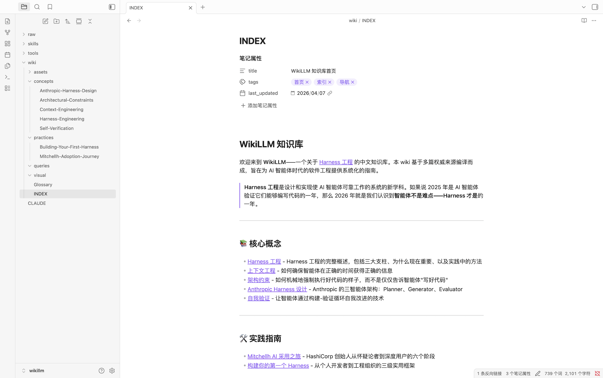

# WikiLLM

利用 LLM 构建个人知识库的系统。WikiLLM 将原始素材"批量编译"成结构化、交叉链接的高质量中文 Wiki，可在 Obsidian 或 Web 浏览器中查看。

本项目基于 **Andrej Karpathy** 提出的 [LLM Wiki](https://gist.github.com/karpathy/442a6bf555914893e9891c11519de94f) 理念构建。

## 项目概述

WikiLLM 的工作流包括：

1. **数据摄入**：源文档（文章、论文、代码库、数据集、图像）被索引到 `raw/` 目录
2. **Wiki 编译**：LLM 分阶段、批量地"编译"原始数据成 markdown 文件的 wiki，包含摘要、反向链接、分类概念和相互链接的文章
3. **IDE**：Obsidian 用作前端查看原始数据、编译后的 wiki 和可视化
4. **问答**：LLM 可以通过研究相关数据来回答针对 wiki 的复杂问题
5. **输出**：结果渲染为 markdown 文件、Marp 幻灯片或 matplotlib 图像，可在 Obsidian 中查看
6. **Linting**：LLM"健康检查"发现不一致、填补缺失数据、建议新文章候选
7. **额外工具**：`tools/wikillm.py` 提供扫描、图片同步、聚类、批次规划、搜索和机械 Lint

## 核心原则

- **LLM 编写和维护所有 wiki 数据**；手动编辑很少见
- **批量、分阶段、可恢复**：大规模语料通过 `tools/wikillm.py` 切分为小 batch，由 subagent 分批处理，状态持久化到 `wiki/_state/`
- **聚合而非逐篇翻译**：多篇 raw 文章聚合成 concept / practice 页，只有重要长文才有独立 source 页
- **用户探索和查询被归档回 wiki** 以增强它
- **系统专注于 markdown 文件和 Obsidian 兼容格式**
- **图像被下载到本地并保留年份目录树** 以便 LLM 轻松引用，避免同名覆盖

## 目录结构

```
wikillm/
├── raw/                      # 源文档和未处理数据
│   ├── posts/                # Markdown 文章（按年份组织）
│   └── images/               # 本地图片（按年份 + 主题子目录组织）
├── wiki/                     # LLM 编译的 markdown wiki
│   ├── _state/               # 编译状态（manifest、taxonomy、batches、lint-report 等）
│   ├── assets/images/        # 从 raw/images 同步的图片，保留年份树
│   ├── concepts/             # 核心概念/原理聚合页
│   ├── practices/            # 实践指南/工具聚合页
│   ├── sources/              # 重要长文单篇深度页
│   ├── topics/               # 主题枢纽页
│   ├── timeline/             # 年度索引
│   ├── visual/               # 可视化内容
│   ├── queries/              # 查询存档
│   ├── INDEX.md              # 首页索引
│   ├── Glossary.md           # 术语表
│   └── sources.md            # 来源索引
├── tools/                    # CLI 工具
│   └── wikillm.py            # 主 WikiLLM CLI
├── skills/wikillm/           # Claude Code 技能
│   ├── SKILL.md              # 技能入口
│   └── references/           # 详细工作流与标准
├── web/                      # Next.js Web 查看器
├── CLAUDE.md                 # 项目特定的 Claude 指令
└── README.md                 # 本文件
```

## 当前状态

- `raw/posts/` 已积累约 788 篇 Markdown 文章（2018–2026）
- `raw/images/` 已积累约 3000 张图片
- `wiki/` 目前为空，等待首次批量构建
- 编译基础设施 `tools/wikillm.py` 已就绪

> 注：README 中此前提到的 Harness Engineering 知识库是旧版本输出，当前 `wiki/` 目录已重置，需按下方流程重新构建。

## 快速开始

### 1. 首次构建 Wiki

打开 Claude Code，触发 WikiLLM skill，然后按 [skills/wikillm/references/bootstrap.md](skills/wikillm/references/bootstrap.md) 的指引完成：

```bash
# 1. 扫描与同步
python3 tools/wikillm.py scan
python3 tools/wikillm.py sync-images

# 2. 生成聚类报告并设计分类法
python3 tools/wikillm.py cluster
# 人工审阅 wiki/_state/taxonomy.md

# 3. 归属与批次
python3 tools/wikillm.py assign
python3 tools/wikillm.py batches

# 4. 按 batch 派发 subagent 进行综合
# 5. 每完成一个主题更新索引和术语表
# 6. Lint
python3 tools/wikillm.py lint
```

首次构建会分多次会话完成；每次会话从 `wiki/_state/progress.md` 和 `wiki/_state/batches.tsv` 断点续跑。

### 2. 在 Obsidian 中查看

1. 下载并安装 [Obsidian](https://obsidian.md/)
2. 在 Obsidian 中打开本仓库作为 vault
3. 从 `wiki/INDEX.md` 开始探索



### 3. 在 Web 浏览器中查看

本项目包含一个 Next.js Web 应用，用于在浏览器中查看知识库：

```bash
cd web
npm install
npm run dev
```

然后访问 http://localhost:3000 即可查看。


**Web 应用功能：**
- Markdown 渲染，支持 GFM 格式
- Obsidian 风格 wiki 链接解析（`[[Page|Label]]`）
- 侧边栏导航，按分类组织页面
- 图片资源支持（保留 `assets/images/YYYY/...` 子路径）
- 响应式设计

### 4. 使用技能

在 Claude Code 中，WikiLLM skill 会自动根据当前仓库状态触发：

- 若 `wiki/_state/taxonomy.md` 不存在 → 进入**首次构建**流程
- 若 `raw/` 有新增/修改 → 进入**批量/增量编译**流程
- 若你提问 → 进入 **Q&A** 流程
- 若要求维护/检查 → 进入 **Lint** 流程

详细说明请参阅 [skills/wikillm/SKILL.md](skills/wikillm/SKILL.md)。

## 常用命令

```bash
python3 tools/wikillm.py scan          # 扫描 raw/posts，生成 manifest
python3 tools/wikillm.py sync-images   # 同步图片，保留年份树
python3 tools/wikillm.py cluster       # 标签聚类报告
python3 tools/wikillm.py assign        # 按 taxonomy 归属文章
python3 tools/wikillm.py batches       # 生成 batch 简报与队列
python3 tools/wikillm.py search "rag"  # 搜索 wiki
python3 tools/wikillm.py lint          # 机械健康检查
python3 tools/wikillm.py status        # 查看编译进度
```

## 许可证

MIT License - 详见 [LICENSE](LICENSE) 文件。
