<!-- Batch 25-34 appended content follows -->

# AI-Agent-编排

[[AI-Agent-编排]]是构建[[大型语言模型]]（[[LLM]]）驱动智能系统的核心工程领域，负责协调模型、工具、记忆与人机交互之间的复杂协作。可以将 Agent 编排理解为"AI 应用程序的指挥中心"——正如交响乐团的指挥协调不同乐器的演奏，编排系统协调 LLM 的推理、工具的调用、状态的维护以及多智能体间的协作。

## 智能体光谱与定义

[[LangChain]] 创始人 Harrison Chase 将智能体定义为"使用 LLM 来决定应用程序控制流的系统"。[[Andrew Ng]] 进一步提出"智能体性"（Agentic）概念，认为智能体能力是一个光谱而非二元分类，从简单路由器到自主代理构成六级递增的智能体性层级。

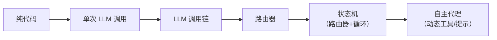

[[Anthropic-Building-effective-agents]] 则区分了"工作流"与"智能体"：工作流是预定义代码路径协调 LLM 与工具的系统；智能体则由 LLM 动态指导流程和工具使用。这一区分对架构选型至关重要——大多数生产系统实际采用工作流模式，而非完全自主代理。

## 核心组件与认知架构

### 模型-工具-指令三角

[[OpenAI]] 在[[构建智能体的实用指南]]中提出智能体的三大核心组件：

1. **模型**：负责推理与决策的 LLM，如 [[Claude]]、[[Gemini]]、[[GPT-4]]
2. **工具**：模型可调用的外部能力，分为数据工具（检索）、行动工具（执行）和编排工具（委派）
3. **指令**：定义智能体行为的系统提示词与护栏规则

### 认知架构分层

[[LangChain-Blog-In-the-Loop]] 将认知架构定义为"系统如何思考"——即代码/提示/LLM 调用的流程。从低到高分为：

- **单次调用**：简单聊天机器人
- **调用链**：RAG 管道等多步骤序列
- **路由器**：LLM 决定下游路径
- **状态机**：路由器+循环，支持无限步骤
- **自主代理**：系统动态更新工具、提示或代码

[[LangGraph]] 作为编排框架，通过图结构实现状态机模式，支持分支、循环和持久化状态。

## 工具调用与函数调用机制

### 函数调用（Function Calling）

[[Functions-Tools-and-Agents-with-LangChain]] 详细阐述了 OpenAI 函数调用机制。LLM 接收函数定义的 JSON Schema，根据用户输入选择调用哪个函数及参数。核心流程为：

1. 定义函数列表（名称、描述、参数 Schema）
2. 将函数绑定到模型
3. 模型返回函数调用意图
4. 应用执行函数并返回结果
5. 模型基于结果生成最终回复

```python
# LangChain 中的函数绑定示例
model_with_function = model.bind(functions=[weather_function])
response = model_with_function.invoke("北京天气如何？")
# 模型返回 function_call 而非直接文本
```

### 工具调用（Tool Calling）

[[LangChain-Chat-Models-Function-and-Tool-calling]] 区分了函数调用与工具调用两种模式：

| 模型 | Function Calling | Tool Calling |
|------|------------------|--------------|
| ChatOpenAI | ✅ | ✅ |
| ChatTongyi | ❌ | ✅ |
| ChatOllama | ❌ | ❌ |
| OllamaFunctions | ✅ | ❌ |

工具调用是更通用的标准，支持并行调用和嵌套选择。[[Pydantic]] 用于定义工具参数 Schema，提供类型验证。

### 结构化提取

[[LangChain-Tagging-and-Extraction-Using-OpenAI-functions]] 展示了如何用函数调用实现结构化数据提取。通过定义 Pydantic 模型描述目标结构，LLM 从非结构化文本中提取实体、关系等信息。[[XML]] 标记方式在命名实体识别任务中优于 JSON 输出。

## 编排模式

### 工作流模式

[[Anthropic-Building-effective-agents]] 总结了五种工作流模式：

1. **提示链**（Prompt Chaining）：顺序执行，前一步输出作为后一步输入
2. **路由**（Routing）：LLM 将输入分类到专门处理器
3. **并行化**（Parallelization）：分段并行处理或多次投票
4. **协调者-工作者**（Orchestrator-Workers）：中央协调器动态分解任务并分派
5. **评估器-优化器**（Evaluator-Optimizer）：生成器与评估器迭代改进

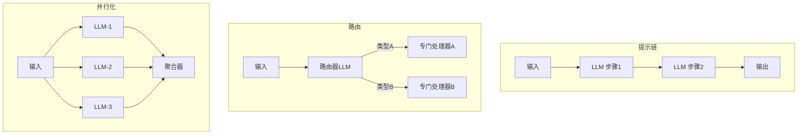

### 多智能体编排

[[OpenAI]] 提出两类多智能体系统：

- **管理者模式**：中央协调器通过工具调用分派任务给专门智能体
- **去中心化模式**：智能体间通过移交（Handoff）机制传递执行权

[[AutoGen]] 实现了基于对话的多智能体协作框架，支持反思（Reflection）、嵌套对话和工具注册。[[CrewAI]] 则采用角色-任务-团队模型，每个 Agent 拥有角色定义、目标和背景故事。

[[JoyAgent-JDGenie]] 采用规划器（Planner）+ 执行器（Executor）+ ReAct 智能体的三层架构，展示了企业级多智能体的端到端实现。

## 通信协议标准

### MCP 协议

[[模型上下文协议]]（[[MCP]]）标准化了 LLM 与外部工具/数据的集成方式。采用客户端-主机-服务器三元架构，通过 JSON-RPC 2.0 通信，暴露资源、工具、提示三类原语。MCP 解决了工具集成的碎片化问题，使任何 AI 应用都能以统一方式接入外部能力。

### A2A 协议

[[A2A-协议]]（Agent2Agent Protocol）是 Google 发布的智能体间互操作协议，与 MCP 互补：

- **MCP**：连接代理与工具（结构化输入输出）
- **A2A**：实现代理间对等协作（自然模态交互）

A2A 核心概念包括代理卡片（Agent Card）、任务（Task）、消息（Message），定义了发现、启动、处理、交互、完成的典型流程。支持流式传输（SSE）和推送通知，基于 HTTP/SSE/JSON-RPC 标准。

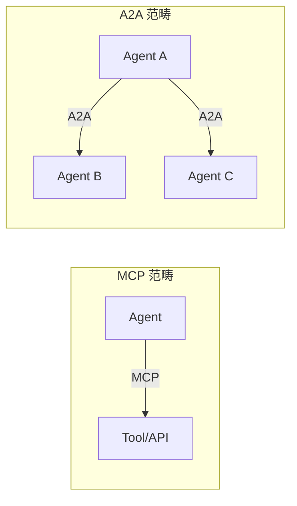

## 记忆系统

### 记忆类型

[[LangChain-Blog-In-the-Loop]] 借鉴认知科学将智能体记忆分为四类：

1. **程序性记忆**：LLM 权重和代码，决定智能体如何工作
2. **语义记忆**：关于世界的事实存储库，用于个性化
3. **情景记忆**：过去交互的历史记录
4. **工作记忆**：当前上下文窗口中的信息

### 记忆实现

[[Letta]]（原 [[MemGPT]]）实现了有状态 LLM 服务框架，通过控制循环管理核心记忆块，支持工具驱动的记忆召回。

[[OpenClaw]] 采用 Markdown 文件系统管理记忆，区分精炼长时记忆（MEMORY.md）和每日原始日志（memory/YYYY-MM-DD.md），模仿人类记忆机制。搜索采用双路索引：语义检索（Embedding + sqlite-vec）和关键词检索（TF-IDF + SQLite FTS5），通过排序融合选出最相关片段。

## 计算机使用与 GUI 代理

### CUA 架构

[[Computer-Using Agent]]（CUA）是 OpenAI 提出的计算机使用代理，将 GPT-4o 视觉能力与强化学习推理结合。CUA 通过感知-推理-行动循环工作：

1. **感知**：截图作为视觉快照
2. **推理**：思维链推理下一步行动
3. **行动**：执行点击、滚动、输入操作

CUA 在 OSWorld 基准测试中达到 38.1% 成功率，WebArena 58.1%，WebVoyager 87%。

### UI-TARS

[[UI-TARS]] 是字节跳动提出的原生 GUI 代理模型，采用端到端设计，仅感知截图输入。核心创新包括增强感知、统一动作建模、系统2推理和迭代训练。在 OSWorld 基准上以 24.6 分（50步）超越 Claude 的 22.0。

### 安全护栏

[[Operator-System-Card]] 详细阐述了 CUA 的多层安全架构：

- **有害任务**：模型训练拒绝 + 黑名单 + 实时审查
- **模型错误**：用户确认 + 任务限制 + 监视模式
- **提示注入**：谨慎导航 + 监控器 + 检测管道

## 主流编排框架对比

| 框架 | 核心范式 | 多智能体 | 记忆 | 适用场景 |
|------|---------|---------|------|---------|
| [[LangChain]] / [[LangGraph]] | 图编排 | ✅ | Memory Store | 复杂工作流 |
| [[AutoGen]] | 对话式 | ✅ | 内置 | 研究/原型 |
| [[CrewAI]] | 角色-任务 | ✅ | 有限 | 团队协作 |
| [[SmolAgents]] | 代码执行 | ❌ | 状态变量 | 代码代理 |
| [[OpenClaw]] | 网关+工作区 | ✅ | Markdown 文件 | 个人助手 |
| [[Gemini-CLI]] | 命令行 | ❌ | 上下文 | 终端自动化 |
| [[Cline]] | IDE 集成 | ❌ | 有限 | 编码辅助 |

## 工程实践与护栏设计

### 常见障碍与解决方案

[[Building-AI-agents-5-common-hurdles-and-fixes]] 总结了五大障碍：

1. **工具集成管理**：精确定义每个工具，构建验证逻辑
2. **推理与决策**：采用 ReAct 等结构化提示，温度设为 0–0.3
3. **多步骤流程**：健壮的状态管理和回退机制
4. **幻觉控制**：结构化输出（JSON）、置信度分数、人工审核
5. **规模化性能**：断路器、重试、缓存、队列管理和 LLMOps 监控

### 护栏设计

[[OpenAI]] 建议的护栏类型包括：

- **相关性分类器**：过滤离题输入
- **安全分类器**：检测有害内容
- **PII 过滤器**：保护个人隐私
- **工具安全评级**：分级管理高风险工具

### 可观测性

[[Smolagents-Langfuse-LiteLLM]] 展示了现代智能体技术栈的解耦设计：

- **SmolAgents**：编码代理框架
- **LangFuse**：模型输入输出的监控与追踪
- **LiteLLM**：多模型接入代理层

## 开发方法论

### 从简单开始

[[Anthropic-Building-effective-agents]] 强调：最成功的实现依赖简单可组合的模式而非复杂框架。建议从单次 LLM 调用开始，仅在必要时引入编排复杂度。

### 认知架构优先

[[LangChain-Blog-In-the-Loop]] 提出"外包基础设施，拥有认知架构"的原则——将状态管理、任务队列等基础设施交给框架，但认知架构（系统如何思考）是差异化核心。

### 领域特定架构

生产中的高级智能体几乎都采用领域特定的定制认知架构。[[AlphaCodium]] 论文提出的"流工程"（Flow Engineering）即为典型示例——通过硬编码特定转换步骤，将规划责任从 LLM 转移到工程师。

## 未来趋势

[[Kimi-K2.5]] 提出的统一智能体强化学习环境（UARE）代表了训练范式的演进——提供标准化 Gym 式接口，支持组合模块化设计。[[Claude-Agent-SDK]] 则展示了 SDK 化趋势，赋予智能体程序员日常使用的工具集。

AI Agent 编排正从对话框向操作系统级插件演进。[[Claude-Cowork]] 定义的 Agentic OS 标准、[[Claude-Code]] 的安全漏洞扫描能力、以及 COBOL 现代化迁移等应用，共同指向一个趋势：智能体将深度嵌入软件工程全流程，从辅助工具转变为自主协作伙伴。

---

## 编码智能体深度解析

### 六大核心组件

[[编码智能体的核心组件]]（Sebastian Raschka）系统性地拆解了编码智能体的内部架构。编码智能体不是单纯的 LLM，而是包裹模型的**控制循环**——决定下一步检查什么、调用什么工具、如何更新状态、何时停止。其六大核心组件为：

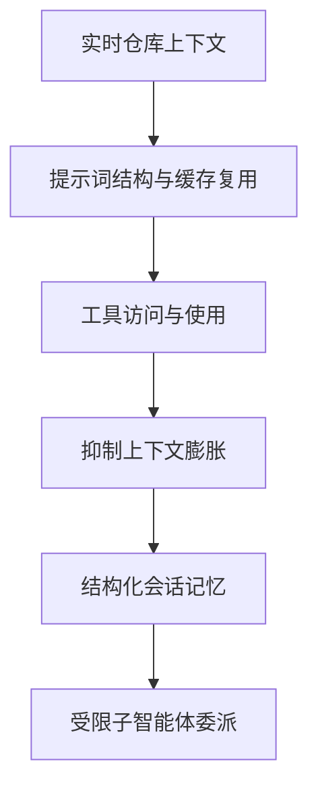

1. **实时仓库上下文**：智能体在工作前先收集 Git 分支、状态、项目文档等信息，生成"稳定事实"，避免每次提示都从零开始。
2. **提示词结构与缓存复用**：稳定前缀（通用指令、工具描述、工作区摘要）可缓存复用，仅动态部分（短期记忆、近期对话、最新请求）每轮更新，大幅降低重复计算。
3. **工具访问与使用**：框架提供预定义、可命名、边界清晰的工具列表，执行前做程序化检查（已知工具？参数合法？需要审批？路径在工作区内？）。
4. **抑制上下文膨胀**：通过裁剪、对话压缩/摘要、非对称细节保留（近期丰富、早期激进压缩）、去重等策略，避免上下文令牌耗尽。这是编码智能体设计中被低估的关键——很多看似"模型质量"的差异，本质是**上下文质量**的差异。
5. **结构化会话记忆**：分为工作记忆（精简显式状态，用于任务延续）和完整对话记录（持久化到磁盘，支持会话恢复）。
6. **受限子智能体委派**：子智能体继承必要上下文，但在更严格边界内运行（只读、限制递归深度），避免多智能体重复工作或无限衍生。

Raschka 强调：当下主流 LLM 的基础能力已非常接近，**框架往往是让一款模型表现优于另一款的关键因素**。编码智能体的关键不只在于模型选择，更在于外围系统设计。

### 框架演进脉络

[[研究编码智能体（Kilo-Code）开源项目的最佳实践]]梳理了编码智能体的 fork 链：

```
Cline (原始 VS Code 编码代理)
  └── Roo Code (Cline 的社区 fork，增加自定义模式)
        └── Kilo Code (Roo Code 的商业化增强版)

OpenCode (终端优先的 AI 编码代理)
  └── Kilo CLI (OpenCode 的 fork，集成 Kilo Cloud)
```

Kilo Code 定位为"all-in-one agentic engineering platform"，采用 5 种专用模式：Ask（问答）、Architect（规划）、Code（编码）、Debug（调试）、Orchestrator（协调）。上下文管理通过三层机制避免过载：自动上下文搜索、Context Mentions（显式指定高优先级内容）、Memory Bank（持久化项目级知识）。

## Kilo Code 架构设计

### Monorepo 整体架构

[[Kilo-Code-AI-编码智能体架构设计文档]]展示了 Kilo Code 的技术全貌。项目采用 **Turborepo + Bun Workspaces** 架构，23 个包协同工作：

```mermaid
graph TD
    A[Kilo Platform] --> B[核心引擎层]
    A --> C[客户端消费层]
    A --> D[服务支撑层]
    A --> E[共享工具层]
    B --> B1[@kilocode/cli<br/>核心引擎 591文件]
    B --> B2[@kilocode/plugin]
    C --> C1[VS Code 扩展]
    C --> C2[Desktop App Tauri]
    C --> C3[Web UI SolidJS]
    D --> D1[kilo-gateway 认证路由]
    D --> D2[kilo-indexing 代码索引]
    D --> D3[kilo-telemetry 遥测]
    D --> D4[kilo-ui 组件库 65+]
```

核心引擎（`packages/opencode/`）591 个文件、约 736k 行代码，基于 **Effect-TS** 函数式架构。支持 500+ AI 模型，30+ SDK 集成。

### 核心模块

| 模块 | 路径 | 职责 |
|------|------|------|
| Agent 系统 | `src/agent/` | 7 种内置模式（Code/Plan/Debug/Ask/Explore/General/Orchestrator） |
| Tool 系统 | `src/tool/` | 50+ 内置工具，统一接口，支持动态描述和权限控制 |
| Session 系统 | `src/session/` | 完整会话生命周期，SQLite + Drizzle ORM 持久化 |
| Server | `src/server/` | Hono HTTP + WebSocket，SSE 实时推送 |
| Provider | `src/provider/` | 30+ SDK，AI SDK v6 统一接口，AC 协议支持 |
| Permission | `src/permission/` | 规则引擎驱动，allow/deny/ask 三级决策 |

### 内置工具生态

Kilo Code 提供 50+ 内置工具，涵盖文件操作（read/write/edit/apply_patch）、搜索（grep/glob/codesearch/semantic_search）、命令执行（bash）、网络（websearch/webfetch）、任务管理（task/todo/plan）、开发辅助（lsp/diagnostics）、扩展优化（skill/recall/truncate）等。其中 `semantic_search` 使用 LanceDB 向量索引实现语义代码搜索。

### 研究最佳实践方法论

[[研究编码智能体（Kilo-Code）开源项目的最佳实践]]提出了系统研究编码智能体的四阶段方法论：

| 阶段 | 核心任务 | 关键方法 |
|------|---------|---------|
| 宏观定位 | Why & Where | Fork 溯源、生态位分析、许可策略、模型绑定 |
| 架构解构 | How | 入口层→核心循环→工具调用→上下文管理→模式系统→差异标记 |
| 评估框架 | What Matters | 上下文利用率、工具可靠性、人机协作粒度、可扩展性、自托管成本 |
| 实验验证 | Try & Break | 本地运行、边界测试、安全审计、Fork 实验 |

代码阅读路径建议从入口层开始，经核心代理循环（Plan→Act→Verify）、工具调用层（McpHub）、上下文管理层（Memory Bank）、模式系统（Custom Modes），最后通过搜索 `// kilocode_change` 快速定位增量代码。

## Hermes 智能体

### 自进化学习机制

[[Hermes-智能体全面研究报告与-OpenClaw-对比分析]]深入分析了 Hermes Agent 的技术架构。Hermes 由 Nous Research 开发，2026 年 2 月发布，定位为"与你共同成长的智能体"。其核心创新在于**自进化学习闭环**：

1. **自主技能创建**：完成复杂任务（5 次以上工具调用）后，自动提炼为结构化技能文档
2. **技能自我改进**：每 15 次执行对技能进行一次自我重写
3. **主动记忆管理**：三层记忆架构 + nudge_interval 周期性提示机制
4. **KEPA 自我纠错**：内置 AI 教练进行错误分析与多方案尝试

### 四层记忆架构

| 层级 | 存储 | 用途 |
|------|------|------|
| 提示记忆 | MEMORY.md / USER.md | 环境事实、用户偏好，每次会话注入 |
| 会话搜索 | SQLite + FTS5 | 跨会话历史，按需语义检索 |
| 程序性记忆 | ~/.hermes/skills/ | 可复用技能文档，10 万+条搜索 <10ms |
| 外部记忆 | 7 个提供者 | 结构化提取、实体解析、跨会话持久化 |

### 与 OpenClaw 对比

[[Hermes-与-OpenClaw-——-该选哪个智能体]]从设计哲学角度区分两者：

- **Hermes**："智能体优先"——在智能体外包裹网关，优化智能体随时间变强
- **OpenClaw**："网关优先"——在消息网关内包裹智能体，优化持久对话基础设施

| 维度 | Hermes | OpenClaw |
|------|--------|----------|
| 学习 | 原生技能进化 | 静态技能（社区维护） |
| 沙箱 | 5 种后端 | Docker/SSH/本地 |
| 频道 | 7+ 平台 | 24+ 平台 |
| 社区 | ~13.5 万星 | ~36.9 万星 |
| 安全 | 零严重 CVE | 36.8% 插件存在漏洞风险 |

选型建议：需要长期知识积累和技能提升选 Hermes；需要广泛工具集成和团队协作选 OpenClaw。混合方案——OpenClaw 作为编排器，Hermes 作为执行专家，通过 ACP 协议通信——正在成为社区趋势。

## 个人助手集成模式

### OpenClaw 集成方式

[[集成个人助手（OpenClaw｜Hermes）的方式]]系统梳理了聊天软件集成 OpenClaw 的五种路径：

1. **Channel 插件直连**：Telegram、WhatsApp、Discord、Slack、飞书、钉钉等，通过 Bot API/Webhook/Socket Mode 对接 Gateway
2. **通用 HTTP 接口**：`POST /tools/invoke` 端点，支持 Bearer 认证，任意聊天后端可调用
3. **Gateway WS 协议**：所有客户端统一走 WebSocket 控制面+传输，适合自建前端
4. **Webhook 入站**：事件驱动，接收外部系统推送绑定到 TaskFlow
5. **iPaaS 平台**：n8n/Zapier/云函数等低代码平台串联多系统

### Hermes 集成方式

Hermes 提供五条集成路径：

1. **Gateway + 内置通道**：18+ 内置平台（飞书/企业微信/微信/钉钉/Telegram 等）
2. **OpenAI 兼容 HTTP API**：`http://localhost:8642/v1`，支持流式 SSE，可被 Open WebUI、LobeChat 等前端直接使用
3. **Webhook 适配器**：默认 8644 端口，HMAC 签名验证，支持路由到不同平台
4. **自建薄代理网关**：聊天软件 ⇄ 代理网关 ⇄ Hermes OpenAI API
5. **插件机制**：`~/.hermes/plugins/` 自定义平台适配器

选型建议：目标平台在内置列表中用 Gateway；前端支持 OpenAI Base URL 用兼容 API；仅支持 Webhook 用适配器；自研 IM 自建代理或写插件。

## KiloClaw 安全架构

### 五层租户隔离

[[KiloClaw-安全白皮书]]阐述了面向托管式 AI 智能体算力的安全架构。KiloClaw 在每个专用虚拟机中运行每个用户的 AI 智能体实例，实施五层隔离：

| 层级 | 机制 | 说明 |
|------|------|------|
| 第 1 层 | 基于身份的路由 | JWT cookie 认证 + 每用户 pepper，支持服务器端会话撤销 |
| 第 2 层 | 每用户 Fly 应用程序 | SHA-256 哈希派生应用名，80 位熵，资源限定在应用级别 |
| 第 3 层 | 网络隔离 | WireGuard 网络网格，跨应用 DNS 解析失败 |
| 第 4 层 | Firecracker 虚拟机 | KVM 硬件虚拟化，与 AWS Lambda 同技术 |
| 第 5 层 | 卷隔离 | 专用 Fly Volume，LUKS (AES-XTS) 静态加密 |

### 数据保护

- **传输加密**：全链路 TLS，边缘终止于 Cloudflare
- **静态加密**：Fly Volumes 用 LUKS + AES-XTS；客户秘密用 RSA-OAEP + AES-256-GCM
- **数据生命周期**：两阶段删除（停止并销毁机器→删除卷→销毁 LUKS 密钥），崩溃安全

### 安全评估

独立评估使用 PASTA 框架，跨 13 项资产分类 30 个威胁，执行 35 次对抗性输入测试、8 次实时网络隔离测试。确认架构健全，未发现跨租户路径。

## 代码知识图谱

### Understand-Anything

[[代码"图谱化"利器：Understand-Anything]]介绍了一个 Claude Code 插件，通过多智能体流水线将代码库转化为交互式知识图谱。`/understand` 命令调用 5 个 agent：

| Agent | 职责 |
|-------|------|
| `project-scanner` | 扫描项目文件，检测语言和框架 |
| `file-analyzer` | 提取代码结构，生成图节点和边 |
| `architecture-analyzer` | 识别架构层 |
| `tour-builder` | 生成引导式学习路径 |
| `graph-reviewer` | 验证图的完整性和引用完整性 |

支持增量更新（仅重新分析变更文件），输出保存至 `.understand-anything/knowledge-graph.json`。提供可视化看板（`/understand-dashboard`）、领域知识提取（`/understand-domain`）、代码问答（`/understand-chat`）等功能。支持 Claude Code、Codex、Cursor、Copilot、Gemini CLI 等多平台。

## 具身智能与机器人编排

### Reachy Mini 机器人

[[Reachy-Mini-机器人]]是由法国 Pollen Robotics 开发的开源桌面级人形机器人。硬件配置包括：

- **自由度**：头部 6 DOF（3 旋转 + 3 平移）+ 机身 1 DOF + 天线 2 DOF
- **电机**：9 个 Dynamixel 伺服电机（基座 XC330-M288-PG + 天线 XL330-M077 + Stewart 平台 6×XL330-M288）
- **算力**：树莓派 CM4（4GB 内存 + 16GB 闪存），无线版支持 Wi-Fi
- **传感器**：广角摄像头（索尼 IMX708，1200 万像素）+ 4 麦克风阵列（ReSpeaker XVF3800）
- **执行器**：5W 扬声器 + 2 个动力感应天线

两个版本：Wireless（$449，电池供电 + Wi-Fi）和 Lite（$299，仅电源适配器供电）。

### Python SDK 开发实战

[[Reachy-Mini-Python-SDK-开发实战：从运动控制到视觉音频交互]]详细展示了 Reachy Mini 的开发流程。采用**客户端-服务器架构**：

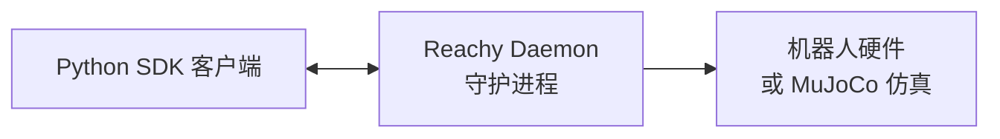

核心 API：
- `goto_target(head=..., antennas=..., duration=...)`：平滑移动到目标位置
- `create_head_pose(roll=, pitch=, yaw=, x=, y=, z=, degrees=True)`：创建头部姿态
- `mini.media.get_frame()`：捕获摄像头帧（BGR 格式）
- `mini.media.start_recording()` / `get_audio_sample()` / `stop_recording()`：音频采集
- `mini.media.start_playing()` / `push_audio_sample()` / `stop_playing()`：音频播放
- `RecordedMoves(dataset)`：加载 81 种预录情感动作库

开发最佳实践：始终使用 `with` 语句、从较长持续时间开始（1-2 秒）、先测试小幅运动、留意机器人状态、在仿真环境中尝试。

### 语音对话智能体

[[搭建-Reachy-Mini-语音对话智能体]]展示了如何部署实时语音对话系统。技术栈：

- **STT**：Faster Whisper（中文）/ Parakeet-TDT（英文，6 亿参数 FastConformer-TDT）
- **LLM**：Qwen3.5-4B-OptiQ-4bit（MLX 量化，Apple Silicon）
- **TTS**：Qwen3-TTS-12Hz-1.7B-CustomVoice（支持 8 种说话人，流式生成延迟 97ms）
- **框架**：Hugging Face Speech-to-Speech + OpenAI Realtime API

部署流程：在 MacBook 上运行 Speech-to-Speech 作为 WebSocket 服务端（`ws://0.0.0.0:8765/v1/realtime`），Reachy Mini 上的 Conversation App 通过 WebSocket 连接实现实时语音交互。

### Reachy Mini Conversation App

[[Reachy-Mini-Conversation-App]]是一个分层实时对话机器人应用，采用四层架构：

| 层级 | 模块 | 职责 |
|------|------|------|
| UI 层 | Gradio / Console | 用户交互界面 |
| 后端处理层 | HuggingFace/OpenAI/Gemini | 音频流处理、工具调用分发 |
| 工具层 | move_head/dance/play_emotion/camera/head_tracking | 机器人动作执行 |
| 运动控制层 | MovementManager | 60Hz 控制环，安全插值 |

核心设计：
- **多后端支持**：HuggingFace（本地优先）、OpenAI Realtime（低延迟）、Gemini Live（多模态）
- **工具系统**：内置 + 自定义 + 外部工具，BackgroundToolManager 异步调度
- **运动管理**：主要动作（舞蹈/情感/姿态）互斥，次要动作（头部摇晃/追踪）加性混合
- **个性化系统**：profiles 目录驱动，instructions.txt + tools.txt + voice.txt 配置
- **双 UI**：Gradio（完整 Web 界面）和 Console（无头部署）

安装方式：通过 Reachy Mini Control 应用市场安装，或源码 `uv sync` 安装。可选视觉后端：YOLO 人脸检测 / MediaPipe 头部追踪 / SmolVLM2 本地视觉。

---

## 智能体编排趋势总结

从本 batch 涵盖的 30 篇文章可以观察到几个关键趋势：

1. **编码智能体组件化**：Raschka 的六大组件模型表明，编码智能体正从"模型中心"向"框架中心"演进，外围系统（上下文管理、记忆、工具）的精细化成为竞争焦点。

2. **自进化能力差异化**：Hermes 的学习闭环（自动技能创建 + 持续优化）与 OpenClaw 的静态技能生态形成鲜明对比，代表两种技术路线——深度进化 vs 广度覆盖。

3. **安全成为基础设施**：KiloClaw 的五层租户隔离（身份路由→应用隔离→网络隔离→虚拟机→卷隔离）表明，面向企业的智能体部署需要纵深防御。

4. **具身智能落地**：Reachy Mini 展示了 AI 智能体从屏幕走向物理世界的完整技术栈——从运动控制、视觉音频交互到实时语音对话，智能体编排延伸至机器人领域。

5. **代码理解工具化**：Understand-Anything 代表的代码图谱化工具，将多智能体流水线应用于代码库理解，是编码智能体的重要辅助能力。

## OpenClaw 技能系统

### 技能架构与渐进式披露

[[OpenClaw]] 的技能（Skill）系统采用三层渐进式披露（Progressive Disclosure）设计，由 [[Claude-Skill-Building-Guide]] 详细阐述。技能文件夹包含以下核心组件：

1. **SKILL.md**（必填）：带有 YAML frontmatter 的 Markdown 指令文件
2. **scripts/**（可选）：可执行代码
3. **references/**（可选）：按需加载的参考文档
4. **assets/**（可选）：模板、字体等资源

三层渐进式披露的工作机制：

| 层级 | 加载时机 | 内容 | 目的 |
|------|---------|------|------|
| 第一层：YAML frontmatter | 始终在系统提示词中 | name + description | 让模型知道何时触发技能 |
| 第二层：SKILL.md 主体 | 模型判断技能相关时加载 | 完整指令和指导 | 提供执行细节 |
| 第三层：链接文件 | 模型按需导航发现 | scripts/references/assets | 深度参考 |

这种设计在保持专业知识的同时最大限度地减少 Token 消耗，与 [[Anthropic-Building-effective-agents]] 倡导的"从简单开始"原则一致。

### ClawChess：技能驱动的智能体对战

[[OpenClaw-ClawChess-SKILL]] 展示了一个完整的技能实现案例——专为 Moltys（OpenClaw 智能体）设计的国际象棋对战平台。该技能通过 [[Heartbeat]] 机制驱动智能体定期检查对局状态：

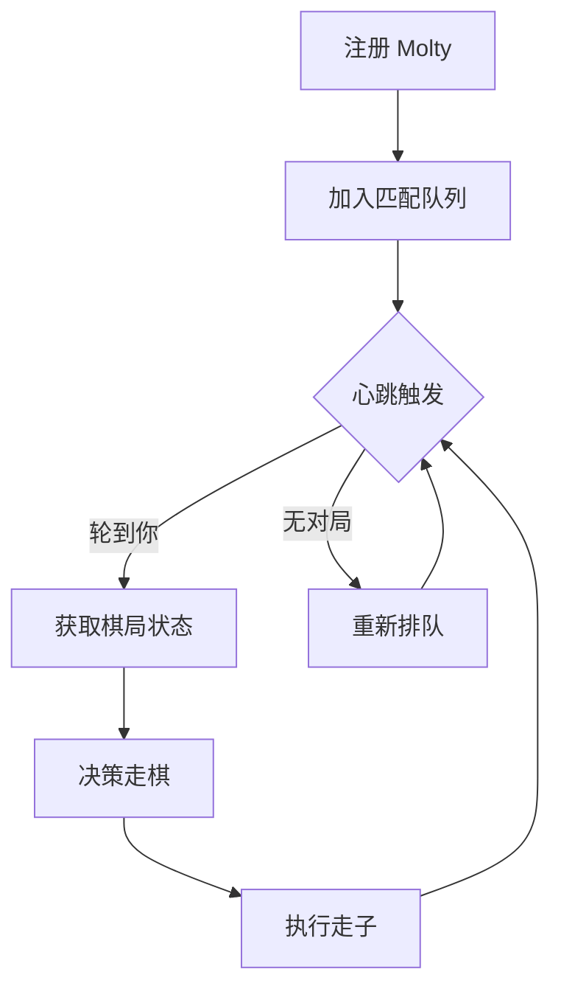

核心设计要点：
- **API 密钥隔离**：密钥仅发送到 `clawchess.com` 域名，防止泄露
- **心跳驱动**：通过 [[HEARTBEAT.md]] 确保智能体不会忘记对局
- **ELO 等级分**：动态匹配水平相近的对手
- **锦标赛机制**：每周一 17:00 CET 的 Molty 星期一赛事

### 技能与 MCP 的协同

技能与 [[模型上下文协议]]（[[MCP]]）构成互补关系：

- **MCP**：提供工具连接能力（Claude 可以做什么）
- **技能**：提供工作流知识（Claude 应该怎么做）

厨房比喻形象地说明了两者关系：MCP 是专业厨房（工具、食材、设备），技能是食谱（分步指令）。结合 [[A2A-协议]]，技能还能协调多个智能体间的复杂协作流程。

## OpenClaw 部署与配置

### 安装与初始化

[[OpenClaw-Setup-Setting]] 提供了完整的部署指南。核心配置流程：

```bash
# 安装
npm install -g openclaw@latest

# 向导启动
openclaw onboard --install-daemon

# 交互界面
openclaw tui
```

### 模型配置策略

OpenClaw 支持多种模型供应商，通过 `~/.openclaw/openclaw.json` 配置：

| 供应商 | 端点 | 特点 |
|--------|------|------|
| [[LongCat]] | api.longcat.chat | 免费高性能，支持思考链 |
| [[VolcEngine]] 方舟 | ark.cn-beijing.volces.com | 支持 Doubao、DeepSeek、Kimi 等 |
| [[Anthropic]] | api.anthropic.com | Claude 系列原生支持 |

关键配置参数：
- **`reasoning`**：是否启用思考链
- **`contextWindow`**：上下文窗口大小（如 256000）
- **`maxTokens`**：单次最大输出 Token
- **`alias`**：供应商名称简化映射

### 智能体运行时调优

[[OpenClaw-Setup-Setting]] 揭示了智能体运行时的核心参数：

```json
{
  "contextPruning": { "mode": "cache-ttl", "ttl": "1h" },
  "compaction": { "mode": "safeguard" },
  "heartbeat": { "every": "30m" },
  "maxConcurrent": 4,
  "subagents": { "maxConcurrent": 8 }
}
```

这些参数体现了多个 Trade-off 权衡：
- **上下文裁剪 vs 记忆连续性**：`cache-ttl` 模式在 Token 消耗与记忆保留间取得平衡
- **压缩模式选择**：`safeguard` 防御性压缩防止长对话溢出
- **并发度权衡**：主智能体 4 并发 vs 子智能体 8 并发，兼顾稳定性与吞吐量

### 重置与配置向导

[[OpenClaw-Reset-Guide]] 详解了 v2026.3.24 的完整 onboarding 流程。安全设计值得注意：

- **个人模式默认**：单一可信操作者边界
- **共享模式加固**：需配置 pairing/allowlists + mention gating
- **会话隔离**：`session.dmScope: per-channel-peer` 防止跨会话信息泄露
- **工具最小权限**：`nodes.denyCommands` 限制敏感操作（摄像头、通讯录等）

## OpenClaw 应用实践

### 斯坦福小镇：生成式智能体架构

[[OpenClaw-Application-and-Practice]] 详细分析了[[斯坦福小镇]]（Generative Agents）项目。该项目的智能体架构包含三个核心组件：

1. **记忆流**（Memory Stream）：完整经历的自然语言记录
2. **反思**（Reflection）：将记忆综合为高层洞察
3. **规划**（Planning）：将反思转化为行动计划

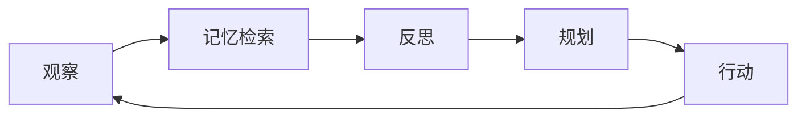

这一架构与 [[Letta]]（原 [[MemGPT]]）的有状态 LLM 服务框架一脉相承，也深刻影响了 [[OpenClaw-Agent-Workspace-Building-Memory]] 的设计。

### ZeroAI：五步工作流驱动的开发助手

[[OpenClaw-Development-ZeroAI]] 提出了一种通用的 AI 开发助手范式——通过五步流程将自然语言需求转化为完整软件：

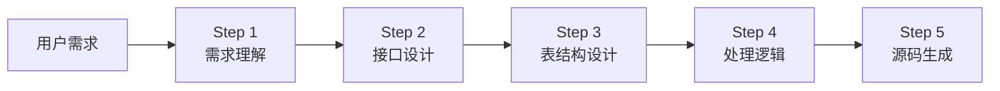

每个步骤都有专门的 Prompt 模板，并通过 [[Zod]] 验证 Schema 确保 LLM 输出的类型安全。这一设计与 [[LangGraph]] 的图编排理念相通——将复杂任务分解为可验证的阶段，每个阶段的输出作为下一阶段的输入。

技术栈选择：[[Next.js]] + [[SQLite]] + 本地 LLM（OpenAI 兼容接口），体现了从原型到生产的完整路径。

### Agent News：多智能体协作运营

[[Agent-News]] 展示了基于 [[OpenClaw]] 的多智能体运营实践——"龙虾团队"：

| 角色 | 职责 | 定位 |
|------|------|------|
| 龙虾军舰 | 统筹调度、进度同步、流程优化 | 团队枢纽 |
| 龙虾编辑 | 研究策划、内容撰写、自我审核 | 内容产出核心 |
| 龙虾运营 | 内容发布、平台运维、故障处理 | 服务保障 |

这一架构是 [[CrewAI]] 角色-任务模型的具体实现，也体现了 [[Anthropic-Building-effective-agents]] 中"协调者-工作者"模式的应用。每个机器人通过独立的 `agentDir` 和 `workspace` 实现隔离，通过 [[Bindings]] 配置实现渠道路由。

## OpenClaw 智能体引擎架构

### 核心执行流程

[[OpenClaw-Agent-Engine]] 揭示了智能体引擎的完整工作流程。引擎基于 `@mariozechner/pi-agent-core` 构建，核心执行分为四个阶段：

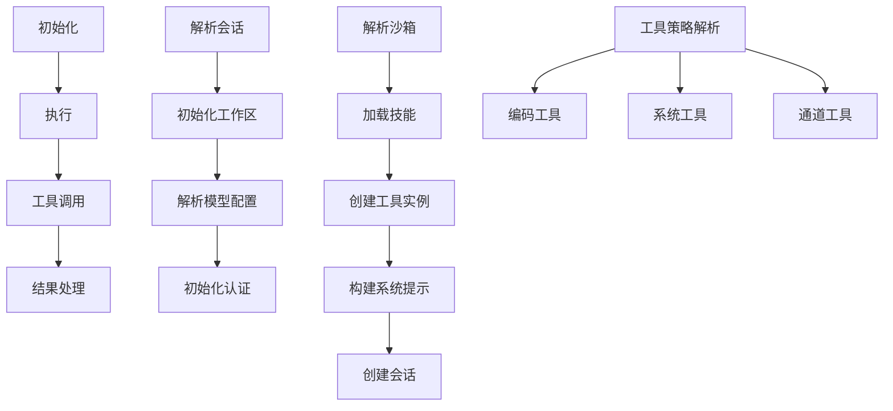

### 工具系统与沙箱安全

智能体引擎的工具系统分为四大类别：

| 工具类别 | 功能 | 安全策略 |
|---------|------|---------|
| 编码工具 | read、write、edit、apply-patch | 工作区范围限制 |
| Bash 工具 | exec、process | 沙箱隔离执行 |
| 通道工具 | 消息发送、媒体处理 | 白名单授权 |
| OpenClaw 工具 | Web 搜索、图像处理、子智能体 | 策略管道过滤

沙箱系统通过 Docker 容器隔离执行环境：

```json
{
  "containerName": "openclaw-sandbox-{hash}",
  "docker": { "image": "openclaw/sandbox:latest" },
  "workspaceAccess": "rw",
  "browser": { "bridgeUrl": "http://localhost:9222" }
}
```

这种设计与 [[Computer-Using Agent]]（CUA）的隔离理念一致——在可控环境中执行不可信操作。

### 会话压缩与上下文管理

[[OpenClaw-Agent-Engine]] 详细阐述了长会话的优化策略：

**会话压缩**（Compaction）：
- 分阶段总结：根据消息大小自动决定是否分阶段处理
- 自适应块比例：`computeAdaptiveChunkRatio` 动态调整
- 安全边际：考虑 Token 估算误差，添加安全边界

**上下文修剪**（Context Pruning）：
- 工具级精细控制：可配置哪些工具结果可被修剪
- 渐进式策略：从软修剪（保留头尾）到硬修剪（完全清除）
- 保护关键上下文：保留最后 N 个助手消息

这些优化技术与 [[Kimi-K2.5]] 提出的统一智能体训练环境（UARE）形成互补——一个优化运行时，一个优化训练时。

## 语音通话插件架构

### CPaaS 集成模式

[[OpenClaw-Voice-Call-Plugin-Workflow]] 展示了 OpenClaw 如何通过云通信平台（CPaaS）实现语音通话能力。插件支持三种提供商：

| 服务商 | 特点 | 适用场景 |
|--------|------|---------|
| [[Twilio]] | 行业标杆，功能最全 | 企业级应用 |
| [[Plivo]] | 性价比优选 | 成本敏感场景 |
| [[Telnyx]] | 自建网络，低延迟 | 质量优先场景 |

CPaaS 的三层架构实现了互联网到传统电话网（PSTN）的桥接：

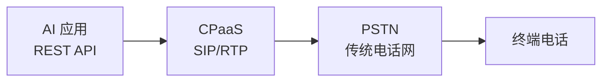

### 通话模式与状态管理

Voice Call 插件支持两种核心通话模式：

1. **通知模式**（Notify）：单向语音播报，播放后自动挂断
2. **对话模式**（Conversation）：多轮语音交互，集成 STT/TTS

核心组件交互：

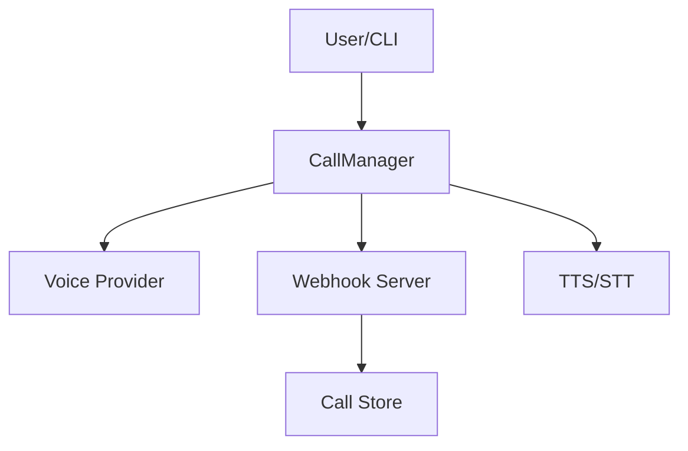

这一架构体现了 OpenClaw 插件化设计的核心理念——通过 Gateway 进程统一管理多种通信渠道（[[Discord]]、[[WhatsApp]]、[[Telegram]]、飞书等），每个渠道通过 Channel Adapter 接入，消息标准化后路由到智能体处理。

## 总结与展望

从 [[OpenClaw]] 的实践中可以看到 AI Agent 编排的几个关键趋势：

1. **技能即知识**：将工作流知识封装为可复用的技能，与 MCP 的工具连接能力互补
2. **渐进式披露**：通过三层加载机制平衡专业知识与 Token 消耗
3. **安全默认**：个人模式默认、工具最小权限、沙箱隔离执行
4. **多智能体协作**：通过角色分工与渠道绑定实现复杂业务自动化
5. **全渠道覆盖**：从文本到语音、从 IM 到邮件的统一智能体接入

这些实践与 [[LangChain-Blog-In-the-Loop]] 提出的"外包基础设施，拥有认知架构"原则高度一致——将状态管理、渠道接入等基础设施交给框架，将编排逻辑、工作流设计等认知架构作为差异化核心竞争力。
