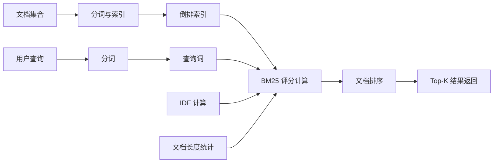

# BM25

BM25（Best Matching 25）是信息检索领域最经典的文档排序算法，用于根据查询词与文档的相关性对搜索结果进行评分和排序。作为 TF-IDF 的改进版本，BM25 通过引入文档长度归一化和词频饱和机制，显著提升了检索排序的准确性。尽管诞生于 1970-1990 年代，BM25 至今仍是搜索引擎、文档检索系统和 RAG 系统中最广泛使用的基线检索算法，与向量检索（如 [[FAISS]]）形成互补的"混合检索"方案。

BM25 的核心思想是：一个查询词对文档的相关性评分取决于三个因素——词频（TF，词在文档中出现多少次）、逆文档频率（IDF，词在多少文档中出现过）和文档长度归一化（长文档不应仅因词出现次数多就获得更高分）。BM25 通过数学公式将这三个因素统一为一个评分函数，其计算高效、可解释性强、无需训练数据的特点使其在工业界长盛不衰。

在现代 AI 系统中，BM25 的角色并未被向量检索完全取代，反而因其独特价值被重新重视：BM25 在关键词精确匹配、专有名词检索、数字和代码检索等方面优于语义向量检索；而向量检索在语义理解、同义词匹配、跨语言检索等方面更优。因此，"BM25 + 向量检索"的混合检索方案已成为 RAG 系统的最佳实践。

## 核心概念

### BM25 评分公式

BM25 的评分公式为：

```
BM25(D, Q) = Σ IDF(qi) × [f(qi, D) × (k1 + 1)] / [f(qi, D) + k1 × (1 - b + b × |D|/avgdl)]
```

其中：
- `qi` 是查询中的第 i 个词
- `f(qi, D)` 是词 qi 在文档 D 中的词频
- `|D|` 是文档 D 的长度（词数）
- `avgdl` 是语料库中文档的平均长度
- `k1` 控制词频饱和度（通常取 1.2-2.0）
- `b` 控制文档长度归一化强度（通常取 0.75）

### 词频饱和度（TF Saturation）

与 TF-IDF 中词频线性增长不同，BM25 的词频贡献是饱和的——当词频超过一定阈值后，继续增加词频对评分的贡献趋近于零。这符合信息检索的直觉：一个词出现 10 次并不比出现 5 次相关 2 倍。参数 `k1` 控制饱和速度：k1 越大，饱和越慢；k1=0 时退化为二值匹配。

### 文档长度归一化

BM25 通过参数 `b`（0 到 1 之间）控制文档长度归一化：

- `b=1`：完全按文档长度归一化，长文档的词频贡献被等比例压缩
- `b=0`：不做长度归一化
- `b=0.75`（默认）：适度归一化，长文档略有惩罚

长度归一化的必要性在于：长文档天然包含更多词，如果仅按词频评分，长文档会系统性获得更高分，即使其实际相关性并不更高。

### 逆文档频率（IDF）

IDF 衡量词的区分能力：

```
IDF(qi) = log[(N - n(qi) + 0.5) / (n(qi) + 0.5) + 1]
```

其中 N 是文档总数，n(qi) 是包含词 qi 的文档数。常见词（如"的"、"是"）的 IDF 很低，稀有专有名词的 IDF 很高。IDF 确保区分度高的词对评分贡献更大。

### BM25 变体

- **BM25F**：考虑文档结构（标题、正文、摘要等字段），对不同字段赋予不同权重
- **BM25+**：在原始 BM25 基础上增加一个小的常数，避免短文档中零频词的评分问题
- **BM25L**：改进长度归一化，更好地处理长度分布不均的语料
- **TF12-BM25**：简化版，不考虑词频饱和度

## 技术架构



## 应用场景

- **搜索引擎**：Elasticsearch、Lucene、Solr 等搜索引擎的默认排序算法
- **RAG 检索**：作为向量检索的补充，在混合检索方案中负责关键词精确匹配
- **企业搜索**：企业内部文档检索、知识库搜索
- **问答系统**：检索与问题相关的候选文档
- **推荐系统**：基于内容相似度的物品推荐
- **代码检索**：代码片段的精确匹配检索

## 相关技术

- [[FAISS]] — 向量检索库，与 BM25 形成混合检索
- [[RAG-检索增强生成]] — BM25 在 RAG 系统中的应用
- [[信息检索]] — 信息检索理论基础
- [[Elasticsearch]] — 基于 BM25 的搜索引擎
- [[混合检索]] — BM25 + 向量检索的融合方案

## 主要页面

- [[topics/RAG与知识检索]] — RAG 系统设计与检索实践
- [[信息检索与搜索技术]] — 信息检索技术综述
