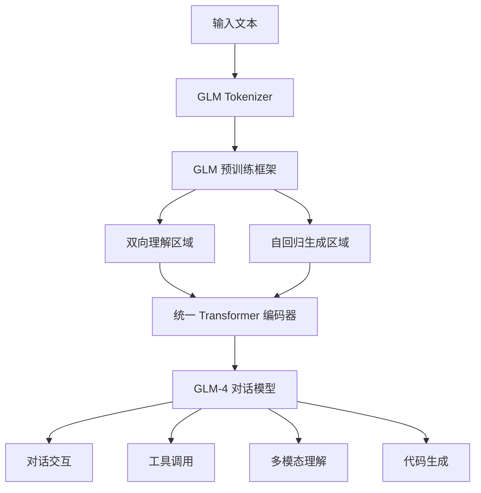

# ChatGLM

ChatGLM 是智谱 AI（Zhipu AI）团队基于清华大学 KEG 实验室研究成果开发的一系列大语言模型。作为中国最早投入大模型研发的团队之一，智谱 AI 从 2022 年 11 月发布 ChatGLM-6B 开始，经历了 ChatGLM2-6B（2023.06）、ChatGLM3-6B（2023.10）、GLM-4（2024.01）等多个版本的迭代，形成了覆盖从 6B 到 100B+ 参数规模的完整模型矩阵。ChatGLM 系列在中文理解、中文知识、中文创作等任务上表现出色，是中国开源大模型生态的重要支柱之一。

ChatGLM 系列的核心技术特色在于其 GLM（General Language Model）预训练框架。与 GPT 系列的自回归生成和 BERT 系列的双向理解不同，GLM 采用了一种统一的预训练目标，通过在文档不同位置使用不同的注意力掩码模式，同时支持双向理解和自回归生成。具体来说，GLM 将输入文档的一部分进行"填空"式双向建模（类似 BERT 的 MLM），另一部分进行自回归生成（类似 GPT），通过统一的框架同时获得理解和生成能力。

## 核心概念

**GLM 预训练框架**：GLM 的核心创新是将 NLU（自然语言理解）和 NLG（自然语言生成）统一到同一个预训练框架中。通过特殊的注意力掩码设计，GLM 的某些 token 可以双向关注（用于理解任务），而另一些 token 只能单向关注（用于生成任务）。这种统一框架使模型在理解和生成任务上都表现出色，避免了传统上需要分别训练理解模型和生成模型的问题。

**中文优化**：ChatGLM 系列在预训练数据、分词器、评估基准等方面都针对中文进行了深度优化。训练数据中中文占比远高于国际同类模型，分词器对中文字符和词组进行了专门优化，评估基准覆盖了中文知识、中文推理、中文创作等多个维度。这使得 ChatGLM 在中文任务上普遍优于同等规模的国际模型。

**对话与工具使用**：ChatGLM 系列从 ChatGLM3 开始强化了对话交互和工具调用能力。GLM-4 系列进一步引入了多模态理解（GLM-4V）、代码生成（GLM-4-AllTools）、Agent 规划等高级能力，形成了覆盖文本、视觉、代码、工具使用的完整能力矩阵。

**开源与商业化双线发展**：智谱 AI 对 ChatGLM 系列采用了"开源基座 + 商业化 API"的双线策略。ChatGLM-6B、ChatGLM2-6B、ChatGLM3-6B 等中小规模模型完全开源（允许商用），而 GLM-4 等大规模模型则通过 API 服务提供。这种策略既推动了开源社区的发展，又保证了商业可持续性。

**CogAgent 与多模态能力**：智谱 AI 在 ChatGLM 的基础上发展了 CogAgent 系列多模态模型，特别强化了 GUI 理解和计算机操作能力。CogAgent 能够在截图中精确定位 GUI 元素并生成操作指令，是 Computer Use Agent 领域的重要参与者。

## 技术架构

## 应用场景

**中文智能对话**：ChatGLM 系列在中文对话场景中表现出色，能够理解中文语境、成语典故、文化背景，生成符合中文表达习惯的回答。ChatGLM-6B 的开源使得大量中文对话应用得以快速构建。

**中文知识问答**：得益于训练数据中丰富的中文知识，ChatGLM 在中文知识问答、中文考试（如高考、公务员考试、司法考试等）任务上表现优异，是中文教育 AI 应用的重要基座模型。

**企业级 AI 应用**：智谱 AI 基于 GLM-4 系列提供了企业级 API 服务，覆盖智能客服、文档分析、数据分析、代码辅助等企业场景。GLM-4 的工具调用能力使其能够与企业内部系统集成，构建端到端的 AI 工作流。

**中文内容创作**：ChatGLM 在中文写作、翻译、摘要等生成任务上表现出色，被广泛应用于新媒体内容创作、营销文案生成、技术文档撰写等场景。

**科研与教学**：ChatGLM 系列作为国产开源大模型的代表，为中国 AI 研究者和学生提供了重要的学习和研究资源，推动了中文 NLP 社区的发展。

## 相关概念

- [[大型语言模型]] — LLM 通用架构与训练方法
- [[DeepSeek-V3]] — 国产开源大模型的另一代表
- [[微调与模型训练]] — 中文模型的微调实践
- [[主流-LLM-与厂商]] — 智谱 AI 在 LLM 格局中的定位

## 主要页面

- [[topics/主流-LLM-与厂商]] — 智谱 AI 与 ChatGLM 系列定位
- [[topics/LLM-技术报告与前沿论文]] — GLM 预训练框架技术细节
- [[topics/中文大模型生态]] — 中文开源大模型全景
