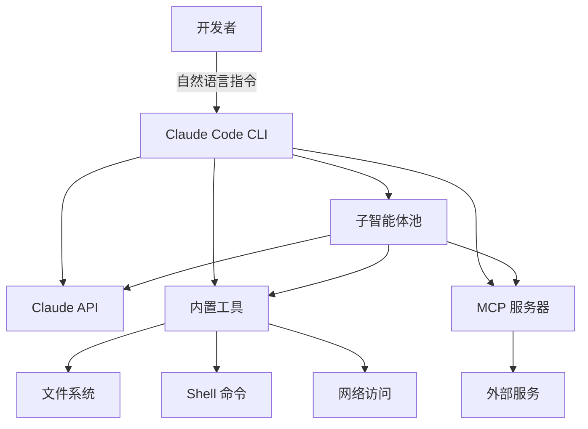

# Claude Code

Claude Code 是 Anthropic 推出的命令行界面（CLI）AI 编码助手，允许开发者在终端中直接与 Claude 大模型交互，完成代码编写、调试、重构、文件操作等开发任务。它于 2025 年初以研究预览形式发布，迅速成为 AI 编码工具领域的标杆产品。

Claude Code 的核心理念是"将 AI 集成到开发者最自然的编码环境——终端"，而非在 IDE 插件或 Web 界面中隔离使用。它支持通过 MCP（Model Context Protocol）协议扩展工具能力，可通过 Skills 机制自定义工作流，并内置了子智能体（Subagent）系统，能够自动拆分复杂任务并并行执行，实现复杂的多步骤自动化编程任务。

作为 Anthropic 的官方产品，Claude Code 深度整合了 Claude 系列模型的能力——包括长上下文窗口（200K tokens）、多模态理解（图片、PDF）和工具调用。它支持 macOS、Linux 和 Windows（通过 WSL），可通过 npm 全局安装或直接运行二进制文件。

## 核心概念

### 命令行交互模型

Claude Code 采用 REPL（Read-Eval-Print Loop）交互模式，开发者通过自然语言向 Claude 发出指令，Claude 则通过工具调用来完成操作：

- **对话式编程**：用自然语言描述需求，Claude 生成代码并写入文件。
- **上下文感知**：Claude 自动读取当前目录结构、文件内容、Git 历史等上下文信息。
- **多轮迭代**：支持连续对话，逐步精化代码，类似"结对编程"体验。
- **权限控制**：文件写入、命令执行等敏感操作需用户确认，保障安全性。

### 工具系统（Tool System）

Claude Code 内置了一组核心工具，可分为以下几类：

- **文件操作**：Read（读取文件）、Write（创建/覆盖文件）、Edit（精确编辑）、Glob（文件模式匹配）、Grep（内容搜索）。
- **命令执行**：Bash（运行 shell 命令），支持后台执行和超时控制。
- **Web 访问**：WebFetch（获取网页内容）、WebSearch（网络搜索）。
- **任务管理**：Task（启动子智能体）、TaskList（查看任务列表）。
- **IDE 集成**：与 VS Code、JetBrains 等 IDE 的终端集成，支持诊断信息获取。

### MCP 扩展

Claude Code 是 MCP 协议的主要支持者和推广者。通过 MCP 服务器，Claude Code 可以：

- 访问外部数据库和 API（如 GitHub、Slack、Jira）
- 执行自定义工具（如部署、测试、监控）
- 集成企业内部的私有工具和服务

MCP 配置文件支持项目级（`.mcp.json`）和全局级（`~/.claude/settings.json`），便于团队协作和复用。

### Skills 机制

Skills 是 Claude Code 的可扩展工作流系统，允许开发者：

- **定义自定义命令**：通过 Markdown 文件（`.claude/commands/`）定义可复用的工作流。
- **参数化执行**：支持 `/command arg1 arg2` 形式的参数传递。
- **上下文注入**：Skills 可自动注入项目上下文、代码风格指南、工具说明等。
- **团队共享**：Skills 文件可提交到代码仓库，团队共享使用。

### 子智能体（Subagents）

Claude Code 的子智能体系统是其最具创新性的设计之一：

- **自动委派**：当任务复杂或需要并行处理时，Claude 自动创建子智能体。
- **隔离执行**：每个子智能体在独立上下文中运行，避免污染主对话。
- **结果汇总**：子智能体完成后，结果自动汇总回主对话。
- **递归委派**：子智能体可进一步委派子任务，形成任务树。

## 技术架构

Claude Code 的架构分层：

1. **交互层**：终端 UI、输入解析、输出格式化
2. **编排层**：对话管理、任务分解、子智能体调度
3. **工具层**：内置工具、MCP 工具、Skills
4. **模型层**：Claude API 调用、上下文管理、流式响应

## 应用场景

- **代码生成与重构**：根据需求描述生成新代码，或重构现有代码改善结构和性能。
- **Bug 调试与修复**：分析错误日志、堆栈跟踪和代码上下文，定位并修复问题。
- **文档与测试生成**：自动生成 API 文档、单元测试、集成测试。
- **代码审查与解释**：解释复杂代码逻辑，审查代码质量和安全性。
- **项目管理自动化**：批量处理文件、执行代码迁移、生成报告。

## 相关技术

- [[LLM-编码助手]]
- [[AI-Agent-编排]]
- [[MCP-协议栈]]
- [[Prompt-Engineering-与上下文工程]]
- [[Anthropic]]

## 主要页面

- [[LLM-编码助手]] - AI 编码助手生态与工具对比
- [[MCP-协议栈]] - Claude Code 的 MCP 工具扩展协议
- [[AI-Agent-编排]] - AI Agent 编排与子智能体设计
