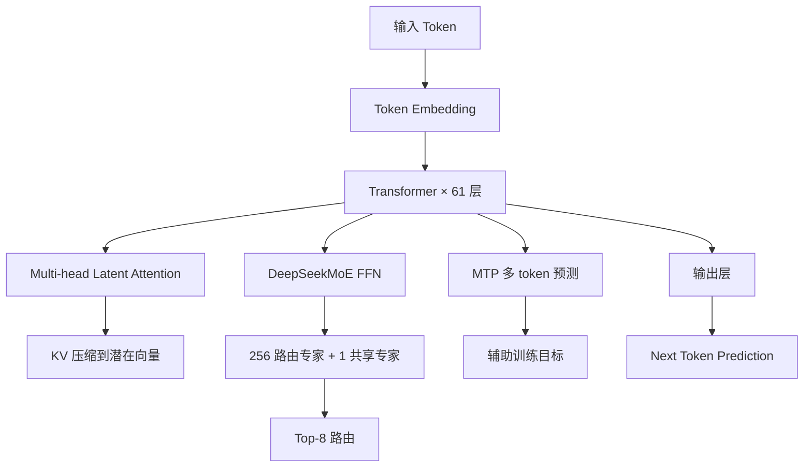

# DeepSeek-V3

DeepSeek-V3 是深度求索（DeepSeek）团队于 2024 年 12 月发布并于 2025 年 3 月正式开源的旗舰级大语言模型。DeepSeek-V3 以约 671B 总参数（激活参数约 37B）的 MoE（Mixture of Experts）架构，在数学、编程、科学推理等任务上达到了与 GPT-4o、Claude 3.5 Sonnet 等顶尖商用模型相当的性能水平，而训练成本仅约 557 万美元（使用约 2048 块 H800 GPU），是同水平模型中训练成本最低的之一。DeepSeek-V3 的发布标志着中国 AI 团队在大模型领域具备了与世界顶尖水平竞争的能力。

DeepSeek-V3 的技术创新集中在三个方向：Multi-head Latent Attention（MLA）机制大幅降低了 KV Cache 的显存占用；DeepSeekMoE 架构通过细粒度专家共享和辅助无损负载均衡策略，实现了高效的专家利用；Multi-Token Prediction（MTP）训练目标提升了训练效率和推理速度。这些创新使得 DeepSeek-V3 在保持强大能力的同时，显著降低了训练和推理成本，是大模型"性价比"路线的典范。

## 核心概念

**Multi-head Latent Attention（MLA）**：DeepSeek-V3 的核心架构创新。传统的 Multi-Head Attention 需要为每个注意力头存储独立的 KV Cache，而 MLA 通过将 KV 压缩到一个低维的潜在向量（Latent Vector）中，在计算时再解压恢复，将 KV Cache 的显存占用降低到传统 MHA 的 1/5 到 1/10。这使得 DeepSeek-V3 能够以极低的显存成本处理超长上下文。

**DeepSeekMoE 架构**：DeepSeek-V3 采用了细粒度的 MoE 架构，共 256 个路由专家 + 1 个共享专家，每个 token 激活 8 个路由专家。关键创新包括：辅助无损负载均衡策略（通过偏置项动态调整专家负载，避免额外损失函数对模型性能的影响）、共享专家机制（所有 token 都经过共享专家，保证基础能力）、节点限制路由（将专家分布在不同节点上，限制每个 token 的路由范围，降低通信开销）。

**Multi-Token Prediction（MTP）**：DeepSeek-V3 在训练时不仅预测下一个 token，还同时预测未来多个 token。MTP 作为辅助训练目标，提升了模型对序列结构的理解能力和训练效率。在推理阶段，MTP 模块可以用于推测解码（Speculative Decoding），加速生成速度。

**FP8 混合精度训练**：DeepSeek-V3 在训练中大规模使用了 FP8 混合精度，通过细粒度量化（1×128 的 tile 量化和 128×128 的 block 量化）和在线 FP32 累加，在保持训练精度的同时将计算吞吐量翻倍。这是 FP8 训练在超大规模模型上的首次成功实践。

**GRPO 强化学习算法**：DeepSeek-R1（基于 DeepSeek-V3 的推理模型）使用了 GRPO（Group Relative Policy Optimization）算法，通过组内相对排名替代传统的价值函数（Value Function），简化了强化学习训练流程，同时保持了优秀的对齐效果。

## 技术架构

## 应用场景

**高性价比大模型部署**：DeepSeek-V3 的 MoE 架构使得推理时仅激活约 37B 参数，大幅降低了部署成本。企业可以在单台 8×H100 服务器上部署完整的 DeepSeek-V3，以远低于 GPT-4o 的成本获得相近的能力。

**超长上下文应用**：MLA 机制使得 DeepSeek-V3 能够以极低的显存成本支持 128K 甚至更长的上下文窗口，适合长文档分析、代码库理解、多轮对话等需要大量上下文的场景。

**推理模型训练基座**：DeepSeek-V3 作为基座模型，通过强化学习训练出了 DeepSeek-R1 推理模型，在数学、编程、科学推理等任务上达到了与 OpenAI o1 相当的水平。这证明了 MoE 架构作为推理模型基座的可行性。

**开源生态发展**：DeepSeek-V3 的开源（MIT 许可）极大推动了开源大模型生态的发展。基于 DeepSeek-V3 的微调模型、量化版本、推理优化方案大量涌现，成为开源社区最活跃的模型之一。

**AI 研究与教学**：DeepSeek-V3 完整公开了技术报告、训练细节和评估结果，为 AI 研究者提供了宝贵的参考资料，推动了 MoE、MLA、MTP 等技术的后续研究。

## 相关概念

- [[惨痛的教训]] — DeepSeek-V3 是"规模化通用方法"的成功案例
- [[Sky-T1]] — 基于 DeepSeek-R1 的开源推理模型复现
- [[强化学习]] — GRPO 算法在 DeepSeek-R1 训练中的应用
- [[KV-Cache]] — MLA 机制对 KV Cache 的优化

## 主要页面

- [[topics/主流-LLM-与厂商]] — DeepSeek 在 LLM 格局中的定位
- [[topics/LLM-技术报告与前沿论文]] — DeepSeek-V3 技术报告深度解读
- [[topics/LLM-推理与服务化部署]] — DeepSeek-V3 推理优化与部署实践
