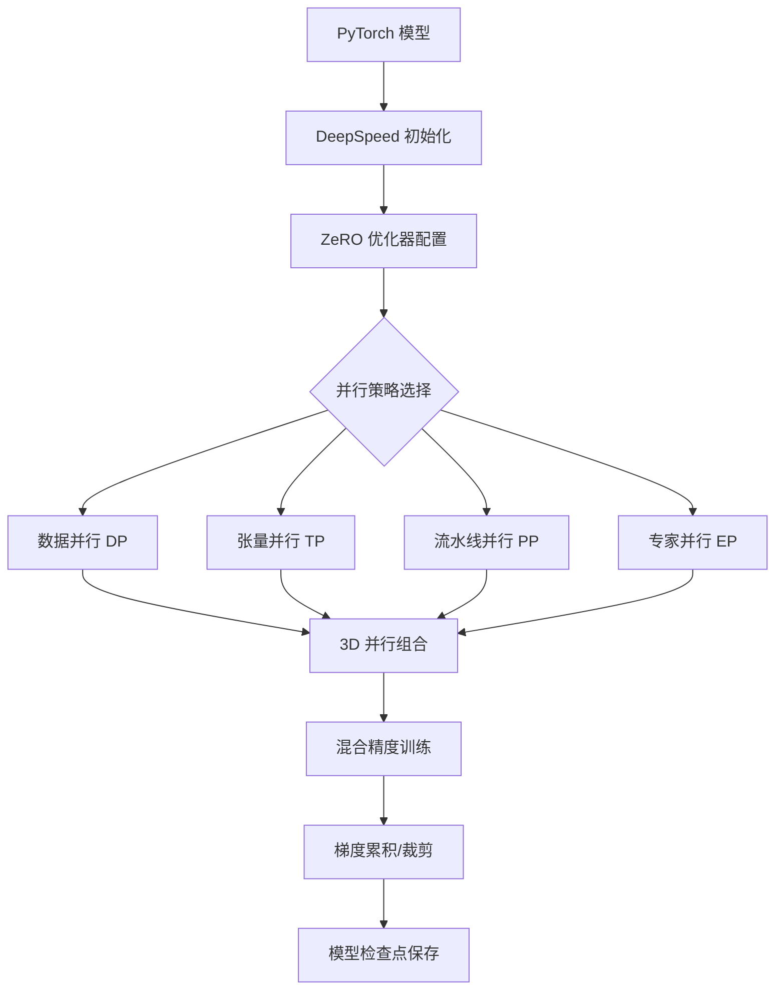

# DeepSpeed

DeepSpeed 是 Microsoft 开发的开源深度学习优化库，专注于解决大规模模型训练中的显存和计算效率问题。其核心目标是在有限的硬件资源下训练尽可能大的模型——通过创新的并行策略、显存优化算法和通信优化技术，DeepSpeed 使得在消费级 GPU 上训练数十亿参数模型、在集群上训练千亿参数模型成为可能。作为 [[PyTorch]] 的扩展库，DeepSpeed 以最小代码侵入的方式集成到现有训练流程中，是当前大模型训练领域最广泛使用的分布式训练框架之一。

DeepSpeed 的技术突破主要体现在 ZeRO（Zero Redundancy Optimizer）系列优化器上。传统数据并行训练中，每个 GPU 都保存完整的模型参数、梯度和优化器状态，导致大量显存冗余。ZeRO 通过切分这些状态到不同 GPU 上，实现了显存占用的线性降低。ZeRO 的三个阶段分别优化优化器状态、梯度和参数的冗余存储，最高可将显存占用降低为原来的 1/N（N 为 GPU 数量）。

除了 ZeRO，DeepSpeed 还提供了混合精度训练（FP16/BF16）、梯度累积、激活检查点（Activation Checkpointing）、通信压缩、流水线并行（Pipeline Parallelism）和专家并行（Expert Parallelism）等丰富的优化手段。2023 年发布的 DeepSpeed-Chat 进一步展示了框架在 RLHF 全流程训练中的能力，而 DeepSpeed4Science 则将优化技术扩展到科学计算领域。

## 核心概念

### ZeRO 优化器

ZeRO 是 DeepSpeed 的核心创新，分为三个阶段：

- **ZeRO-1**：切分优化器状态（Optimizer States），将 Adam 优化器的 momentum 和 variance 状态分布到不同 GPU，显存降低约 4 倍（FP16 训练时）
- **ZeRO-2**：在 ZeRO-1 基础上进一步切分梯度（Gradients），显存降低约 8 倍
- **ZeRO-3**：在 ZeRO-2 基础上进一步切分模型参数（Parameters），显存随 GPU 数量线性降低，理论上可训练任意规模的模型

ZeRO-3 虽然显存效率最高，但通信开销也最大。实际使用中，ZeRO-2 通常是性价比最高的选择，在显存节省和通信开销之间取得良好平衡。

### 混合精度训练

DeepSpeed 支持 FP16 和 BF16 混合精度训练，通过以下机制保证训练稳定性：

- **动态损失缩放**（Dynamic Loss Scaling）：自动调整损失缩放因子，防止梯度下溢
- **主权重维护**（Master Weights）：在 FP32 精度下维护优化器状态，避免精度损失
- **梯度裁剪**：在缩放后的梯度上执行裁剪，防止梯度爆炸

BF16 精度在 Ampere 架构（A100）及以上的 GPU 上表现更优，因其动态范围与 FP32 相同，无需损失缩放。

### 流水线并行

DeepSpeed 的流水线并行（Pipeline Parallelism）将模型按层切分到不同 GPU 上，每个 GPU 只持有部分层。通过微批次（Micro-batch）调度和 1F1B（One Forward One Backward）调度策略，最大化流水线效率。DeepSpeed 支持与 ZeRO 结合使用，在流水线并行的每个阶段内进一步切分优化器状态。

### 3D 并行

DeepSpeed 支持数据并行（DP）、张量并行（TP）和流水线并行（PP）的三维组合，称为 3D 并行。通过自动并行策略搜索，框架可以根据模型规模、集群拓扑和带宽特性选择最优的并行配置。对于超大规模模型（如千亿参数），3D 并行是必不可少的策略。

### DeepSpeed Inference

除了训练优化，DeepSpeed 还提供推理优化能力：

- **DeepSpeed Inference**：支持模型并行推理，将超大模型分布到多个 GPU
- **MoE 推理**：针对 Mixture of Models 模型的专用推理优化
- **量化推理**：支持 INT8/INT4 量化推理加速

## 技术架构

## 应用场景

- **大模型预训练**：在 GPU 集群上训练百亿到千亿参数的基础模型，利用 ZeRO-3 + 3D 并行突破显存瓶颈
- **RLHF 全流程训练**：DeepSpeed-Chat 支持 SFT、RM 训练和 PPO 强化学习的端到端流程
- **消费级 GPU 微调**：在单张消费级 GPU（如 RTX 3090/4090）上通过 ZeRO-2/3 微调 7B-70B 参数模型
- **MoE 模型训练**：支持 Mixture of Experts 模型的专家并行训练
- **科学计算**：DeepSpeed4Science 支持蛋白质折叠、分子动力学等科学计算任务

## 相关技术

- [[LLaMA-Factory]] — 集成 DeepSpeed 的微调框架
- [[微调与模型训练]] — 大模型微调技术体系
- [[模型并行]] — 分布式训练并行策略
- [[混合精度训练]] — 训练精度优化技术
- [[Flash-Attention]] — 注意力计算加速

## 主要页面

- [[微调与模型训练]] — 大模型训练实践，包含 DeepSpeed 配置案例
- [[LLM-技术报告与前沿论文]] — 分布式训练相关论文
