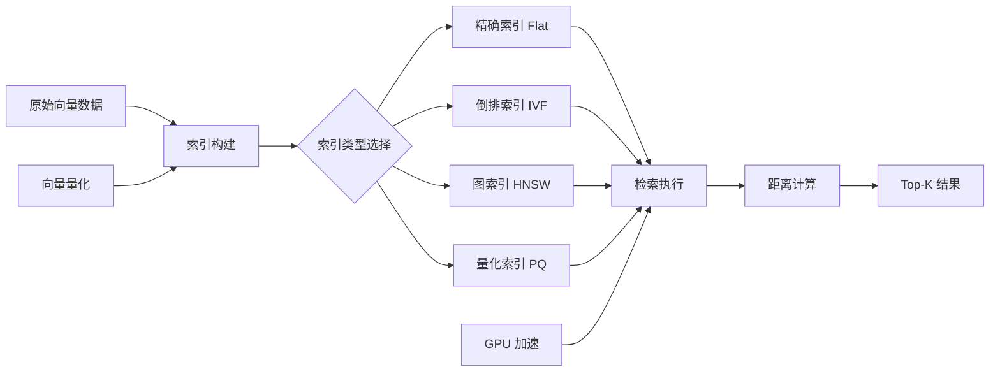

# FAISS

FAISS（Facebook AI Similarity Search）是 Meta（原 Facebook）AI Research 开发的高效向量检索库，专注于大规模嵌入向量的相似度搜索和聚类。作为 RAG（Retrieval-Augmented Generation）系统的核心基础设施，FAISS 能够在数十亿级向量集合中快速找到与查询向量最相似的 Top-K 个结果，是构建向量数据库、语义搜索、推荐系统和多模态检索的关键技术组件。

FAISS 的设计哲学是在搜索速度、内存占用和检索精度之间提供灵活的权衡。它支持多种索引类型，从精确的暴力搜索到各种近似最近邻（ANN）算法，覆盖从百万到十亿级向量的检索需求。FAISS 的核心优势在于其高度优化的 C++ 实现，充分利用了 SIMD 指令、GPU 加速和量化压缩技术，在 CPU 和 GPU 上都能实现极致的检索性能。

FAISS 在 AI 应用中的角色日益重要。随着大语言模型嵌入能力的提升，越来越多的系统使用 FAISS 作为向量检索后端：RAG 系统用它检索相关文档片段，推荐系统用它查找相似商品，图像搜索系统用它匹配视觉特征，语音系统用它识别相似音频。FAISS 也是众多向量数据库（如 Milvus、Qdrant、Weaviate）的底层检索引擎。

## 核心概念

### 索引类型

FAISS 提供丰富的索引类型，适应不同规模和精度的检索需求：

- **IndexFlatL2 / IndexFlatIP**：暴力搜索索引，精确计算所有向量间的距离，适合小规模数据集（<100万）或对精度要求极高的场景
- **IndexIVFFlat**：倒排文件索引，将向量空间划分为多个 Voronoi 单元，搜索时只查询最近的几个单元，以少量精度损失换取大幅速度提升
- **IndexIVFPQ**：乘积量化倒排索引，将高维向量压缩为低维编码，大幅降低内存占用，适合十亿级向量检索
- **IndexHNSW**：基于分层可导航小世界图的索引，搜索速度快、精度高，但内存占用较高
- **IndexLSH**：局部敏感哈希索引，适合超高维稀疏向量
- **IndexBinaryFlat / IndexBinaryIVF**：二进制向量索引，适用于哈希特征和二值嵌入

### 向量量化

FAISS 的核心优化技术之一是向量量化，通过压缩向量表示来降低内存占用和加速距离计算：

- **PQ（Product Quantization）**：将高维向量切分为多个子空间，每个子空间用码本中的最近码字表示，压缩比可达 10-100 倍
- **SQ（Scalar Quantization）**：将浮点数量化为 8-bit 整数，压缩比 4 倍，精度损失小
- **RQ（Residual Quantization）**：残差量化，多级 PQ 级联，实现更高压缩比
- **OPQ（Optimized PQ）**：在量化前对向量空间进行旋转优化，提升量化精度

### GPU 加速

FAISS 提供完整的 GPU 实现，支持单 GPU 和多 GPU 检索：

- **GpuIndexFlat**：GPU 暴力搜索，适合百万级向量的快速精确检索
- **GpuIndexIVF**：GPU 倒排索引，支持十亿级向量的近似检索
- **多 GPU 并行**：通过分片（Sharding）和复制（Replication）策略实现多 GPU 并行检索
- **CPU-GPU 混合**：支持索引部分存储在 CPU 内存、部分在 GPU 显存的混合模式

### 距离度量

FAISS 支持多种距离度量方式：

- **L2 距离**（欧氏距离）：适用于大多数嵌入向量的相似度计算
- **内积**（Inner Product）：适用于归一化向量的余弦相似度近似
- **余弦相似度**：通过向量归一化 + 内积实现
- **汉明距离**：适用于二进制向量的相似度计算

### 批量搜索与过滤

FAISS 支持高效的批量搜索（一次查询多个向量）和 ID 范围搜索（只检索特定 ID 范围内的向量）。`IndexIDMap` 允许为向量附加自定义 ID，便于与外部数据系统（如数据库）关联。`Range Search` 支持返回距离在指定半径内的所有向量。

## 技术架构

## 应用场景

- **RAG 检索增强生成**：在 LLM 应用中检索与用户问题最相关的文档片段，作为生成上下文
- **语义搜索**：构建基于语义理解的企业搜索引擎，替代传统关键词匹配
- **推荐系统**：基于用户和物品嵌入向量的相似度推荐
- **图像检索**：以图搜图，通过视觉特征嵌入查找相似图片
- **去重与聚类**：大规模数据集的近似去重和语义聚类
- **多模态检索**：跨文本、图像、音频的联合嵌入检索

## 相关技术

- [[RAG-检索增强生成]] — FAISS 的核心应用场景
- [[向量数据库]] — 基于 FAISS 的向量数据库系统
- [[嵌入模型]] — 生成检索向量的嵌入模型
- [[BM25]] — 传统关键词检索算法
- [[近似最近邻搜索]] — ANN 算法理论基础

## 主要页面

- [[topics/RAG与知识检索]] — RAG 系统设计与 FAISS 实践
- [[LLM-技术报告与前沿论文]] — 向量检索相关论文
