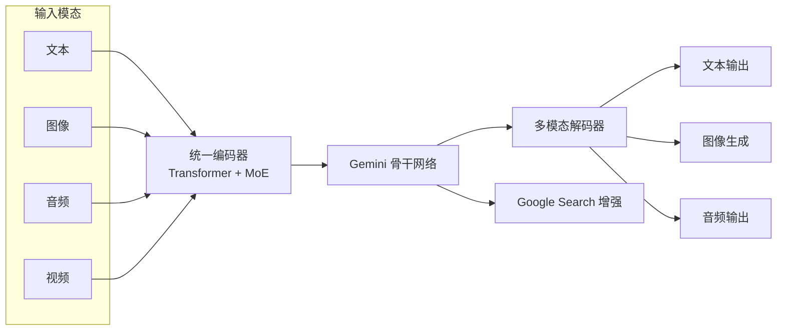

# Gemini

Gemini 是 Google 推出的旗舰级多模态大模型系列，由 Google DeepMind 团队开发，于 2023 年 12 月正式发布。作为 Google AI 战略的核心产品，Gemini 从设计之初就定位为"原生多模态"模型，能够同时理解和生成文本、图像、音频、视频等多种模态的内容，代表了 Google 在大语言模型领域的最高技术水准。

Gemini 的发布标志着 Google 在 AI 竞赛中的全面回归。此前，Google 虽然在 Transformer 架构、BERT、PaLM 等技术上领先，但在产品化方面落后于 OpenAI 的 GPT 系列。Gemini 的推出整合了 Google Brain 和 DeepMind 的顶级研究力量，直接对标 OpenAI 的 GPT-4 系列，并在多项基准测试中展现出领先的性能。

Gemini 系列采用分层产品策略，覆盖从边缘设备到云端数据中心的全场景需求。其原生多模态能力、超长上下文窗口和与 Google 生态的深度集成，使其成为开发者和企业用户的重要选择。

## 核心概念

### 原生多模态架构

与许多"后期融合"的多模态模型不同，Gemini 从训练之初就是"原生多模态"（Natively Multimodal）的：

- **统一训练**：文本、图像、音频、视频数据在同一模型中联合训练，而非分别训练后拼接。
- **模态对齐**：通过共享的表示空间实现跨模态理解，如将视频帧、音频波形和文本映射到同一向量空间。
- **跨模态推理**：能够进行"看图听音写文章"等跨模态推理任务，而非简单的模态转换。

这种原生设计使得 Gemini 在多模态理解任务上具有天然优势，尤其在需要深度跨模态推理的场景中表现出色。

### 版本演进

Gemini 系列经历了快速迭代：

- **Gemini 1.0**（2023.12）：首次发布，分为 Ultra（最强）、Pro（平衡）、Nano（轻量）三个版本。Ultra 版本在 MMLU 等基准上首次超越 GPT-4。
- **Gemini 1.5**（2024.02）：引入突破性的 100 万 token 上下文窗口，采用 MoE（Mixture of Experts）架构，大幅提升长文档和视频理解能力。
- **Gemini 2.0**（2024.12）：正式发布，强调 Agent 能力，支持原生图像生成、音频输出和 Google 搜索集成。分为 Flash（快速）、Pro（强大）、Flash-Lite（轻量）版本。
- **Gemini 2.5**（2025.03）：在推理能力上大幅提升，引入"深度思考"模式，在复杂数学和编程任务上表现优异。

### 上下文窗口

Gemini 系列在上下文窗口方面持续突破：

- Gemini 1.5 Pro 支持 100 万 token 上下文，能够处理整本书籍、长视频或大型代码库。
- Gemini 2.0 进一步优化了长上下文的利用效率，通过稀疏注意力等技术降低计算成本。
- 超长上下文支持"上下文学习"（In-Context Learning），用户可在提示中放入大量示例和参考资料。

### Google 生态集成

Gemini 与 Google 生态深度集成是其独特优势：

- **Google Search**：实时搜索增强，获取最新信息。
- **Google Photos**：理解和管理个人照片库。
- **Google Workspace**：集成到 Gmail、Docs、Sheets 等办公工具中。
- **Android**：作为系统级 AI 助手，支持端侧推理（Nano 版本）。
- **Google Cloud**：通过 Vertex AI 提供企业级 API 服务。

## 技术架构

Gemini 采用基于 Transformer 的架构，结合 MoE（混合专家）技术实现高效推理。输入端通过统一的编码器处理多种模态，骨干网络进行跨模态推理，输出端支持文本、图像和音频生成。

## 应用场景

- **多模态内容创作**：根据文本描述生成图像、视频脚本或音频内容，支持跨模态创作。
- **智能助手**：Google Assistant 集成 Gemini 后具备更强的上下文理解和任务执行能力。
- **代码辅助**：通过 Google Cloud 的 Gemini Code Assist 提供代码生成、审查和调试功能。
- **科研分析**：处理学术论文、实验数据、医学影像等复杂多模态信息。
- **企业应用**：通过 Vertex AI 提供定制化的企业级 AI 解决方案。

## 相关技术

- [[主流-LLM-与厂商]]
- [[多模态大模型]]
- [[LLM-推理优化]]
- [[AI-Agent-编排]]

## 主要页面

- [[主流-LLM-与厂商]] - 主流大语言模型与相关厂商概览
- [[多模态大模型]] - 多模态大模型架构与应用
