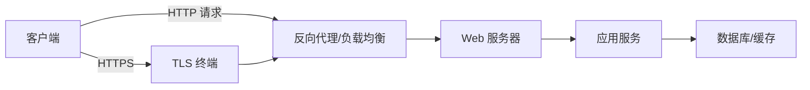

# HTTP

HTTP（HyperText Transfer Protocol，超文本传输协议）是 Web 上应用最广泛的应用层协议，定义了客户端与服务器之间交换消息的格式与规则。它由 Tim Berners-Lee 在 1989 年提出，经过 HTTP/1.0、HTTP/1.1、HTTP/2 到 HTTP/3 的持续演进，至今仍是互联网数据通信的基石。

HTTP 采用经典的请求-响应（Request-Response）模型：客户端（如浏览器、移动端应用、API 客户端）发送请求报文，服务器处理后返回响应报文。每个请求独立、无状态（Stateless），但可通过 Cookie、Token 等机制实现会话状态。HTTP 协议本身运行在 TCP（或基于 UDP 的 QUIC）之上，默认端口为 80（HTTP）和 443（HTTPS）。

在现代软件工程与 AI 生态中，HTTP 是几乎所有远程 API 的传输载体——从 RESTful API、GraphQL 到 LLM 推理接口、MCP 通信、Webhook 推送，都建立在 HTTP 协议之上。理解 HTTP 的核心概念、请求方法、状态码和头部机制，是 Web 开发、系统集成和 AI 应用开发的基础能力。

## 核心概念

### 请求方法（Methods）

HTTP 定义了一组标准请求方法，用于表达对资源的操作意图。最常用的包括：

- **GET**：获取资源，应该是幂等且安全的（不改变服务器状态）。用于读取数据、查询接口。
- **POST**：提交数据、创建资源。常用于表单提交、文件上传、API 调用。
- **PUT**：替换指定资源的全部内容，幂等操作，适合完整更新。
- **PATCH**：对资源进行部分更新，非幂等。
- **DELETE**：删除指定资源。
- **HEAD**：与 GET 相同但只返回响应头，不返回 Body，常用于检查资源是否存在或获取元数据。
- **OPTIONS**：查询服务器支持的方法或跨域请求（CORS）预检。

RESTful API 设计风格中，请求方法与资源的组合形成了统一的接口语义，使得 API 设计更加直观和可预测。

### 状态码（Status Codes）

HTTP 状态码是服务器对请求处理结果的数字化表达，分为五大类：

- **2xx 成功**：200 OK（通用成功）、201 Created（资源已创建）、204 No Content（成功但无返回体）。
- **3xx 重定向**：301 Moved Permanently（永久重定向）、302 Found（临时重定向）、304 Not Modified（缓存有效，用于条件请求）。
- **4xx 客户端错误**：400 Bad Request（请求格式错误）、401 Unauthorized（未认证）、403 Forbidden（无权限）、404 Not Found（资源不存在）、429 Too Many Requests（限流）。
- **5xx 服务器错误**：500 Internal Server Error（通用服务器错误）、502 Bad Gateway（网关错误）、503 Service Unavailable（服务不可用）。

在 API 开发和调试中，正确理解和使用状态码是保证系统可观测性和错误处理质量的关键。

### 请求与响应结构

一个完整的 HTTP 请求由以下部分组成：

- **请求行**：包含方法、路径和协议版本（如 `GET /api/v1/users HTTP/1.1`）。
- **请求头（Headers）**：携带元信息，如 `Content-Type`（请求体格式）、`Authorization`（认证信息）、`Accept`（期望的响应格式）、`User-Agent`（客户端标识）。
- **请求体（Body）**：POST、PUT、PATCH 等方法携带的数据，常见格式为 JSON、表单、multipart。

响应报文则包含状态行、响应头和响应体。常见的 `Content-Type` 包括 `application/json`、`text/html`、`text/plain`、`application/octet-stream` 等。

### HTTPS 与传输安全

HTTPS（HTTP Secure）是 HTTP 在 TLS/SSL 协议之上的加密版本，提供三大安全保障：机密性（数据加密传输）、完整性（防篡改）、身份认证（通过证书验证服务器身份）。现代 Web 应用中 HTTPS 已是默认要求，浏览器对非 HTTPS 站点会标记为"不安全"。Let's Encrypt 等免费证书服务的普及使得 HTTPS 部署成本几乎为零。

### HTTP 协议演进

- **HTTP/1.1**（1997）：引入持久连接、管道化、分块传输，是当前最广泛使用的版本。
- **HTTP/2**（2015）：引入多路复用（Multiplexing）、头部压缩（HPACK）、服务器推送，显著提升性能，解决 HTTP/1.1 的队头阻塞问题。
- **HTTP/3**（2022）：基于 QUIC（UDP）协议，解决 TCP 层面的队头阻塞，内置 TLS 1.3，连接建立更快，尤其适合移动网络和弱网环境。

## 技术架构

典型的 HTTP 请求流程：客户端发起请求 → DNS 解析 → TCP/TLS 握手 → 反向代理（Nginx/Cloudflare）→ Web 服务器（Apache/Caddy）→ 应用服务（Node.js/Python/Go）→ 数据库或缓存 → 原路返回响应。

## 应用场景

- **Web 页面浏览**：浏览器通过 HTTP 获取 HTML、CSS、JS 等静态资源，是最经典的应用场景。
- **RESTful API 设计**：现代前后端分离架构中，HTTP 是前后端通信的标准协议，REST 风格定义了资源导向的 API 设计范式。
- **LLM 推理接口**：OpenAI、Anthropic、Google 等 AI 厂商的模型推理 API 均基于 HTTP/HTTPS 暴露，支持 JSON 格式的请求和流式响应（SSE）。
- **微服务通信**：服务网格（Service Mesh）和微服务架构中，HTTP 是服务间同步通信的主要协议，常配合 gRPC 使用。
- **Webhook 与回调**：GitHub、Stripe、Slack 等平台通过 HTTP POST 请求向外部系统推送事件通知，实现事件驱动架构。

## 相关技术

- [[Web-开发与在线工具]]
- [[LLM-部署与开源生态]]
- [[MCP-协议栈]]
- [[FastAPI]]

## 主要页面

- [[Web-开发与在线工具]] - Web 开发技术与在线工具生态
- [[LLM-部署与开源生态]] - LLM 推理 API 与部署方案
