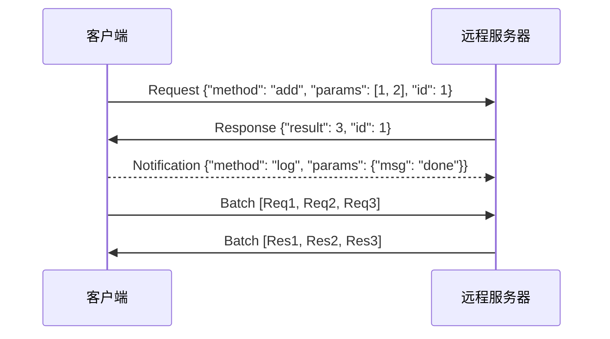

# JSON-RPC

JSON-RPC（JSON Remote Procedure Call）是一种基于 JSON 编码的轻量级远程过程调用（RPC）协议，允许客户端调用远程服务器上的函数或方法，并以 JSON 格式接收返回结果。它于 2005 年左右提出，2.0 版本于 2006 年发布，是目前最简洁、广泛使用的 RPC 协议之一。

JSON-RPC 的设计哲学是"极简主义"——协议规范仅定义了请求、响应、通知和错误四种消息类型，没有复杂的类型系统、传输绑定或会话管理。这种简洁性使得 JSON-RPC 可以运行在任何传输层（HTTP、WebSocket、TCP、进程间通信等）之上，并且易于实现和调试。

在现代 AI 工具生态中，JSON-RPC 是 MCP（Model Context Protocol）协议的底层传输协议之一。MCP 定义了 AI 智能体与外部工具之间的交互语义，而 JSON-RPC 2.0 则提供了消息编码和传输的基础框架。理解 JSON-RPC 的核心概念对于深入掌握 MCP 协议栈至关重要。

## 核心概念

### 请求结构

JSON-RPC 请求是一个 JSON 对象，包含以下字段：

- `jsonrpc`：协议版本，固定为 `"2.0"`。
- `method`：要调用的远程方法名称（字符串）。
- `params`：方法参数，可以是数组（位置参数）或对象（命名参数），可选。
- `id`：请求标识符（字符串、数字或 null），用于匹配响应。如果省略，则为通知（Notification）。

示例请求：

```json
{
  "jsonrpc": "2.0",
  "method": "tools/call",
  "params": {
    "name": "read_file",
    "arguments": { "path": "/home/user/project/main.py" }
  },
  "id": 1
}
```

### 响应结构

JSON-RPC 响应也是 JSON 对象，包含以下字段：

- `jsonrpc`：协议版本 `"2.0"`。
- `result`：调用成功时的返回值（与 `error` 互斥）。
- `error`：调用失败时的错误对象（与 `result` 互斥），包含 `code`（错误码）、`message`（错误描述）和可选的 `data`（额外信息）。
- `id`：与请求中的 `id` 对应，用于匹配。

示例成功响应：

```json
{
  "jsonrpc": "2.0",
  "result": { "content": "print('Hello, World!')" },
  "id": 1
}
```

### 通知（Notification）

通知是一种特殊请求，没有 `id` 字段，表示客户端不期望收到响应。通知适用于"单向"场景，如日志上报、状态广播、事件推送等。服务器收到通知后不应返回响应。

```json
{
  "jsonrpc": "2.0",
  "method": "notifications/message",
  "params": { "level": "info", "data": "Processing complete" }
}
```

### 批处理（Batch）

JSON-RPC 支持批处理，客户端可以一次性发送多个请求（JSON 数组），服务器返回对应数量的响应数组。批处理可提高传输效率，减少往返延迟。响应数组中的元素顺序可能与请求顺序不同，需通过 `id` 匹配。

### 错误码

JSON-RPC 定义了标准错误码：

- `-32700`：Parse error（解析错误，无效 JSON）
- `-32600`：Invalid Request（无效请求格式）
- `-32601`：Method not found（方法不存在）
- `-32602`：Invalid params（无效参数）
- `-32603`：Internal error（内部错误）
- `-32000` 到 `-32099`：Server error（服务端自定义错误，保留区间）

## 技术架构



JSON-RPC 作为传输层无关的协议，常见传输绑定包括：

- **HTTP**：请求通过 POST 发送，响应在 HTTP Body 中返回。
- **WebSocket**：双向通信，支持服务端主动推送通知。
- **TCP/Unix Socket**：低延迟的本地进程间通信。
- **stdio**：标准输入输出，常用于子进程通信（MCP stdio 模式）。

## 应用场景

- **MCP 协议传输层**：Model Context Protocol 使用 JSON-RPC 2.0 作为消息编码标准，定义了 `tools/list`、`tools/call`、`resources/list` 等标准方法。
- **区块链节点通信**：以太坊的 `eth_call`、比特币的 `bitcoin-rpc` 等区块链 API 广泛使用 JSON-RPC。
- **编辑器/IDE 通信**：Language Server Protocol（LSP）的底层传输借鉴了 JSON-RPC 的设计理念。
- **微服务 RPC**：轻量级服务间通信，相比 gRPC/Protobuf 更易于调试和集成。
- **IoT 设备控制**：智能家居、嵌入式设备通过 JSON-RPC 暴露控制接口。

## 相关技术

- [[MCP-协议栈]]
- [[HTTP]]
- [[SSE]]
- [[WebSocket]]

## 主要页面

- [[MCP-协议栈]] - MCP 协议与 JSON-RPC 在 AI 工具中的应用
