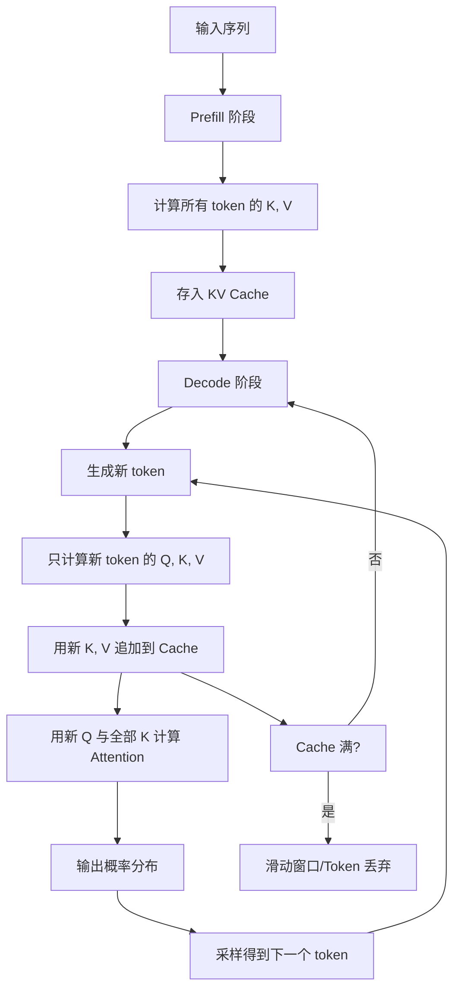

# KV-Cache

KV Cache（Key-Value Cache，键值缓存）是 Transformer 架构自回归推理过程中最核心的加速技术之一。在自回归生成（Autoregressive Generation）中，模型每次只生成一个 token，然后将新生成的 token 追加到输入序列末尾，再次执行完整的前向传播来预测下一个 token。如果不做任何优化，每次生成都需要重新计算整个序列的所有 Key 和 Value，导致计算量随序列长度呈二次方增长。KV Cache 通过缓存已计算过的 Key 和 Value 向量，使得每一步只需计算新增 token 的 KV，从而将推理复杂度从 O(n²) 降低到 O(n)。

从数学角度看，自注意力机制计算 Attention(Q, K, V) = softmax(QK^T/√d)V。当已经生成了前 t 个 token 并计算了对应的 K₁...Kₜ 和 V₁...Vₜ 时，生成第 t+1 个 token 只需计算 qₜ₊₁ 与所有 K 的点积，而不需要重新计算 K₁...Kₜ。KV Cache 正是利用了这一特性，将历史 KV 向量存储在 GPU 显存中直接复用。这项技术使得长序列推理成为可能，也是 vLLM、SGLang、TensorRT-LLM 等推理框架的基础优化手段。

## 核心概念

**Key-Value 缓存机制**：在 Transformer 的每一层 Multi-Head Attention 中，每个 token 经过线性投影后生成对应的 Key 和 Value 向量。KV Cache 将这些向量按序列维度拼接存储，每生成一个新 token 只需追加其 KV 到缓存末尾。缓存的生命周期与推理请求绑定，请求结束后释放。

**显存占用分析**：KV Cache 的显存占用公式为 `2 × num_layers × num_heads × head_dim × seq_len × batch_size × sizeof(dtype)`。以 Llama-2-70B 为例（80 层、64 头、head_dim=128），单个 token 的 KV Cache 约为 2.5MB，一个 4096 token 的序列就需要约 10GB 显存仅用于 KV Cache。因此 KV Cache 是长序列推理的主要显存瓶颈。

**PagedAttention**：vLLM 提出的核心创新，借鉴操作系统虚拟内存的分页思想，将 KV Cache 切分为固定大小的 block（通常 16-64 个 token），按需分配而非预先分配连续空间。这解决了传统 KV Cache 的内存碎片问题，将显存利用率从约 20-40% 提升至接近 100%，显著提高了推理服务的并发吞吐量。

**KV Cache 量化与压缩**：为降低 KV Cache 的显存压力，研究者提出了多种压缩策略：量化（将 FP16 的 KV 压缩为 INT8 或 INT4）、共享（MQA/GQA 减少 KV 头数量）、窗口注意力（只保留最近 N 个 token 的 KV）、Token Dropping（丢弃不重要的 token KV）等。这些方法在精度和显存之间进行权衡。

**推理框架的 KV Cache 管理**：现代推理框架如 vLLM 的 PagedAttention、SGLang 的 RadixAttention（基于 Radix Tree 的 prefix caching）、TensorRT-LLM 的 KV Cache manager，都在 KV Cache 的高效管理上进行了深度优化，包括 prefill-decode 分离、KV Cache 跨请求共享、分布式 KV Cache 等。

## 技术架构

## 应用场景

**长文本生成与对话**：在多轮对话和长文档生成场景中，上下文可能达到数万甚至数十万 tokens。KV Cache 使得模型无需每轮重复计算历史对话的注意力，是 ChatGPT、Claude 等对话式 AI 能够流畅交互的关键技术。

**推理服务高并发部署**：在生产环境中，推理服务需要同时处理大量用户请求。PagedAttention 通过高效的 KV Cache 内存管理，使得单块 GPU 能够并发服务数十倍于传统方法的请求，大幅降低了 LLM 推理的硬件成本。

**Prefix Caching 与 System Prompt 复用**：当多个请求共享相同的 system prompt 或前缀内容时，SGLang 的 RadixAttention 等技术可以跨请求共享对应的 KV Cache，避免重复计算，显著加速批量请求的处理速度。

**推测解码（Speculative Decoding）**：推测解码使用小模型快速生成候选 token 后，大模型并行验证。KV Cache 在此过程中支持大模型一次性对整个候选序列进行注意力计算，是小模型猜测-大模型验证流程能够高效运行的基础设施。

**多轮 Agent 推理**：在 AI Agent 的多步推理场景中，模型需要反复读取完整的历史执行记录。KV Cache 使得 Agent 在每一步工具调用后无需重新处理整个执行历史，大幅提升了 Agent 系统的响应速度。

## 相关概念

- [[LLM-推理优化]] — 推理加速的综合技术体系
- [[SGLang]] — 基于 RadixAttention 的高效推理框架
- [[vLLM]] — PagedAttention 推理引擎
- [[大型语言模型]] — Transformer 架构与自回归生成

## 主要页面

- [[topics/LLM-推理与服务化部署]] — LLM 推理框架与 KV Cache 优化实践
- [[topics/LLM-技术报告与前沿论文]] — Attention 机制与 KV Cache 前沿研究
