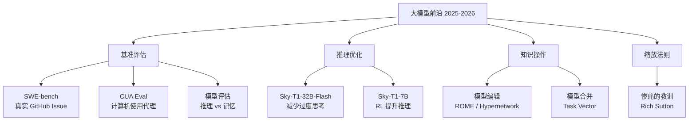
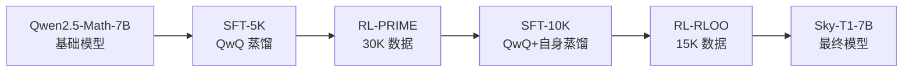
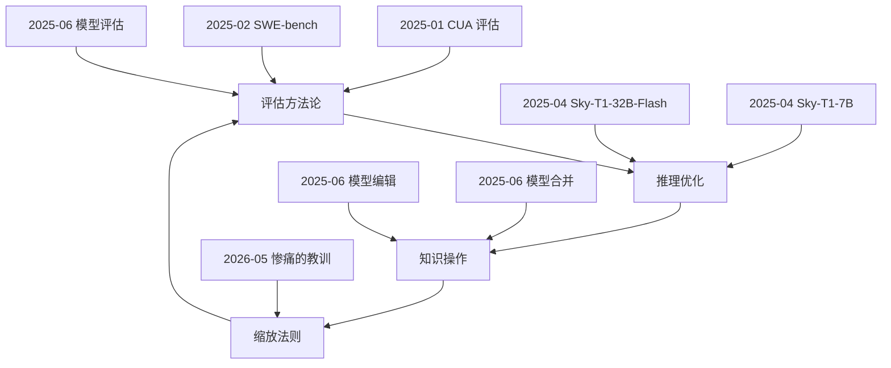

# LLM-技术报告与前沿论文

> 本聚合页覆盖 2025–2026 年间关于大模型评估、推理优化、模型编辑与合并、以及缩放法则的核心技术报告与前沿论文，从基准构建到后训练范式，再到参数空间的操作，勾勒出一条从"评测驱动"到"算力驱动"的技术演进脉络。

## 1. 全景：从评测到算力的范式转移

大模型研究在 2025 年前后进入深水区，四条主线交织推进：

1. **基准评估的精细化**——从单题打分走向真实任务环境（[[SWE-bench]]、[[CUA-评估]]）；
2. **推理效率的再思考**——过度思考（Overthinking）问题催生高效推理模型（[[Sky-T1-32B-Flash]]、[[Sky-T1-7B]]）；
3. **模型知识的微创更新**——[[模型编辑]]与[[模型合并]]绕过全量重训练；
4. **缩放法则的哲学回归**——[[惨痛的教训]]提醒社区：长期赢家永远是算力与搜索。

上述四条主线并非孤立存在。基准评估为推理优化提供衡量标尺；推理模型的知识又可通过编辑与合并技术局部修正；而所有技术路径的最终天花板，皆由缩放法则决定。

---

## 2. 基准评估：从人工构造到真实任务

### 2.1 SWE-bench——真实软件工程的试金石

[[SWE-bench]] 将评估从"几行代码的编程题"拉升到"跨文件、跨函数的仓库级补丁生成"。其核心设计在于：从 12 个流行 Python 仓库的 90,000 个 PR 中，通过三阶段过滤（抓取 → 属性过滤 → 执行过滤）筛选出 2,294 个高质量任务实例。每个任务要求模型根据 Issue 描述生成补丁，并通过真实单元测试验证。

SWE-bench 的关键特征包括：

- **跨上下文代码编辑**——参考方案平均编辑 1.7 个文件、3.0 个函数、32.8 行；
- **持续可更新**——流水线可复用于任意 Python 仓库，不断注入新实例；
- **长上下文挑战**——代码库平均 438K 行，远超模型上下文窗口，迫使检索与定位能力升级。

实验结果令人警醒：即便使用 BM25 检索器，Claude 2 仅解决 1.96% 的问题；切换到"Oracle"检索后提升至 4.8%。这一差距揭示出当前模型在**代码定位**与**长上下文推理**上的根本瓶颈。更多细节可参阅 [[SWE-bench]] 专页。

### 2.2 CUA 评估——计算机使用代理的系统化评测

OpenAI 的 [[CUA-评估]]（Computer Using Agent Evaluation）聚焦于模型在真实浏览器与操作系统环境中的多步操作能力。评估覆盖 [[WebArena]]、[[OSWorld]]、[[WebVoyager]] 三个基准，分别考察网页导航、桌面操作与真实网站交互。

CUA 评估的设计要点：

- **环境适配**——WebArena 与 WebVoyager 使用 Operator 浏览器（依赖视觉动作空间），OSWorld 使用 VMWare Ubuntu VM；
- **提示工程精细化**——为每个网站定制专属提示（如 Magento 购物后台、OpenStreetMap 路径规划），弥合基准与真实知识的鸿沟；
- **评分鲁棒性**——采用 GPT-4o 自动评估，并剔除 35 个因网站内容变更而失效的任务。

CUA 评估与 SWE-bench 形成互补：前者考察模型与图形界面的交互能力，后者考察代码库的理解与修改能力。两者共同构成"模型作为操作者"的评估图谱。参见 [[AI-Agent-编排]] 与 [[Prompt-Engineering-与上下文工程]]。

### 2.3 模型评估的方法论反思

李宏毅在 2025 年《生成式AI时代下的机器学习》第九讲中，对 LLM 评估做出方法论层面的反思，聚焦两个核心议题：

**推理 vs 记忆**——模型在基准上的高分可能源于训练数据的记忆而非真正的推理能力。通过构造"表面相似但答案相反"的对照实验，可剥离记忆效应，测得模型的真实推理水平。

**ARC-AGI 与 Chatbot Arena**——[[ARC-AGI]] 通过抽象推理任务测试模型的流体智力；[[Chatbot Arena]] 则借助 Elo 评分系统，在真实用户互动中对模型进行大规模排序，覆盖情感、风格控制等细粒度维度。

上述方法论与 [[SWE-bench]] 的执行式评估形成呼应：真正有效的评估，必须绕过模型的记忆与投机，直击其泛化与推理的本质。

---

## 3. 推理优化：从过度思考到高效推理

### 3.1 Sky-T1-32B-Flash——思考更少，成就更多

[[Sky-T1-32B-Flash]] 针对推理模型的"过度思考"症结，提出一套三阶段训练方案（数据生成 → 响应重写 → 偏好优化），在保持准确性的同时将生成长度削减最高 57%。

#### 核心问题：过度思考

推理模型（如 Sky-T1-32B-Preview、QwQ、R1）倾向于生成冗余的推理序列——同一问题提出多个解法，每个解法后伴随"另外""等一下""让我重新考虑"等复核转换词。对于简单问题（如"1+1等于多少"），Sky-T1-32B-Preview 可生成超过 1,000 个 token 与 10 余个复核步骤，造成严重效率浪费。

#### 三阶段训练方案

**阶段一：数据生成与偏好对构建**

使用 Sky-T1-32B-Preview 为 PRM800K 的 12K 个问题各生成 8 个回答（温度 1.0），以最短正确回答为正样本、最长正确回答为负样本构建偏好对。仅保留至少有两个正确回答的问题。

关键改进在于：针对编程（LCB-Medium/Hard）与最难题目（AIME24、MATH500 Level 5）的准确率下降，引入"短错误 + 长正确"偏好对，防止模型**思考不足**。这一权衡（Trade-off）凸显了推理深度与效率之间的张力。

**阶段二：响应重写**

使用 Llama-3.3-70B 对正样本进行剪枝，仅保留"第一个正确解法 + 1 个额外解法"（FCS+1），删除冗余子解决方案。消融实验表明 FCS+1 在维持准确性的同时达成最短生成长度。编程样本因结构差异不做重写。

**阶段三：偏好优化**

采用 [[SimPO]] 算法——在 DPO 基础上引入长度归一化的隐式奖励，无需参考模型，计算开销更低。以 Sky-T1-32B-Preview 为基础模型，学习率 5e-7、gamma 0.3、beta 2.0 为最优配置。

#### 结果

Sky-T1-32B-Flash 在 AIME24 上削减 37%、在 LCB-Hard 上削减 57% 的生成长度，同时保持 Sky-T1-32B-Preview 的准确性。整个训练方案在 8×H100 上仅需约 $275。

### 3.2 Sky-T1-7B——强化学习提升推理模型的潜力

[[Sky-T1-7B]] 探索了一条不同于"纯 SFT 蒸馏"的路径：通过 SFT → RL → SFT → RL 四步训练，仅用 5K 个蒸馏样本，在 7B 规模上达到 SOTA 水平。

#### 四步训练流程

**步骤一：SFT**——从 NUMINA 数据集筛选高难度题目（难度 > 3 级），使用 QwQ 生成解答并经拒绝采样保留正确响应，获得 5K 样本。

**步骤二：RL（PRIME）**——采用 PRIME 算法与 Eurus-2-RL-Data，每个提示生成 4 个 rollout，过滤全正确或全错误的题目。此阶段在 8×H100 上运行约 44 小时。

**步骤三：再次 SFT**——结合 QwQ 蒸馏与步骤二自身蒸馏的数据，共 10K 样本做第二轮 SFT。

**步骤四：再次 RL（RLOO）**——采用简单 RLOO 算法，每个提示 8 个 rollout，约 15K 数据。

#### 核心发现：SFT 与 RL 的互补性

消融实验揭示出关键规律：

- **长链条 CoT SFT** 提升 pass@k 整体性能（高采样预算下优势显著）；
- **RL** 提升 pass@1 性能（低采样预算下效率更高），但可能以牺牲解法熵为代价；
- **RL 的数据效率**优于 SFT——SFT 在 60K 数据后收益饱和，而 RL 在 120K 时仍有增益。

这一发现对后训练资源分配具有指导意义：若追求单次推理质量，应加大 RL 比重；若追求多样化解法，则需保留 SFT 与采样的空间。

#### Sky-T1-mini——简单 RL 的潜力

作为副产品，Sky-T1-mini 在 DeepSeek-R1-Distill-Qwen-7B 基础上仅用简单 RLOO 训练 36 小时（约 $870），即接近 OpenAI o1-mini 的性能。这进一步证明 [[强化学习]] 在蒸馏之外仍有独立增益空间。

---

## 4. 知识操作：模型编辑与模型合并

### 4.1 模型编辑——知识的微创手术

[[模型编辑]]（Model Editing）旨在不重新训练的前提下，精准植入特定事实或修正错误知识。李宏毅第十讲系统阐述了这一技术谱系。

#### 评估标准

模型编辑的质量由三个维度衡量：

- **可靠性**——编辑后的模型能否正确回答目标问题；
- **泛化性**——能否回答目标问题的多种改写形式；
- **局部性**——未编辑区域的性能是否保持不变。

#### 两类方法

**不改变参数**——通过外部记忆或解码时干预实现知识修正（如上下文编辑、检索增强）；

**改变参数**——直接修改模型权重。代表性方法 [[ROME]]（Rank-One Model Editing）通过定位知识存储的关键层，施加秩一修改实现知识植入。[[Hypernetwork]] 则更进一步，训练一个"编辑网络"来预测参数修改量，实现"学习如何编辑"的元学习范式。

模型编辑与 [[后训练]] 形成互补：后训练旨在学习新技能，编辑旨在植入事实。两者共同构成知识更新的工具箱。

### 4.2 模型合并——参数空间的算术

[[模型合并]]（Model Merging）探索在参数空间中对模型进行加减运算，以实现能力组合或抑制。

#### 任务向量（Task Vector）

给定基础模型权重 θ_base 与微调后权重 θ_tuned，任务向量定义为 τ = θ_tuned − θ_base。该向量编码了"微调带来的能力增量"。通过向量运算：

- **能力组合**：θ_merged = θ_base + τ_A + τ_B，将两种微调能力合并；
- **能力抑制**：θ_detoxified = θ_base − τ_toxic，减少有毒内容生成。

#### 规模化考量

模型合并面临任务向量干扰、能力冲突等挑战。高级方法通过任务算术、TIES、DARE 等技术缓解干扰。未来愿景是"任务向量市场"——小团队可专门开发、出售和交换任务向量，形成模块化的 AI 能力生态。

模型合并与 [[模型编辑]] 共同代表了一种新范式：将模型视为可组合、可修改的参数结构，而非不可变的整体。这与 [[微调与模型训练]] 领域密切相关。

---

## 5. 惨痛的教训：缩放法则的哲学启示

[[惨痛的教训]]（The Bitter Lesson，Rich Sutton，2019）虽非新作，但在 2025–2026 年的大模型时代被反复重读，其预见性愈发显著。

### 核心论点

回顾 70 年人工智能史，最深刻的教训是：**依托算力的通用方法，最终效果远超基于人类知识的专用方法，且优势极其显著**。根源在于摩尔定律——单位计算成本持续指数下降。

### 历史案例

- **国际象棋**（1997）：依靠大规模深度搜索的"蛮力"方法击败基于人类棋局理解的精巧算法；
- **围棋**（AlphaGo）：早期研究试图用人类经验规避搜索，最终自我对弈与搜索胜出；
- **语音识别**：HMM 统计方法完胜基于音素、发声器官知识的定制方案；
- **计算机视觉**：深度神经网络摒弃边缘检测、SIFT 等手工特征，性能质的飞跃。

### 对当下的启示

1. **通用方法潜力无限**——搜索与学习两种可无限适配算力增长的核心路径；
2. **人类认知不应硬编码**——大脑运行逻辑极其复杂，强行简化内置只会阻碍进展；
3. **元方法优先**——应搭建能自主发现复杂特征的元方法，而非预设人类发现。

惨痛的教训与 [[SWE-bench]] 的实验发现形成深刻共鸣：当前模型在真实任务上的低解决率，恰恰说明依赖参数记忆（人类知识的压缩）的路径已触及天花板，未来突破需更多依赖搜索、执行与学习。

---

## 6. 技术演进脉络与内在联系

上述八个来源并非孤立的技术点，而是相互关联的研究网络：

- **评估驱动优化**：[[SWE-bench]] 与 [[CUA-评估]] 暴露模型短板，催生 [[Sky-T1-32B-Flash]] 与 [[Sky-T1-7B]] 等推理优化工作；
- **优化沉淀知识**：高效推理模型的知识更新需求，推动 [[模型编辑]] 与 [[模型合并]] 技术发展；
- **知识操作服从缩放**：所有知识操作技术的长期天花板，由 [[惨痛的教训]] 揭示的缩放法则决定；
- **缩放反哺评估**：算力增长使更复杂、更真实的评估成为可能，形成正反馈循环。

---

## 7. 关键术语与内部链接索引

| 术语 | 锁定译法 | 相关页面 |
|------|---------|---------|
| Benchmark | 基准评估 | [[SWE-bench]]、[[CUA-评估]] |
| Model Editing | 模型编辑 | [[模型编辑]] |
| Model Merging | 模型合并 | [[模型合并]] |
| Post-training | 后训练 | [[微调与模型训练]] |
| Scaling Laws | 缩放法则 | [[惨痛的教训]] |
| SWE-bench | SWE-bench（不翻译） | [[SWE-bench]] |
| Bitter Lesson | 惨痛的教训（Rich Sutton） | [[惨痛的教训]] |
| Overthinking | 过度思考 | [[Sky-T1-32B-Flash]] |
| Task Vector | 任务向量 | [[模型合并]] |
| ROME | ROME（不翻译） | [[模型编辑]] |
| SimPO | SimPO（不翻译） | [[Sky-T1-32B-Flash]] |
| RLOO | RLOO（不翻译） | [[Sky-T1-7B]] |
| ARC-AGI | ARC-AGI（不翻译） | [[模型评估]] |
| Chatbot Arena | Chatbot Arena（不翻译） | [[模型评估]] |

---

## 8. 延伸阅读

- [[LLM-推理优化]]——推理框架、引擎与加速技术
- [[微调与模型训练]]——参数高效微调与训练框架
- [[AI-Agent-编排]]——智能体框架与多智能体协作
- [[Prompt-Engineering-与上下文工程]]——提示工程方法论
- [[主流-LLM-与厂商]]——大模型竞争格局
- [[数据集标注与模型评估]]——数据构建与评估实践

---

*本聚合页由 LLM 基于 8 篇原始文章合成，覆盖 2025-01 至 2026-05 间的技术报告与课程材料。*
