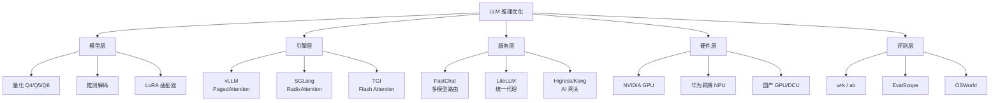
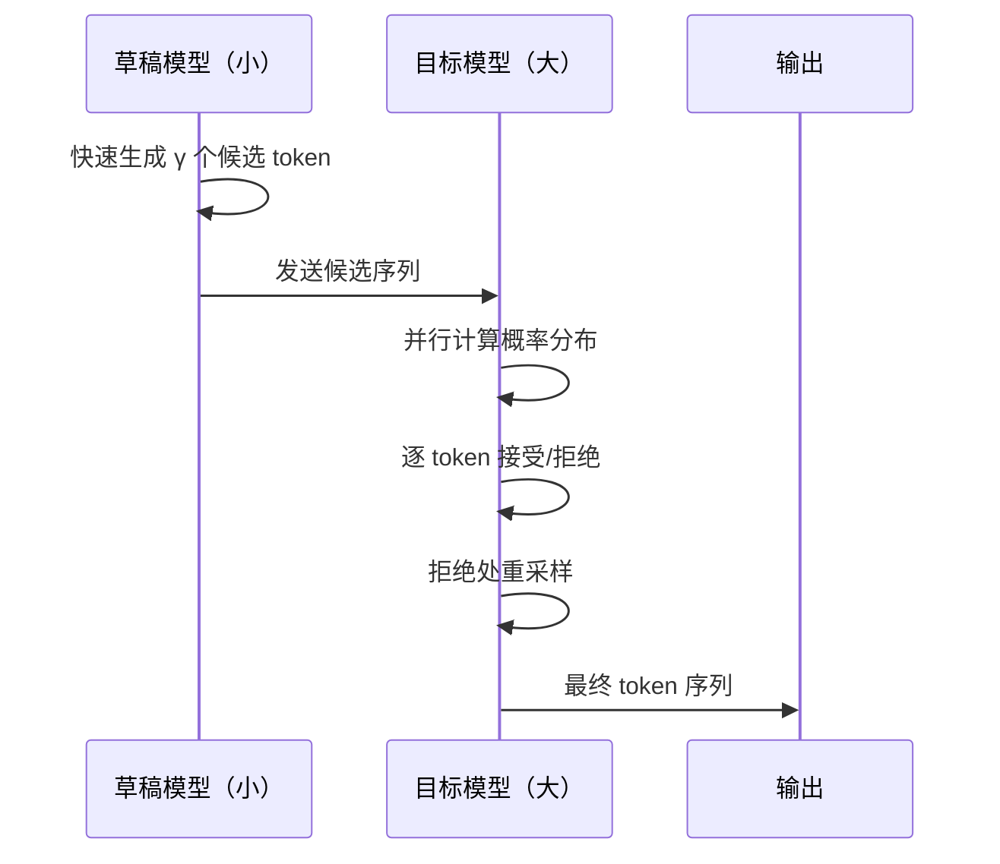
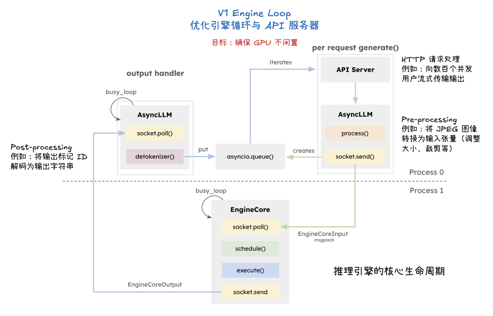
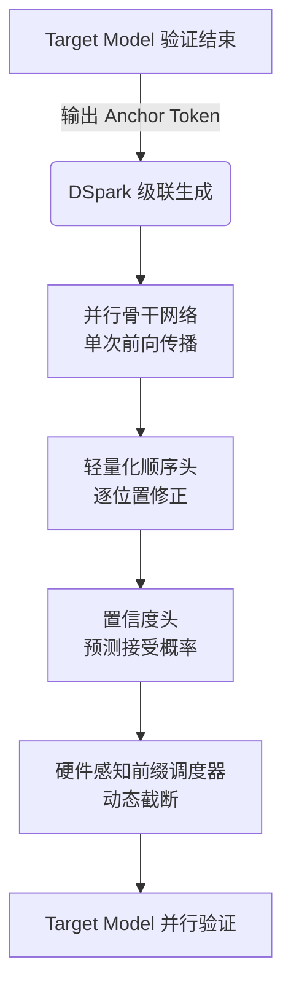
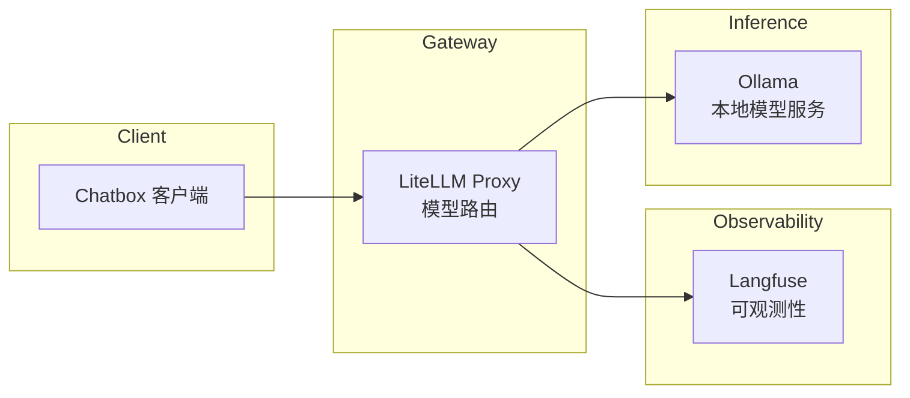

# LLM-推理优化

> 本聚合页覆盖从模型打包部署、推理框架选型、量化压缩、推测解码到性能压测的完整技术栈，梳理 LLM 推理优化领域的核心工具链、架构演进与前沿研究成果。

## 1. 全景：推理优化的技术分层

LLM 推理优化贯穿"模型→框架→硬件→服务"全链路，可抽象为五个层次：

1. **模型层**——[[量化]]、[[模型融合]]、蒸馏等压缩技术，降低参数精度与计算量；
2. **引擎层**——[[vLLM]]、[[SGLang]]、[[Text-Generation-Inference]] 等推理框架，负责调度与内存管理；
3. **服务层**——[[FastChat]]、[[LiteLLM]]、[[Higress-AI-Gateway]] 等网关与代理，负责路由与负载均衡；
4. **硬件层**——GPU、NPU、国产芯片（华为昇腾、沐曦、海光）上的适配与压测；
5. **评测层**——[[性能压测]]工具（wrk、ab、EvalScope）与基准数据集（OSWorld、SWE-bench）。



上述五层并非孤立存在。模型量化决定引擎的内存分配策略；引擎的 KV Cache 管理直接影响服务的并发能力；服务层的路由决策又依赖于硬件层的算力画像；而评测层贯穿始终，为每一层的优化提供衡量标尺。

---

## 2. 模型部署与打包

### 2.1 Docker 与 Kubernetes 上的模型分发

模型制品的容器化是推理服务的起点。借助 [[Docker]] 的 `docker commit` 机制，可将训练好的权重直接打包为镜像层，再通过 Kubernetes 的 [[Init-Containers]] 将模型注入共享存储卷，实现"模型镜像"与"服务镜像"解耦。这种模式在 YOLO 等视觉模型上已验证可行，其核心优势在于：

- **版本可追溯**——每次模型更新对应一个镜像 tag，回滚只需切换镜像；
- **启动加速**——Init Container 在服务容器启动前完成模型拷贝，避免运行时下载；
- **多模型共享**——同一模型镜像可被多个 Deployment 引用，节省存储与带宽。

### 2.2 推理服务的 API 封装

[[FastAPI]] 是当前主流的推理服务框架，配合 [[Uvicorn]] 与 [[Gunicorn]] 可实现 ASGI 异步服务。基准测试揭示出一个关键权衡：**同步函数在单进程下失败率显著高于异步函数**，但随着 worker 数增加，两者差距缩小；在 4 个 worker 时达到最佳吞吐，8 个 worker 后收益递减。此外，Gunicorn+Uvicorn 组合在纯计算密集型场景下并未展现出相对于单独使用 Uvicorn 的优势，但在需要进程管理（如热重载、优雅退出）时仍是首选。

文件上传下载场景下，[[wrk]] 配合 Lua 脚本可精确模拟 multipart 流式上传。测试表明：**stream 异步读 + 异步写磁盘**的组合在大文件场景下吞吐最优，而全量读取模式在小文件场景下延迟更低。

---

## 3. 推理引擎：核心框架对比

### 3.1 vLLM——PagedAttention 的开创者

[[vLLM]] 通过操作系统虚拟内存的分页思想管理 [[KV Cache]]，将传统"为每个序列预留最大长度显存"的模式转变为"按需分配、动态回收"。这一机制带来两方面的显著收益：

- **显存利用率提升至接近 100%**——消除内部碎片，同等 GPU 下支持 2–3 倍并发；
- **吞吐大幅提升**——在 Qwen1.5 等模型上，相比 HuggingFace Transformers 原生推理提升数倍。

vLLM 的部署极为简洁：`vllm serve` 命令即可启动 OpenAI 兼容的 API 服务，支持张量并行（Tensor Parallelism）与量化（GPTQ、AWQ）。其架构核心包括 Scheduler、Block Manager 与 Worker 三部分，协同完成请求调度、显存分配与模型执行。

### 3.2 SGLang——RadixAttention 的引入

[[SGLang]]（原 Structured Generation Language）在 vLLM 的 PagedAttention 基础上，进一步引入 [[RadixAttention]] 机制，通过前缀树（Radix Tree）复用多个请求共享的 KV Cache 前缀。这一优化在以下场景尤为有效：

- **多轮对话**——历史轮次的 KV Cache 无需重复计算；
- **Few-shot 推理**——多个样本共享 system prompt 前缀；
- **Agent 工作流**——工具调用产生的长上下文存在大量重复片段。

SGLang 还集成了 [[FlashInfer]] 内核，在长上下文场景下延迟显著低于 vLLM。

### 3.3 Text Generation Inference（TGI）

[[Text-Generation-Inference]] 是 HuggingFace 官方推出的推理引擎，其特色在于：

- **Flash Attention 与 Paged Attention 双优化**——在支持的 GPU 上自动启用；
- **多种量化方案**——bitsandbytes、GPTQ、AWQ 开箱即用；
- **safetensors 权重加载**——避免反序列化安全风险；
- **水印机制**——为模型输出嵌入可追踪的统计特征。

TGI 的 Docker 部署模式与 vLLM 类似，但其对 HuggingFace Hub 生态的集成更为紧密。

### 3.4 其他引擎

- **[[llama.cpp]]**——纯 C/C++ 实现，支持 Q2–F16 多种量化格式，在 CPU 与 Apple Silicon 上表现优异；
- **[[Candle]]**——基于 Rust 的轻量级推理框架，支持 MPS（Metal Performance Shaders）后端，适合边缘设备；
- **[[TVM]]**——深度学习编译器，通过自动调优生成针对特定硬件的高效算子；
- **[[OpenVINO]]**——Intel 推出的推理优化工具包，其 `benchmark_app` 支持同步（Latency）与异步（Throughput）两种模式。

---

## 4. 量化与压缩

### 4.1 权重量化

[[量化]] 是降低显存占用与加速推理的核心手段。[[llama.cpp]] 提供从 Q2_K 到 F16 的十余种量化格式，其权衡规律如下：

| 量化类型 | 位宽（BPW） | 相对大小 | 困惑度影响 |
|---------|------------|---------|-----------|
| Q4_K_M | ~4.5 | 较小 | 低 |
| Q5_K_M | ~5.5 | 中等 | 很低 |
| Q6_K | ~6.5 | 较大 | 极低 |
| Q8_0 | 8.0 | 大 | 可忽略 |
| F16 | 16.0 | 原始 | 无 |

困惑度（PPL）是衡量量化质量的核心指标——PPL 增量越小，量化引入的精度损失越低。实践中，Q4_K_M 通常是"显存-质量"的最佳平衡点。

### 4.2 激活量化与混合精度

[[LLM.int8]]（bitsandbytes 实现）采用混合精度分解策略：对异常值保留 FP16 精度，其余部分量化为 INT8。实测在 RoBERTa 等模型上，显存减少 72%，速度提升 33%。

[[DeepSeek-V3]] 在训练阶段引入 [[FP8]] 混合精度，在保持模型质量的同时将训练吞吐量提升约 50%。FP8 训练的稳定性依赖于精细的损失缩放（Loss Scaling）策略与分块量化（Block-wise Quantization）。

---

## 5. 推测解码（Speculative Decoding）

[[推测解码]]（Speculative Decoding）是一种"以小博大"的推理加速技术，其核心流程：

1. **草稿生成**——小型草稿模型（Draft Model）快速生成一串候选 token；
2. **并行验证**——大型目标模型一次性评估所有候选 token 的概率；
3. **接受/拒绝**——基于概率比较决定接受哪些 token，拒绝处从修正分布重采样。



推测解码的加速比取决于草稿模型与目标模型的"匹配度"——草稿模型越接近目标模型分布，接受率越高，加速比越大。在 vLLM 与 TGI 中均已集成该功能，实测可获得 2–3 倍的吞吐提升。

---

## 6. 多 LoRA 适配器部署

[[LoRA]]（Low-Rank Adaptation）微调产生的轻量级适配器，可在共享基座模型的前提下服务多个下游任务。[[多-LoRA-推理]] 的核心挑战在于：

- **显存隔离**——不同适配器的权重需独立加载，避免相互干扰；
- **动态切换**——请求到达时快速加载对应适配器，减少冷启动延迟；
- **批处理兼容**——同一批次内可能包含不同适配器的请求。

[[vLLM]] 通过 `--enable-lora` 与 `--lora-modules` 参数支持多 LoRA 部署；[[Text-Generation-Inference]] 则通过 HuggingFace 的 `multi-lora-serving` 方案实现类似功能。[[NVIDIA-NIM]] 进一步将 LoRA 服务化，支持无缝切换大量适配器。

---

## 7. 显存规划与计算

推理服务的显存需求由三部分构成：**模型权重**、[[KV Cache]]、**激活与临时缓冲区**。以 [[Qwen2]] 为例：

| 参数量 | 加载显存（FP16） | 8K 上下文总显存 | 32K 上下文总显存 |
|-------|----------------|---------------|----------------|
| 1.5B | 3 GB | ~10 GB | ~32 GB |
| 7B | 14 GB | ~21 GB | ~43 GB |
| 72B | 144 GB | ~154 GB | ~213 GB |

对于 [[vLLM]] 等采用显存预分配的引擎，实际占用难以精确预估，需预留 10–20% 的缓冲空间。[[华为-Atlas-800I-A2]] 等国产化服务器的显存规划还需考虑 NPU 与 CPU 内存的配比。

---

## 8. 服务网关与代理

### 8.1 AI 网关

[[Higress-AI-Gateway]] 与 [[Kong-AI-Gateway]] 是两类代表性的 AI 网关：

- **Higress**——基于 Envoy/Istio 构建，原生支持 LLM 流量治理，提供模型路由、限流、降级等能力；
- **Kong**——传统 API 网关的 AI 扩展，通过 AI Proxy 插件对接多家 LLM 提供商，强调可观测性与插件生态。

### 8.2 统一代理

[[LiteLLM]] 定位为"LLM 的 OpenAI 兼容层"，其核心能力包括：

- **统一接口**——将 100+ 模型提供商的 API 统一为 OpenAI 格式；
- **负载均衡**——在多个 API Key 与 Endpoint 间智能路由；
- **可观测性**——集成 Langfuse 等工具，追踪每次调用的成本与延迟；
- **故障转移**——主提供商异常时自动切换到备用。

### 8.3 多模型服务

[[FastChat]] 采用 Controller + Model Worker + OpenAI API Server 的三层架构，支持在同一服务中部署多个模型（如 ChatGLM2-6B、Vicuna-7B），每个模型可绑定不同 GPU。其 `launch_all_serve` 模块支持一键启动多模型部署。

---

## 9. 硬件适配与性能压测

### 9.1 华为昇腾 Atlas 800I A2

[[华为-Atlas-800I-A2]] 搭载昇腾 910B NPU，单卡 64GB HBM。在 [[MindIE]] 框架下部署 [[Qwen]] 系列模型，需关注：

- **NPU 与 CPU 配比**——NUMA 拓扑对跨卡通信延迟影响显著；
- **vLLM 适配**——通过 Ascend 后端接入 vLLM，支持 PagedAttention；
- **多实例部署**——单卡可切分为多个推理实例，提升资源利用率。

性能压测使用 [[EvalScope]] 框架，覆盖吞吐（Tokens/s）、首 Token 延迟（TTFT）、单 Token 延迟（TPOT）等指标。

### 9.2 国产 GPU/DCU

- **[[沐曦-MXC500]]**——国产训练 GPU，支持 FP16/BF16 推理，通过 vLLM 部署 Qwen 模型时需关注驱动兼容性；
- **[[海光-DCU]]**——基于 HIP 架构，兼容 CUDA 生态，在 vLLM 与 LiteLLM 上均可运行。

### 9.3 压测工具链

| 工具 | 适用场景 | 特点 |
|-----|---------|-----|
| [[wrk]] | HTTP 服务压测 | 支持 Lua 脚本，高并发 |
| [[ab]] | 简单 HTTP 压测 | Apache 自带，易于使用 |
| [[EvalScope]] | LLM 专用压测 | 支持 TTFT、TPOT、吞吐等多维度 |
| [[OpenVINO-Benchmark]] | Intel 硬件推理 | 支持同步/异步模式 |

---

## 10. 前沿模型架构

### 10.1 DeepSeek-V3——MoE + MLA 的标杆

[[DeepSeek-V3]] 采用 [[MoE]]（Mixture-of-Experts）架构，总参数 671B，每 token 仅激活 37B。其核心创新包括：

- **[[MLA]]**（Multi-head Latent Attention）——将 KV Cache 压缩为低维潜变量，显著降低推理显存；
- **无辅助损失负载均衡**——避免传统 MoE 中辅助损失对主损失的影响；
- **[[多-Token-预测]]**（MTP）——训练时预测多个未来 token，提升样本效率；
- **FP8 训练**——在 H800 GPU 上实现稳定的 FP8 混合精度训练。

### 10.2 DeepSeek-R1——强化学习驱动的推理能力

[[DeepSeek-R1]] 通过 [[GRPO]]（Group Relative Policy Optimization）强化学习，在无需监督微调（SFT）的情况下涌现出链式推理（Chain-of-Thought）能力。其技术路线：

1. **R1-Zero**——纯 RL 训练，验证推理行为可自发涌现；
2. **冷启动 + 多阶段 RL**——引入少量高质量数据解决可读性与语言混合问题；
3. **蒸馏**——将 R1 的推理能力迁移至 1.5B–70B 的稠密模型。

---

## 11. 推理评测基准

### 11.1 OSWorld——真实计算机环境的多模态代理评测

[[OSWorld]] 构建了首个可扩展的真实计算机环境，支持 Ubuntu、Windows、macOS 上的 369 个开放式任务。其评估覆盖：

- **GUI 操作**——通过 PyAutoGUI 模拟鼠标点击与键盘输入；
- **CLI 命令**——终端环境下的文件操作与脚本执行；
- **跨应用工作流**——浏览器、编辑器、终端的协同操作。

当前最优模型仅完成 12.24% 的任务（人类为 72.36%），主要瓶颈在于 GUI 定位与长序列规划能力。

### 11.2 推理服务的性能基准

LLM 推理服务的核心指标包括：

- **TTFT**（Time To First Token）——首 Token 延迟，影响用户感知响应速度；
- **TPOT**（Time Per Output Token）——单 Token 生成延迟，影响流式体验；
- **Throughput**——单位时间处理的 Token 数，决定服务成本；
- **GPU Utilization**——GPU 计算单元利用率，反映资源使用效率。

[[LLM-基准测试]] 实践表明，在 Tesla T4 上部署 Qwen-1_8B-Chat，vLLM 相比 FastChat 原生 Worker 在吞吐上具有显著优势，但 FlashAttention 在 Turing 架构 GPU 上不可用，需回退到 FlashAttention 1.x。

---

## 12. 技术选型建议

| 场景 | 推荐方案 | 理由 |
|-----|---------|-----|
| 单卡高并发 | vLLM + Q4 量化 | PagedAttention 最大化显存利用 |
| 多轮对话 | SGLang | RadixAttention 复用前缀 KV |
| 多模型路由 | FastChat + LiteLLM | 统一 OpenAI 兼容接口 |
| 边缘设备 | llama.cpp / Candle | 纯 C/Rust，无 GPU 依赖 |
| 国产硬件 | MindIE + vLLM Ascend | 昇腾 NPU 原生支持 |
| 快速验证 | Transformers Pipeline | 开箱即用，适合原型 |

---

## 13. vLLM 深度优化实验

### 13.1 聊天场景下的前缀缓存与分块预填充

在 Tesla T4 (16GB) 上对 [[Qwen3]]-4B 进行的系统性基准测试揭示了 [[vLLM]] 关键优化参数的影响规律。使用 ShareGPT 数据集（100 条请求），对比了五种配置：

| 配置方案 | 请求吞吐 (req/s) | 总 Token 吞吐 (tok/s) | 平均 TTFT (ms) | 平均 E2EL (ms) |
|---------|------------------|-----------------------|----------------|----------------|
| 基准 | 1.31 | 611.47 | 7983.40 | 29372.42 |
| + prefix caching | 1.37 | 640.97 | 6991.24 | 28070.48 |
| + chunked prefill (8192) | **1.38** | **643.33** | **6631.39** | **27798.67** |
| + chunked prefill (2048) | 1.30 | 605.71 | 8737.94 | 30992.45 |
| 所有优化组合 | 1.37 | 637.96 | 6980.78 | 28308.21 |

关键发现：
- **prefix caching** 使 TTFT 降低约 12.4%，因其复用共享前缀的 [[KV Cache]] 块，避免重复计算。
- **chunked prefill** 在 chunk size=8192 时达到最优，TTFT 降低 16.9%，吞吐提升 5.3%；但 chunk size=2048 时性能反而下降，说明过小的 chunk 增加了调度开销。
- 所有优化组合并未实现叠加效果，表明瓶颈集中在前缀预填与调度策略上。

### 13.2 Agent 场景下的极致优化

在模拟 [[智能体]] 交互（输入:输出 ≈ 100:1）的自定义数据集上，优化效果更为显著。未缓存请求的成本约为已缓存请求的 10 倍，这凸显了前缀缓存在高频重复前缀场景下的经济价值。

| 数据集 | TTFT 降低幅度 | 吞吐提升 |
|--------|--------------|---------|
| Dynamic（动态时间前缀） | **-64.6%** | +10.2% |
| Static（静态时间前缀） | **-64.4%** | +16.3% |

推荐的最佳配置：

```bash
vllm serve Qwen/Qwen3-4B \
    --enable-prefix-caching \
    --enable-chunked-prefill \
    --max-num-batched-tokens=8192
```

### 13.3 vLLM V1 引擎核心优化技术

[[vLLM]] V1 引擎通过重构核心引擎循环，引入了多项关键优化：

- **分段式 CUDA 图**——将输入处理并行化，实现更灵活、动态的执行模型，显著降低 [[TTFT]] 与 [[TPOT]]。
- **级联推理（Cascade Inference）**——针对多请求共享相同前缀的场景，将注意力计算解耦为"共享前缀注意力"与"独特后缀注意力"两阶段，通过数学上等价的合并操作符组合结果。在 H100 SXM 80GB 上可实现高达 31 倍加速。
- **编译优化（torch.compile）**——通过算子融合与自动调优生成高效内核。
- **量化支持**——涵盖 FP8、INT8、FP4 等低位精度，同时对 KV 缓存进行量化，这对长上下文工作负载尤为关键。

V1 引擎的架构目标是**确保 GPU 不闲置**，通过 API 服务器与 EngineCore 之间的协作来高效调度与执行任务。



---

## 14. 推测解码前沿：DSpark 与草稿模型选型

### 14.1 DSpark：半自回归 + 置信度调度

[[DSpark]] 是 DeepSeek 提出的无损加速大模型推理方案，已集成于 [[DeepSpec]] 开源训练框架。其核心创新在于两点：

1. **半自回归生成**——在并行骨干网络后拼接轻量顺序头（Markov Head / RNN Head），让后续 token 能根据前面生成的 token 进行自适应修正，大幅提升长序列猜测准确度。
2. **置信度调度**——实时感知系统硬件负载与并发压力，动态裁剪低置信度后缀，只送高可靠前缀给目标模型验证。



DSpark 在 DeepSeek 真实高并发生产环境中实现了 **60%–85%** 的用户端生成速度提升。

### 14.2 三种草稿模型对比

[[DeepSpec]] 框架同时开源了三种草稿模型方案，其本质区别在于"生成速度"与"草稿质量"的权衡：

| 评估维度 | DFlash（纯并行） | DSpark（半自回归） | Eagle3（纯自回归） |
|---------|-----------------|-------------------|-------------------|
| 时间复杂度 | O(1) | O(1) + 轻量校验 | O(N) |
| 草稿接受率 | 低（指数衰减） | 中等至高（动态调整） | 极高 |
| 高并发吞吐量 | 差 | **最优** | 中等 |
| 适用场景 | 快速验证基线 | ToC 高并发服务 | ToB 复杂推理 |

选型决策路径：
- **无训练预算** → DFlash（零代码修改，快速上线）
- **追求系统总吞吐** → DSpark（置信度调度 + 动态 Batching）
- **追求极致单次响应** → Eagle3（超高接受率，稳定加速比）

---

## 15. 新型网络架构：mHC 与 Engram

### 15.1 DeepSeek-mHC：流形约束超连接

[[DeepSeek-mHC]]（Manifold-Constrained Hyper-Connections）改进了原始 [[超连接]]（HC）架构，通过将连接矩阵投影至 Birkhoff 多面体（双随机流形），恢复了恒等映射的数值稳定性。

mHC 在 27B 模型规模上的实验表明：
- 相比传统残差连接，平均性能提升 **8.55%**（BBH、GSM8K、MMLU 等基准）
- 消除了 HC 的损失函数激增与梯度异常现象
- 通过算子融合、选择性重算与 [[DualPipe]] 通信重叠，仅引入约 6.7% 的额外耗时

### 15.2 DeepSeek-Engram：类脑条件记忆

[[DeepSeek-Engram]] 是一种增强大语言模型性能的**条件记忆模块**，通过现代化的 N-gram 哈希查找实现 O(1) 时间复杂度的知识获取。

核心设计：
- **稀疏性分配**——在固定参数预算下，将 75%–80% 参数分配给 Engram 内存、其余为 MoE 路由专家，呈现 U 型缩放法则
- **确定性寻址**——索引仅取决于 Token ID，支持从主机内存异步预取，使通信开销完全被计算掩盖
- **多级缓存**——高频模式缓存在 GPU HBM，长尾模式存放于 SSD

Engram-27B 相比 MoE-27B 在 27 个基准测试上平均提升 **4.73%**，且仅需 82% 的预训练计算量即可达到同等长文本性能。

---

## 16. Apple Silicon 推理：MLX 框架

[[MLX]] 是 Apple 机器学习研究团队为 Apple Silicon 设计的数组框架，其核心特性包括：

- **统一内存模型**——数组存在于共享内存中，可在任何支持设备类型上执行操作，无需数据传输
- **NumPy/PyTorch 风格 API**——降低学习成本，C++、C、Swift API 与 Python 保持一致
- **内置 LLM 支持**——通过 `mlx_lm` 包提供生成、量化（4-bit–float16）、LoRA/QLoRA 微调与 HTTP 服务

在 Apple M2 Max (64GB) 上的推理速度：

| 模型 | 量化 | 生成速度 (tokens/s) |
|------|------|---------------------|
| Qwen-1.8B-Chat | float16 | 62.57 |
| Qwen-7B-Chat | float16 | 19.76 |
| Mistral-7B-Instruct | int4 | 52.56 |
| Qwen-14B-Chat | float16 | 10.71 |

MLX 还支持 [[LoRA]] / [[QLoRA]] 微调（`mlx_lm.lora`）、模型融合（`mlx_lm.fuse`）与 OpenAI 兼容的 HTTP 服务（`mlx_lm.server`）。

---

## 17. TensorRT-LLM 推理

[[TensorRT-LLM]] 是 NVIDIA 推出的 LLM 推理优化框架，提供 Python API 定义模型并构建包含最先进优化的 TensorRT 引擎。其部署通常与 [[Triton-Inference-Server]] 配合使用：

1. **构建 TensorRT 引擎**——将模型编译为针对 NVIDIA GPU 优化的引擎文件
2. **Triton 模型仓库**——通过 ensemble、preprocessing、postprocessing、tensorrt_llm 等组件构建服务流水线
3. **Backend 集成**——TensorRT-LLM Backend 将引擎封装为 Triton 可调度服务

TensorRT-LLM 支持 [[FP8]]、INT8 等量化方案，以及张量并行与流水线并行。

---

## 18. 多模态推理服务部署

在 [[Jetson-Thor]] 等边缘平台上，语言、视觉语言、语音三类模型的推理服务部署呈现出显著差异：

### 18.1 语言模型性能对比

| 模型 | 量化精度 | vLLM (tok/s) | SGLang (tok/s) | llama.cpp (tok/s) |
|------|---------|-------------|---------------|-------------------|
| Qwen3-8B | bfloat16 | 10.5 | 11.3 | ⛔ |
| Qwen3-8B-FP8 | fp8_w8a8 | ❌ | 27.3 | ⛔ |
| Qwen3-8B-FP4 | modelopt_fp4 | 33.3 | 29.0 | ⛔ |
| Qwen3-8B-GGUF | Q5_K_M | ⛔ | ⛔ | 37.4 |
| Qwen3-Coder-30B-A3B-GGUF | Q5_K_M | ⛔ | ⛔ | 58.7 |

> ❌ 部署后不能有效输出（乱码、崩溃）；⛔ 不支持

关键经验：
- [[SGLang]] 在 FP8 量化下吞吐显著优于 [[vLLM]]（27.3 vs 不支持）
- [[llama.cpp]] 在 GGUF 量化下表现最优，但缺乏对 MoE 架构的支持
- FP4 量化在 vLLM 上可达 33.3 tok/s，但需通过 `--enforce-eager` 解决 CUDA 非法内存访问

### 18.2 视觉语言与语音

- **视觉语言**——通过 [[vLLM]] 部署 Qwen2.5-VL-7B-Instruct-AWQ，支持本地图片路径与 URL 输入
- **语音**——[[whisper.cpp]] 提供高效的语音转文字服务，支持 Flash Attention 与多语言自动检测

---

## 19. LiteLLM 代理实践深化

[[LiteLLM]] 的代理实践揭示出若干关键兼容性问题：

- **接口支持差异**——LongCat 仅支持 Chat Completions，不支持 Responses API；Ollama 同时支持两者
- **版本管理**——`uv tool install 'litellm[proxy]'` 安装最新版本，但可能与 conda 环境中的旧版本冲突，需先卸载旧版
- **配置模式**——通过 `config.yaml` 定义模型列表，支持多提供商路由（如火山方舟 + Ollama 混合部署）

LiteLLM 在本地 AI 技术栈中常与 [[Langfuse]]（可观测性）、[[Ollama]]（本地模型）、[[Chatbox]]（客户端）协同部署。

---

## 20. 本地 AI 技术栈

构建完整的本地 AI 技术栈涉及多个组件的协同：



实践要点：
- **drop_params: true**——解决 Ollama 不支持部分 OpenAI 参数（如 presence_penalty）导致的 UnsupportedParamsError
- **Langfuse 集成**——通过 `success_callback` 与 `failure_callback` 实现全链路追踪
- **多模型路由**——在单一配置文件中定义语言、视觉、代码、推理、嵌入五类模型

---

## 21. Reader-LM 与文档转换

[[Reader-LM]] 是 Jina AI 推出的专用小型语言模型（0.5B / 1.5B），用于将原始 HTML 转换为干净的 Markdown。其设计哲学是用小型语言模型替换传统的 readability + turndown + regex 启发式管道。

Reader-LM 基于 [[Jina-Embeddings-V3]] 架构，后者引入了任务特定的 [[LoRA]] 适配器（retrieval、separation、classification、text-matching），支持最长 8192 token 序列。

---

## 22. 推理服务压测报告

在 4×NVIDIA T4 (16GB) 服务器上，使用 [[EvalScope]] 对 [[vLLM]]、[[SGLang]]、[[LiteLLM]]+vLLM、[[Higress]]+vLLM 四层架构进行了系统性压测。

压测配置：
- **模型**：Qwen2-7B-Instruct
- **数据集**：HC3-Chinese（中文聊天）、Codefuse-Evol-Instruct（代码问答）、ShareGPT
- **并发梯度**：16、32、64、100、128、150、200、300、400、500

关键发现：
- [[SGLang]] 在高并发下（>400）需限制 `mem-fraction-static=0.8`，否则出现 OOM
- [[vLLM]] 通过 `--gpu-memory-utilization 0.99` 最大化显存利用
- AI 网关（LiteLLM / Higress）引入的延迟开销需在压测中量化评估

---

## 23. 内部链接索引

- 推理框架：[[vLLM]]、[[SGLang]]、[[Text-Generation-Inference]]、[[llama.cpp]]、[[Candle]]、[[TensorRT-LLM]]、[[MLX]]
- 服务网关：[[Higress-AI-Gateway]]、[[Kong-AI-Gateway]]、[[LiteLLM]]、[[FastChat]]
- 优化技术：[[量化]]、[[推测解码]]、[[LoRA]]、[[KV Cache]]、[[模型融合]]、[[DSpark]]、[[前缀缓存]]、[[分块预填充]]
- 硬件平台：[[华为-Atlas-800I-A2]]、[[沐曦-MXC500]]、[[海光-DCU]]、[[Jetson-Thor]]
- 前沿模型：[[DeepSeek-V3]]、[[DeepSeek-R1]]、[[Qwen2]]、[[Qwen3]]、[[DeepSeek-mHC]]、[[DeepSeek-Engram]]
- 评测工具：[[wrk]]、[[ab]]、[[EvalScope]]、[[OSWorld]]
- 相关概念：[[LLM-基准测试]]、[[性能压测]]、[[模型部署]]、[[Reader-LM]]、[[Jina-Embeddings-V3]]、[[Triton-Inference-Server]]、[[whisper.cpp]]、[[Langfuse]]、[[Chatbox]]
