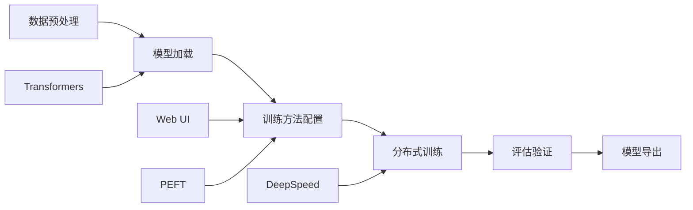

# LLaMA-Factory

LLaMA-Factory 是一个统一、轻量且高效的开源大语言模型微调框架，由 hiyouga 团队开发并维护。其核心理念是"一站式"——将模型加载、数据预处理、训练方法、参数配置、评估推理、模型导出等微调全流程集成在统一的框架内，让研究者和开发者无需在多个工具之间切换即可完成从数据到部署的完整链路。框架基于 [[PyTorch]] 和 [[Hugging Face Transformers]] 构建，支持单卡、多卡（[[DeepSpeed]]）以及华为 [[Atlas A2]] 等国产 NPU 平台上的训练。

LLaMA-Factory 最大的差异化优势在于其内置的 Web UI（LLaMA Board），通过浏览器即可完成模型选择、数据集配置、参数调整和训练监控，大幅降低了微调的技术门槛。同时，框架支持近 200 种主流大模型（LLaMA、Qwen、ChatGLM、Mistral、DeepSeek、Yi、Gemma 等），集成了 LoRA、QLoRA、DoRA、GaLore 等 20+ 种参数高效微调方法，以及全量微调、P-Tuning v2、DPO、ORPO、SimPO 等对齐训练方法，是当前功能最全面的开源微调框架之一。

## 核心概念

### 统一模型加载

LLaMA-Factory 通过统一的模型配置接口支持多种主流开源模型的加载和微调。用户只需在配置中指定 `model_name_or_path`（本地路径或 Hugging Face Hub 路径），框架会自动识别模型类型并加载对应的 tokenizer 和配置。支持的模型覆盖国内外主流 LLM，包括 [[LLaMA]] 系列（1/2/3）、[[Qwen]] 系列（1/1.5/2/2.5）、[[ChatGLM]] 系列（6B/9B）、[[Mistral]]、[[DeepSeek]]、[[Yi]]、[[Gemma]]、[[Phi]]、[[Baichuan]]、[[InternLM]] 等。框架还支持从 [[ModelScope]] 魔搭社区下载模型和数据集，方便国内用户使用。

### 参数高效微调方法

框架集成了丰富的 [[PEFT]]（Parameter-Efficient Fine-Tuning）方法，核心包括：

- **[[LoRA]]**：通过低秩矩阵注入实现参数高效微调，仅训练 0.01%-5% 的参数
- **[[QLoRA]]**：在 LoRA 基础上引入 4-bit 量化，大幅降低显存需求
- **DoRA**：将权重分解为幅度和方向两部分，分别微调
- **GaLore**：梯度低秩投影，实现全量微调级别的内存效率
- **LLaMA-PRO**：块级参数扩展，适用于代码和数学能力增强
- **NEFTune**：噪声嵌入微调，提升指令遵循能力

每种方法都可通过简单的配置切换，无需修改代码。

### Web UI（LLaMA Board）

LLaMA Board 是 LLaMA-Factory 的图形化配置界面，通过 `python src/train_web.py` 启动，默认在 localhost:7860 访问。界面包含"训练"和"聊天"两大功能模块：

- **训练模块**：模型路径配置、数据集选择、训练方法切换、超参数调整（lora_rank、lora_alpha、learning_rate、epochs、batch_size 等）、训练启动与 Loss 曲线监控
- **聊天模块**：加载微调后的模型进行实时对话测试，支持对比微调前后的效果

这种可视化方式让不熟悉命令行操作的用户也能快速上手微调。

### 分布式训练

LLaMA-Factory 支持 [[DeepSpeed]] 分布式训练框架，提供 ZeRO-2 和 ZeRO-3 两种并行策略。在华为 Atlas A2（Ascend 910 NPU）上的实践验证了框架对国产 AI 芯片的支持能力——通过 `ASCEND_RT_VISIBLE_DEVICES` 环境变量指定 NPU 设备，将模型精度从 bfloat16 调整为 float16（NPU 不支持 bfloat16），即可在 8 张 Ascend 910 上完成 Qwen1.5-7B-Chat 的 LoRA 微调。

### 模型导出与部署

训练完成后，框架支持将 LoRA 适配器融合回基础模型（export），导出完整的独立模型，可直接用于推理部署。导出的模型兼容 [[vLLM]]、[[Ollama]]、[[llama.cpp]] 等主流推理框架，实现从训练到部署的无缝衔接。

## 技术架构

## 应用场景

- **领域模型定制**：使用企业私有数据微调通用 LLM，打造垂直领域专家模型
- **指令遵循训练**：通过 SFT 和 DPO/ORPO 对齐方法提升模型的指令遵循能力
- **命名实体识别**：微调小模型（如 Qwen1.5-1.8B）完成精确的领域实体抽取
- **Text2SQL 生成**：微调模型实现自然语言到 SQL 查询的转换
- **国产芯片适配**：在华为 Atlas A2 等国产 NPU 平台上完成模型微调
- **推理模型训练**：如 Sky-T1-32B-Preview 使用 LLaMA Factory + DeepSpeed Zero-3 训练推理能力

## 相关技术

- [[微调与模型训练]]——LLaMA-Factory 所属的微调技术体系
- [[LoRA]]——框架支持的核心参数高效微调方法
- [[QLoRA]]——量化版 LoRA，降低显存需求
- [[DeepSpeed]]——分布式训练加速库
- [[SWIFT]]——ModelScope 生态下的竞品微调框架

## 训练方法详解

### 监督微调（SFT）

SFT 是 LLaMA-Factory 最基础也是最常用的训练方式，通过指令-回答对数据训练模型遵循指令的能力。框架内置了丰富的数据集格式支持（alpaca、sharegpt、openai 等），并预配置了多个主流数据集。SFT 训练的关键参数包括：

- **lora_rank / lora_alpha**：LoRA 的秩和缩放因子，rank 越大表达能力越强但显存占用越高
- **learning_rate**：学习率，LoRA 通常使用 1e-4 到 5e-4
- **num_train_epochs**：训练轮数，通常 3-5 轮
- **max_seq_length**：最大序列长度，影响显存占用

### 对齐训练（RLHF/DPO/ORPO）

LLaMA-Factory 支持多种对齐训练方法，让模型输出更符合人类偏好：

- **DPO**（Direct Preference Optimization）：直接使用偏好数据优化模型，无需训练奖励模型，比 PPO 更稳定
- **ORPO**（Odds Ratio Preference Optimization）：在 SFT 损失中加入比值损失，单步完成微调和偏好对齐
- **SimPO**（Simple Preference Optimization）：简化版 DPO，无需参考模型
- **KTO**（Kahneman-Tversky Optimization）：基于前景理论的对齐方法
- **PPO**：经典强化学习方法，需要训练单独的奖励模型
- **Reward Modeling**：训练奖励模型，为 PPO 提供奖励信号

### 增量预训练与多轮对话

- **增量预训练**（Pre-Training）：在领域语料上继续预训练，增强模型的领域知识
- **多轮对话训练**：通过 ShareGPT 格式数据训练模型的多轮对话能力
- **多模态训练**：支持 LLaVA 等视觉语言模型的微调

## 高级配置

### 自定义数据集

LLaMA-Factory 支持通过 `dataset_info.json` 注册自定义数据集，支持以下数据源：

- **本地文件**：JSON、JSONL、CSV、Parquet 格式
- **Hugging Face Hub**：直接引用 HF 上的数据集
- **ModelScope**：支持魔搭社区数据集
- **混合数据集**：按比例混合多个数据集进行训练

### 分布式训练配置

框架支持多种分布式训练后端：

- **DeepSpeed**：ZeRO-2/ZeRO-3 优化器状态切分
- **FSDP**：PyTorch 原生全量数据并行
- **华为 NPU**：通过 `ASCEND_RT_VISIBLE_DEVICES` 指定昇腾设备
- **多机多卡**：通过 `torchrun` 启动多节点训练

### 评估与推理

训练完成后，LLaMA-Factory 提供多种评估方式：

- **BLEU/ROUGE**：基于 n-gram 的自动评估指标
- **LLM-as-Judge**：使用强模型（如 GPT-4）作为评判者评估生成质量
- **基准测试**：支持 MMLU、CMMLU、GSM8K 等主流评测集
- **聊天界面**：直接在 Web UI 中加载微调模型进行测试

## 主要页面

- [[微调与模型训练]] - LLM 微调技术与训练实践，包含 LLaMA-Factory 的详细使用案例
- [[LLM-技术报告与前沿论文]] - 微调方法的理论基础与前沿研究
