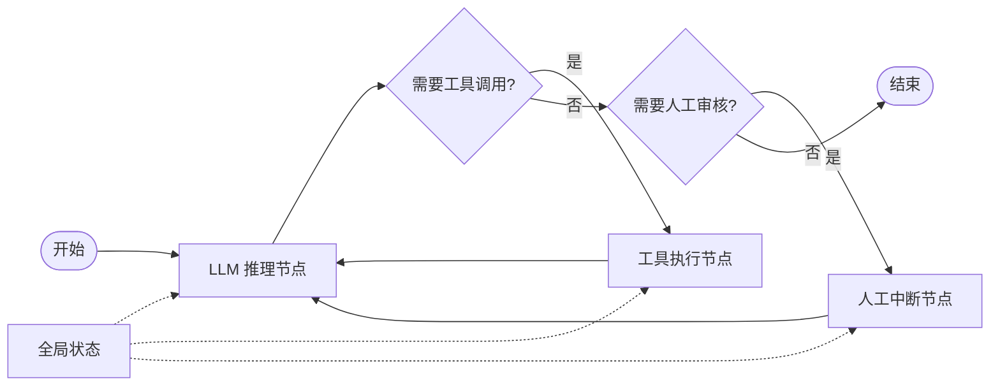

# LangGraph

LangGraph 是 LangChain 团队推出的图编排框架（Graph Orchestration Framework），专为构建有状态、多步骤的 LLM 应用而设计。它于 2024 年初发布，核心理念是将 AI Agent 的执行流程建模为有向图（节点和边），每个节点代表一个计算步骤，边代表步骤间的状态传递和条件路由。

LangGraph 的出现源于对 LangChain Chain 抽象的局限性的反思。LangChain 的 Chain 抽象虽然简洁，但本质上是线性的（或简单的 DAG），难以表达复杂的多分支、循环、并行和回溯逻辑。LangGraph 通过引入"图"这一更通用的计算模型，使得开发者能够构建任意复杂的 Agent 工作流——包括多 Agent 协作、人机交互、条件分支和状态持久化。

作为 LangChain 生态的"编排层"，LangGraph 与 LangChain 的模型集成、工具库、向量存储等组件无缝衔接，同时保持了足够的灵活性，可以独立使用或与其他框架集成。它已成为构建生产级 LLM 应用的主流选择之一。

## 核心概念

### 图模型（Graph Model）

LangGraph 的核心抽象是 StateGraph：

- **节点（Node）**：表示一个可执行的函数或计算步骤，接收状态、修改状态并返回更新。
- **Edge（边）**：表示节点间的连接关系，分为普通边（无条件跳转）和条件边（根据状态动态路由）。
- **State（状态）**：在图执行过程中持续传递和更新的数据结构，类似"全局变量"。
- **Entry Point**：图的起始节点，定义执行流程的入口。

这种图模型天然支持循环（Cycle）、分支（Branch）和并行（Parallel），能够表达任意复杂的控制流。

### 状态管理（State Management）

LangGraph 的状态管理是其最具特色的设计：

- **TypedDict 定义**：状态通过 TypedDict 或 Pydantic 模型定义，类型安全。
- **Reducer 机制**：多个节点可并发更新同一字段，通过 Reducer 函数（如 `operator.add`、`last_value`）合并更新。
- **持久化**：通过 Checkpointer 实现状态的持久化存储，支持断点续传和会话恢复。
- **时间旅行**：支持从历史状态分支执行，便于调试和探索不同路径。

### 条件路由（Conditional Routing）

条件边允许根据当前状态动态选择下一个节点：

```python
def should_continue(state):
    if state["iterations"] > 10:
        return "end"
    elif state["needs_review"]:
        return "review"
    else:
        return "continue"

graph.add_conditional_edges("process", should_continue, {
    "end": END,
    "review": "review_node",
    "continue": "process_node"
})
```

这种机制使得 Agent 能够根据中间结果动态调整执行流程，实现自适应决策。

### 人机交互（Human-in-the-Loop）

LangGraph 原生支持人机交互模式：

- **中断点（Interrupt）**：在特定节点暂停执行，等待人类输入。
- **审批流**：高风险操作（如执行代码、发送邮件）可设置人工审批环节。
- **编辑状态**：人类可直接修改 Agent 的状态，引导执行方向。

### Checkpoint 与持久化

LangGraph 通过 Checkpointer 实现状态持久化：

- **内存后端**：InMemorySaver，适合开发和测试。
- **数据库后端**：PostgreSQL、SQLite 等，适合生产环境。
- **会话管理**：每个会话（Thread）独立持久化，支持多用户并发。
- **历史查询**：可查询任意时刻的状态快照，支持"时间旅行"调试。

## 技术架构



LangGraph 的执行流程：从入口节点开始，按图结构流转，状态在节点间传递，条件边根据状态动态路由，支持循环和分支。

## 应用场景

- **多 Agent 协作**：构建由多个专业 Agent 组成的协作系统，如"研究员-写手-审稿人"工作流。
- **对话式 Agent**：构建有状态的对话 Agent，支持多轮上下文和记忆管理。
- **RAG 应用**：构建复杂的检索增强生成流程，支持多跳检索和重排序。
- **代码生成 Agent**：构建能自主编写、测试、调试代码的 Agent 工作流。
- **客服系统**：构建带人工升级机制的自动化客服系统。

## 相关技术

- [[AI-Agent-编排]]
- [[LangChain]]
- [[LLM-应用开发]]
- [[状态机与工作流]]

## 主要页面

- [[AI-Agent-编排]] - AI Agent 编排与工作流设计
- [[LangChain]] - LangChain 生态与 LLM 应用开发
