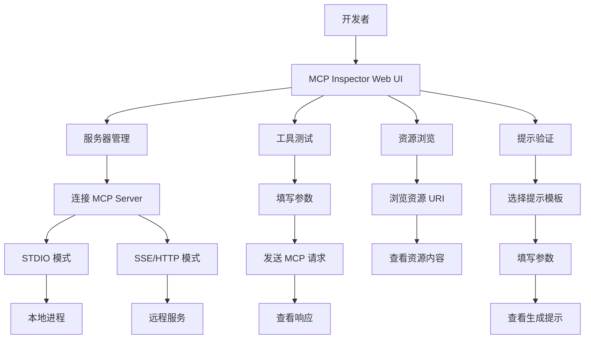

# MCP Inspector

MCP Inspector 是 Anthropic 为 Model Context Protocol（MCP）生态系统提供的官方调试和开发工具，以 Web UI 的形式帮助开发者测试、调试和验证 MCP 服务器。MCP 协议定义了 AI 模型与外部工具/数据源之间的标准化通信方式，而 MCP Inspector 则为这一通信过程提供了可视化的调试界面，使开发者能够直观地查看 MCP 服务器提供的资源（Resources）、提示（Prompts）和工具（Tools），并手动触发调用以验证其行为。

MCP Inspector 的核心价值在于降低了 MCP 服务器开发和调试的门槛。在 MCP Inspector 出现之前，开发者需要使用命令行工具或编写测试代码来验证 MCP 服务器的功能，效率低下且不够直观。MCP Inspector 通过浏览器界面提供了完整的 MCP 交互能力：自动发现服务器能力、手动调用工具、查看请求/响应、检查资源内容、验证提示模板等。这使得 MCP 服务器的开发从"盲调"变为"可视化调试"。

## 核心概念

**MCP 协议交互可视化**：MCP Inspector 提供了完整的 MCP 协议交互界面，开发者可以查看服务器声明的所有工具（Tools）、资源（Resources）和提示（Prompts），了解每个工具的参数定义、返回格式和使用说明。这相当于为 MCP 服务器提供了一个"API 文档 + 调试控制台"的组合。

**工具调用测试**：开发者可以在 MCP Inspector 中手动填写工具参数并触发调用，实时查看请求和响应的完整内容。这对于验证工具实现的正确性、调试参数格式问题、检查返回值格式等场景非常有用。

**资源浏览**：MCP Inspector 可以浏览 MCP 服务器提供的资源（如文件、数据库记录、API 数据等），以结构化的方式展示资源内容。开发者可以验证资源 URI 的正确性和资源内容的格式。

**提示模板验证**：对于 MCP 服务器提供的提示模板（Prompts），MCP Inspector 可以展示模板内容和参数定义，开发者可以填写参数并查看生成的提示文本，验证提示模板的正确性。

**多服务器管理**：MCP Inspector 支持同时连接和管理多个 MCP 开发者可以在不同服务器之间切换，对比不同实现的功能差异。这对于构建多服务器协作的 AI Agent 系统非常有用。

## 技术架构

## 应用场景

**MCP 服务器开发调试**：MCP Inspector 是 MCP 服务器开发者的必备工具。在开发新的 MCP 服务器时，开发者可以使用 MCP Inspector 实时验证工具实现、调试参数格式、检查返回值，大幅提升开发效率。

**AI Agent 系统集成测试**：在构建基于 MCP 的 AI Agent 系统时，开发者可以使用 MCP Inspector 验证多个 MCP 服务器之间的协作是否正常，确保 Agent 能够正确调用各个工具。

**MCP 协议学习与教学**：MCP Inspector 是学习 MCP 协议的优秀教学工具。新手可以通过 MCP Inspector 直观地理解 MCP 协议的三种核心能力（Tools、Resources、Prompts），了解协议的消息格式和交互流程。

**第三方 MCP 服务器评估**：在使用第三方开发的 MCP 服务器之前，开发者可以使用 MCP Inspector 评估其功能完整性和实现质量，查看工具定义是否规范、资源格式是否正确。

**CI/CD 集成**：MCP Inspector 支持命令行模式（`npx @modelcontextprotocol/inspector`），可以集成到 CI/CD 流程中，自动化验证 MCP 服务器的功能正确性。

## 相关概念

- [[MCP-协议栈]] — Model Context Protocol 完整协议规范
- [[MCP-服务器]] — MCP 服务器开发与部署
- [[Claude-Code]] — 使用 MCP 协议的 AI 编程工具
- [[AI-Agent-编排]] — 基于 MCP 的 Agent 工具调用

## 主要页面

- [[topics/MCP-协议与工具生态]] — MCP 生态全景与 Inspector 定位
- [[topics/AI-智能体技术前沿]] — MCP 在 Agent 系统中的应用
