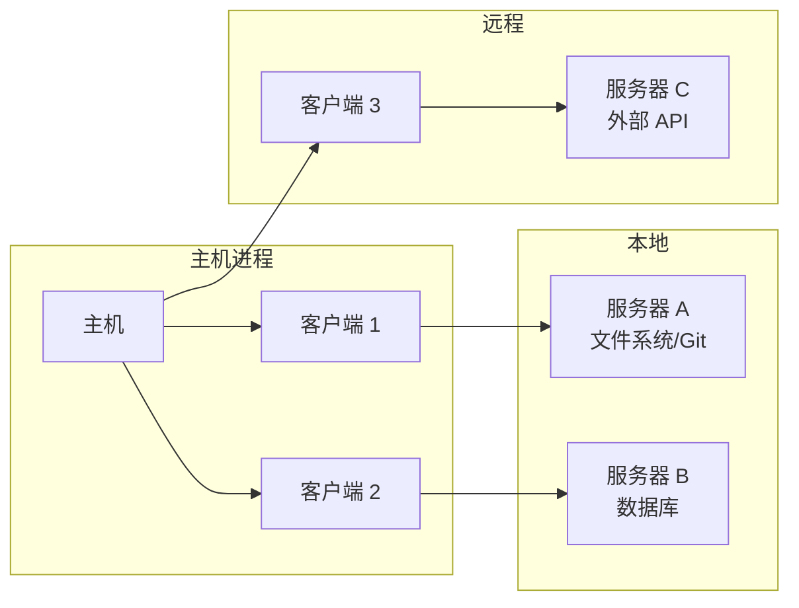
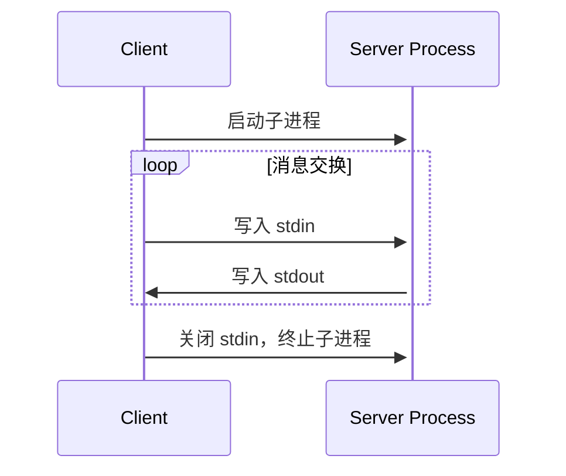
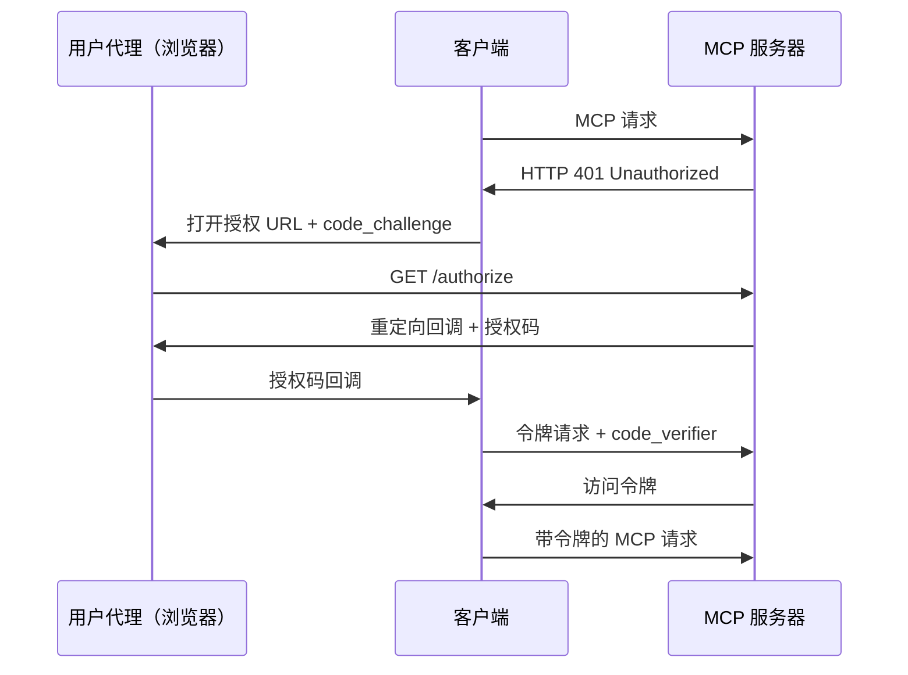
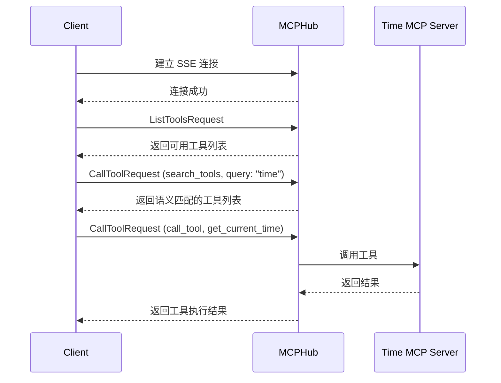
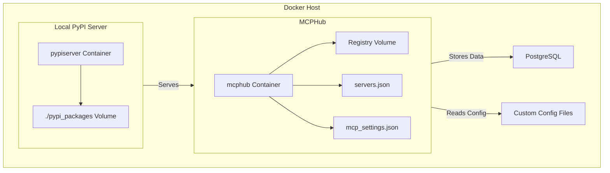
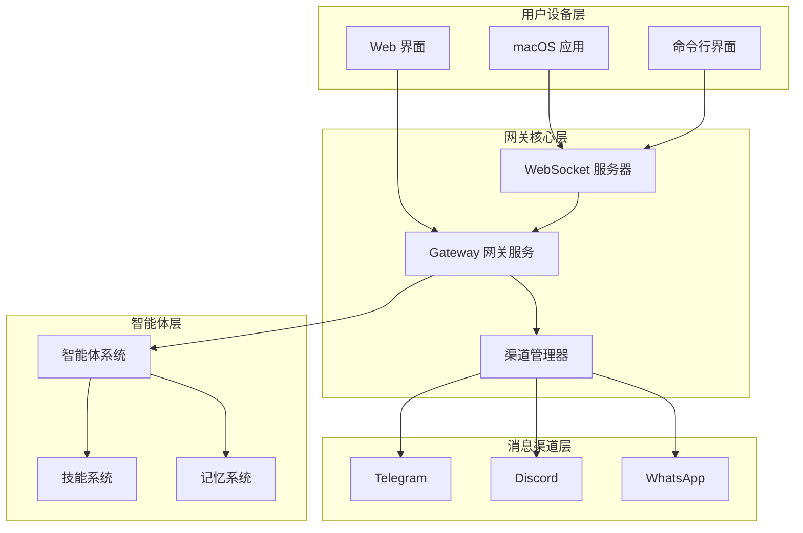

# MCP 协议栈

[[模型上下文协议]]（Model Context Protocol，MCP）是一套开放标准，负责规范化 [[大型语言模型]]（[[LLM]]）应用程序与外部数据源、工具之间的集成方式。可以将 MCP 理解为 AI 应用程序的"[[USB-C]] 端口"——正如 USB-C 统一了设备与外设的物理连接，MCP 统一了 LLM 与外部能力的逻辑连接。[[MCP-架构]] 部分详细描述了整体拓扑。

## 设计哲学

MCP 的架构决策建立在四个核心原则之上，这些原则深受 [[语言服务器协议]]（[[LSP]]）的启发：

1. **标准化**：用统一协议替代碎片化的定制连接器，使任何系统都能以一致方式接入 AI 能力。这与传统 [[REST-API]] 每个服务单独集成的方式形成鲜明对比。
2. **模块化与可组合性**：每个 [[MCP-服务器功能]] 提供专注的功能，多个服务器可在同一协议下无缝协作，无需修改 [[LLM]] 核心逻辑。
3. **安全边界**：通过客户端-主机-服务器分层隔离，主机保留完整对话历史，服务器仅接收执行任务所需的最少上下文。
4. **渐进式扩展**：核心协议保持最小化，额外能力通过 [[能力协商]] 机制动态叠加，保持向后兼容性。

这些原则共同塑造了一个"即插即用"的生态系统——新增功能无需重新训练 [[模型]] 或重构应用。

## 核心架构

MCP 采用客户端-主机-服务器（[[Client-Host-Server]]）三元架构，清晰界定各组件的职责边界。这种设计类似于 [[gRPC]] 的客户端-服务器模型，但专为 [[AI-集成]] 场景定制。



### 主机（Host）

主机是最终用户交互的 [[LLM]] 应用程序（如 [[Claude-Desktop]]、[[Continue]]、[[Cursor]]），承担容器与协调器角色：

- 创建和管理多个 [[MCP-客户端]] 实例
- 控制连接权限与生命周期
- 执行安全策略与用户同意流程
- 协调 [[AI]]/[[LLM]] 集成与 [[采样（Sampling）]]
- 聚合跨客户端上下文

### 客户端（Client）

客户端驻留于主机内部，与每个服务器维持 [[1:1-连接]] 的有状态会话：

- 处理协议协商与 [[能力交换]]
- 双向路由协议消息
- 管理订阅与通知
- 维护服务器间的安全边界

### 服务器（Server）

服务器是生态系统的功能骨干，通过 [[MCP-服务器功能]] 暴露三类核心原语：

- **[[资源（Resources）]]**：应用程序控制的上下文数据（文件内容、数据库记录、[[API]] 响应）
- **[[工具（Tools）]]**：模型控制的可执行函数（[[API]] 调用、代码执行、数据写入）
- **[[提示（Prompts）]]**：用户控制的交互模板（斜杠命令、工作流指令）

## 基础协议

MCP 以 **[[JSON-RPC]] 2.0** 作为线路格式，定义三种消息类型。这与 [[gRPC]] 使用 [[Protocol Buffers]] 的序列化方式不同，JSON-RPC 更轻量、更易于调试。

| 消息类型 | 方向 | 特征 |
|---------|------|------|
| 请求（[[Request]]） | 双向 | 包含 `id`、`method`、`params`，期待响应 |
| 响应（[[Response]]） | 双向 | 携带对应请求的 `id`，含 `result` 或 `error` |
| 通知（[[Notification]]） | 双向 | 不含 `id` 的单向消息，无需响应 |

所有消息必须使用 [[UTF-8]] 编码。MCP 实现必须接收支持 [[JSON-RPC]] 批处理（[[Batching]]）。

## 连接生命周期

MCP 定义严格的三阶段生命周期，确保 [[能力协商]] 与状态管理的可靠性。这一生命周期设计参考了 [[语言服务器协议]] 的成熟模式。

```mermaid
sequenceDiagram
    participant Client
    participant Server

    Note over Client,Server: 初始化阶段
    Client->>+Server: initialize 请求（协议版本 + 能力）
    Server-->>Client: initialize 响应（服务器能力 + 信息）
    Client--)Server: initialized 通知

    Note over Client,Server: 操作阶段
    rect rgb(200, 220, 250)
        Client->>Server: 请求 / 通知
        Server-->>Client: 响应 / 通知
    end

    Note over Client,Server: 关闭阶段
    Client--)-Server: 断开连接
```

### 初始化阶段

1. 客户端发送 `initialize` 请求，携带支持的协议版本与能力声明
2. 服务器响应自身能力与实现信息
3. 客户端发送 `initialized` 通知确认就绪

版本协商规则：客户端应发送支持的最新版协议本；服务器若不支持则返回自身支持的最新版本；客户端不支持服务器版本时应断开连接。

### 操作阶段

双方根据协商的能力交换消息，仅使用已成功协商的功能。支持两种通信模式：

- **请求-响应**：任意一方发送请求，另一方返回响应
- **通知**：任意一方发送单向消息

### 关闭阶段

- **[[stdio]] 传输**：客户端先关闭子进程输入流，等待退出；超时后依次发送 `SIGTERM`、`SIGKILL`
- **[[HTTP]] 传输**：通过关闭相关 [[HTTP]] 连接终止

## 传输机制

MCP 定义两种标准传输实现，并支持自定义扩展。传输层负责将 [[JSON-RPC]] 消息转换为线路格式。

### 标准输入输出（[[stdio]]）

适用于本地进程间通信。客户端将服务器作为子进程启动，通过 `stdin`/`stdout` 交换 [[JSON-RPC]] 消息，以换行符分隔。服务器可通过 `stderr` 写入日志。



### 可流式 [[HTTP]]（[[Streamable-HTTP]]）

服务器作为独立进程运行，支持多客户端连接。客户端通过 [[HTTP]] POST 发送请求，服务器可选使用 [[SSE]]（[[Server-Sent-Events]]）向客户端流式推送消息。

关键机制：
- **会话管理**：服务器在初始化时通过 `Mcp-Session-Id` 头分配会话 [[ID]]
- **可恢复性**：[[SSE]] 事件可附加 `id` 字段，客户端通过 `Last-Event-ID` 头恢复断开的流
- **向后兼容**：可与已弃用的 [[HTTP]]+[[SSE]] 传输（2024-11-05 版本）共存

### 自定义传输

协议与传输无关，实现可插拔扩展。自定义传输必须保留 [[JSON-RPC]] 消息格式与生命周期要求，可基于 [[WebSockets]] 或专用通信通道实现。

## 授权机制

MCP 在传输层提供基于 [[OAuth-2.1]] 的授权框架，使客户端能代表资源所有者访问受限服务器。这与 [[STDIO]] 传输从环境变量获取凭据的方式形成互补。



核心要求：
- 必须实现 [[OAuth-2.1]]，本地客户端作为公共客户端使用 [[PKCE]]
- 支持动态客户端注册（[[RFC-7591]]），使应用自动获取客户端 [[ID]]
- 支持授权服务器元数据发现（[[RFC-8414]]），回退至默认端点路径
- 访问令牌通过 `Authorization: Bearer` 头发送，禁止放在 [[URI]] 查询字符串中

## 服务器功能原语

### [[资源（Resources）]]

资源由唯一 [[URI]] 标识，支持文本（[[UTF-8]]）与二进制（[[Base64]]）两种内容类型。客户端可通过 `resources/list` 发现资源，通过 `resources/read` 读取内容，通过 `resources/subscribe` 订阅变更通知。

常见 [[URI]] 方案：
- `file://`：[[文件系统]]资源
- `https://`：[[网络]]资源
- `git://`：[[Git]] 版本控制集成
- 自定义方案：由服务器定义

### [[工具（Tools）]]

工具是模型控制的可执行函数，通过 `tools/list` 发现，通过 `tools/call` 调用。每个工具由名称、描述和 [[JSON-Schema]] 定义的输入参数组成。

工具结果支持多种内容类型：文本、图像、音频、嵌入资源。错误通过结果中的 `isError: true` 标记，而非协议级错误，使 [[LLM]] 能够感知并处理失败。

### [[提示（Prompts）]]

提示是用户控制的模板，通过 `prompts/list` 发现，通过 `prompts/get` 获取。支持动态参数与嵌入式资源上下文，可链接多步骤工作流。

## 客户端功能

### [[采样（Sampling）]]

服务器可通过 `sampling/createMessage` 请求客户端驱动 [[LLM]] 补全，实现复杂 [[代理]] 行为。客户端审查请求、执行采样、审查结果后返回。用户始终掌握对提示内容与生成结果的控制权。

### [[根目录（Roots）]]

根目录定义服务器可操作的 [[URI]] 边界，主要用于 [[文件系统]]路径，也可为 [[HTTP]] URL。客户端在连接时声明根目录，服务器应尊重这些边界。

## [[SDK]] 生态

官方 [[SDK]] 覆盖多种编程语言，降低 [[MCP-客户端]] 与 [[MCP-服务器]] 的开发门槛：

| 语言 | SDK 仓库 | 特点 |
|------|---------|------|
| [[Python]] | [[python-sdk]] | [[FastMCP]] 高级 API，支持生命周期管理、[[MCP-Inspector]] 集成 |
| [[TypeScript]] | [[typescript-sdk]] | 完整协议支持，[[Stdio]]/[[SSE]] 双传输 |
| [[Java]] | [[Java-SDK]] | [[Spring-AI]] 集成 |
| [[Kotlin]] | [[Kotlin-SDK]] | 协程原生支持 |
| [[Rust]] | [[Rust-SDK]] | 高性能异步实现 |

[[Python]] [[SDK]] 提供 `[[FastMCP]]` 高级抽象，通过装饰器暴露工具、资源和提示：

```python
from mcp.server.fastmcp import FastMCP

mcp = FastMCP("Demo")

@mcp.tool()
def add(a: int, b: int) -> int:
    """将两个数字相加"""
    return a + b

@mcp.resource("greeting://{name}")
def get_greeting(name: str) -> str:
    return f"你好，{name}！"
```

## 工具链与项目脚手架

### [[uv]] 包管理器

[[uv]] 是用 [[Rust]] 编写的极速 [[Python]] 项目管理器，已成为 [[MCP]] 生态的标准工具，替代传统 [[pip]] + [[virtualenv]] 的工作流：

```bash
# 创建项目
uv init my-server
cd my-server

# 添加 MCP 依赖
uv add "mcp[cli]"

# 运行服务器
uv run my-server

# 同步完整开发环境
uv sync
```

### [[create-mcp-server]]

[[create-mcp-server]] 是官方脚手架工具，零配置生成标准项目结构，使用 [[Jinja2]] 模板渲染：

```bash
uvx create-mcp-server
```

生成结构：
```
my-server/
├── README.md
├── pyproject.toml
└── src/
    └── my_server/
        ├── __init__.py
        ├── __main__.py
        └── server.py
```

工具自动配置 [[Claude-Desktop]] 集成，遵循 [[Python]] 打包标准。

### [[MCP-Inspector]]

[[MCP-Inspector]] 是官方调试工具，通过 [[浏览器]] 界面测试服务器连接与功能：

```bash
mcp dev server.py
# 或
npx @modelcontextprotocol/inspector uv --directory . run my-server
```

## 客户端生态

[[MCP]] 已获得广泛的客户端支持，覆盖从桌面应用到 [[IDE]] 的多种场景：

| 客户端 | 资源 | 提示 | 工具 | 采样 | 特点 |
|--------|------|------|------|------|------|
| [[Claude-Desktop]] | ✅ | ✅ | ✅ | ❌ | 全面本地集成 |
| [[Continue]] | ✅ | ✅ | ✅ | ❌ | 开源 [[AI-编码助手]]，[[VS-Code]] + [[JetBrains]] |
| [[Cursor]] | ❌ | ❌ | ✅ | ❌ | AI 代码编辑器 |
| [[Cline]] | ✅ | ❌ | ✅ | ❌ | [[VS-Code]] 自主编码助手 |
| [[Zed]] | ❌ | ✅ | ❌ | ❌ | 高性能编辑器，斜杠命令 |
| [[fast-agent]] | ✅ | ✅ | ✅ | ✅ | 完整多模态支持 |
| [[Goose]] | ❌ | ❌ | ✅ | ❌ | 开源 AI 智能体 |

完整客户端列表参见 [[Example-Clients]]。

## 服务器生态

官方参考实现覆盖核心场景，均由 [[Anthropic]] 或合作伙伴维护：

- **[[文件系统]]**：安全文件操作与访问控制
- **[[GitHub]]**：仓库管理、[[PR]] 操作、代码搜索、[[Issue]] 管理（26 个工具）
- **[[PostgreSQL]] / [[SQLite]]**：只读数据库访问与架构检查
- **[[Brave-搜索]]**：网络与本地搜索 [[API]]
- **[[Puppeteer]]**：浏览器自动化与网页抓取
- **[[Slack]]**：频道管理与消息功能
- **[[Memory]]**：基于知识图谱的持久记忆

社区生态持续扩展，覆盖 [[Docker]]、[[Kubernetes]]、[[Linear]]、[[Snowflake]]、[[Spotify]]、[[Todoist]] 等平台。

## 安全考量

[[MCP]] 安全模型建立在四个支柱之上，应对 [[任意代码执行]] 与数据访问的风险：

1. **用户同意与控制**：所有数据访问与操作需用户明确授权
2. **数据隐私**：主机不得在未经同意的情况下向服务器暴露用户数据
3. **工具安全**：工具视为 [[任意代码执行]]，调用前必须获得用户同意；工具注释视为不可信
4. **[[LLM]] 采样控制**：用户控制是否采样、发送的提示内容、服务器可见的结果

实施最佳实践：
- 构建健壮的同意与授权流程
- 对网络传输使用 [[TLS]]
- 验证所有输入（资源 [[URI]]、工具参数、提示参数）
- 实施访问控制与速率限制
- 对远程连接使用 [[OAuth-2.1]] + [[PKCE]]

## 能力协商

[[MCP]] 使用基于能力的协商系统，在初始化阶段显式声明支持的功能。这确保 [[MCP-客户端]] 与 [[MCP-服务器]] 明确理解彼此能力：

| 类别 | 能力 | 描述 |
|------|------|------|
| 客户端 | `roots` | 提供 [[文件系统]] 根目录 |
| 客户端 | `sampling` | 支持 [[LLM]] 采样请求 |
| 服务器 | `prompts` | 提供提示模板 |
| 服务器 | `resources` | 提供可读资源 |
| 服务器 | `tools` | 暴露可调用工具 |
| 服务器 | `logging` | 发出结构化日志 |

子能力 `listChanged` 支持列表变更通知，`subscribe` 支持资源订阅。能力协商确保双方明确理解彼此支持的功能，同时保持协议的可扩展性。

## 实践示例：[[GitHub-MCP-Server]] 集成

以 [[Continue]] 集成 [[GitHub-MCP-Server]] 为例，展示完整配置流程：

1. 申请 [[GitHub]] Personal Access Token（需 `repo` 权限范围）
2. 在 [[config.yaml]] 中配置：

```yaml
mcpServers:
  - name: GitHub Server
    command: npx
    args:
      - -y
      - "@modelcontextprotocol/server-github"
    env:
      GITHUB_PERSONAL_ACCESS_TOKEN: ghp_xxx
```

3. 使用本地 [[Ollama]] 模型（如 `qwen2.5-coder:32b`）驱动智能体
4. 通过自然语言创建仓库、搜索代码、管理 [[PR]]、执行代码评审

[[GitHub-MCP-Server]] 暴露 26 个工具，涵盖文件操作（`create_or_update_file`、`push_files`）、搜索（`search_code`、`search_issues`、`search_users`）、仓库管理（`create_repository`、`fork_repository`、`create_branch`）、[[PR]] 与 [[Issue]] 全生命周期管理等。

## 协议演进

[[MCP]] 当前规范版本为 **2025-03-26**，仍在积极开发中。早期采用者包括 [[Anthropic]]、[[Cursor]]、[[Zed]]、[[Sourcegraph]] 等。未来方向包括增强的 [[代理]] 支持、远程能力优化与开放治理模型。

作为受 [[语言服务器协议]]（[[LSP]]）启发的协议，[[MCP]] 正在将 [[LLM]] 上下文集成从碎片化定制走向标准化——正如 [[LSP]] 统一了编程语言在开发工具中的支持方式，[[MCP]] 正在统一 [[AI]] 应用与外部能力的连接方式。

## 使用 [[Cline]] 构建 [[MCP-服务器]]

[[Cline]] 是 [[VS-Code]] 扩展生态中的 [[AI-编码助手]]，通过自然语言交互简化 [[MCP-服务器]] 的构建流程。[[Cline]] 不仅能协助编写代码，还能管理项目配置、执行构建命令、处理故障排除，使非协议专家也能快速构建功能完整的 [[MCP-服务器]]。

### 构建流程

使用 [[Cline]] 构建自定义 [[MCP-服务器]] 遵循四阶段流程：

1. **需求定义**：向 [[Cline]] 描述服务器目标（如"GitHub 助手服务器"）、所需 [[API]] 访问（如 [[GitHub]] [[API]]）以及认证方式（如 [[OAuth]] 或个人访问令牌）
2. **项目初始化**：[[Cline]] 调用 [[create-mcp-server]] 工具生成项目结构（`package.json`、`tsconfig.json`、`src/` 目录），生成核心代码（文件处理工具、[[API]] 客户端、服务器框架）
3. **测试验证**：[[Cline]] 创建多个"工具"代表数据检索与操作功能，提示用户提供必要信息（如 [[API]] 密钥），执行工具并呈现结果
4. **迭代完善**：通过自然语言讨论新功能想法，[[Cline]] 协助编写代码、测试新功能、集成其他工具

### [[MCP-服务器]] 开发协议

[[Cline]] 生态推荐使用 `.clinerules` 文件定义结构化的 [[MCP-服务器]] 开发协议，该文件置于工作目录根目录，自动配置 [[Cline]] 行为并执行最佳实践。协议核心要求：

| 阶段 | 关键活动 | 核心原则 |
|------|---------|---------|
| 规划 | 问题定义、[[API]] 选择、认证需求分析 | 明确工具价值与边界 |
| 实现 | 使用 [[MCP-SDK]]、全面日志记录、类型定义、错误处理 | 必须使用官方 [[SDK]] |
| 测试 | 逐一测试每个工具、验证输出格式 | **禁止在测试前完成** |
| 完成 | 验证所有工具测试通过、输出格式正确 | 全部测试通过后才允许完成 |

**关键约束**：
- 必须使用 [[MCP-SDK]]（[[TypeScript]] 或 [[Python]] 实现）
- 必须实现全面的日志记录（使用 `console.error` 或 `logging` 模块）
- 必须单独测试每个工具
- 必须优雅处理错误（带上下文的错误信息）
- **绝不能在测试前跳过测试环节**

### 快速入门路径

[[Cline]] 文档提供了 [[MCP-服务器]] 的快速入门指南：

1. 安装 `mcp-installer` 作为首个 [[MCP-服务器]]
2. 通过自然语言让 [[Cline]] 从 [[NPM]] 注册表或 [[PyPI]] 安装更多服务器
3. 使用 [[uvx]] 或 [[Python]] 运行 [[Python]] 实现的服务器
4. 使用 [[npx]] 运行 [[Node.js]] 实现的服务器

## [[MCPHub]]：[[MCP-服务器]] 聚合平台

[[MCPHub]] 是开源的 [[MCP-服务器]] 聚合与管理平台，通过将多个服务器组织为灵活的流式 [[HTTP]]（[[SSE]]）端点简化运维。[[MCPHub]] 提供集中式管理控制台、热插拔配置、基于 [[JWT]] 与 [[bcrypt]] 的安全认证，以及 [[Docker]] 化部署能力。

### 核心功能

- **广泛的服务器兼容性**：无缝集成任何 [[MCP-服务器]]，配置简单
- **集中式管理控制台**：在 Web UI 中实时监控所有服务器状态与性能指标
- **灵活的协议兼容**：完全支持 [[stdio]] 与 [[SSE]] 两种 [[MCP]] 协议
- **热插拔式配置**：运行时动态添加、移除或更新服务器配置，无需停机
- **基于分组的访问控制**：自定义分组并管理服务器访问权限
- **安全认证机制**：内置用户管理，基于 [[JWT]] 与 [[bcrypt]] 实现角色权限控制
- **[[Docker]] 就绪**：提供容器化镜像，快速部署

### 协议端点

[[MCPHub]] 提供两种标准传输端点，支持全局、分组、单服务器三种访问粒度：

| 传输类型 | 端点模式 | 示例 |
|---------|---------|------|
| [[Streamable-HTTP]] | `/mcp`、`/mcp/{group}`、`/mcp/{server}` | `http://localhost:3000/mcp/github` |
| [[SSE]] | `/sse`、`/sse/{group}`、`/sse/{server}` | `http://localhost:3000/sse/$smart` |

![[MCPHub-Dashboard.png|MCPHub 管理控制台]]

### 智能路由

[[MCPHub]] 的智能路由（Smart Routing）是核心差异化功能，通过语义向量匹配解决工具数量膨胀问题：

**技术原理**：
- 将每个 [[MCP]] 工具的名称与描述嵌入为高维语义向量
- 用户任务请求同样转换为向量
- 通过语义相似度计算返回最相关的工具列表

**核心组件**：
- **向量嵌入引擎**：支持 `text-embedding-3-small`、`bge-m3` 等主流模型
- **[[PostgreSQL]] + [[pgvector]]**：开源向量数据库方案，支持高效向量索引与搜索
- **两步工作流分离**：`search_tools` 负责语义工具发现，`call_tool` 执行实际工具调用

**价值权衡（Trade-off）**：
- **减少认知负荷**：工具数量超过 100 个时，智能路由将候选工具压缩至 5～10 个
- **降低 token 消耗**：传统做法传入全量工具描述消耗上千 token，智能路由可降低 70～90%
- **提升调用准确率**：理解任务语义（如"图片增强"→选择图像处理工具），而非依赖关键词匹配



### 内网部署方案

[[MCPHub]] 支持离线环境部署，核心挑战在于 [[Python]] 包与 [[NPM]] 包的本地化管理：

**架构组件**：
- **[[pypiserver]]**：本地 [[PyPI]] 源，存储 [[Python]] 包
- **[[Verdaccio]]**：本地 [[NPM]] 源，存储 [[JavaScript]] 包
- **自定义配置**：通过 `custom/servers.json` 定义服务器市场，`custom/mcp_settings.json` 配置运行时设置



**部署步骤**：
1. 在 [[MCPHub]] 容器内使用 `pip download` 下载目标服务器及其依赖
2. 将包存储至本地目录，挂载到 [[pypiserver]] 容器
3. 配置 `pip.conf` 与 `.npmrc` 指向本地源
4. 通过 [[Docker-Compose]] 统一编排 [[PostgreSQL]]、[[pypiserver]]、[[Verdaccio]]、[[MCPHub]]

## [[FastMCP]] 实战

[[FastMCP]] 是 [[Python]] [[MCP-SDK]] 的高级抽象框架，通过装饰器语法简化服务器与客户端开发。[[FastMCP]] 支持 [[stdio]] 与 [[Streamable-HTTP]] 双传输，内置 [[MCP-Inspector]] 集成。

### 服务器开发

使用 [[FastMCP]] 构建计算器 [[MCP-服务器]] 的示例：

```python
from fastmcp import FastMCP

mcp = FastMCP("Calculator MCP Server")

@mcp.tool()
def add(a: float, b: float) -> float:
    """Adds two numbers (int or float)."""
    return a + b

@mcp.tool()
def power(base: float, exponent: float) -> float:
    """Raises a number to the power of another number."""
    return base ** exponent
```

**项目配置**（`pyproject.toml`）：
- 依赖 `fastmcp>=2.9.0`
- 支持 `python -m build` 构建、`twine upload` 发布到 [[PyPI]]
- 通过 `uvx calculator-mcp-server` 直接运行

### 客户端开发

[[FastMCP]] 提供同步/异步客户端，支持直接调用工具或集成 [[OpenAI]] [[API]]：

```python
from fastmcp import Client

client = Client("main.py")

async with client:
    tools = await client.list_tools()
    result = await client.call_tool("add", {"a": 5, "b": 3})
```

**与 [[OpenAI]] 集成**：将 [[MCP]] 工具转换为 [[OpenAI]] 函数调用格式，实现自然语言与计算器的交互。客户端负责工具格式转换、会话管理、工具调用与结果处理。

## [[OpenClaw]]：本地优先 [[AI-智能体]] 平台

[[OpenClaw]] 是本地优先（Local-First）、高度自治、基于 [[Markdown]] 记忆管理的 [[AI-智能体]] 系统。[[OpenClaw]] 不仅是一个 [[MCP-客户端]]，更是完整的智能体运行平台，集成网关、运行时、记忆、技能等子系统。

### 网关架构

[[OpenClaw]] 采用单一网关（[[Gateway]]）+ 多客户端/节点模型，支持 [[WhatsApp]]、[[Telegram]]、[[Slack]]、[[Discord]]、[[Signal]]、[[iMessage]] 等多种通信渠道。



**核心组件**：
- **[[Gateway]]**：长期运行的守护进程，维护提供商连接，公开类型化 [[WebSocket]] [[API]]
- **客户端**：控制平面应用（macOS 应用、CLI、Web UI），每个客户端一条 [[WebSocket]] 连接
- **节点（Nodes）**：设备节点（macOS/iOS/Android/无头设备），提供硬件能力（相机、定位、录屏）
- **渠道适配器**：统一接口处理消息标准化、路由、智能体处理、出站格式化

**协议特性**：
- 传输：[[WebSocket]]，文本帧携带 [[JSON]] 有效负载
- 第一帧必须是 `connect`，支持设备身份验证与配对
- 请求/响应/事件三种帧类型，支持幂等键安全重试
- 本地连接可自动批准，非本地连接需明确批准

### 智能体运行时

[[OpenClaw]] 运行基于 `@mariozechner/pi-agent-core` 的嵌入式智能体运行时，提供从单智能体执行到多智能体协作的完整功能。

**核心执行流程**：
1. `agent` [[RPC]] 验证参数、解析会话、持久化元数据
2. `agentCommand` 运行智能体：解析模型、加载技能、调用 `runEmbeddedPiAgent`
3. `runEmbeddedPiAgent`：序列化运行、解析模型与认证、订阅事件、流式传输
4. `subscribeEmbeddedPiSession`：将事件桥接到 [[OpenClaw]] 流

**工具系统**：
- **编码工具**：read、write、edit、apply-patch
- **执行工具**：exec、process（支持沙箱）
- **通道工具**：消息发送、媒体处理
- **[[OpenClaw]] 工具**：Web 搜索、图像处理、会话管理、子智能体、浏览器、定时任务

**工具策略**：支持全局、厂商、智能体、配置文件多级策略过滤，通过 `resolveEffectiveToolPolicy` 解析有效策略。

### 记忆系统

[[OpenClaw]] 的记忆系统采用双路索引架构，结合语义检索与关键词检索：

- **语义检索（Embedding）**：使用 Embedding model 将文本向量化，存入 [[sqlite-vec]]
- **关键词检索（TF-IDF）**：使用 [[TF-IDF]] 算法，存入 [[SQLite]] 的 [[FTS5]]
- **排序融合（Rank Fusion）**：加权融合两种检索结果，选出最相关片段

**工作区文件结构**：

| 文件 | 功能 |
|------|------|
| `AGENTS.md` | 操作说明与记忆维护规则 |
| `SOUL.md` | 人格、基调和边界 |
| `IDENTITY.md` | 智能体名称、氛围、表情符号 |
| `USER.md` | 用户画像与首选地址 |
| `MEMORY.md` | 精选的长期记忆 |
| `memory/YYYY-MM-DD.md` | 每日原始日志 |
| `TOOLS.md` | 工具配置与策略 |
| `HEARTBEAT.md` | 心跳任务清单 |
| `BOOTSTRAP.md` | 一次性首次运行仪式 |

### 技能系统

[[OpenClaw]] 从三个位置加载技能（名称冲突时工作空间优先）：
- 捆绑技能（随安装发布）
- 管理/本地技能：`~/.openclaw/skills`
- 工作空间技能：`<workspace>/skills`

技能通过 `formatSkillsForPrompt` 注入系统提示词，模型按需 `read` 技能的 `SKILL.md`。

### 心跳机制

心跳（Heartbeat）是 [[OpenClaw]] 的周期性智能体轮询机制，允许模型在无用户消息时主动 surface 需要关注的内容：

- **周期性轮询**：默认每 30 分钟运行一次
- **静默确认**：支持 `HEARTBEAT_OK` 令牌表示"一切正常"
- **批量检查**：合并邮件、日历、通知等定期检查
- **与 [[Cron]] 分工**：心跳适用于批量检查与上下文感知任务，[[Cron]] 适用于精确时间调度

### Voice Call 插件

[[OpenClaw]] 的 Voice Call 插件支持通过 [[AI]] 助手发起和接收语音通话，支持 [[Twilio]]、[[Telnyx]]、[[Plivo]] 等 [[CPaaS]] 提供商：

- **通知模式（Notify）**：单向语音通知，自动挂断
- **对话模式（Conversation）**：多轮语音对话，支持 [[STT]]/[[TTS]]
- **入站呼叫**：[[Webhook]] 接收事件，白名单验证，进入对话模式

## [[Claude-Skill]] 构建指南

[[Claude-Skill]]（技能）是一种指令包，教导 [[Claude]] 如何处理特定任务或工作流。技能与 [[MCP]] 结合，将底层工具访问转化为可靠、标准化的操作流程。

### 渐进式披露结构

技能使用三层系统，平衡专业知识与 token 消耗：

1. **第一层（[[YAML-Frontmatter]]）**：始终加载在系统提示词中，提供足够信息让 [[Claude]] 知道何时使用技能
2. **第二层（SKILL.md 主体）**：当技能与任务相关时加载，包含完整指令
3. **第三层（链接文件）**：捆绑在技能目录中的其他文件，按需发现

### 技能结构

```
your-skill-name/
├── SKILL.md              # 必填 - 主技能文件
├── scripts/              # 可选 - 可执行代码
├── references/           # 可选 - 文档（按需加载）
└── assets/               # 可选 - 资源文件
```

**关键规则**：
- `SKILL.md` 命名必须准确（区分大小写）
- 文件夹使用 kebab-case，不得包含空格、下划线、大写字母
- 技能文件夹内禁止包含 `README.md`

### [[YAML-Frontmatter]] 字段

```yaml
---
name: your-skill-name          # 必填，kebab-case
description: 功能 + 何时使用     # 必填，含触发词，≤1024 字符
license: MIT                   # 可选
metadata:                      # 可选
  author: 公司名称
  version: 1.0.0
  mcp-server: server-name
---
```

**安全限制**：
- 禁止 [[XML]] 尖括号（`< >`）——防止提示词注入
- 禁止 `claude` 或 `anthropic` 前缀——防止特权提升

### 技能与 [[MCP]] 的关系

| [[MCP]]（连接性） | [[Claude-Skill]]（知识） |
|:---:|:---:|
| 将 [[Claude]] 连接到服务 | 教导 [[Claude]] 如何有效使用服务 |
| 提供实时数据访问和工具调用 | 捕捉工作流和最佳实践 |
| **[[Claude]] 可以做什么** | **[[Claude]] 应该怎么做** |

**厨房比喻**：[[MCP]] 提供专业厨房（工具、食材、设备），技能提供食谱（分步说明）。

### 工作流编排模式

1. **顺序工作流编排**：按特定顺序执行多步骤流程，含验证门槛与回滚指令
2. **多 [[MCP]] 协同**：跨多个服务编排，清晰阶段划分与数据传递
3. **迭代优化**：输出质量随迭代提升，含验证脚本与质量门槛
4. **上下文感知工具选择**：相同目标根据上下文采用不同工具
5. **特定领域智能**：在工具访问之外增加行业专业知识

### 测试与迭代

有效的技能测试涵盖三个领域：
- **触发测试**：确保技能在正确时间加载（正确触发 + 不触发无关主题）
- **功能测试**：验证技能产生正确输出、错误处理有效
- **性能对比**：证明技能相对基准线改进结果

**迭代信号**：
- 触发不足：技能在该加载时未加载 → 增加描述细节
- 触发过度：技能在无关查询时加载 → 添加负面触发词、更具体描述
- 执行问题：结果不一致、[[API]] 调用失败 → 改进指令、增加错误处理

## [[llms.txt]] 标准

[[llms.txt]] 是由 Jeremy Howard 提出的网站标准化提案，通过在网站根路径添加 `/llms.txt` [[Markdown]] 文件，为 [[LLM]] 提供简洁、专业的内容访问。

### 格式规范

[[llms.txt]] 遵循特定顺序的 [[Markdown]] 结构：

1. **H1 标题**：项目或网站名称（唯一必填部分）
2. **块引用**：项目简短摘要
3. **详细信息段落**：零个或多个 [[Markdown]] 部分
4. **文件列表**：由 H2 标题分隔，包含 `[name](url)` 格式的链接列表

```markdown
# 项目名称

> 项目简短摘要

## 文档

- [快速入门](https://example.com/quickstart.html.md): 功能概述

## Optional

- [可选内容](https://example.com/optional.html.md)
```

**特殊约定**：`Optional` 部分具有特殊含义——需要较短上下文时可跳过其中 URL。

### 与现有标准的关系

[[llms.txt]] 旨在与现有 Web 标准共存：
- 补充 `robots.txt`：为允许的内容提供上下文
- 补充 `sitemap.xml`：为 [[LLM]] 提供精选概述（而非全部页面索引）
- 支持结构化数据标记引用

**设计目标**：主要用于*推理*（用户寻求帮助时），而非*训练*。

### 工具生态

- `llms_txt2ctx`：[[CLI]] 与 [[Python]] 模块，解析 [[llms.txt]] 并生成 [[LLM]] 上下文
- `vitepress-plugin-llms`：[[VitePress]] 插件，自动生成 [[LLM]] 友好文档
- `docusaurus-plugin-llms`：[[Docusaurus]] 插件
- `llms-txt-php`：[[PHP]] 库

## 生态整合视角

[[MCP]] 协议栈的成熟不仅体现在协议规范本身，更在于围绕它构建的工具链与生态系统。从 [[Cline]] 的自然语言驱动开发、[[MCPHub]] 的聚合与智能路由、[[FastMCP]] 的高级抽象，到 [[OpenClaw]] 的完整智能体平台、[[Claude-Skill]] 的知识封装，[[MCP]] 正在从协议规范演变为连接 [[LLM]] 与外部世界的完整技术栈。

[[llms.txt]] 标准的出现进一步扩展了这一生态——当 [[LLM]] 需要理解网站内容时，[[llms.txt]] 提供标准化的信息入口；当 [[LLM]] 需要操作外部服务时，[[MCP]] 提供标准化的工具接口。两者共同构成 [[LLM]] 与外部世界交互的标准化层。

参见：[[MCP-架构]]｜[[MCP-服务器功能]]｜[[MCP-Inspector]]｜[[模型上下文协议]]｜[[JSON-RPC]]｜[[Streamable-HTTP]]｜[[OAuth-2.1]]｜[[能力协商]]｜[[FastMCP]]｜[[语言服务器协议]]
