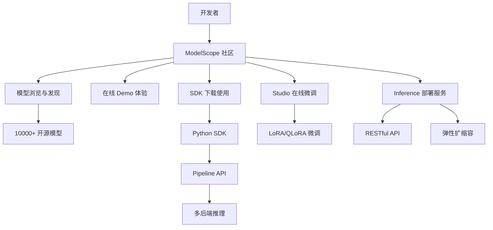

# ModelScope（魔搭社区）

ModelScope（魔搭社区）是阿里巴巴集团于 2022 年 11 月推出的开源模型社区和模型服务平台，愿景是"打造下一代开源的模型即服务共享平台，为泛 AI 开发者提供灵活、易用、低成本的模型服务"。ModelScope 集成了数万款预训练模型（覆盖 NLP、CV、音频、多模态、大模型等领域），提供了从模型下载、在线体验、微调训练到部署服务的完整工具链，是中国最大的开源模型社区之一，也是全球开源 AI 生态的重要参与者。

ModelScope 的核心定位是"模型的 GitHub"——为 AI 模型提供统一的托管、发现和使用平台。开发者可以在 ModelScope 上浏览和下载各类开源模型，通过 ModelScope 的 Python SDK 在几行代码内加载和使用模型，或者使用 ModelScope 的在线 Demo 直接体验模型能力。对于大模型场景，ModelScope 还提供了 ModelScope Studio（在线微调平台）和 ModelScope Inference（推理部署服务），大幅降低了大模型的使用门槛。

## 核心概念

**模型托管与发现**：ModelScope 托管了超过 10,000 个开源模型，覆盖自然语言处理、计算机视觉、语音、多模态、科学计算等多个领域。每个模型页面提供了详细的模型介绍、使用说明、示例代码和在线 Demo，开发者可以快速找到并评估所需模型。

**ModelScope SDK**：ModelScope 提供了统一的 Python SDK，开发者可以通过 `pipeline` API 在几行代码内加载和运行模型。SDK 支持自动模型下载、缓存管理、多后端推理（PyTorch、ONNX、vLLM 等），大幅简化了模型的使用流程。

**ModelScope Studio（在线微调）**：ModelScope Studio 提供了在线模型微调服务，开发者无需配置 GPU 环境即可在平台上进行 LoRA、QLoRA 等参数高效微调。平台提供了可视化界面和预置的训练模板，降低了微调的技术门槛。

**ModelScope Inference（推理服务）**：ModelScope 提供了模型推理部署服务，支持一键部署模型为 RESTful API，自动处理负载均衡、弹性扩缩容、监控告警等运维工作。对于大模型，平台支持 vLLM、SGLang 等高效推理后端。

**Data-Juicer 与数据工程**：ModelScope 团队开源了 Data-Juicer 数据工程工具，提供了数百个数据操作算子（Op），支持大规模数据清洗、过滤、去重、增强等操作。Data-Juicer 特别针对多模态数据设计，是高质量训练数据构建的重要工具。

## 技术架构

## 应用场景

**快速模型评估与选型**：开发者可以在 ModelScope 上快速浏览和体验不同模型的能力，通过在线 Demo 和示例代码评估模型是否满足需求，大幅缩短模型选型周期。

**大模型微调与定制**：通过 ModelScope Studio，企业和开发者可以在平台上进行大模型的领域微调，无需自建 GPU 集群，降低了大模型定制的成本和门槛。

**模型部署与服务化**：ModelScope Inference 提供了一键模型部署服务，开发者可以将微调后的模型快速部署为生产级 API 服务，平台自动处理运维工作。

**学术研究与教学**：ModelScope 为学术研究者和学生提供了丰富的开源模型资源，支持快速复现论文结果和进行教学实验，推动了 AI 教育和研究的发展。

**开源模型生态建设**：ModelScope 为开源模型作者提供了模型托管、版本管理、社区推广等服务，是中国开源 AI 生态的重要基础设施。

## 相关概念

- [[LLaMA-Factory]] — 开源大模型微调工具
- [[Hugging Face]] — 国际最大的开源模型社区
- [[SGLang]] — 高效推理框架
- [[微调与模型训练]] — 模型微调方法论

## 主要页面

- [[topics/LLM-部署与开源生态]] — ModelScope 在开源生态中的定位
- [[topics/LLM-推理与服务化部署]] — 模型部署与推理服务
