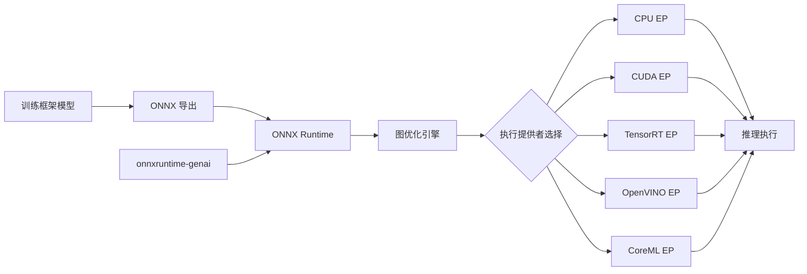

# ONNX Runtime

ONNX Runtime 是 Microsoft 开发的开源推理引擎，专为 ONNX（Open Neural Network Exchange）格式的模型提供高性能推理。其核心设计理念是"一次转换，随处部署"——将来自不同训练框架的模型统一转换为 ONNX 格式后，通过 ONNX Runtime 在各种硬件平台上高效执行推理。ONNX Runtime 支持 Windows、Linux、macOS 等操作系统，以及 CPU、GPU（NVIDIA CUDA、AMD ROCm、Intel OpenVINO）、NPU 等多种硬件加速器，是当前跨平台模型部署的首选推理引擎。

ONNX Runtime 的架构采用分层设计：底层是 ONNX 格式的模型表示，中间层是图优化引擎，上层是执行提供者（Execution Provider, EP）框架。执行提供者机制是 ONNX Runtime 的核心创新——它将硬件特定的优化和执行抽象为可插拔的 EP 模块，使得同一份 ONNX 模型可以在不同硬件上通过切换 EP 实现最优推理。这种设计让 ONNX Runtime 成为一个真正的"硬件无关"推理引擎。

ONNX Runtime 在微软内部被广泛使用，支撑了 Office、Teams、Bing、Azure AI 等产品的 AI 推理需求。在开源社区，ONNX Runtime 也是 Hugging Face、PyTorch、TensorFlow 等生态的标准推理后端。对于 LLM 推理，ONNX Runtime 提供了生成式 AI 扩展（onnxruntime-genai），支持 Llama、Mistral、Phi 等模型的本地推理。

## 核心概念

### 执行提供者（Execution Provider）

执行提供者是 ONNX Runtime 的硬件抽象层，每个 EP 封装了特定硬件平台的优化和执行能力：

- **CPU EP**：默认执行提供者，支持 x86/ARM 架构，利用 MLAS（Math Library for Accelerated Systems）加速
- **CUDA EP**：NVIDIA GPU 加速，利用 cuDNN、cuBLAS 等 CUDA 库
- **TensorRT EP**：NVIDIA GPU 极致加速，利用 TensorRT 的图优化和内核调优
- **OpenVINO EP**：Intel 硬件加速，支持 CPU、iGPU、VPU
- **ROCm EP**：AMD GPU 加速，利用 MIOpen 库
- **CoreML EP**：Apple 设备加速，利用 Apple Neural Engine
- **QNN EP**：高通 Snapdragon 平台加速
- **WebNN EP**：浏览器端推理加速

EP 支持自动回退机制：当某个算子在高级 EP 上不支持时，自动回退到 CPU EP 执行，确保模型兼容性。

### 图优化

ONNX Runtime 提供多层次的图优化能力：

- **基础优化**（Level 1）：算子融合、常量折叠、死节点消除、冗余节点移除
- **扩展优化**（Level 2）：更复杂的算子融合（如 GEMM+BiasAdd+Activation）、布局优化
- **布局优化**：根据硬件特性选择最优数据布局（NCHW vs NHWC）

优化级别可配置，用户可以在优化时间和推理性能之间权衡。

### 量化支持

ONNX Runtime 提供完整的量化工具链：

- **动态量化**：运行时动态量化激活值，权重预量化
- **静态量化**：使用校准数据集确定量化参数，精度更高
- **QOperator 量化**：以量化算子（QLinearConv、QLinearMatMul 等）表示量化计算
- **QDQ 量化**：以 QuantizeLinear/DequantizeLinear 节点显式表示量化/反量化，兼容更多 EP

### 生成式 AI 支持

ONNX Runtime 的 `onnxruntime-genai` 扩展提供了 LLM 推理能力：

- **模型导出**：支持 PyTorch 模型导出为 ONNX 格式
- **KV-Cache 管理**：优化自回归生成的 KV-Cache 内存管理
- **多批次推理**：支持多个请求的并行推理
- **跨平台**：同一份 ONNX 模型可在 Windows、Linux、Android、iOS 上推理

### 推理会话

ONNX Runtime 通过 `InferenceSession` 管理推理生命周期：

- **会话选项**：配置线程数、优化级别、EP 选择、内存策略
- **IO Binding**：将输入输出绑定到特定设备内存，避免数据拷贝
- **异步推理**：支持异步推理模式，提升吞吐量
- **模型量化**：支持运行时量化，无需重新导出模型

## 技术架构

## 应用场景

- **跨平台模型部署**：同一份 ONNX 模型在 Windows、Linux、macOS、移动端部署
- **云端推理服务**：在 Azure 等云平台上部署 ONNX 模型推理服务
- **边缘设备推理**：在 ARM 设备（如 Raspberry Pi、Jetson）上利用 CPU/NPU EP 推理
- **浏览器端推理**：通过 ONNX Runtime Web 在浏览器中执行模型推理
- **LLM 本地推理**：通过 onnxruntime-genai 在本地运行量化后的 LLM
- **Windows ML**：Windows 平台的 AI 推理标准后端

## 相关技术

- [[ONNX]] — 开放的神经网络交换格式
- [[TensorRT]] — NVIDIA 平台的极致推理优化
- [[OpenVINO]] — Intel 平台的推理优化
- [[LLM-推理优化]] — 推理优化技术体系
- [[模型部署]] — 模型生产部署实践

## 主要页面

- [[topics/模型部署与推理服务]] — 模型部署实践与工具链
- [[LLM-推理优化]] — 推理优化技术综述
