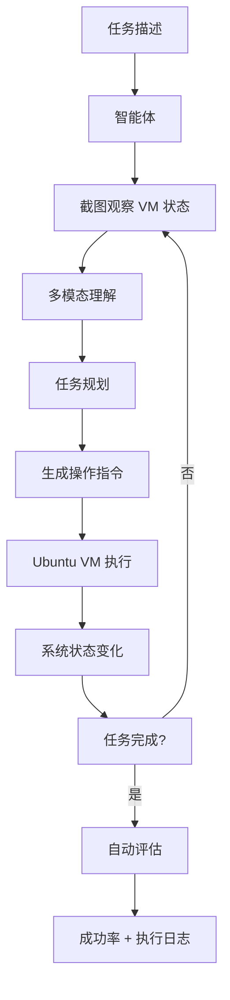

# OSWorld

OSWorld 是 CMU 和 Microsoft Research 于 2024 年联合推出的一个开放式计算机操作智能体基准评估平台。与传统的 AI 基准测试不同，OSWorld 要求 AI 智能体在一个真实的 Ubuntu 虚拟机环境中执行开放式计算机操作任务，包括使用 LibreOffice 编辑文档、用 Chrome 浏览器浏览网页、用 Thunderbird 管理邮件、用 GIMP 编辑图片等真实桌面应用。OSWorld 的出现标志着 AI 评估从"回答问题"走向"执行任务"，是计算机操作智能体（Computer Use Agent）领域的里程碑式基准。

OSWorld 的核心设计理念是"真实环境、真实任务、真实交互"。基准包含 369 个跨应用的任务，涵盖办公、浏览、多媒体、编程、系统配置等多个领域。每个任务都有明确的执行目标（如"在 LibreWriter 中将文档标题改为 Arial 字体"），智能体需要通过截图观察屏幕状态、理解 GUI 元素、规划操作序列、执行鼠标点击和键盘输入来完成任务。任务的评估通过检查系统状态（如文件内容、浏览器状态、配置设置）来自动判定成功与否，避免了人工标注的主观性。

## 核心概念

**真实虚拟机环境**：OSWorld 使用真实的 Ubuntu 22.04 虚拟机作为评估环境，智能体通过 VNC 协议与虚拟机交互。这与传统的模拟环境或 API 调用不同，智能体需要处理真实 GUI 的复杂性，包括窗口管理、菜单导航、对话框交互、错误处理等。

**开放式任务设计**：OSWorld 的任务是开放式的，即没有预设的操作路径。智能体需要根据任务描述自主规划操作序列，可能涉及多个应用之间的协作（如在浏览器中搜索信息，然后复制到 LibreOffice 文档中）。这种设计更接近真实世界的使用场景。

**跨应用操作能力**：OSWorld 的任务经常需要跨多个应用协同完成。例如，一个任务可能要求智能体从邮件附件中下载图片，用 GIMP 进行裁剪，然后插入到 LibreOffice 文档中。这种跨应用操作能力是衡量智能体综合计算机操作能力的关键指标。

**多模态感知与操作**：OSWorld 要求智能体具备多模态理解能力（从截图中识别 GUI 元素、理解文本内容、判断界面状态）和精确操作能力（计算点击坐标、输入文本、使用快捷键）。这需要模型同时具备视觉理解、空间推理和序列规划能力。

**评估指标体系**：OSWorld 使用任务成功率（Task Success Rate）作为主要评估指标，同时记录操作步数、执行时间、错误次数等辅助指标。基准还提供了详细的执行日志和截图序列，便于分析智能体的失败模式。

## 技术架构

## 应用场景

**Computer Use Agent 评估**：OSWorld 是目前最权威的计算机操作智能体评估基准，被广泛用于评估和对比不同模型（如 GPT-4V、Claude、Gemini 等）的 GUI 操作能力。基准揭示了当前模型在真实计算机操作任务上的巨大差距——即使是最好的模型，在 OSWorld 上的成功率也仅约 10-30%。

**AI Agent 能力边界探索**：OSWorld 揭示了当前 AI Agent 在真实环境操作中的核心挑战：GUI 元素识别精度不足、长序列操作容易出错、跨应用协调困难、异常情况处理能力弱。这些发现为后续研究指明了方向。

**人机交互研究**：OSWorld 为研究人类与 AI 智能体的协作提供了实验平台，研究者可以探索 AI 在复杂计算机任务中的自主操作边界，以及人类在哪些环节仍需介入。

**操作系统与 GUI 自动化**：OSWorld 的研究成果可以应用于 RPA（机器人流程自动化）、自动化测试、无障碍辅助等领域，推动 GUI 自动化技术的发展。

**智能体安全研究**：在真实操作系统环境中执行任务的智能体面临安全风险，OSWorld 为研究智能体的安全边界、权限控制、异常恢复等提供了实验环境。

## 相关概念

- [[AI-智能体架构]] — 智能体设计与多步推理
- [[Claude-Code]] — 代码智能体的计算机操作能力
- [[数据集标注与模型评估]] — 基准评估方法论
- [[具身智能]] — 从数字世界到物理世界的智能体

## 主要页面

- [[topics/AI-智能体技术前沿]] — Computer Use Agent 研究进展
- [[topics/数据集标注与模型评估]] — AI 基准评估全景
