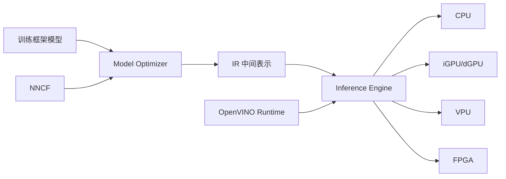

# OpenVINO

OpenVINO（Open Visual Inference and Neural Network Optimization）是 Intel 推出的开源推理优化工具包，专注于在 Intel 硬件平台上实现高性能的深度学习推理。其核心使命是"一次编写，处处部署"——开发者可以将训练好的模型（来自 PyTorch、TensorFlow、ONNX 等框架）通过 OpenVINO 优化后，在 Intel CPU、集成显卡（iGPU）、独立显卡（dGPU）、Movidius VPU、FPGA 等多种硬件上高效运行。OpenVINO 特别擅长计算机视觉场景的推理加速，同时也在 NLP、音频处理等领域持续扩展能力。

OpenVINO 的工作流程分为两个阶段：**模型优化**和**推理执行**。模型优化阶段使用 Model Optimizer 将训练模型转换为 IR（Intermediate Representation）中间表示格式，执行图优化（算子融合、常量折叠、精度转换等）；推理执行阶段使用 Inference Engine 在目标硬件上加载 IR 模型并执行推理。这种分离设计让模型只需优化一次，即可在不同 Intel 硬件上部署。

自 2018 年首次发布以来，OpenVINO 已迭代多个重大版本。2022 年推出的 OpenVINO 2022.1 引入了全新的 API 设计，统一了 C++ 和 Python 接口；2023 年的 2023.0 版本增强了对 LLM 的支持，引入了 NNCF（Neural Network Compression Framework）权重压缩；2024 年的版本进一步优化了生成式 AI 推理，支持 Llama、ChatGLM、Qwen 等大模型的 Intel 平台部署。

## 核心概念

### IR 中间表示

OpenVINO 的核心是 IR（Intermediate Representation）格式，由两个文件组成：`.xml`（网络拓扑结构）和 `.bin`（模型权重数据）。Model Optimizer 将来自不同训练框架的模型统一转换为 IR 格式，在此过程中执行一系列优化：

- **算子融合**（Layer Fusion）：将 Conv+BN+ReLU 等连续操作融合为单一算子，减少内存访问和 kernel launch 开销
- **常量折叠**（Constant Folding）：预计算图中常量节点的值，减少运行时计算
- **精度降低**（Precision Reduction）：将 FP32 权重转换为 FP16 或 INT8，在精度损失可控的前提下大幅提升推理速度
- **布局转换**（Layout Conversion）：将 NCHW 等训练布局转换为硬件最优的推理布局

### 异构推理

OpenVINO 支持将模型的不同层分配到不同的硬件设备上执行，实现异构推理。例如，将计算密集层分配到独立显卡（dGPU），将后处理层分配到 CPU，通过设备间的协同加速整体推理。`HETERO` 插件支持自动设备间模型切分，`MULTI` 插件支持多设备并行推理，`AUTO` 插件则自动选择最优设备。

### 推理模式

OpenVINO 提供两种推理模式：

- **同步推理**（Synchronous）：逐批次处理输入，适合离线批处理场景
- **异步推理**（Async）：流水线化输入预处理、推理执行和后处理，最大化硬件利用率，适合实时视频流等高吞吐场景

异步推理通过双缓冲机制实现：当一批数据在设备上推理时，CPU 同时准备下一批数据，实现计算与数据搬运的重叠。

### 模型压缩与量化

OpenVINO 内置 NNCF（Neural Network Compression Framework）工具，支持训练后量化（PTQ）和量化感知训练（QAT）。INT8 量化是最常用的压缩手段，可将模型大小缩减 4 倍，推理速度提升 2-3 倍，精度损失通常控制在 1% 以内。对于 LLM，OpenVINO 支持权重-only 量化（INT4/INT8），在保持激活精度的同时大幅降低显存占用。

### 生成式 AI 支持

2023 年起，OpenVINO 大幅增强了对生成式 AI 的支持，包括：

- **LLM 推理优化**：支持 PagedAttention、KV-Cache 量化、动态形状等 LLM 专用优化
- **文本嵌入**：优化 Sentence Transformer 等嵌入模型的推理
- **图像生成**：支持 Stable Diffusion 系列模型的 Intel 平台推理
- **多模态**：支持 LLaVA 等多模态大模型的推理加速

## 技术架构

## 应用场景

- **工业视觉检测**：在 Intel CPU 上实现产线缺陷检测的实时推理，利用 INT8 量化达到毫秒级响应
- **智能视频分析**：多路视频流的实时目标检测和行为识别，利用异构推理分配计算负载
- **零售场景**：客流统计、货架分析、无人结算等边缘 AI 部署
- **医疗影像**：CT/MRI 影像的 AI 辅助诊断推理，利用 Intel 平台降低部署成本
- **大模型边缘部署**：在 Intel Core Ultra 等平台上运行量化后的 LLM，实现本地 AI 助手

## 相关技术

- [[LLM-推理优化]] — 推理优化技术体系
- [[TensorRT]] — NVIDIA 平台的推理优化器
- [[ONNX-Runtime]] — 跨平台推理引擎
- [[边缘硬件]] — 边缘计算硬件平台
- [[模型量化]] — 模型压缩与量化技术

## 主要页面

- [[topics/边缘计算与AI部署]] — 边缘 AI 部署实践与工具链
- [[LLM-推理优化]] — 推理优化技术综述
