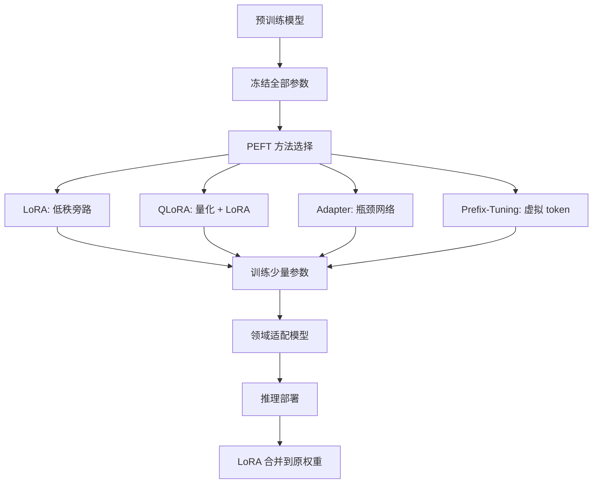

# PEFT（Parameter-Efficient Fine-Tuning）

PEFT（Parameter-Efficient Fine-Tuning，参数高效微调）是一类在保持预训练模型大部分参数冻结的前提下，仅训练少量额外参数来实现模型领域适配的技术方法。传统全参数微调（Full Fine-Tuning）需要更新模型的所有参数，对于 70B 级别的模型，仅显存就需要超过 500GB，远超普通硬件的承载能力。PEFT 方法通过引入少量可训练参数（通常不到原模型参数的 1%），在保持预训练知识的同时实现领域适配，使大模型微调从"奢侈品"变为"日用品"。

PEFT 的核心思想基于一个关键发现：大模型在预训练阶段已经学习了丰富的通用知识和语言能力，领域适配只需要在模型的表征空间中做一个低维的"调整"，而不需要重新训练整个模型。这一思想与线性代数中的低秩近似（Low-Rank Approximation）密切相关——模型权重的变化量 ΔW 可以近似分解为两个低秩矩阵的乘积，从而大幅减少需要训练的参数数量。LoRA（Low-Rank Adaptation）是这一思想的典型代表，也是目前最流行的 PEFT 方法。

## 核心概念

**LoRA（Low-Rank Adaptation）**：LoRA 是目前最广泛使用的 PEFT 方法，由微软于 2021 年提出。其核心思想是在 Transformer 的权重矩阵旁路（Bypass）引入低秩分解：ΔW = BA，其中 B ∈ R^(d×r)，A ∈ R^(r×k)，r ≪ min(d, k)。训练时冻结原模型参数，只训练 A 和 B。推理时可以将 ΔW 合并到原权重中，不引入额外推理延迟。LoRA 的参数量仅为原模型的 0.1%-1%，但效果接近全参数微调。

**QLoRA（Quantized LoRA）**：QLoRA 是 LoRA 的量化版本，由华盛顿大学团队于 2023 年提出。QLoRA 将基座模型量化为 4-bit（使用 NF4 量化格式），然后在量化模型上应用 LoRA。这使得在单张 48GB GPU 上微调 65B 模型成为可能。QLoRA 还引入了 Paged Optimizer 来管理优化器状态的显存峰值。

**Adapter**：Adapter 是最早的 PEFT 方法之一，由 Houlsby 等人于 2019 年提出。Adapter 在 Transformer 层之间插入小型瓶颈网络（Bottleneck Network），训练时只更新 Adapter 参数。Adapter 的参数量约为原模型的 3%-5%，但会引入额外的推理延迟。

**Prefix-Tuning 与 Prompt-Tuning**：Prefix-Tuning 在输入序列前添加可训练的虚拟 token（Prefix），通过调整 Prefix 来影响模型的注意力分布。Prompt-Tuning 是 Prefix-Tuning 的简化版本，只训练 soft prompt 向量。这两种方法参数量极小（约 0.01%），但效果通常不如 LoRA。

**IA3（Infused Adapter by Inhibiting and Amplifying Inner Activations）**：IA3 通过学习向量的逐元素缩放来调整模型的激活值，参数量极低（约 0.01%），特别适合多任务学习场景。

## 技术架构

## 应用场景

**大模型领域适配**：PEFT 是大模型领域适配的主流方法。企业可以使用 LoRA/QLoRA 在领域数据上微调大模型，使其掌握特定领域的知识和术语，如法律、医疗、金融、制造等。微调后的模型在领域任务上显著优于通用模型。

**多任务学习与多租户服务**：在推理服务中，可以为每个任务或租户训练独立的 LoRA Adapter，共享同一个基座模型。通过动态加载不同的 Adapter，单台 GPU 服务器可以同时服务多个任务，大幅降低部署成本。vLLM、SGLang 等推理框架都支持多 LoRA Adapter 的动态加载。

**个性化 AI 助手**：PEFT 使得为每个用户训练个性化模型成为可能。通过收集用户偏好数据并训练个性化 LoRA，可以为每个用户提供定制化的 AI 助手体验，同时保持基座模型的通用能力。

**低成本模型迭代**：在模型开发过程中，PEFT 大幅降低了实验成本。研究者可以在消费级 GPU 上快速尝试不同的训练策略和数据组合，加速模型迭代周期。

**开源社区模型生态**：Hugging Face、ModelScope 等平台上大量开源的 LoRA Adapter 形成了丰富的模型生态。开发者可以下载社区训练的 LoRA Adapter，在基座模型上叠加不同的能力（如角色扮演、代码生成、创意写作等）。

## 相关概念

- [[QLoRA]] — LoRA 的量化版本
- [[LoRA]] — 最流行的 PEFT 方法
- [[微调与模型训练]] — 微调方法论全景
- [[LLaMA-Factory]] — 开源大模型微调工具

## 主要页面

- [[topics/微调与模型训练]] — PEFT 方法实践与对比
- [[topics/LLM-部署与开源生态]] — 多 LoRA Adapter 部署方案
