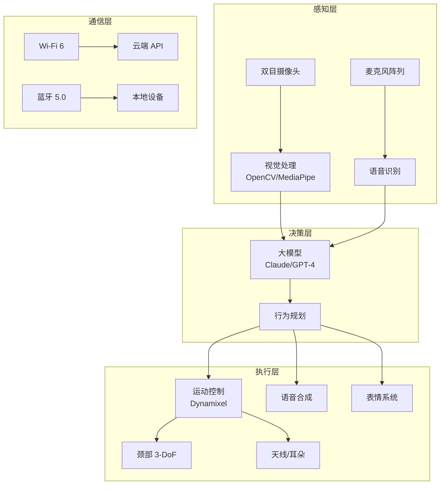

# Reachy Mini

Reachy Mini 是由法国 Pollen Robotics 公司推出的开源人形桌面机器人平台，旨在为研究者、开发者和 AI 爱好者提供一个低成本、高灵活性的具身智能实验平台。它于 2025 年首次亮相，以其可爱的外观、全栈 Python SDK 和开放的硬件设计迅速在开源机器人社区获得关注。

Reachy Mini 的设计理念是"让每个人都能拥有自己的机器人"。与工业级人形机器人（如 Boston Dynamics Atlas、Tesla Optimus）动辄数十万美元的售价不同，Reachy Mini 定位为桌面级开发平台，价格亲民，适合个人开发者、教育机构和研究实验室使用。它的头部配备了可动的眼睛、耳朵和天线，颈部具有多个自由度，能够表达丰富的情感和意图。

作为 Pollen Robotics 产品线中的小型化产品，Reachy Mini 继承了其前身 Reachy 机器人的技术积累，包括 Dynamixel 电机驱动、ROS 2 集成和 Python 优先的开发体验。它特别适合与 AI 大模型（如 Claude、GPT-4）结合，构建能看、能听、能说的智能交互机器人。

## 核心概念

### 硬件规格

Reachy Mini 的硬件设计注重紧凑性和可扩展性：

- **头部**：配备双目摄像头（立体视觉）、麦克风阵列（声源定位）和扬声器（语音输出），实现视听交互能力。
- **颈部**：3-DoF（自由度）颈部结构，支持俯仰（Pitch）、偏航（Yaw）和翻滚（Roll）运动，模拟人类头部动作。
- **表情系统**：可动的耳朵、天线和眼部LED，用于表达情感状态（如好奇、兴奋、困惑）。
- **计算单元**：内置 ARM 单板计算机（如 Raspberry Pi 或 Jetson Nano），支持边缘 AI 推理。
- **通信**：Wi-Fi 6 和蓝牙 5.0，支持无线控制和远程开发。
- **电源**：USB-C 供电或内置锂电池，便于移动使用。

### Python SDK

Reachy Mini 的核心优势在于其全栈 Python SDK，降低了机器人开发门槛：

- **高层 API**：提供 `reachy.goto()`、`reachy.look_at()`、`reachy.say()` 等直观的高级接口。
- **运动控制**：内置逆运动学（IK）求解器，支持关节空间和笛卡尔空间控制。
- **视觉处理**：集成 OpenCV 和 MediaPipe，支持人脸检测、物体识别、手势识别。
- **语音交互**：集成 TTS（文本转语音）和 ASR（语音识别），支持多语言。
- **AI 集成**：提供与 Claude、GPT-4、Gemini 等大模型的集成示例，实现自然语言交互。

### 开源生态

Reachy Mini 采用开源硬件和开源软件的双开源策略：

- **硬件开源**：机械设计文件（STEP、STL）、电路图、BOM 表完全公开，可自由修改和制造。
- **软件开源**：SDK、驱动、仿真环境、示例代码均在 GitHub 上开源（Apache 2.0 许可证）。
- **仿真支持**：提供基于 PyBullet 或 Gazebo 的仿真环境，支持先仿真后实物的开发流程。
- **社区贡献**：活跃的开发者社区贡献了多种附件设计（如机械臂、移动底座）和 AI 应用示例。

### AI 集成能力

Reachy Mini 的设计初衷就是作为 AI 的物理载体：

- **多模态交互**：结合摄像头、麦克风和扬声器，实现视觉-语言-动作的闭环交互。
- **大模型接入**：通过 API 调用 Claude、GPT-4 等大模型，实现自然语言理解和生成。
- **情感表达**：通过头部动作、LED 颜色和声音表达情感状态，增强人机交互的自然性。
- **自主导航**（可选）：配合移动底座可实现自主导航和环境探索。

## 技术架构

## 应用场景

- **AI 教育与研究**：作为具身智能、人机交互、机器人学课程的实验平台。
- **智能助手原型**：构建能看、能听、能说的桌面智能助手，结合大模型实现自然交互。
- **情感计算研究**：通过头部动作和表情系统研究人机情感交互。
- **机器人竞赛**：参与开源机器人竞赛，如 RoboCup、FIRST 等。
- **创客项目**：DIY 爱好者基于 Reachy Mini 开发个性化的交互机器人。

## 相关技术

- [[具身智能与机器人]]
- [[物联网与嵌入式开发]]
- [[Python-编程生态]]
- [[多模态大模型]]

## 主要页面

- [[具身智能与机器人]] - 具身智能与机器人技术全景
- [[物联网与嵌入式开发]] - 嵌入式系统与 IoT 开发
