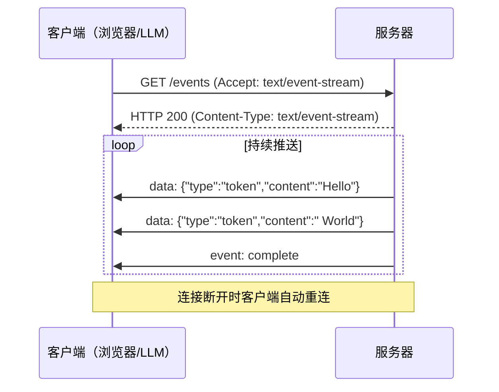

# SSE

SSE（Server-Sent Events，服务器推送事件）是一种基于 HTTP 的服务器向客户端单向推送数据的技术标准。它允许服务器在建立连接后持续向客户端发送事件流，无需客户端反复轮询。SSE 于 2004 年由 Opera 的 Ian Hickson 提出，2015 年成为 W3C 标准（HTML5 的一部分），目前得到所有主流浏览器的原生支持。

SSE 的核心优势在于其简单性——它运行在标准 HTTP 协议之上，使用 `text/event-stream` MIME 类型，无需额外的协议栈或库。与 WebSocket 的双向通信不同，SSE 是单向的（仅服务器到客户端），但正是这种单向性使得它在服务器推送场景中更加轻量、可靠且易于实现。

在 AI 应用生态中，SSE 被广泛用于实时流式输出场景——从 ChatGPT 的逐字回复，到 LLM 推理的 token 流式生成，到 MCP 协议中的进度通知和日志推送，SSE 提供了标准化的实时通信机制。

## 核心概念

### 事件流格式

SSE 使用纯文本的事件流格式，每条事件由一行或多行组成，以空行分隔：

```
event: message
data: 这是第一条消息
id: 1

data: 这是第二条消息
id: 2

: 这是一条注释（心跳）
```

- `event`：事件类型名称，默认 `message`，可自定义（如 `update`、`error`、`progress`）。
- `data`：事件数据，多行 `data` 字段会自动以换行符连接。
- `id`：事件 ID，用于断线续传（客户端重连时发送 `Last-Event-ID` 头部）。
- `retry`：重连时间（毫秒），服务器可建议客户端等待多久后重试。
- 以 `:` 开头的行是注释，常用于心跳保活。

### 连接管理

SSE 的连接管理非常直观：

- **建立连接**：客户端通过普通 HTTP GET 请求建立连接，设置 `Accept: text/event-stream` 头部。
- **保持连接**：服务器保持 HTTP 连接打开，持续写入事件流数据。
- **自动重连**：连接断开时，浏览器默认在 3 秒后自动重连，并可通过 `retry` 字段调整间隔。
- **断点续传**：客户端重连时发送 `Last-Event-ID` 头部，服务器可从断点继续推送。

### 与 WebSocket 的对比

| 维度 | SSE | WebSocket |
|------|-----|-----------|
| 通信方向 | 单向（服务器→客户端） | 双向（全双工） |
| 协议基础 | 标准 HTTP | 独立协议（ws://） |
| MIME 类型 | `text/event-stream` | 无（二进制帧） |
| 自动重连 | 内置支持 | 需手动实现 |
| 断点续传 | 通过 `id` 实现 | 需手动实现 |
| 二进制数据 | 不支持（仅文本） | 支持 |
| 跨域支持 | 标准 CORS | 需服务器支持 |
| 代理友好 | 是（标准 HTTP） | 部分代理不支持 |
| 适用场景 | 推送通知、实时更新 | 聊天、游戏、协作 |

SSE 适合"服务器推送、客户端展示"的场景；WebSocket 适合需要双向实时通信的场景。两者并非替代关系，而是互补。

### 在 MCP 中的应用

MCP（Model Context Protocol）将 SSE 作为可选的传输方式之一（SSE Transport），用于 AI 智能体与 MCP 服务器之间的通信：

- **工具调用结果流式返回**：LLM 推理过程中，MCP 服务器通过 SSE 推送中间结果和最终响应。
- **进度通知**：长时间运行的 MCP 工具可通过 SSE 实时报告进度。
- **日志与调试信息**：开发阶段，SSE 可推送结构化的日志流，便于调试。

MCP 的 SSE 传输模式通常结合 HTTP/2 使用，以支持多路复用和头部压缩。

## 技术架构



## 应用场景

- **AI 对话流式输出**：ChatGPT、Claude 等聊天应用使用 SSE 逐字（token）推送回复内容，提升用户体验。
- **实时数据仪表盘**：股票行情、系统监控、日志面板等场景，服务器通过 SSE 推送最新数据。
- **新闻与通知推送**：社交媒体动态、邮件通知、系统告警等实时信息推送。
- **LLM 推理进度**：推理服务通过 SSE 推送生成进度、中间结果和完成状态。
- **MCP 工具通信**：Model Context Protocol 中，SSE 作为传输层支持流式工具调用和通知推送。

## 相关技术

- [[MCP-协议栈]]
- [[Web-开发与在线工具]]
- [[HTTP]]
- [[JSON-RPC]]

## 主要页面

- [[MCP-协议栈]] - MCP 协议与 SSE 在 AI 工具中的应用
- [[Web-开发与在线工具]] - Web 实时通信技术与工具
