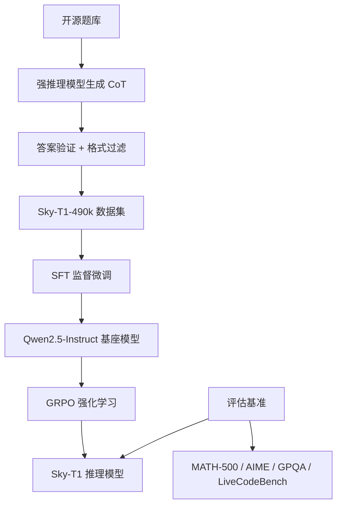

# Sky-T1

Sky-T1 是 UC Berkeley 的 Nova Sky Lab 于 2025 年 2 月开源的一款推理模型训练复现项目，其核心目标是验证"仅使用开源数据和公开方法即可复现 DeepSeek-R1 等顶尖推理模型的能力"。Sky-T1 以 Qwen2.5-Instruct 系列模型为基座，通过大规模推理数据蒸馏（Distillation）+ 强化学习（RL）的训练流程，在数学、编程、科学推理等任务上达到了接近 DeepSeek-R1 的性能水平。整个项目的训练数据、训练代码和模型权重完全开源，是推理模型民主化进程中的重要里程碑。

Sky-T1 的核心方法论遵循了"数据蒸馏 + 后训练"的路线：首先收集高质量的数学、编程、科学推理题目，使用强推理模型（如 QwQ-32B）生成详细的思维链（Chain-of-Thought, CoT）解答，形成大规模的推理训练数据；然后在基座模型上进行监督微调（SFT），让模型学会生成结构化的推理过程；最后通过强化学习（如 GRPO）进一步提升模型的推理能力和格式遵循能力。这一路线与 DeepSeek-R1 的训练方法高度相似，但 Sky-T1 的关键贡献在于证明了仅使用公开数据和开源工具即可实现接近的效果。

## 核心概念

**推理数据蒸馏**：Sky-T1 的核心创新在于高质量推理数据的构建。团队从多个公开的数学竞赛数据集（如 AIME、MATH、AMC）和编程数据集（如 Codeforces、LeetCode）中筛选题目，使用 QwQ-32B、DeepSeek-R1 等强推理模型生成详细的思维链解答，并通过答案验证和格式过滤确保数据质量。最终构建了约 40,000 条高质量的推理训练样本。

**训练流程复现**：Sky-T1 完整复现了 DeepSeek-R1 系列的关键训练阶段：基于蒸馏数据的 SFT 阶段让模型学会生成结构化推理过程，GRPO 强化学习阶段提升模型的推理能力和格式遵循。整个训练流程使用开源框架（如 veRL、OpenRLHF）实现，训练成本约 80×A100 GPU × 数天。

**成本与效率**：Sky-T1 的训练成本约为 DeepSeek-R1 的 1/100 到 1/1000，证明了推理能力的获取不一定需要天量的计算资源。通过合理的数据蒸馏策略和训练方法，中等规模的计算资源即可复现顶尖推理模型的相当比例能力。

**开源贡献**：Sky-T1 开源了完整的训练数据（Sky-T1-490k，包含 49 万条推理样本）、训练代码、模型权重和评估结果。这一开源贡献极大降低了推理模型研究的门槛，使更多的研究团队和企业能够基于此进行二次开发和创新。

**与 DeepSeek-R1 的对比**：Sky-T1 在数学推理任务上达到了 DeepSeek-R1 约 80-90% 的性能水平，在编程和科学推理任务上也有不错的表现。虽然与 DeepSeek-R1 仍有差距，但考虑到训练成本和数据的开放性，Sky-T1 的性价比极高。

## 技术架构

## 应用场景

**推理模型研究复现**：Sky-T1 为学术界和工业界提供了一个完整的推理模型训练复现基准，研究者可以基于此验证新的训练方法、数据策略和评估流程，推动推理模型研究的民主化。

**低成本推理能力获取**：对于资源有限的研究团队和中小企业，Sky-T1 证明了通过数据蒸馏和开源工具即可获取高质量的推理能力，无需从头训练大规模模型。

**推理数据工程研究**：Sky-T1 开源的 49 万条推理数据为推理数据工程研究提供了重要资源，研究者可以基于此研究数据质量、数据多样性、数据规模对推理能力的影响。

**教育领域的推理模型应用**：Sky-T1 的开源特性使其适合应用于教育场景，如数学辅导、编程教学、科学推理训练等，学生可以查看模型的完整推理过程进行学习。

**推理模型微调基线**：Sky-T1 可以作为领域推理微调的基线模型，企业可以在此基础上使用领域数据进行二次微调，构建特定领域的推理模型。

## 相关概念

- [[DeepSeek-V3]] — DeepSeek 系列模型架构与训练方法
- [[强化学习]] — GRPO 等强化学习算法在推理模型训练中的应用
- [[大型语言模型]] — 基座模型与推理能力基础
- [[微调与模型训练]] — SFT 与 RL 微调方法论

## 主要页面

- [[topics/LLM-技术报告与前沿论文]] — 推理模型训练前沿研究
- [[topics/微调与模型训练]] — 推理模型微调实践
