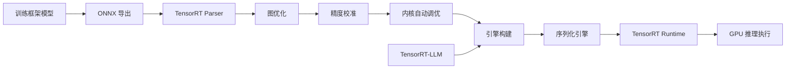

# TensorRT

TensorRT 是 NVIDIA 开发的高性能深度学习推理优化器和运行时库，专为 NVIDIA GPU 平台上的生产级推理部署而设计。其核心目标是将训练好的深度学习模型转化为在 GPU 上极致优化的推理引擎，实现最低的推理延迟和最高的吞吐量。TensorRT 是当前 NVIDIA GPU 平台上推理性能优化的黄金标准，广泛应用于自动驾驶、推荐系统、大语言模型推理、计算机视觉等对性能要求极高的场景。

TensorRT 的工作流程分为两个阶段：**构建阶段**（Build Phase）和**推理阶段**（Runtime Phase）。构建阶段中，TensorRT 的优化器对模型执行一系列图级优化，生成针对目标 GPU 高度优化的推理引擎（Engine）；推理阶段中，运行时库加载引擎并执行高效推理。构建阶段是一次性的（可离线完成），推理阶段则是高频执行的。这种分离设计使得 TensorRT 可以在构建阶段投入大量时间进行极致优化，而不影响在线推理性能。

TensorRT 的优化能力来源于对 NVIDIA GPU 架构的深度适配。它针对不同 GPU 架构（Volta、Turing、Ampere、Hopper、Ada Lovelace）的 Tensor Core、内存层次结构和指令集进行专门优化，能够充分利用硬件特性。对于 LLM 推理，TensorRT 与 TensorRT-LLM 项目结合，提供了从模型优化到服务部署的完整解决方案。

## 核心概念

### 图优化

TensorRT 在构建阶段执行多层次的图优化：

- **层融合**（Layer Fusion）：将 Conv+BN+ReLU、MatMul+BiasAdd+GELU 等连续操作融合为单一 kernel，减少内存访问和 kernel launch 开销。一个典型的 Transformer 层可被融合为单个 kernel
- **精度校准**（Precision Calibration）：通过校准数据集确定 INT8 量化的最优缩放因子，最小化量化精度损失
- **内核自动调优**（Kernel Auto-Tuning）：针对目标 GPU 型号，从候选 kernel 实现中选择性能最优的版本
- **动态张量内存**（Dynamic Tensor Memory）：优化内存分配策略，减少推理过程中的内存占用
- **多流执行**（Multi-stream Execution）：利用 CUDA Stream 实现计算与数据搬运的并行

### 精度模式

TensorRT 支持多种精度模式，在精度和性能之间提供灵活选择：

- **FP32**：全精度推理，精度最高但速度最慢
- **FP16**：半精度推理，利用 Tensor Core 加速，速度提升约 2 倍，精度损失通常可忽略
- **INT8**：8-bit 整数量化推理，速度提升约 4 倍，需要校准数据集
- **INT4**：4-bit 量化推理，主要用于 LLM 的权重压缩
- **TF32**：TensorFloat-32 精度，Ampere+ GPU 原生支持，精度接近 FP32 但速度接近 FP16

### TensorRT-LLM

TensorRT-LLM 是 NVIDIA 专为大语言模型推理优化的开源库，基于 TensorRT 构建：

- **Inflight Batching**：动态批处理，支持在生成过程中添加新请求，提升 GPU 利用率
- **PagedAttention**：借鉴操作系统虚拟内存的 KV-Cache 管理，避免显存碎片
- **量化支持**：支持 GPTQ、AWQ、SmoothQuant 等多种量化方法的 TensorRT 引擎构建
- **多 GPU 推理**：支持张量并行和流水线并行的多 GPU 推理
- **自定义算子**：针对 LLM 特有的操作（如 FlashAttention、RMSNorm）提供优化实现

### 推理模式

TensorRT 支持两种推理模式：

- **隐式批处理**（Implicit Batch）：固定 batch size，适合离线批处理场景
- **显式批处理**（Explicit Batch）：动态 batch size，适合在线推理服务

对于 LLM 推理，TensorRT-LLM 引入了序列级并行和上下文并行等高级特性，优化自回归生成的效率。

### 引擎序列化

TensorRT 构建的推理引擎可以序列化为 `.engine` 或 `.plan` 文件，实现一次构建、多次部署。引擎文件针对特定 GPU 型号和 TensorRT 版本优化，不可跨设备或跨版本使用。这种设计确保了推理性能的可预测性和一致性。

## 技术架构

## 应用场景

- **自动驾驶**：在 NVIDIA Orin/Thor 平台上实现实时感知、预测和规划推理
- **大语言模型服务**：通过 TensorRT-LLM 部署高性能 LLM 推理服务
- **推荐系统**：在 NVIDIA T4/A100 上实现高吞吐的推荐模型推理
- **计算机视觉**：实时目标检测、图像分割、人脸识别等视觉任务
- **语音处理**：语音识别、语音合成、语音翻译的实时推理
- **医疗影像**：CT/MRI 影像的实时 AI 辅助诊断

## 相关技术

- [[LLM-推理优化]] — 推理优化技术体系
- [[OpenVINO]] — Intel 平台的推理优化工具包
- [[ONNX-Runtime]] — 跨平台推理引擎
- [[CUDA]] — NVIDIA GPU 并行计算平台
- [[TensorRT-LLM]] — LLM 专用推理优化库

## 主要页面

- [[topics/LLM推理部署]] — LLM 推理优化与部署实践
- [[边缘硬件]] — NVIDIA Jetson 等边缘平台
