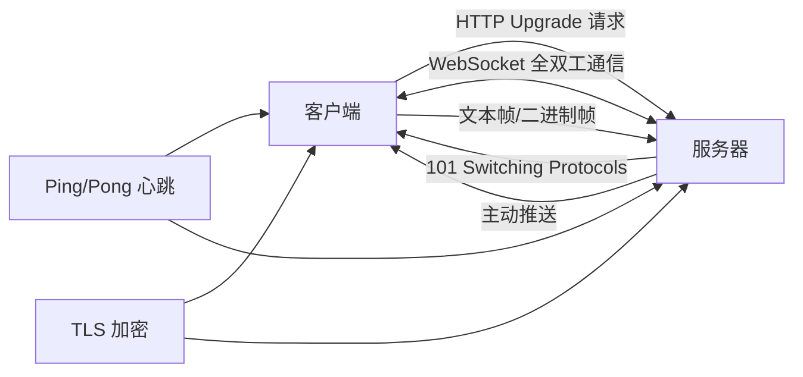

# WebSocket

WebSocket 是一种在单个 TCP 连接上进行全双工通信的网络协议，由 IETF 在 RFC 6455 中标准化（2011 年）。与传统的 HTTP 请求-响应模式不同，WebSocket 允许服务器主动向客户端推送数据，实现了真正的实时双向通信。WebSocket 的设计初衷是解决 Web 应用中实时通信的需求——在 WebSocket 出现之前，开发者不得不使用轮询（Polling）、长轮询（Long Polling）或 Comet 等 hack 方式模拟实时通信，这些方案在效率、延迟和资源消耗方面都存在明显缺陷。

WebSocket 的连接建立过程称为"握手"（Handshake）：客户端首先发送一个 HTTP 请求，在 `Upgrade` 头部中声明希望升级到 WebSocket 协议；服务器同意后，连接从 HTTP 协议切换为 WebSocket 协议，之后双方可以在连接上自由地发送文本或二进制数据帧。一旦建立，WebSocket 连接会保持打开状态，直到任一方主动关闭或网络中断。这种持久连接的特性使得 WebSocket 在延迟和吞吐量方面远优于 HTTP 轮询。

WebSocket 已成为现代 Web 应用的实时通信基础设施。从在线聊天、协同编辑、实时通知到在线游戏、金融行情、IoT 设备控制，WebSocket 支撑了众多对实时性要求高的场景。在后端服务中，WebSocket 也被广泛用于微服务间通信、实时数据推送和 AI 流式输出（如 ChatGPT 的逐字输出效果）。

## 核心概念

### 协议握手

WebSocket 连接的建立过程：

1. 客户端发送 HTTP GET 请求，包含以下关键头部：
   - `Upgrade: websocket` — 请求协议升级
   - `Connection: Upgrade` — 指示连接升级
   - `Sec-WebSocket-Key: <base64随机值>` — 客户端生成的随机密钥
   - `Sec-WebSocket-Version: 13` — 协议版本

2. 服务器返回 HTTP 101 Switching Protocols 响应：
   - `Upgrade: websocket`
   - `Connection: Upgrade`
   - `Sec-WebSocket-Accept: <hash值>` — 对客户端密钥进行哈希验证

3. 握手完成后，连接切换为 WebSocket 协议，双方可自由通信。

### 数据帧

WebSocket 通信以帧（Frame）为单位，帧的结构包括：

- **FIN**：是否为消息的最后一帧
- **Opcode**：帧类型（0x0 延续帧、0x1 文本帧、0x2 二进制帧、0x8 关闭帧、0x9 Ping、0xA Pong）
- **Mask**：客户端到服务器的帧必须掩码，服务器到客户端的帧不掩码
- **Payload length**：载荷长度（7 位、16 位 或 64 位）
- **Payload data**：实际数据

大消息可以分多帧发送（分片），接收方根据 FIN 位判断消息是否完整。

### 全双工通信

WebSocket 的全双工特性意味着：

- 客户端和服务器可以同时发送数据，无需等待对方响应
- 服务器可以主动推送数据，无需客户端请求
- 没有 HTTP 的请求-响应开销，每个帧的头部仅 2-14 字节

这使得 WebSocket 在实时性要求高的场景中具有显著优势。

### 心跳与保活

WebSocket 协议内置 Ping/Pong 帧用于连接保活：

- **Ping**：一方发送 Ping 帧，请求对方响应
- **Pong**：收到 Ping 的一方必须回复 Pong 帧
- 心跳机制用于检测连接是否存活，防止中间设备（如 NAT、负载均衡器）因超时而关闭空闲连接

应用层也可以实现自定义的心跳逻辑，如定期发送包含时间戳的消息。

### 扩展与子协议

WebSocket 支持扩展和子协议：

- **扩展**：在握手时协商，如 `permessage-deflate`（消息级压缩）
- **子协议**：在握手时指定应用层协议，如 `wss://example.com/chat` 中可指定 `chat` 子协议
- **STOMP/MQTT**：可以在 WebSocket 之上运行 STOMP、MQTT 等消息协议

### 安全性

WebSocket 的安全机制包括：

- **wss://**：基于 TLS 加密的 WebSocket 连接，等同于 HTTPS
- **Origin 校验**：服务器可验证请求的 Origin 头部，防止跨站劫持
- **认证**：握手时通过 Cookie、Token 或自定义头部进行身份认证
- **速率限制**：防止恶意客户端发送大量数据导致服务端资源耗尽

## 技术架构

## 应用场景

- **实时聊天**：在线聊天室、客服系统、IM 应用
- **协同编辑**：多人实时文档编辑（如 Google Docs、Notion）
- **实时通知**：股票行情、体育比分、新闻推送
- **在线游戏**：多人实时游戏、棋牌对战
- **AI 流式输出**：ChatGPT 等 AI 对话系统的逐字输出效果
- **IoT 设备控制**：智能家居、工业设备的实时控制与监控
- **实时数据可视化**：仪表盘、监控大屏的实时数据更新

## 相关技术

- [[HTTP]] — WebSocket 基于 HTTP 握手建立连接
- [[Server-Sent Events]] — 服务器单向推送的轻量替代方案
- [[gRPC]] — 高性能 RPC 框架，支持双向流
- [[MQTT]] — IoT 场景的轻量消息协议
- [[长轮询]] — WebSocket 出现之前的实时通信方案

## 主要页面

- [[topics/Web开发与实时通信]] — Web 实时通信技术实践
- [[topics/AI应用开发]] — AI 应用中的 WebSocket 流式输出
