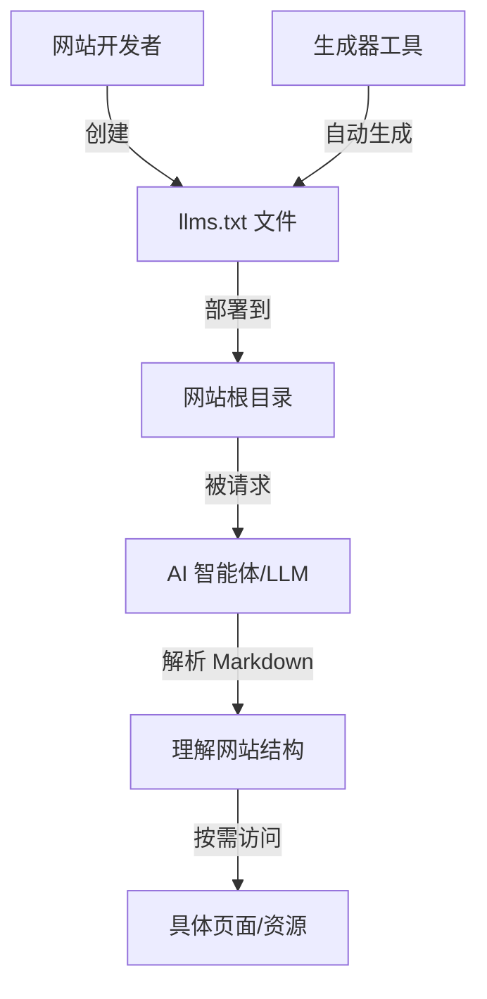

# llms.txt

`llms.txt` 是一种为 LLM（大语言模型）描述网站内容的文本格式标准，旨在让 AI 系统能够快速理解网站的核心信息、导航结构和关键资源。它类似于 `robots.txt` 为搜索引擎爬虫提供网站访问规则，`llms.txt` 则为 AI 智能体和 LLM 应用提供"机器友好"的内容索引。

该标准由 [llmstxt.org](https://llmstxt.org) 提出，核心理念是在网站根目录放置一个标准化的 Markdown 文件（`<domain>/llms.txt`），以结构化的方式列出网站的关键页面、API 文档、产品信息和资源链接。与 `robots.txt` 使用自定义语法不同，`llms.txt` 采用纯 Markdown 格式，既便于人类阅读，也便于 LLM 解析。

在 AI 应用快速发展的背景下，`llms.txt` 填补了传统 Web 标准与 AI 需求之间的空白——搜索引擎有 `sitemap.xml`，爬虫有 `robots.txt`，而 LLM 智能体需要一种轻量、可读、结构化的方式来理解网站内容。`llms.txt` 的推广有助于构建更友好的 AI-Ready Web 生态。

## 核心概念

### 格式规范

`llms.txt` 采用 Markdown 格式，通常包含以下结构：

- **标题（H1）**：网站或项目名称，作为整体标识。
- **摘要（Blockquote）**：简短描述网站的用途、定位和核心功能。
- **指导信息（H2）**：针对 AI 智能体的使用说明或注意事项。
- **资源目录（H2）**：按功能分类的链接列表，如"文档"、"API"、"产品"、"博客"等。每个分类下使用 Markdown 列表提供链接和简要说明。

示例结构：

```markdown
# 项目名称

> 项目的一句话描述

## 文档

- [快速开始](https://example.com/docs/start.md): 5 分钟上手指南
- [API 参考](https://example.com/docs/api.md): 完整的 API 接口文档

## 资源

- [GitHub](https://github.com/example/project): 开源代码仓库
```

### 与 robots.txt 的关系

`robots.txt` 和 `llms.txt` 都是为了"告知机器如何与网站交互"而设计的标准文件，但目标对象和语义不同：

| 维度 | robots.txt | llms.txt |
|------|-----------|----------|
| 目标对象 | 搜索引擎爬虫（Googlebot、Bingbot 等） | AI 智能体、LLM 应用 |
| 语法定义 | 自定义的 Robots Exclusion Protocol | 标准 Markdown |
| 核心功能 | 控制爬虫访问权限（Allow/Discharge） | 提供内容索引和导航 |
| 文件格式 | 纯文本指令 | 结构化 Markdown |
| 强制性 | 被主流搜索引擎遵守 | 新兴标准，逐步推广 |

两者可以共存：`robots.txt` 控制爬虫行为，`llms.txt` 为 AI 提供内容理解。一些先进的 `llms.txt` 实现甚至会通过 `robots.txt` 中的特殊指令（如 `llms.txt: <url>`）来声明 `llms.txt` 文件的位置。

### 与 sitemap.xml 的区别

`sitemap.xml` 是面向搜索引擎的 XML 格式站点地图，包含所有可索引页面的 URL、更新频率和优先级。而 `llms.txt` 更侧重于"精选内容"和"上下文描述"——它不仅列出链接，还提供每个链接的语义说明，帮助 LLM 理解链接的用途和重要性。

### 工具生态

随着 `llms.txt` 标准的推广，相关工具生态正在形成：

- **生成器**：自动化工具可扫描网站结构并生成 `llms.txt` 文件，如 `llms.txt` 官方推荐的生成器。
- **验证器**：检查 `llms.txt` 格式是否合规、链接是否有效。
- **AI 平台集成**：Perplexity、ChatGPT 等 AI 搜索产品开始支持自动发现和读取 `llms.txt`。
- **CDN 平台支持**：Vercel、Cloudflare 等边缘平台提供 `llms.txt` 的自动托管和缓存。

## 技术架构



`llms.txt` 的工作流程：开发者在网站根目录创建 `llms.txt` → AI 智能体访问网站时首先获取该文件 → 解析 Markdown 内容理解网站结构 → 根据用户需求导航到具体页面。

## 应用场景

- **开源项目文档**：GitHub 开源项目通过 `llms.txt` 为 AI 编码助手（如 Claude Code、Cursor）提供项目结构概览，提升代码理解效率。
- **API 服务平台**：API 提供商通过 `llms.txt` 列出端点文档、SDK 资源和示例代码，让 LLM 能够快速定位 API 信息。
- **企业官网**：企业通过 `llms.txt` 为 AI 搜索和问答系统提供准确的产品信息、联系渠道和帮助文档。
- **个人博客与作品集**：个人开发者使用 `llms.txt` 让 AI 助手更好地理解自己的内容体系和技术栈。
- **MCP 服务器发现**：`llms.txt` 可用于描述 MCP 服务器的功能、端点和工具列表，帮助 AI 智能体发现和选择合适的 MCP 服务。

## 相关技术

- [[Web-开发与在线工具]]
- [[MCP-协议栈]]
- [[HTTP]]
- [[Markdown]]

## 主要页面

- [[Web-开发与在线工具]] - Web 开发标准与在线工具生态
- [[MCP-协议栈]] - MCP 协议与 AI 工具扩展生态
