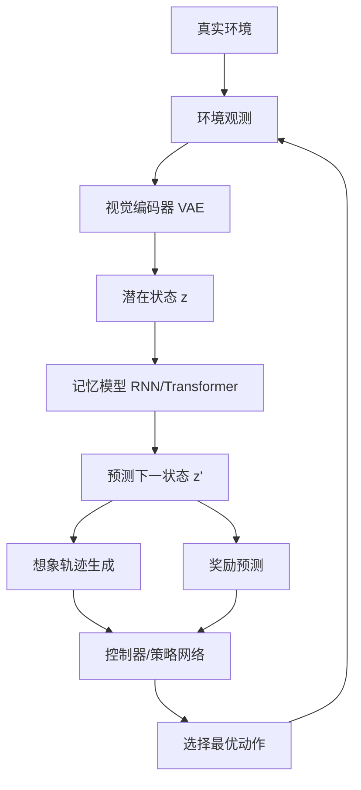

# 世界模型（World Model）

世界模型（World Model）是人工智能领域中一种让智能体在内部构建环境模拟的核心理念。其核心思想是：智能体不应仅仅通过试错与环境交互来学习，而应首先在内部建立一个关于环境动态的"心智模型"，然后在这个内部模型中进行想象、规划和决策，从而大幅减少与真实环境的交互成本。这一概念最早由 Juergen Schmidhuber 在 1990 年提出，后由 David Ha 和 Jürgen Schmidhuber 在 2018 年通过论文《World Models》系统性地形式化，成为强化学习和通用人工智能研究的重要范式。

世界模型的灵感来源于人类认知科学。人类在做出决策时，并非每次都通过真实行动来验证后果，而是在大脑中"想象"不同选择的可能结果，选择最优方案后再执行。这种"心理模拟"能力是人类智能高效的关键——我们可以在短时间内评估大量可能的行动路径，而无需承担真实试错的成本和风险。世界模型试图在 AI 系统中复现这种能力。

在深度学习时代，世界模型通常由三个核心组件构成：**视觉模块**（Vision，通常使用 VAE 编码感知输入）、**记忆模块**（Memory，通常使用 RNN/LSTM/MDN-RNN 预测环境动态）和**控制器**（Controller，通常使用简单线性策略或进化策略在想象空间中规划）。智能体通过视觉模块感知当前状态，通过记忆模块预测未来状态，控制器在想象的未来中选择最优行动。

## 核心概念

### 环境动态建模

世界模型的核心是对环境动态（Environment Dynamics）的建模——给定当前状态和动作，预测下一状态和奖励。这种建模使智能体能够在"想象"中推演未来，无需真实交互。环境动态建模的挑战在于：

- **部分可观测性**：真实环境中智能体无法获取完整状态，需要从历史观测中推断隐状态
- **随机性**：环境转移可能是随机的，需要建模概率分布而非确定性映射
- **长期预测**：多步预测的误差会累积，需要设计机制缓解预测漂移

### 潜在空间想象

现代世界模型通常在潜在空间（Latent Space）而非原始像素空间进行想象。通过 VAE 或 VQ-VAE 将高维感知输入压缩为低维潜在表示，智能体在紧凑的潜在空间中进行动态推演，大幅降低计算复杂度。Dreamer 系列模型是这一方向的代表：它在潜在空间中训练世界模型，并在想象轨迹上优化策略。

### 基于模型的强化学习

世界模型是基于模型强化学习（Model-Based RL）的核心组件。与无模型 RL（Model-Free RL）直接学习状态-动作价值函数不同，基于模型的 RL 先学习环境模型，再基于模型进行规划或策略优化：

- **Dyna 架构**：交替进行真实环境交互（更新世界模型）和想象推演（优化策略）
- **MPC（Model Predictive Control）**：在每个时间步基于世界模型进行有限时域规划
- **策略梯度在想象轨迹上**：如 Dreamer 系列，在想象轨迹上直接优化策略网络

### 生成式世界模型

2024 年以来，生成式 AI 技术推动了世界模型的革新。基于扩散模型（Diffusion Model）和 Transformer 架构的生成式世界模型能够生成高质量的未来帧预测：

- **Sora/OpenAI**：视频生成模型作为世界模拟器，生成物理世界的动态视频
- **Genie/Google DeepMind**：从交互动作生成可玩的 2D 游戏世界
- **DriveDreamer/UniSim**：自动驾驶场景的驾驶世界模型
- **LeCun 的世界模型架构**：Yann LeCun 提出的 JEPA（Joint Embedding Predictive Architecture）架构，在抽象表示空间进行预测

### 规划与决策

世界模型的最终目的是支持智能体的规划与决策。在想象空间中，智能体可以：

- **评估行动后果**：模拟不同行动的长期结果，选择最优方案
- **探索安全策略**：在想象中进行高风险探索，避免真实环境的代价
- **反事实推理**：思考"如果采取不同行动会怎样"，提升决策质量
- **目标导向规划**：从目标状态反向规划行动序列

## 技术架构

## 应用场景

- **游戏 AI**：在模拟环境中训练游戏智能体，如 OpenAI Five、AlphaGo 的规划组件
- **自动驾驶**：构建驾驶世界模型，模拟不同驾驶决策的后果，提升安全性
- **机器人控制**：在想象空间中规划机器人动作，减少真实环境试错
- **视频生成**：作为世界模拟器生成物理世界视频，用于训练和娱乐
- **科学发现**：模拟分子动力学、气候系统等复杂系统的演化
- **通用人工智能**：作为 AGI 的核心组件，赋予 AI 系统想象和规划能力

## 相关技术

- [[强化学习]] — 世界模型所属的机器学习范式
- [[生成式模型]] — 生成式世界模型的技术基础
- [[JEPA]] — Yann LeCun 提出的联合嵌入预测架构
- [[自动驾驶]] — 世界模型在自动驾驶中的应用
- [[视频生成]] — Sora 等视频生成模型

## 主要页面

- [[topics/强化学习与智能体]] — 强化学习技术体系与世界模型实践
- [[LLM-技术报告与前沿论文]] — 世界模型相关论文
