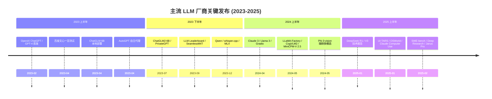
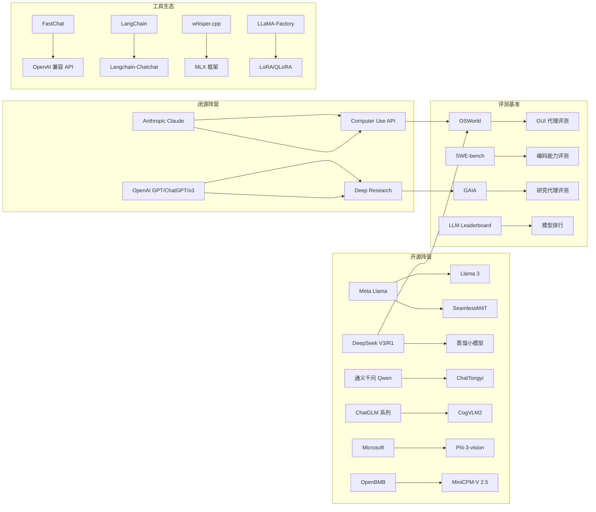

# 主流-LLM-与厂商

> 本聚合页覆盖 2023–2026 年间国内外主流大模型厂商、旗舰模型与配套生态工具。本批次（#109-111）重点追加 DeepSeek-V4 架构、DeepSeek-OCR、Gemini CLI 生态、DXT 桌面扩展规范、Google Nano Banana 图像生成、稳定币市场概览、京东健康核心数据。

> 本聚合页覆盖 2023–2025 年间国内外主流大模型厂商、旗舰模型与配套生态工具，从 OpenAI 的 GPT 系列、Anthropic 的 Claude、Meta 的 Llama，到国产的 DeepSeek、通义千问、ChatGLM、文心一言、Phi-3、MiniCPM、CogVLM，再到本地部署与评测基准，勾勒出一幅完整的 LLM 厂商全景图。

## 1. 全景：LLM 厂商生态演进

过去三年，大语言模型经历了一条"闭源领跑→开源追赶→推理突破"的演进路径。[[OpenAI]] 凭借 GPT 系列与 ChatGPT 产品率先定义了对话式 AI 的形态；[[Anthropic]] 以 Claude 系列切入安全与长上下文场景；[[Meta]] 通过 Llama 系列驱动了开源生态的繁荣；国产阵营中，[[DeepSeek]] 以 MoE 架构与强化学习推理模型异军突起，[[Qwen-通义千问]]、[[ChatGLM]]、[[文心一言]]、[[Phi-3]]、[[MiniCPM]]、[[CogVLM]] 则分别占据了中文、端侧、多模态等细分高地。



## 2. OpenAI：闭源领跑者与 API 生态

### 2.1 GPT 系列与 ChatGPT 产品

[[OpenAI]] 在 2023 年 2 月发布 [[ChatGPT-快速入门]]，系统梳理了 [[GPT]] 系列从 [[GPT-3]] 到 [[GPT-3.5]] 的演进脉络。旗舰模型 `text-davinci-003` 与 `gpt-3.5-turbo` 分别承担高质量文本生成与高性价比对话任务。[[ChatGPT-快速入门]] 详细说明了 API 的三大模型能力：[[GPT-3]] 文本补全、[[Codex]] 代码生成、[[DALL·E]] 图像生成，以及 [[Python]] 调用的核心参数（`temperature`、`max_tokens`、`model`）。

[[通过命令使用-ChatGPT]] 的实践表明，开源工具 [[ChatGPT-Wrapper]] 提供了 [[CLI]]、[[Python]] API 和 [[Flask]] API 三种交互方式，结合 [[Playwright]] 浏览器自动化完成会话登录与问答。[[在-Hugging-Face-上搭建-ChatGPT-聊天机器人]] 的实践则展示了如何用 [[Gradio]] 构建 Web 界面，通过 [[tiktoken]] 精确控制上下文 token 长度，最终通过 [[git]] push 触发 [[Docker]] 镜像自动构建。[[Hugging-Face]] 作为模型托管平台，承载了开源生态的核心流通。

### 2.2 OpenAI API 技术栈

[[OpenAI-API-快速入门]] 系统介绍了 [[Prompts]] 与 [[Tokens]] 的核心概念——英文场景下 1 token ≈ 4 字符 ≈ 0.75 单词，模型上下文上限 2048 tokens。[[Tokenization]] 机制决定了模型的文本理解粒度。审核模型（[[Moderation-API]]）通过 `text-moderation-latest` 与 `text-moderation-stable` 两个版本，对暴力与色情内容进行分类。[[Moderation-API]] 测试显示暴力内容识别置信度达 0.95。

[[OpenAI-API-Chat-Completion]] 深入解读了 [[Chat-Completion-API]] 的 Token 计算机制：`gpt-3.5-turbo-0301` 每条消息固定消耗 4 tokens，`gpt-4-0314` 每条 3 tokens。通过 [[tiktoken]] 库实现的计数函数与 API 返回的 usage 字段完全一致（验证样本 127 tokens）。[[OpenAI-Embeddings]] 则展示了 `text-embedding-ada-002` 的实战应用：零样本好评差评分类、基于 [[Kaggle]] 亚马逊耳机评论的指标评估，以及语义检索——[[Faiss]] 向量检索库相比纯余弦距离计算提速约 354 倍（7.8s vs 2.2s）。

### 2.3 微调与训练范式

[[OpenAI-Fine-Tuning]] 汇总了官方微调文档、[[JSON-Lines]] 格式规范与定价页面。[[State-of-GPT]] 系统梳理了 [[Andrej-Karpathy]] 在微软 [[Build-2023]] 大会上的演讲，完整介绍了 GPT 助手训练流水线：[[Pretraining]] → [[Supervised-Finetuning]] (SFT) → [[Reward-Modeling]] → [[Reinforcement-Learning]] (RLHF)。应用层延伸到 [[Chains-Agents]]、[[Tool-Use-Plugins]]、[[Retrieval-Augmented-LLMs]]、[[Constrained-Prompting]] 等方向。

### 2.4 Deep Research 与推理前沿

[[Introducing-deep-research]] 展示了 OpenAI 在 2025 年 2 月发布的 [[Deep-Research]]——由针对网页浏览和数据分析优化的 [[o3]] 模型版本驱动，能在 5-30 分钟内独立搜索、分析和综合数百个在线来源，撰写带引用的分析师级报告。在 [[Humanity's-Last-Exam]] 上达 26.6% 准确率（GPT-4o 仅 3.3%），在 [[GAIA]] 验证集上达 67.36%（pass@1），刷新 SOTA。[[Deep-Research]] 代表了从对话助手到自主研究代理的范式跃迁。

## 3. Anthropic：安全与 Computer Use

### 3.1 Claude 3 模型系列

[[Anthropic]] 在 2024 年 4 月发布 [[Claude-3]] 系列，三款模型形成清晰的能力梯度：

| 模型 | 定价（MTok） | 定位 |
|------|-------------|------|
| Opus | Input $15 / Output $75 | 复杂分析、多步骤长期任务 |
| Sonnet | Input $3 / Output $15 | 高效、高吞吐量任务 |
| Haiku | Input $0.25 / Output $1.25 | 轻量级操作、速度领先 |

所有 [[Claude-3]] 模型均支持视觉能力与 200,000 Token 上下文窗口。[[Anthropic-Claude]] 通过 [[LangChain]] 的 `ChatAnthropic` 接口验证了中英翻译任务：[[Sonnet]] 返回简洁准确（"我喜欢Python"），[[Haiku]] 则倾向于发散解释。[[Anthropic]] 将"宪法 AI"（[[Constitutional-AI]]）方法论融入训练，强调模型的安全性与有用性平衡。

### 3.2 Claude Computer Use API

[[Claude-API-Computer-use]] 在 2025 年 2 月以 Beta 形式发布，通过 [[Messages-API]] 为 [[Claude-3.5-Sonnet]] 提供计算机控制能力。三大 Anthropic 定义工具构成其核心：

- **computer**：鼠标、键盘、截图交互
- **text_editor**：文件编辑
- **bash**：命令行执行

采用"代理循环"（[[Agent-Loop]]）模式——Claude 发出 `tool_use`，应用端在容器或虚拟机上执行后返回 `tool_result`，循环直至任务完成。参考实现基于 [[Docker]] 容器化环境，使用 [[xdotool]] 驱动输入。工具调用存在显著的 token 开销：computer 工具额外 683 tokens、text_editor 700 tokens、bash 245 tokens。[[Computer-Use]] 标志着大模型从信息处理向物理世界操作的延伸。

## 4. Meta：Llama 开源生态与多模态

### 4.1 Llama 3 架构与能力

[[Meta]] 在 2024 年 4 月发布 [[Llama-3]]，最大变化是采用新 [[Tokenizer]]，词汇表扩展至 128,256（前代仅 32,000），提升了多语种编码效率，但也导致嵌入层尺寸增大，使小型模型参数从 [[Llama-2]] 的 7B 增至 8B。8B 版本采用分组查询注意力（[[GQA]]），支持 8000 Token 上下文。[[Meta-Llama-3]] 记录了完整部署链路：通过 [[Ollama]] 一键下载、[[Transformers]] 库直接调用、[[LangChain]] 的 `Ollama` 接口集成。

训练规模达到 24,000 [[GPU]] 集群、超过 15 万亿 Token 的新公共在线数据。[[Instruct]] 版本结合超过 1000 万人工标注数据，通过 [[SFT]]、[[拒绝采样]]、[[PPO]] 和 [[DPO]] 多阶段训练。安全层面，[[Llama-Guard-2]] 基于 Llama 3 8B 微调，为生产环境提供输入/响应安全分类。[[Llama-3]] 的开源策略推动了整个 [[LLM-部署与开源生态]] 的繁荣。

### 4.2 SeamlessM4T 多模态翻译

[[SeamlessM4T]] 是 Meta 开源的多模态语音翻译模型，支持五大任务：[[ASR]]（96 语言）、[[S2ST]]（100→35）、[[S2TT]]（100→95）、[[T2ST]]（95→35）、[[T2TT]]（95→95）。在 [[Apple-Silicon]] ([[MPS]]) 上部署时需设置 `PYTORCH_ENABLE_MPS_FALLBACK=1` 绕过 `aten::_weight_norm_interface` 未实现问题。实测发现英文→中文的 S2TT 翻译失败（返回仍为英文），非对称语言对表现不稳定。[[SeamlessM4T]] 代表了[[多模态大模型]]在语音翻译领域的尝试。

## 5. 国产大模型：从追赶到超越

### 5.1 DeepSeek：MoE 架构与强化学习推理

[[DeepSeek]] 在 2025 年初连续发布两款旗舰模型，重塑了开源 LLM 格局。

**[[DeepSeek-V3]]** 是一个 671B 总参数、37B 激活参数的 [[MoE]] 语言模型。架构层面采用多头潜在注意力（[[MLA]]）和 [[DeepSeekMoE]] 实现高效推理与训练，首创无辅助损失负载均衡策略，并引入多标记预测（[[MTP]]）训练目标。训练层面首次在极大规模模型上验证 [[FP8]] 混合精度训练的可行性，设计 [[DualPipe]] 算法实现计算-通信重叠。在 14.8T 标记上预训练，总训练成本仅 557.6 万美元（2.788M [[H800]] GPU 小时），训练过程零损失尖峰。评估显示 [[MMLU]] 88.5、[[MATH-500]] 超越 o1-preview、[[LiveCodeBench]] 编码竞赛 SOTA。

**[[DeepSeek-R1]]** 探索了纯强化学习激发 LLM 推理能力的路径。[[R1-Zero]] 首次验证无需 SFT 即可通过大规模 RL 涌现推理行为，[[AIME-2024]] pass@1 从 15.6% 升至 71.0%。采用 [[GRPO]] 算法作为 RL 框架。R1 引入冷启动数据+多阶段训练解决可读性和语言混合问题，性能与 [[OpenAI-o1-1217]] 相当：AIME 2024 Pass@1 达 79.8%、MATH-500 达 97.3%、[[Codeforces]] Elo 2029（超越 96.3% 人类）。[[蒸馏]] 实验表明，将 R1 推理能力蒸馏到小模型（1.5B-70B）远超同规模直接 RL 训练，蒸馏 14B 模型大幅超越 [[QwQ-32B-Preview]]。

**[[DeepSeek-Janus-Pro-7B]]** 是 DeepSeek 的多模态图像生成模型，实测显示英文提示词生成效果良好，中文提示词效果明显不佳，存在提示语言依赖问题。[[Janus-Pro-7B]] 代表了统一理解与生成多模态架构的探索。

### 5.2 通义千问：阿里全栈 LLM

[[Qwen-通义千问]] 系列由 [[阿里云]] 推出，覆盖 1.8B/7B/14B 多尺度。[[Qwen]] 在 [[macOS]] ([[Apple-Silicon]]) 上的部署通过 [[FastChat]] 搭建 OpenAI 兼容 API，Model Worker 使用 `--device mps` 调用 Apple GPU 加速。[[ChatTongyi]] 通过 [[LangChain]] 的 `ChatTongyi` 接口实现流式调用，支持 `qwen-turbo` 模型。[[Gradio-Chatbot]] 则展示了 [[DashScope]] 灵积服务与 [[Gradio]] 的集成，支持 [[system-prompt]] 定制与流式响应。

微调实践方面，[[LLaMA-Factory-Fine-Tuning-Text2SQL]] 使用 [[LLaMA-Factory]] 框架，基于 [[Qwen1.5-4B-Chat]] 进行 [[LoRA]] 微调，训练数据采用 [[Alpaca]] 格式的 [[Text2SQL]] 指令集，通过 [[PEFT]] 库实现参数高效微调。[[Text2SQL]] 任务要求模型将自然语言转换为结构化查询语言。

### 5.3 ChatGLM：智谱中英双语模型

[[ChatGLM]] 系列由 [[THUDM]] 团队开发，定位中英双语对话模型。

**[[ChatGLM-6B]]** 在 [[MacBook-Pro-M2-Max]] 上的部署实践显示：FP16 推理需 13G 显存，INT4 量化后仅需 4.7G。[[P-tuning-v2]] 微调实验使用 [[ADGEN]] 广告文案数据集，FP16 训练耗时 4h33m，INT4 训练耗时 9h43m，评估指标 INT4 略优（BLEU-4 8.02 vs 7.89）但耗时近 3 倍。

**[[ChatGLM2-6B]]** 带来三大升级：[[GLM]] 混合目标函数（1.4T 标识符预训练）、[[FlashAttention]] 将上下文扩至 32K、[[Multi-Query-Attention]] 提升推理效率。评测提升显著：MMLU +23%、[[CEval]] +33%、[[GSM8K]] +571%、[[BBH]] +60%。推理速度比初代提升 42%。

**[[ChatGLM3]]** 文档问答对比实验表明：32K 模型在完整文档场景下回答更精准，8K+[[RAG]] 在上下文缺失时易触发幻觉。FP16 下 8K 平均 29.35 字符/秒、32K 平均 30.52 字符/秒。[[Langchain-Chatchat-and-FastChat]] 将 [[FastChat]] 作为本地推理后端、[[Langchain-Chatchat]] 作为 RAG 知识库前端，通过 OpenAI 兼容接口实现完整集成。

### 5.4 文心一言：百度的大模型尝试

[[文心一言]]（[[ERNIE-Bot]]）在 2023 年 4 月的测试中表现欠佳：分类任务答错后自我纠正、情感分类模棱两可、阅读理解事实错误（卫健委副主任姓名识别错误）、代码生成存在明显 bug。正面表现集中在翻译与语法纠错任务。[[文心一言测试]] 揭示了早期中文大模型在事实准确性和代码逻辑方面的显著差距。[[百度]] 的[[文心一言]]之路反映了中文大模型早期探索的曲折。

## 6. 微软 Phi 系列：小模型大能力

[[Microsoft-Phi-3]] 是 [[微软]] 开源的轻量级多模态模型，4B 参数，属于 [[Phi-3]] 模型系列，支持 128K 上下文长度。[[Phi-3-vision-128k-instruct]] 基于[[合成数据]]和过滤后的公开网站训练，聚焦文本与视觉方面的[[推理密集数据]]。实测在手写英文作文识别、表格 Markdown 转换、代码注入分类统计等任务上表现出色——能将复杂表格精准转为 Markdown 格式，作文识别遵循指令仅识别作文内容。[[Phi-3-vision]] 验证了小参数模型在端侧多模态任务上的可行性。

## 7. 多模态大模型：视觉语言融合

### 7.1 CogVLM2：智谱开源多模态

[[CogVLM2]] 智谱开源多模态大模型基于 [[Meta-Llama-3-8B-Instruct]] 构建，19B 参数量，支持 8K 文本长度与 1344×1344 图像分辨率。[[CogVLM2-Llama3-19B]] 在 [[OCR]] 任务上表现突出：印刷体、手写体、中英文均可识别，支持保单、车牌、火车票等结构化信息提取，以及复杂表格识别。调提示词需要精确描述（如"红色数字"、"手写英文"），才能获得理想效果。[[CogVLM2]] 代表了[[多模态大模型]]在视觉理解领域的开源高地。

### 7.2 MiniCPM-Llama3-V 2.5：端侧 GPT-4V 级

[[MiniCPM-Llama3-V-2.5]] 由 [[OpenBMB]] 开发，基于 [[SigLip-400M]] 和 [[Llama3-8B-Instruct]] 构建，8B 参数量。在 [[OpenCompass]] 榜单上平均得分 65.1，以 8B 量级超越 GPT-4V-1106、Gemini Pro、Claude 3、Qwen-VL-Max 等商用闭源模型。[[OCRBench]] 得分达 725，超越 GPT-4o、GPT-4V、Gemini Pro。通过 [[RLAIF-V]] 对齐技术，幻觉率降至 10.3%（GPT-4V-1106 为 13.6%）。支持德语、法语、西班牙语等 30+ 种语言的多模态能力。端侧部署通过[[模型量化]]、[[CPU]]/[[NPU]]/编译优化实现，语言解码速度 3 倍加速、图像编码 150 倍加速。[[MiniCPM-V-2.5]] 证明了端侧设备运行 GPT-4V 级多模态的可行性。

## 8. 本地部署与推理优化

### 8.1 Apple Silicon 推理生态

[[Whisper-cpp]] 在 [[Apple-M2-Max]] 上对比三种加速方案：[[NEON]] & [[MPS]]（[[Metal]]）、[[CoreML]] 编码器、[[MLX]]。结论：CoreML 总耗时比 NEON&MPS 快约 47%（71s vs 105s），但识别效果下降（出现重复/卡死 token）；MLX 在小模型上已超越 whisper.cpp 原生性能。[[MLX-LLMS-Examples]] 在 M2 Max 64GB 上运行 [[Phi-2]] 与 [[Qwen]] 系列，Qwen-1.8B-Chat 生成速度 62.57 tokens/s、Qwen-7B-Chat 19.76 tokens/s、Qwen-14B-Chat 10.71 tokens/s，模型越大 tokens/s 近似线性下降。[[Apple-Silicon]] 已成为本地 LLM 推理的重要平台。

### 8.2 本地 RAG 与私有部署

[[Private-GPT]] 构建本地私有 GPT 系统的工程实践涵盖：模型选型（[[Qwen-7B]]、[[Taiyi-CLIP-Roberta-102M-Chinese]]）、向量数据库对比（[[Chroma]] 需 sqlite3≥3.35.0、[[Milvus]] 接入 LangChain + [[BAAI-bge-base-zh]]）、文件去重（[[Redis]] 存储图片 MD5）、[[Gunicorn]] 多进程部署（通过 `--preload` 解决 Worker 启动失败，`MAX_WORKERS=3` 解决 OOM）、多平台 [[Docker]] 镜像构建（amd64/arm64）。[[Private-GPT]] 代表了数据主权意识下本地部署的范式。

### 8.3 框架与工具链

[[FastChat]]（[[lm-sys]]）提供 Controller → Model Worker → OpenAI API Server → Gradio Web Server 完整链路。[[LangChain-Chatchat]]（[[chatchat-space]]）作为 RAG 知识库前端，通过修改 `model_config.py` 与 `kb_cache/base.py` 将请求路由到本地 127.0.0.1:8000。[[LLaMA-Factory]]（[[hiyouga]]）提供 WebUI 驱动的微调流程，支持 [[LoRA]]、[[QLoRA]]、[[PPO]]、[[DPO]] 等多种训练方式。[[FastChat]] 与 [[LangChain-Chatchat]] 的组合构成了完整的本地 RAG 方案。

## 9. Agent 能力与评测基准

### 9.1 GUI 代理：UI-TARS 与 OSWorld

[[UI-TARS]] 是 [[字节跳动]] 提出的原生 GUI 代理模型，仅感知截图输入并执行类人交互。四大创新构成其核心：增强感知（大规模 GUI 截图数据集）、统一动作建模（跨平台统一动作空间）、系统 2 推理（任务分解/反思/里程碑识别）、迭代训练（数百台虚拟机在线轨迹收集+反思调优）。基于 [[Qwen-2-VL]] 7B/72B 训练，在 10+ GUI 基准上达 SOTA：[[OSWorld]] 50 步得分 24.6（Claude 22.0）、[[AndroidWorld]] 46.6（GPT-4o 34.5）、[[VisualWebBench]] 82.8（GPT-4o 78.5）。

[[OSWorld]] 是首个可扩展的真实计算机环境，支持 [[Ubuntu]]/[[Windows]]/[[macOS]] 上的多模态代理评估。基准包含 369 个真实计算机任务（[[Chrome]]/[[VS-Code]]/[[LibreOffice]]/[[GIMP]] 等），涉及 [[GUI]] 和 [[CLI]] 交互、跨应用工作流。人类成功率 72.36%，最佳模型仅 12.24%，当前 [[LLM]]/[[VLM]] 远不能胜任计算机助手角色。

### 9.2 编码基准：SWE-bench

[[SWE-bench]] 是从 12 个流行 [[Python]] 仓库中提取的 2294 个真实 [[GitHub]] issue-PR 对组成的基准。任务要求模型根据 issue 描述编辑代码库生成补丁并通过测试。[[Claude-2]] 仅解决 1.96%（[[BM25]] 检索）/4.8%（oracle 检索），[[GPT-4]] oracle 仅 1.3%，微调模型 [[SWE-Llama]] 13B 与 Claude 2 竞争力相当。模型生成补丁平均仅 30.1 行（金补丁 74.5 行）。[[SWE-bench]] 揭示了真实软件工程场景下 LLM 的显著不足。

### 9.3 研究代理：Deep Research 复现

[[Open-source-DeepResearch]] 是 [[Hugging-Face]] 团队在 24 小时内复现 OpenAI Deep Research 的代理框架。核心发现：使用 [[CodeAgent]]（代码形式表达动作）比 JSON 形式性能提升显著（55.15% vs 33%），步骤减少 30%。系统包含文本网页浏览器和文本检查器工具（基于 [[Magentic-One]]）。在 [[GAIA]] 验证集上达 55.15%，超越此前开源 SOTA Magentic-One（46%）。[[Open-source-DeepResearch]] 证明了开源社区快速复现闭源代理的能力。

### 9.4 模型评测与排行

[[LLM-Leaderboard]] 整理了 2023 年 LLM 与 Embedding 领域的评测基准与开源模型资源。[[HuggingFace]] 的 [[Open-LLM-Leaderboard]] 评测大模型、[[MTEB-Leaderboard]] 评测嵌入模型。国产代表模型 [[Qwen-7B]]、[[ChatGLM2-6B]]，中文通用嵌入模型 [[sensenova-piccolo-large-zh]]（[[商汤]]）和 [[BAAI-bge-large-zh]]（[[FlagEmbedding]]）。[[AutoGPT]] 作为早期自主 AI 代理项目，依赖 [[OpenAI]] API + [[Google-Custom-Search]] + [[Pinecone]] 向量数据库 + [[ElevenLabs]] 语音合成。

## 10. 技术演进脉络



## 11. 关键数据与性能对比

| 厂商 | 旗舰模型 | 参数规模 | 架构特点 | 核心能力 |
|------|---------|---------|---------|---------|
| OpenAI | GPT-4o / o3 | 未公开 | 闭源 | 多模态、推理、Deep Research |
| Anthropic | Claude 3.5 Sonnet | 未公开 | 闭源 | 200K 上下文、Computer Use |
| Meta | Llama 3 | 8B/70B | GQA、新Tokenizer | 开源多语种、Llama Guard |
| DeepSeek | V3 / R1 | 671B/37B 激活 | MoE、MLA、FP8 | 推理（GRPO RL）、低成本训练 |
| 阿里 | Qwen-1.8B/7B/14B | 1.8-14B | ChatML | 中文、FastChat 集成 |
| 智谱 | ChatGLM3 / CogVLM2 | 6B/19B | GLM 目标函数 | 中英双语、OCR |
| 百度 | 文心一言 | 未公开 | ERNIE | 中文对话 |
| 微软 | Phi-3-vision | 4B | 小模型 | 端侧多模态、128K 上下文 |
| OpenBMB | MiniCPM-V 2.5 | 8B | SigLip+Llama3 | 端侧 GPT-4V 级 |
| 字节跳动 | UI-TARS | 7B/72B | Qwen-2-VL | 原生 GUI 代理 |

## 12. 相关主题

- [[LLM-技术报告与前沿论文]]——DeepSeek R1/V3、UI-TARS、OSWorld、SWE-bench 等技术报告的深度解读
- [[RAG-检索增强生成]]——PrivateGPT、Langchain-Chatchat 等检索增强实践
- [[LLM-部署与开源生态]]——FastChat、whisper.cpp、MLX 等本地部署工具
- [[微调与模型训练]]——LLaMA-Factory、OpenAI Fine Tuning、P-tuning v2 等微调实践
- [[AI-Agent-编排]]——AutoGPT、Deep Research、Open-source DeepResearch 等代理框架
- [[MCP-协议栈]]——模型上下文协议与工具集成
- [[向量数据库与语义搜索]]——Faiss、Chroma、Milvus 在 LLM 生态中的角色
- [[多模态大模型]]——CogVLM2、MiniCPM-V 2.5、Phi-3-vision 等多模态专题
- [[计算机视觉与目标检测]]——OCR、图像理解等视觉任务
- [[GPU-与-CUDA-开发]]——FP8 训练、DualPipe 等训练优化技术

## 13. DeepSeek-V4：百万token上下文的混合注意力架构

### 13.1 架构概览

[[DeepSeek]] 在 2026 年 4 月发布 **DeepSeek-V4** 系列预览版，包含两个变体：

| 模型 | 总参数量 | 激活参数量 | 上下文长度 | 精度 |
|------|---------|----------|----------|------|
| DeepSeek-V4-Pro | 1.6T | 49B | 1M token | FP4 + FP8 混合 |
| DeepSeek-V4-Flash | 284B | 13B | 1M token | FP4 + FP8 混合 |

FP4 + FP8 混合精度策略：MoE 专家参数使用 FP4 精度，其余大部分参数使用 FP8。采用 MIT 许可证开源。

### 13.2 四大架构创新

**1. 混合注意力架构（Hybrid Attention）**：结合压缩稀疏注意力（[[CSA]]）与重度压缩注意力（[[HCA]]），在 1M token 场景下，相比 [[DeepSeek-V3.2]]：
- 单 token 推理 FLOPs 仅为其 **27%**
- KV Cache 仅为其 **10%**

**2. 流形约束超连接（[[mHC]]）**：替代传统残差连接，每层维护 `hc_mult`（默认 4）份隐藏状态副本，通过 [[Sinkhorn]] 算法学习预/后混合权重，增强信号跨层传播稳定性。

**3. [[Muon 优化器]]**：采用 Muon 优化器实现更快的收敛速度和更高的训练稳定性。

**4. 多阶段训练范式**：
- 预训练：超过 **32T** 高质量 token
- 后训练两阶段范式：
  1. 各领域专家独立培养（SFT + GRPO 强化学习）
  2. 通过 on-policy 蒸馏统一模型整合

### 13.3 性能对比

**DeepSeek-V4-Pro-Max 与前沿模型对比**：

| 基准 | Opus-4.6 Max | GPT-5.4 xHigh | Gemini-3.1-Pro High | DS-V4-Pro Max |
|------|:---:|:---:|:---:|:---:|
| MMLU-Pro | 89.1 | 87.5 | **91.0** | 87.5 |
| SimpleQA-Verified | 46.2 | 45.3 | **75.6** | 57.9 |
| LiveCodeBench | 88.8 | - | 91.7 | **93.5** |
| Codeforces Rating | - | 3168 | 3052 | **3206** |
| SWE Verified | **80.8** | - | 80.6 | 80.6 |

[[DeepSeek-V4]] 在编程和数学推理上达到开源顶尖水平，Agent 能力显著提高——已成为 DeepSeek 内部员工使用的 Agentic Coding 模型，使用体验优于 Sonnet 4.5，交付质量接近 Opus 4.6 非思考模式。

### 13.4 API 与上下文硬盘缓存

DeepSeek API 支持思考模式（thinking mode），模型先输出 `reasoning_content` 思维链，再输出最终 `content`。上下文硬盘缓存技术对所有用户默认开启：
- 请求结束位置与模型输出结束位置产生两个缓存前缀单元
- 公共前缀检测自动落盘
- 缓存命中部分计入"缓存命中"，显著降低重复前缀的计算成本

支持 [[Claude Code]] 接入，通过配置 `ANTHROPIC_BASE_URL` 指向 DeepSeek API，可将 `ANTHROPIC_MODEL` 设为 `deepseek-v4-pro[1m]` 或 `deepseek-v4-flash`。

## 14. DeepSeek-OCR：上下文光学压缩

### 14.1 架构设计

[[DeepSeek-OCR]] 基于"上下文光学压缩"思路，将图像信息压缩为少量视觉 token，再由语言模型解码。核心组件 **DeepEncoder** 结合 [[SAM]] 和 [[CLIP]]：
- SAM 部分（PP0）：作为视觉词元分析器，参数冻结
- CLIP 部分（PP1）：作为输入嵌入层，权重不冻结
- 语言模型（PP2, PP3）：DeepSeek3B-MoE 共 12 层

训练硬件：20 节点 × 8 A100-40G GPU，数据并行 40，全局批次 640。纯文本 90B tokens/天，多模态 70B tokens/天。

### 14.2 核心能力

支持多种提示模式：
- `Free OCR.` — 自由 OCR
- `<|grounding|>Convert the document to markdown.` — 文档转 Markdown
- `Parse the figure.` — 图表解析
- `Locate <|ref|>...<|/ref|> in the image.` — 目标定位
- 中英文双语描述

在 [[OmniDocBench]] 基准上表现出色，支持图像转 Markdown、深度解析、通用视觉理解等任务。实测能将复杂表格、数学公式、代码块精准转为 Markdown 格式。

### 14.3 部署与运行

通过 [[Transformers]] 库或 [[vLLM]] 容器部署。模型托管于 [[HuggingFace]]（`deepseek-ai/DeepSeek-OCR`）。实测中需注意与 [[Transformers]] 版本兼容性（`LlamaFlashAttention2` 导入问题需版本对齐）。

## 15. Gemini CLI：Google 开源 AI 智能体

### 15.1 产品定位

[[Gemini CLI]] 是 Google 开源的 AI 智能体命令行工具，将 [[Gemini]] 能力直接带入终端。核心定位：通过自然语言编写代码、调试问题并简化工作流程。

关键特性：
- 免费使用限额：每分钟 60 请求，每天 1,000 请求
- 内置工具：ReadFolder、ReadFile、SearchText、FindFiles、Edit、WriteFile、WebFetch、ReadManyFiles、Shell、Save Memory、GoogleSearch
- 支持 [[MCP]] 或捆绑扩展
- YOLO 模式（ctrl+y）：自动批准所有工具调用

### 15.2 技术架构

项目采用 monorepo 结构，包含两个核心包：
- **cli**：用户界面层（React + Ink），处理用户输入、输出、主题
- **core**：核心业务逻辑，与 Gemini API 通信、管理工具和业务逻辑

交互流程：用户输入 → CLI 处理 → Core 构建请求 → Gemini API → 工具调用 → 返回结果 → CLI 展示。

通过 [[VSCode]] 的 [[GitHub Copilot]] Ask 模式对比分析，不同大模型对 Gemini CLI 项目的学习路径建议各有侧重：[[GPT-4.1]] 步骤简洁、[[GPT-4o]] 全面详尽、[[Gemini]] 2.5 Pro 强调单步调试、[[Claude]] Sonnet 侧重技术架构深度。

## 16. DXT：桌面扩展规范与 MCP 生态

### 16.1 DXT 规范概述

[[DXT]]（Desktop Extensions）是 [[Anthropic]] 开源的 zip 格式软件包，用于简化本地 [[MCP]] 服务器的安装和分发。核心思路：将 MCP 服务器文件 + `manifest.json` 打包为 `.dxt` 文件，实现一键安装。

三大组件：
1. 扩展规范（MANIFEST.md）
2. CLI 工具 `@anthropic-ai/dxt`（init / pack / validate / unpack / sign / verify）
3. Claude for macOS/Windows 加载验证代码

### 16.2 Manifest.json 规范

必填字段：`dxt_version`、`name`、`version`、`description`、`author.name`、`server`。

服务器类型支持：
- **Python**：`server.type = "python"`，依赖打包在 `server/lib/` 或 `server/venv/`
- **Node.js**：`server.type = "node"`，依赖打包在 `node_modules/`
- **Binary**：`server.type = "binary"`，预编译可执行文件

变量替换机制：`${__dirname}` 扩展目录、`${HOME}` 用户主目录、`${user_config.KEY}` 用户配置值。

兼容性声明：`compatibility.platforms`（darwin/win32/linux）、`compatibility.runtimes`（python>=3.8, node>=16.0.0）。

### 16.3 开发实战与跨平台陷阱

基于 calculator-mcp-server 的 DXT 开发实践：
- `dxt init` 交互式创建 manifest.json
- `pip install -r requirements.txt --target server/lib --upgrade --force-reinstall` 安装依赖
- `dxt pack` 打包为 .dxt 文件

**关键跨平台问题**：在 macOS arm64 上构建的 dxt 包包含 arm64 二进制文件，无法在 Linux x86_64 容器中运行。解决方案：使用目标平台 Docker 容器构建：
```bash
docker run --rm -v $PWD:/app -w /app samanhappy/mcphub bash -c \
  "pip install -r requirements.txt --target server/lib --upgrade --force-reinstall"
```

纯 Python 包（wheel 文件名带 none-any）才可跨平台，含 C/C++ 扩展的包（如 `pydantic_core`）必须在目标平台构建。

## 17. Google Nano Banana：Gemini 2.5 Flash 图像生成

[[Google Nano Banana]] 是基于 [[Gemini]] 2.5 Flash 的图像生成能力，通过 [[Google AI Studio]] 或 API 调用。实测能力包括：

- **图像到图像转换**：输入绝缘子图像生成类似训练样本、在杆塔图像上生成鸟窝
- **换衣与风格化**：输入人像生成不同风格服装（复古优雅、未来科技、波西米亚、街头潮流、古典仙气、职业干练、运动休闲、哥特暗黑、异域民族）
- **证件照生成**：输入人像生成一寸/两寸学生照，蓝色背景换校服
- **文本到图像**：生成穿戏服的香蕉等创意图像

Nano Banana 代表了 [[Google]] 在图像生成领域的多模态能力，与 [[Gemini CLI]] 共同构成 Google AI 生态的工具链。

## 18. 稳定币：加密金融的基础设施

### 18.1 市场概览

[[稳定币]]市场在 2020-2025 年间显著增长。核心特征：
- **美元主导**：99% 的稳定币与美元挂钩
- **满足美债需求**：稳定币发行公司通过投资短期和长期国债运作
- **合规司法管辖区**：美国、巴哈马、迪拜、澳大利亚、欧盟、新加坡

### 18.2 香港稳定币沙盒

香港稳定币沙盒计划参与者包括京东链、圆币创新、渣打银行等。稳定币对银行的潜在影响包括利润损失和经济联系的降低。

## 19. 京东健康核心数据

[[京东健康]]（6618.HK）2020-2025年H1核心成长数据：

| 时间 | 年活用户 | 非IFRS盈利(亿) | 商品收入(亿) | 服务收入(亿) | 日均问诊量 |
|------|---------|-------------|------------|------------|----------|
| 2020 | 8,980万 | 7.49 | 168 | 26 | > 10万 |
| 2021 | 1.233亿 | 14.02 | 262 | 45 | > 19万 |
| 2022 | 1.543亿 | 26.16 | 404 | 64 | > 30万 |
| 2023 | 1.723亿 | 41.35 | 457 | 79 | > 45万 |
| 2024 | 1.836亿 | 47.92 | 488 | 94 | > 49万 |
| 2025H1 | 突破2亿 | 35.70(半年) | 293(半年) | 60(半年) | > 50万 |

履约能力：全国 33 个药品仓（22 个专业冷链仓），即时零售最快 9 分钟送达、平均 30 分钟送药上门。"AI京医"智能体累计服务用户超 5,000 万。到家快检覆盖 23 个城市、超 160 款检测服务。

## 20. 更新后的厂商全景表

| 厂商 | 旗舰模型 | 参数规模 | 架构特点 | 核心能力 |
|------|---------|---------|---------|---------|
| OpenAI | GPT-4o / o3 / GPT-5.4 | 未公开 | 闭源 | 多模态、推理、Deep Research |
| Anthropic | Claude 3.5 / 4 / 4.6 | 未公开 | 闭源 | 200K 上下文、Computer Use |
| Meta | Llama 3 / 4 | 8B/70B | GQA、新Tokenizer | 开源多语种 |
| DeepSeek | V3 / R1 / V4 | 671B/37B → 1.6T/49B | MoE、MLA、CSA+HCA | 推理、百万上下文、低成本训练 |
| Google | Gemini 2.5 / 3.1 | 未公开 | 闭源 | Nano Banana、Gemini CLI、Stitch |
| 阿里 | Qwen-1.8B/7B/14B/3 | 1.8-72B | ChatML | 中文、FastChat 集成 |
| 智谱 | ChatGLM3 / CogVLM2 / GLM-5 | 6B/19B | GLM 目标函数 | 中英双语、OCR |
| 百度 | 文心一言 | 未公开 | ERNIE | 中文对话 |
| 微软 | Phi-3-vision | 4B | 小模型 | 端侧多模态、128K 上下文 |
| OpenBMB | MiniCPM-V 2.5 | 8B | SigLip+Llama3 | 端侧 GPT-4V 级 |
| 字节跳动 | UI-TARS | 7B/72B | Qwen-2-VL | 原生 GUI 代理 |
