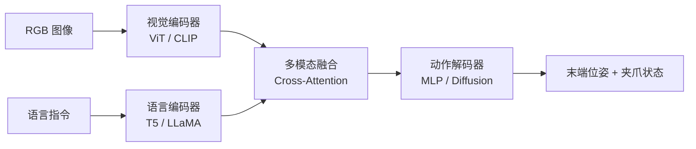

# 具身智能与机器人

具身智能（[[Embodied AI]]）是人工智能从"虚拟思考者"走向"物理行动者"的关键路径。其核心主张是：真正的智能在与物理环境的持续互动中涌现，而非仅靠数据驱动。本页面聚合具身智能的基础理论、[[视觉语言动作模型]]（VLA）架构设计、仿真与真机部署，以及 [[Reachy Mini]] 机器人的完整开发实践。

## 核心定义

具身智能 = 智能的大脑 + 行动的身体

与传统 AI 系统（对话模型、图像生成器）不同，具身智能体必须拥有物理"身体"，通过传感器感知环境、通过执行器影响环境，在互动中学习和决策。这背后是一场范式转变：从"缸中之脑"到"身心合一"。

## 三要素架构

具身智能系统包含三个不可或缺的核心组件：

1. **身体（Body）**：物理形态 + 传感器（摄像头、激光雷达、触觉）+ 执行器（电机、机械臂、轮子）
2. **大脑（Brain）**：深度学习、强化学习、大语言模型等 AI 算法，负责感知、决策和行动
3. **环境（Environment）**：智能体所处的物理世界，充满不确定性、动态变化和复杂物理规律

## 发展历程

### 第一阶段：先驱时代（20 世纪中叶 - 20 世纪末）

[[控制论]]创始人诺伯特·维纳提出机器与环境交互的构想。1966-1972 年，[[斯坦福研究院]]研制的世界第一台移动机器人 **Shakey** 首次将感知、推理和行动整合，被誉为具身智能的"始祖"。

### 第二阶段：深度学习赋能（21 世纪初 - 2020 年）

[[计算机视觉]]赋予机器人"眼睛"，[[强化学习]]让机器人通过"试错"学习复杂技能。[[波士顿动力]]（Boston Dynamics）的 Atlas 机器人展示了运动控制和平衡能力的惊人高度。

### 第三阶段：大模型开启新纪元（2021 年 - 至今）

大语言模型（[[LLM]]）为具身智能带来"常识"和推理能力：

- **Google [[RT-2]]**：首次将视觉-语言模型直接迁移到机器人控制，实现端到端[[视觉语言动作模型]]（VLA）
- **特斯拉 Optimus**：利用[[自动驾驶]]积累的视觉感知和 AI 计算能力打造通用人形机器人
- **Figure AI × OpenAI**：将 [[ChatGPT]] 的对话和推理能力集成到 Figure 01 机器人

## 机器人学基础

### 坐标变换与齐次矩阵

描述物体在空间中的位姿是机器人学的基础。使用 $4 \times 4$ 齐次变换矩阵 $T$ 将旋转 $R$（$3 \times 3$）和平移 $P$（$3 \times 1$）统一：

$$ T = \begin{bmatrix} R & P \\ 0 & 1 \end{bmatrix} $$

在无人机和机器人应用中，通常使用"坐标轴旋转"模式——已知机体旋转角度，求同一点在新坐标系下的表示。

### DH 参数与运动学

[[Denavit-Hartenberg]]（DH）参数法是描述机器人连杆间几何关系的标准方法。每个连杆由四个参数定义：$a_i$（连杆长度）、$\alpha_i$（连杆扭转角）、$d_i$（连杆偏距）、$\theta_i$（关节角）。通过 DH 参数构建相邻连杆间的变换矩阵，实现从关节空间到[[笛卡尔空间]]的运动学正解。

### 动力学方程

机器人动力学研究力和运动的关系：

$$ M(q) \ddot{q} + C(q, \dot{q}) \dot{q} + G(q) = \tau $$

其中 $M(q)$ 为惯性矩阵，$C(q, \dot{q})$ 为科里奥利和离心力项，$G(q)$ 为重力项，$\tau$ 为关节力矩。

## 视觉语言动作模型（VLA）

[[视觉语言动作模型]]（Vision-Language-Action, VLA）是具身智能领域的核心范式，将[[视觉感知]]、语言理解和动作生成端到端集成。

### 架构组件



#### 视觉编码器

| 架构 | 特点 | 适用场景 |
|------|------|------|
| ViT | 全局注意力 | 通用机器人操作 |
| CLIP ViT | 视觉-语言预对齐 | 开放场景理解 |
| DINOv2 | 自监督预训练 | 少样本学习 |
| EfficientNet | 高效轻量 | 边缘部署 |

#### 语言编码器

| 架构 | 特点 | 适用场景 |
|------|------|------|
| T5 | 编码器-解码器 | 复杂指令理解 |
| LLaMA / Phi | 自回归 | 长指令上下文 |
| BERT | 双向编码 | 指令理解 |

#### 多模态融合策略

| 策略 | 优点 | 缺点 |
|------|------|------|
| Concatenation | 简单直接 | 缺乏交互 |
| Cross-Attention | 强交互 | 计算量大 |
| FiLM | 轻量化 | 灵活性较低 |
| Transformer | 端到端 | 计算量大 |

#### 动作解码器

| 架构 | 特点 | 适用场景 |
|------|------|------|
| MLP Head | 简单直接 | 单步动作 |
| Transformer Decoder | 自回归生成 | 轨迹序列 |
| Diffusion Model | 概率生成 | 多样化动作 |
| VAE | 隐空间规划 | 规划与控制解耦 |

### VLA 模型演进

#### 开山时代：Google 的霸权

- **[[RT-1]]**：将机械臂动作映射为离散 Token，用 Transformer 端到端训练，开启 VLA 时代
- **[[RT-2]]**：将 550 亿参数的多模态语言模型接入机器人，涌现出类似人类的"思维链"
- **[[RT-X]]**：联合全球机构打造的跨具身数据集与权重，解决"换个机械臂就不会动"的痛点

#### 开源爆发时代

- **[[Octo]]**：伯克利和斯坦福打造，无 LLM 包袱，纯 Transformer + 扩散模型，推理速度最快
- **[[OpenVLA]]**：基于 Llama 2（7B）的开源六边形战士，创业公司和实验室首选
- **[[RoboFlamingo]]**：外挂显式策略头，记住历史多帧画面，处理长线任务稳定

#### 细分进化时代

- **[[SpatialVLA]]**：注入 Ego3D 深度位置编码，突破 2D 限制，精密抓取成功率跨越式提升
- **[[SmolVLA]]**：仅 450M 参数，通过极致压缩让普通笔记本电脑就能训练家用机械臂
- **[[SwiftVLA]]**：引入 4D streamVGGT 时空特征，学会"预判"物体运动轨迹

#### 工业收割时代

- **[[GR00T N1.5]]**：NVIDIA 工业级方案，大量吸收仿真合成数据，16 层流匹配 Transformer
- **[[GR00T N1.6]]**：搭载 Cosmos Reason 推理大模型，具备"System 2"慢思考能力，32 层动作预测头
- **[[HoloBrain-0]]**：将 URDF 动力学描述和相机内外参作为显式输入，实现极强跨具身通用性

### 训练策略

VLA 模型采用三阶段预训练框架：

1. **多模态对齐预训练**：视觉-语言对齐（对比学习、掩码建模）
2. **机器人行为预训练**：大规模机器人数据的行为克隆
3. **下游任务微调**：LoRA / Adapter 等轻量微调策略

[[LoRA]] 微调仅更新 ~1% 参数（为目标模块添加低秩投影 $A$ 和 $B$），在数据有限场景下实现高效适配。[[PEFT]] 库提供了 LoRA 的标准实现。

## 具身世界模型

[[世界模型]]（[[World Model]]）让智能体在"脑海"中模拟环境，通过预测未来状态进行规划。其核心价值在于样本效率、安全探索和[[长程规划]]能力。

### 表征崩溃问题

世界模型训练中的核心难题是**表征崩溃**（Representation Collapse）——编码器将所有输入映射为同一常数向量（如全 0），使预测误差人为降低，但特征完全失去区分度。

### LeWorldModel 的 SIGReg 解法

[[LeWorldModel]]（LeWM）通过**随机投影 + 一维正态性检验**（[[SIGReg]]）从根本上解决表征崩溃：

- 在 $d$ 维特征空间随机选取 $M$ 个方向，将高维特征投影到一维
- 对每组一维数据执行 Epps-Pulley 正态性检验
- 逼着特征在所有投影方向上符合正态分布，从而保证高维特征空间的正态性

基于 Cramér–Wold 定理：若高维数据在所有一维投影方向上都符合正态分布，则其本身必为高维正态分布。这使得模型无法通过"输出常数"来走捷径。

## 仿真环境与真机部署

### 仿真平台对比

| 平台 | 特点 | 适用场景 |
|------|------|------|
| [[MuJoCo]] | 轻量、快速、跨平台 | 入门、轨迹规划与控制 |
| [[Isaac Sim]] | 高保真光线追踪、并行数千环境 | 大规模训练、合成数据 |
| [[Habitat]] | 高速导航仿真、Matterport3D 场景 | VLN、PointNav |
| [[GenieSim]] | 高保真、一键启动 | Pi0 等模型部署 |

### MuJoCo 快速开始

```bash
pip install mujoco
python examples/01_hello_every_embodied_mujoco.py
```

MuJoCo 安装简单、跨平台（Windows / Linux / macOS），物理仿真稳定，是具身智能入门的首选。

### 真机部署：Reachy Mini

[[Reachy Mini]] 是 [[Pollen Robotics]] 推出的轻量级人形机器人，采用客户端-服务器架构：

- **守护程序（Daemon）**：后台服务，直接控制电机、传感器、摄像头和音频
- **Python SDK**：`reachy_mini` 包，支持 `with ReachyMini() as mini:` 上下文管理
- **仿真支持**：`reachy-mini-daemon --sim` 启动 MuJoCo 仿真，无需实体硬件

#### 运动控制

头部具有 6 个自由度（X/Y/Z 平移 + Roll/Pitch/Yaw 旋转），天线以弧度制 `[右, 左]` 指定。`goto_target()` 方法实现[[平滑运动]]，支持组合头部姿态与天线位置创造丰富表情。

#### 视觉与音频交互

- **摄像头**：`mini.media.get_frame()` 获取 [[BGR]] 格式帧
- **麦克风**：[[ReSpeaker]] 4 麦克风阵列，16 kHz 采样率
- **音频播放**：`push_audio_sample()` 逐块推送，支持生成正弦波提示音
- **情感库**：81 种预录情感动作，通过 `RecordedMoves` 加载和播放

#### 开发最佳实践

- 始终使用 `with` 语句管理连接
- 实验时从较长持续时间（1-2 秒）和小角度（5-10 度）开始
- 每次运动之间回到中立位置
- 优先在仿真环境中测试后再上真机

## 视觉语言导航（VLN）

[[视觉语言导航]]（Vision-Language Navigation, VLN）要求智能体根据自然语言指令，在视觉引导下导航到目标位置。核心挑战包括语言-视觉对齐、[[部分可观测性]]、长程规划和环境泛化。

### ETPNav

[[ETPNav]]（Evolving Topological Planning）是 VLN-CE 领域的强力 Baseline，解决了长距离规划和避障问题：

1. **在线拓扑建图**：自组织沿途预测的路点，动态构建拓扑地图
2. **鲁棒避障**：基于试错启发式的 Tryout 控制器，防止连续环境中碰撞死锁

## 数据集与基准

### LIBERO

[[LIBERO]] 是面向终身学习的机器人操作基准，分为四个任务套件：

| 数据集 | 任务数 | Episodes | 平均长度 | 测试目标 |
|--------|-------|---------|---------|------|
| libero_10 | 10 | 379 | 267.7 | 长程时序推理 |
| libero_goal | 10 | 428 | 121.6 | 目标状态多样性 |
| libero_object | 10 | 454 | 147.5 | 物体泛化 |
| libero_spatial | 10 | 432 | 122.6 | 空间布局鲁棒性 |

### Open X-Embodiment

谷歌联合多家机构构建的跨具身数据集，包含 1M+ 轨迹、20+ 机器人平台，是 VLA 模型预训练的核心数据源。

## 核心挑战与未来方向

### 当前挑战

1. **[[Sim-to-Real]] 鸿沟**：仿真训练的模型迁移到现实世界时性能下降
2. **[[数据稀缺]]**：高质量机器人交互数据昂贵且难以获取
3. **[[泛化能力]]**：面对新物体和新环境时的决策可靠性
4. **[[安全性]]与伦理**：拥有物理能力的 AI 系统的行为安全可控

### 未来方向

- **更好的世界模型**：准确预测更长时间跨度的环境演化
- **自监督学习**：从大量无标注视频中学习物理规律
- **轻量化 VLA**：SmolVLA、SwiftVLA 等证明小模型也能实现高效能
- **多机器人协作**：多个智能体之间的有效协调与任务分配

## 产业级平台与开源生态

具身智能从实验室走向产业落地，依赖完整的工具链、数据工厂与开放生态。本节汇聚华为云、北京智源（BAAI）、NVIDIA、Google、HuggingFace 等代表性机构的方案，以及 [[Reachy Mini]] 真机开发的工程实践。

### 华为云：盘古具身智能大模型

[[华为云]]围绕**盘古具身智能大模型**构建了一体化开发平台与工具链，重点解决复杂任务规划与执行问题。其技术路线强调[[大模型]]在[[智能制造]]和[[物流分拣]]等场景的落地，通过一体化平台打通从数据标注、模型训练到部署推理的全流程。核心思路是以基础大模型为中枢，将感知、规划、控制统一到同一框架下，降低行业客户构建具身系统的工程门槛。

### 北京智源研究院（BAAI）

[[北京智源人工智能研究院]]（BAAI）自 2018 年起推动人工智能原始创新，先后推出**悟道**（语言大模型）、**悟界**（具身智能）系列成果，以及 **FlagOpen** 开放平台。其在具身智能领域的布局覆盖基础模型、操作系统与跨本体协作框架，代表作为 [[RoboOS]] 2.0 与 [[OpenComplex2]]（生命科学方向）。智源大会已成为具身技术与产业应用的重要交流平台。

#### RoboOS：跨本体大小脑协作

[[RoboOS]] 是智源发布的跨本体具身大小脑协作框架，针对长程任务规划与跨本体协作的不足，提出"具身大脑 + 具身小脑"双层架构：

- **具身大脑**：负责全局感知与任务决策，基于大模型理解场景并分解子任务
- **具身小脑**：提供即插即用的技能库，负责底层运动控制与执行
- **共享记忆系统**：在空间和时间维度上实现数据中心化，支持多机器人、多任务场景下的经验复用
- **云端协同**：通过云边协同调度，提升任务分解与执行的准确性

该框架体现了[[多机器人协作]]从"单机自主"走向"群体智能"的关键转变。

#### InsightOS：机器人智能操作系统

[[具识智能]]（Insight Robotics）研制的 **InsightOS** 定位机器人智能操作系统，由**具身智能代理（EAP）** 与**集成开发环境（IDE）** 两部分组成，类比安卓系统在移动端的角色。InsightOS 强调提高开发效率、处理运行异常和优化现场调度，已适配多种机器人型号，面向制造业与家庭场景的智能化需求。其架构表明[[机器人操作系统]]（[[ROS]]）正从分布式中间件演进为以 AI 为核心的统一调度平台。

### NVIDIA Isaac GROOT N1：人形机器人基础模型

[[NVIDIA]] 的 **Isaac GROOT N1** 是面向[[人形机器人]]的具身基础模型，遵循三大核心原则：**泛化能力**、**双系统架构**（高层认知 + 低层控制）和**数据金字塔**（现实数据 + 合成数据 + 网络数据）。

#### 数据工厂：从人类演示到合成数据

GROOT 的数据工厂（Data Factory）构建了从人类演示到大规模合成训练数据的完整流水线：

1. **GR00T-Teleop**：人类操作员在 [[Isaac Lab]] 虚拟环境中进行动作演示，实时记录控制信号与机器人状态
2. **GR00T-Mimic**：利用 Motion Annotator 动作标注 + Isaac Lab 加速物理引擎生成海量轨迹，Trajectory Evaluator 验证物理可行性
3. **GR00T-Gen**：将验证后的 3D 轨迹导入 [[Isaac Sim]]，结合 [[Cosmos]]（NVIDIA 生成式世界基础模型）生成高保真视频数据

[[Omniverse]] 基于 OpenUSD 标准构建工业数字化平台，创建遵循物理定律的[[数字孪生]]场景；**Cosmos** 作为物理 AI 专用的世界基础模型，理解重力、光影等物理规律，将 3D 草图或简单视频扩增为逼真的感官训练数据。

#### 训练与微调策略

GROOT N1 推荐**收集真实数据的同时生成对应比例的模拟数据**，通过[[Sim-to-Real]]混合训练提升模型在真实世界的适应性。这一策略与[[世界模型]]驱动的数据生成范式一脉相承。

### Google Gemini Robotics On-Device

[[Google]] 的 **Gemini Robotics On-Device** 是基于设备端 [[Gemma]] 模型的[[视觉语言动作模型]]（VLA），专为本地设备高效运行设计，支持通用机器人操作。

#### 核心能力

- **输入**：文本指令、图像、机器人本体感受数据
- **输出**：机器人动作数值
- **训练硬件**：[[TPU]]（Tensor Processing Units），使用 [[JAX]] 和 ML Pathways 框架
- **数据处理**：去重、安全过滤、质量过滤，符合谷歌负责任 AI 承诺

#### 性能表现

在 Gemini Robotics 基准测试中，On-Device 模型在**泛化**和**指令遵循**方面与旗舰 Gemini Robotics 模型表现接近，在**快速适应**方面——使用不到 100 个示例的七项灵巧操作任务上——优于当时最佳的设备端 VLA 模型。这标志着端侧[[机器人学习]]在保持云模型能力的同时，向低延迟、隐私保护方向迈进。

### LeRobot：开源端到端机器人学习

[[LeRobot]] 由 [[HuggingFace]] 推动，在 [[PyTorch]] 中为真实世界机器人提供模型、数据集和工具，目标是降低机器人技术入门门槛。其核心聚焦[[模仿学习]]与[[强化学习]]：

- 提供预训练模型与人类演示数据集
- 支持模拟环境与真实机器人（如 SO-100/SO-101 机械臂）
- 社区共享数据集与预训练权重（huggingface.co/lerobot）

LeRobot 代表了具身智能开源生态的重要力量，与 [[OpenVLA]]、[[Octo]] 等共同推动 VLA 技术的民主化。

## 具身智能全链路解决方案

从数据到部署的完整工作流，可概括为五个环节：

### 1. 动作捕捉

采集人类原始动作数据的两条技术路线：

- **惯性动捕**（如 PN Studio）：成本低、易用、环境适应性强
- **光学动捕**（如 HybridTrack）：鲁棒性强、精度极高

### 2. 数据处理与本体映射

捕捉信号经 Axis Studio 或 Hybrid Data Server 处理，输出高精度动捕数据、6DOF 数据、原始加速度（ACC）与陀螺仪（GYRO）数据，并支持 MocapApi、VRPN、Isaac 插件等接口。**重定向（Retargeting）** 算法将人类骨架运动映射到机器人 [[URDF]] 模型上，确保动作符合物理结构约束。

### 3. 仿真与训练

核心软件生态包括 [[C++]]/[[Python]]、[[ROS]] 中间件、[[NVIDIA ISAAC]] 仿真平台。[[MuJoCo]] 与 [[Isaac Sim]] 分别承担轻量入门与大规模高保真训练的角色。

### 4. 本体执行与数据资产

最终应用于[[人形机器人]]、[[机械臂]]、[[灵巧手]]、[[仿生机器人]]（四足等），同时沉淀为大规模[[机器人训练数据集]]，形成数据飞轮。

## 具身智能 Scaling Laws

与语言模型遵循 Scaling Law 类似，具身智能领域正在探索模型性能随数据量、参数量、计算量增长的规律。研究表明，跨具身数据规模、仿真合成数据比例、真实数据多样性是影响 VLA 泛化能力的关键因素。[[Open X-Embodiment]] 等大规模跨具身数据集的出现，为具身 Scaling Laws 的验证提供了数据基础。

## 飞行机器人：从物理智能到具身智能

[[飞行机器人]]（[[UAV]]/[[Drone]]）代表了具身智能从地面走向空域的重要方向。其研究方向包括：

- **全状态轨迹生成**：在复杂环境下在线规划飞行轨迹
- **动态环境感知与建模**：低延迟动态感知系统
- **全自主微型无人机集群**：[[Swarm Robotics]] 协作

飞行机器人的演进路径体现了从"数学驱动"到"数据驱动"的转变——传统方法依赖精确动力学模型，而具身智能方法通过数据驱动实现更强大的[[涌现智能]]，使无人机在未知环境中具备自适应能力。

## 物理 AI 的产业视角

[[Physical AI]] 是具身智能在工业界的统称，涵盖机器人、自动驾驶、智能设备等方向。2026 年 CES 等产业大会显示，[[NVIDIA]]、[[吉利]]（Geely）等企业正将物理 AI 作为战略方向，将[[自动驾驶]]积累的视觉感知和 AI 计算能力迁移至机器人领域。这进一步模糊了自动驾驶与具身智能的技术边界，[[端到端]]学习、[[世界模型]]、[[多模态感知]]成为共同的技术底座。

## Reachy Mini 真机开发实践

[[Reachy Mini]] 的到手开发深化了具身智能系统的工程认知，重点涉及硬件架构、系统运维与开发工作流。

### 硬件架构

Reachy Mini 由 [[Pollen Robotics]] 研制，分 Wireless（$449）和 Lite（$299）两个版本。核心配置包括：

- **自由度**：头部 6 DOF（Stewart 平台，6 个 Dynamixel XL330-M288-T）+ 机身旋转 1 DOF（XC330-M288-PG）+ 天线 2 DOF（XL330-M077-T），共 9 个伺服电机
- **算力**：[[树莓派]] CM4（4GB 内存 + 16GB 闪存），运行 64 位 Linux 内核 6.12（Debian）
- **感知**：索尼 IMX708 1200 万像素广角摄像头（自动对焦）、4 麦克风阵列（reSpeaker XMOS XVF3800，16kHz 采样率）
- **电源**：磷酸铁锂电池 2000mAh（6.4V / 12.8Wh），具备过充/过放/过流/短路/温度保护

### 系统运维要点

- **守护进程**（`reachy-mini-daemon.service`）：后台服务控制电机与传感器，开机默认禁止自动唤醒（`--no-wake-up-on-start` 参数），需手动删除该参数启用
- **关机安全**：物理按键关机直接调用内核断电，绕过 systemd，导致机器人未执行 `goto-sleep` 就砸下来。推荐通过 systemd 依赖链（`Before=shutdown.target` + `Conflicts=shutdown.target`）让守护进程先优雅停止
- **时区同步**：默认 `Europe/London`，需通过 `timedatectl set-timezone Asia/Shanghai` 与 `set-ntp true` 配置
- **控制环路**：约 20ms 周期（~50Hz），读取 ~1.95ms，写入 ~0.08ms

### 开发工作流

推荐三种跨平台开发方案：

- **方案 A（推荐）**：代码存机器人端，通过 [[SSHFS]] 挂载到本地编辑，`pip install -e .` 可编辑安装
- **方案 B**：本地源码挂载覆盖机器人 site-packages 已安装应用
- **方案 C**：本地源码挂载到机器人直接运行，适合快速测试

无线版不支持 USB-C 直连电脑，需通过 Wi-Fi 或 USB-C 转以太网适配器连接。SSH 免密登录通过 `scp ~/.ssh/id_rsa.pub` 到机器人 `authorized_keys` 实现。

## 2025 年具身智能发展回顾

2025 年是具身智能从技术探索走向产业落地的关键年份。技术层面，[[VLA]] 模型架构持续演进，从 [[RT-1]]/[[RT-2]] 的端到端范式，到 [[OpenVLA]]、[[π0]] 等开源爆发，再到 [[GR00T N1]]、[[HoloBrain-0]] 等工业级方案，呈现出"双系统架构 + 数据金字塔 + 世界模型驱动"的收敛趋势。工程层面，[[LeRobot]]、[[RoboOS]] 等开源框架降低了研发门槛，而华为云、NVIDIA 等产业平台则推动工具链一体化。

与此同时，[[氛围编程]]（Vibe Coding）的兴起让 AI 辅助开发从代码补全走向系统级构建，[[Claude Code]]、[[MCP]] 等智能体工具链正重塑软件与机器人系统的开发范式。具身智能与智能体的融合，预示着"能思考、能行动、能构建"的下一代 AI 系统正在形成。

## 相关技术

- [[计算机视觉与目标检测]]：具身智能的视觉感知基础
- [[语音与音频处理]]：机器人语音交互能力
- [[Jetson 与边缘计算]]：端侧机器人算力平台
- [[LLM 部署与开源生态]]：VLA 模型中的语言大模型组件
- [[微调与模型训练]]：LoRA 等高效微调策略
