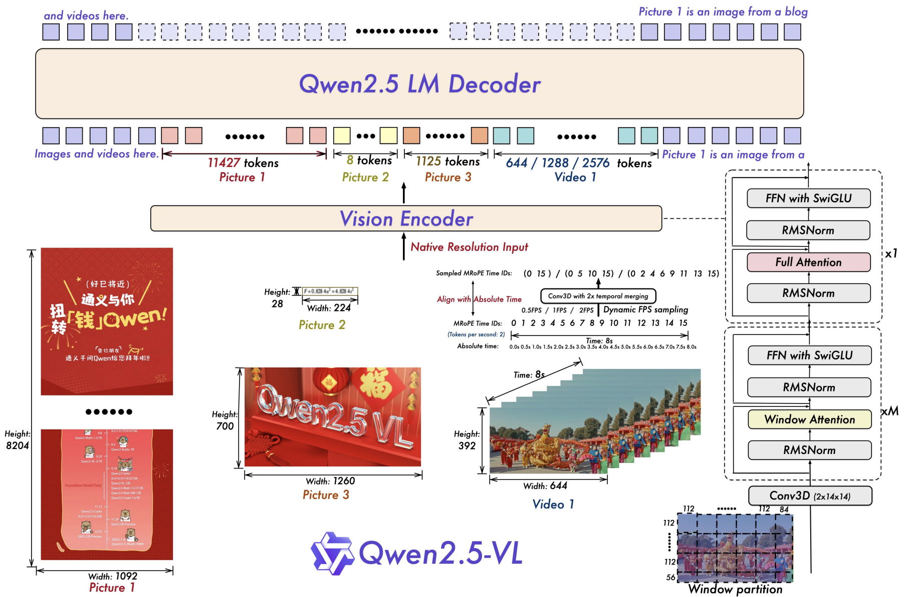
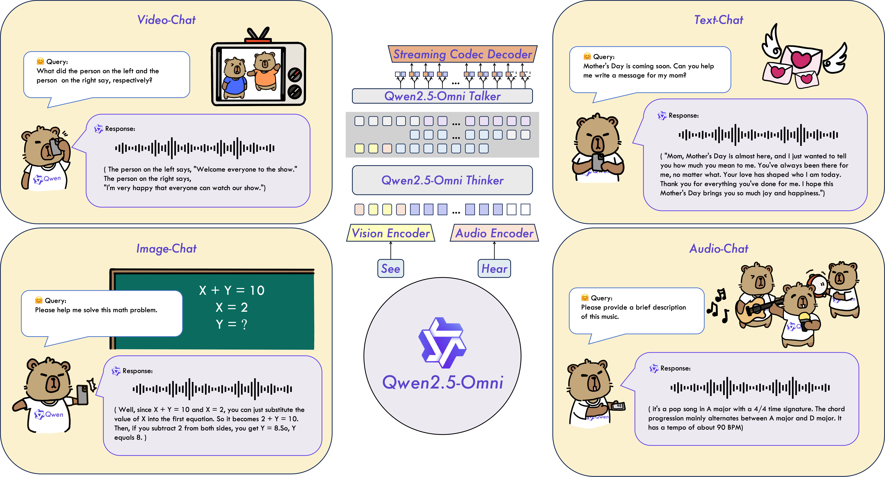
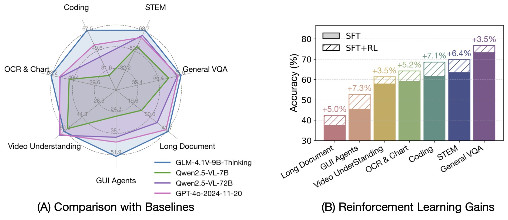
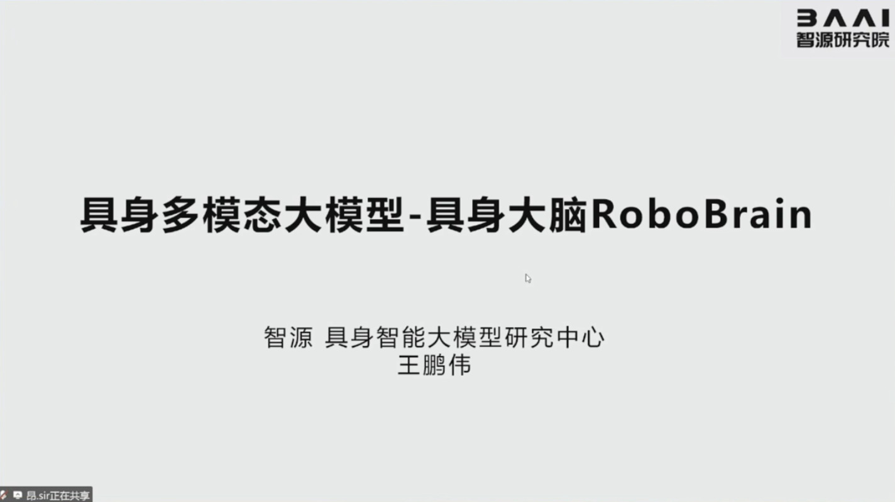
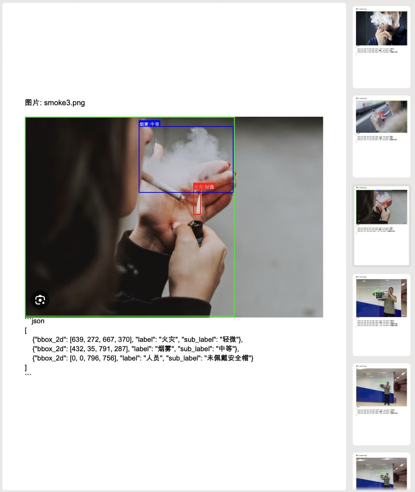

# 多模态大模型

多模态大模型（Multimodal Large Language Model, MLLM）是融合视觉感知、语言理解与跨模态推理的下一代 AI 基座。与纯文本 [[LLM]] 不同，这类模型原生支持图像、视频、音频等多种输入模态，在 [[文档解析]]、[[视频理解]]、[[视觉定位]]、[[智能体]] 操作乃至 [[具身智能]] 等场景中展现出通用化的潜力。本页面围绕四条技术主线展开：Qwen2.5-VL 系列在视觉-语言任务上的系统性突破、Qwen2.5-Omni 的端到端全模态架构、智源 [[RoboBrain]] 面向具身智能的具身大脑设计，以及 GLM-4.1V-Thinking 通过强化学习驱动的视觉推理范式。

## 1. 架构演进：从拼接到原生

早期视觉-语言模型普遍采用"视觉编码器 + 投影器 + LLM"的三件套范式，存在训练与推理阶段计算负载失衡、原生分辨率丢失、时序建模薄弱等结构性瓶颈。Qwen2.5-VL 通过四项关键创新重塑了这一架构：

1. **Window Attention（窗口注意力）**——在视觉编码器（ViT）的大多数层中引入窗口注意力，仅保留四层全局自注意力，使计算复杂度随 patch 数量呈线性而非二次增长，同时保持原生分辨率处理能力。
2. **动态 FPS 采样**——将动态分辨率从空间维度扩展到时间维度，模型自适应可变帧率输入，配合绝对时间编码实现秒级事件定位。
3. **MRoPE 对齐绝对时间**——多模态旋转位置嵌入（MRoPE）的时间分量从"帧序号"升级为"绝对时间戳"，使模型能够理解不同 FPS 采样率下的节奏与时长。
4. **预训练语料规模跃升**——预训练 token 从 1.2 万亿扩展到约 4.1 万亿，覆盖交错图文、OCR、定位、文档解析、视频描述与智能体交互等多元数据类型。

这一架构在三个规模上落地：Qwen2.5-VL-3B、7B 与 72B，旗舰 72B 在 MMMU、MathVista、OCRBench、ScreenSpot 等基准上对标 GPT-4o 与 Claude 3.5 Sonnet，小模型在资源受限环境中仍保持竞争力。



## 2. 核心能力图谱

### 2.1 文档全解析（Omni-Document Parsing）

[[Qwen2.5-VL]] 将文本识别升级为全文档解析，单模型统一处理布局分析、文本提取、图表解读与插图的全部流程。训练阶段合成大规模文档数据，将表格、公式、乐谱、化学分子式等多元元素统一编码为 HTML 标签结构，并按照阅读顺序附带模块坐标。在 OmniDocBench、CC-OCR、OCRBench_v2 等综合基准上，72B 模型在英文与中文赛道分别超越 Gemini 1.5-Pro 9.6% 与 20.6%。

### 2.2 精确视觉定位

模型同时解锁基于边界框（Box）与点（Point）的定位能力，并支持开放词汇检测与计数：

- **Box Grounding**：ODinW-13 数据集上达到 43.1 mAP，逼近专用检测模型。
- **Point Grounding**：突破边界框对细节表达的局限，实现基于点的精确定位。
- **计数能力**：CountBench 上采用"先检测再计数"策略，准确率达 93.6。

### 2.3 超长视频理解

通过动态 FPS 采样与绝对时间编码，Qwen2.5-VL 原生支持长达数小时的视频输入，并在 LVBench、MLVU、Charades-STA 等长视频与时间定位基准上显著超越 GPT-4o。推理阶段单视频最多分析 768 帧、视频 token 上限 24,576。

### 2.4 智能体操作

凭借卓越的定位与推理能力，Qwen2.5-VL-72B 在 GUI 智能体 benchmark 上表现突出：

| 基准 | Qwen2.5-VL-72B | 对比基线 |
| :--- | :--- | :--- |
| ScreenSpot | 87.1% | Gemini 2.0: 84.0%, Claude: 83.0% |
| ScreenSpot Pro | 43.6% | Aguvis-72B: 23.6%, Qwen2-VL-72B: 1.6% |

在 AndroidWorld、MobileMiniWob++、OSWorld 等在线评估中，即使不借助 Set-of-Mark 辅助标记，模型仍能独立完成真实设备操作。

## 3. Qwen2.5-Omni：端到端全模态架构

[[Qwen2.5-Omni]] 是 Qwen 系列首个端到端多模态大模型，采用全新的 **Thinker-Talker 架构**，统一处理文本、图像、音频、视频输入，并以流式方式同步生成文本与自然语音输出。

### 3.1 架构设计

- **Thinker（思考器）**：负责多模态理解与推理，承担跨模态融合的核心计算。
- **Talker（表达器）**：负责将 Thinker 的内部表征转化为流式语音输出。
- **TMRoPE（Time-aligned Multimodal RoPE）**：原创位置编码技术，通过时间轴对齐实现视频与音频输入的精准同步。

### 3.2 关键特性

- **实时音视频交互**：支持分块输入与即时输出，满足实时对话场景的低延迟需求。
- **自然语音生成**：在语音自然度与稳定性上超越多数流式/非流式替代方案。
- **全模态性能优势**：音频能力优于同规模 Qwen2-Audio，视觉能力与 Qwen2.5-VL-7B 持平。
- **端到端语音指令跟随**：在 MMLU、GSM8K 等纯文本基准上，语音输入与文本输入效果相当。

模型提供 3B 参数规模，可通过 [[HuggingFace]] Transformers 与 `qwen-omni-utils` 库部署，支持语音到语音的端到端推理。



## 4. GLM-4.1V-Thinking：强化学习驱动的视觉推理

[[GLM-4.1V-Thinking]] 基于 GLM-4-9B-0414 基座模型，通过 **课程采样强化学习（RLCS, Reinforcement Learning with Curriculum Sampling）** 全面提升模型能力，在 18 个基准任务中持平甚至超越参数量 8 倍的 Qwen-2.5-VL-72B。

### 4.1 Design2Code：设计图到代码

模型在设计图转代码任务上表现卓越，能够将 UI 设计稿高质量转换为 HTML/CSS 代码。与 Qwen2.5-VL-32B-Instruct 的对比评估显示：

| 评估维度 | GLM-4.1V-9B-Thinking | Qwen2.5-VL-32B-Instruct |
| :--- | :--- | :--- |
| 设计忠实度 | 中高，整体布局与色彩保留良好 | 波动大，复杂设计易失败 |
| 文本内容保留 | 高，绝大部分数据准确提取 | 高，偶有少量遗漏 |
| 生产代码适用性 | 更佳，提供稳定可用的代码基线 | 一般，复杂设计需大量重构 |

### 4.2 坐标归一化注意事项

实际部署中发现，GLM-4V 系列模型在处理图片时以 1000×1000 分辨率进行内部推理，但输出的边界框坐标未自动映射回原图坐标系。调用方需自行实现坐标缩放，这一点与 Qwen2.5-VL 直接输出原图坐标的行为不同，是工程落地时的重要差异。



## 5. RoboBrain：具身多模态大模型

[[RoboBrain]] 由智源人工智能研究院开发，是面向 [[具身智能]] 的具身多模态大模型，聚焦于复杂长期操作任务中的端到端决策。

### 5.1 三大核心能力

1. **任务规划（Task Planning）**：将高层指令分解为可执行的多步操作序列。
2. **可操作区域感知（Operable Area Perception）**：理解场景中机器人可交互的空间区域。
3. **轨迹预测（Trajectory Prediction）**：生成连续、平滑且物理可行的运动轨迹。

### 5.2 训练数据与策略

模型基于 **ShareRobot 数据集** 进行训练，该数据集涵盖多任务、多场景的机器人操作数据。训练策略强调从抽象指令到具体动作的端到端映射，使模型能够桥接高层推理与低层控制。在多项具身操作基准测试中，RoboBrain 超越现有模型表现。

RoboBrain 代表多模态大模型从"屏幕中的理解"走向"物理世界的行动"的关键一步，与 [[视觉语言动作模型]]（VLA）范式深度衔接。



## 6. 部署实践：从下载到服务

### 6.1 模型获取

- **ModelScope**：通过 `modelscope download` 命令下载 Qwen2.5-VL-3B/7B-Instruct。
- **HuggingFace**：通过 `git clone` 获取 Qwen2.5-Omni-3B 权重。
- **智谱 API**：通过 ZhipuAI SDK 免费调用 GLM-4.1V-Thinking。

### 6.2 vLLM 服务化部署

使用 [[vLLM]] 部署 Qwen2.5-VL，可开启 OpenAI 兼容的 API 服务：

```bash
vllm serve /path/to/Qwen2.5-VL-7B-Instruct \
    --served-model-name Qwen2.5-VL \
    --max-model-len 32000
```

多 GPU 张量并行配置：

```bash
python -m vllm.entrypoints.openai.api_server \
    --model /path/to/Qwen2.5-VL-7B-Instruct \
    --tensor-parallel-size 4 \
    --dtype=float16 \
    --max-model-len 32000
```

> ⚠️ 默认上下文长度 128000 易在初始内存分析阶段触发 OOM，建议将 `--max-model-len` 下调至 32000 以平衡性能与显存占用。

## 7. 典型应用：安全检测系统

多模态大模型在工业安全检测场景中展现出实用价值。基于 Qwen2.5-VL 与 GLM-4.1V-Thinking 均可构建安全检测系统，功能包括：

- **目标检测**：识别图像中的火灾、烟雾与人员安全帽佩戴情况。
- **坐标定位**：以 `bbox_2d` 格式输出目标边界框坐标。
- **可视化标注**：在原始图像上绘制检测框与标签（红色=火灾，蓝色=烟雾，绿色=人员）。
- **报告生成**：将检测结果自动整理为 PDF 文档。



该应用验证了多模态大模型从感知到结构化决策的端到端能力，可复用于巡检、安防、质检等场景。

## 8. 模型对比总览

| 模型 | 规模 | 核心模态 | 架构创新 | 代表性能力 |
| :--- | :--- | :--- | :--- | :--- |
| [[Qwen2.5-VL]] | 3B/7B/72B | 图像+视频+文本 | Window Attention + 动态 FPS + MRoPE 绝对时间 | 文档全解析、超长视频理解、GUI 智能体 |
| [[Qwen2.5-Omni]] | 3B | 文本+图像+音频+视频 | Thinker-Talker + TMRoPE | 流式语音生成、实时音视频交互、端到端语音指令跟随 |
| [[GLM-4.1V-Thinking]] | 9B | 图像+文本 | RLCS 强化学习 | Design2Code、视觉推理、18 项基准对齐 72B 模型 |
| [[RoboBrain]] | — | 视觉+语言+动作 | 具身大脑统一模型 | 任务规划、可操作区域感知、轨迹预测 |

## 9. 技术趋势与权衡

多模态大模型的发展正沿着几条主线推进：

1. **原生多模态**——从"拼接式"走向"原生统一"，端到端架构减少模态间信息损失。
2. **感知精细化**——从粗粒度分类走向像素级定位、文档级解析、秒级事件定位。
3. **推理增强**——通过 [[强化学习]]（如 RLCS）与思维链蒸馏，以更小参数量逼近大模型性能。
4. **具身延伸**——从屏幕理解走向物理世界操作，与 [[具身智能]]、[[视觉语言动作模型]] 深度融合。
5. **效率优化**——Window Attention、动态分辨率、动态 FPS 等技术在不牺牲原生分辨率的前提下控制计算开销。

核心权衡（Trade-off）在于：原生分辨率与动态输入带来的保真度提升，与计算复杂度、显存占用之间的持续博弈。Qwen2.5-VL 的窗口注意力与动态打包策略、Qwen2.5-Omni 的 Thinker-Talker 分工、GLM-4.1V-Thinking 的 RLCS 课程采样，均是在这一权衡下的工程最优解。

---

**相关页面**：[[具身智能与机器人]] · [[LLM-技术报告与前沿论文]] · [[视觉语言动作模型]] · [[文档解析]] · [[视频理解]] · [[智能体]]
