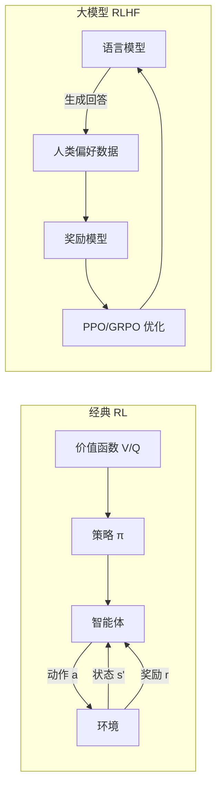

# 强化学习

强化学习（Reinforcement Learning, RL）是机器学习的一个重要分支，研究智能体（Agent）如何通过与环境的交互来学习最优行为策略。与监督学习不同，强化学习不需要标注数据，而是通过试错（Trial and Error）的方式，根据环境反馈的奖励信号（Reward Signal）来调整策略，最终学习到能够最大化长期累积奖励的行为模式。强化学习是实现通用人工智能（AGI）的关键技术路径之一，在游戏 AI、机器人控制、推荐系统、大模型对齐等领域取得了突破性成果。

强化学习的核心框架包括五个要素：智能体（Agent）、环境（Environment）、状态（State）、动作（Action）和奖励（Reward）。智能体在每个时间步观察环境状态，选择执行某个动作，环境根据动作转移到新状态并返回奖励信号。强化学习的目标是学习一个策略函数 π(a|s)，使得智能体在任意状态下选择的动作能够最大化期望累积奖励。经典的算法包括 Q-Learning、SARSA、Policy Gradient、Actor-Critic 等。近年来，深度强化学习（Deep RL）结合深度网络的表征能力，在 Atari 游戏、围棋、机器人控制等复杂任务上取得了超越人类的性能。

## 核心概念

**马尔可夫决策过程（MDP）**：强化学习的数学基础是马尔可夫决策过程，假设当前状态包含了所有历史信息（马尔可夫性质），未来状态只取决于当前状态和动作。MDP 通过状态转移概率 P(s'|s,a) 和奖励函数 R(s,a) 形式化描述强化学习问题。

**奖励与价值函数**：奖励是环境对智能体行为的即时反馈，而价值函数（Value Function）衡量从某个状态开始遵循特定策略的长期累积回报。Q 函数 Q(s,a) 表示在状态 s 执行动作 a 后的期望累积回报，是 Q-Learning 等算法的核心。

**探索与利用的权衡**：强化学习面临探索（Exploration）与利用（Exploitation）的经典权衡——智能体需要在尝试新行为（探索未知策略可能带来的更高回报）和利用已知最优行为（执行当前认为最好的动作）之间取得平衡。ε-greedy、UCB、Thompson Sampling 等是常用的探索策略。

**策略梯度与 Actor-Critic**：策略梯度方法直接优化策略函数，通过梯度上升最大化期望回报。Actor-Critic 架构同时学习策略网络（Actor）和价值网络（Critic），Critic 评估状态价值，Actor 根据 Critic 的评估调整策略，是当前主流的强化学习算法框架。

**大模型对齐中的 RLHF**：RLHF（Reinforcement Learning from Human Feedback）是将强化学习应用于大模型对齐的关键技术。通过人类偏好数据训练奖励模型（Reward Model），然后使用 PPO 等算法优化语言模型策略，使其输出符合人类偏好。DPO（Direct Preference Optimization）则通过直接优化偏好数据来绕过奖励模型的训练，简化了流程。

## 技术架构

## 应用场景

**大模型对齐与安全**：RLHF 和 DPO 是当前 LLM 对齐的主流方法，ChatGPT、Claude、Llama 2 等模型都依赖这些技术来提升有用性、降低有害输出。GRPO 是 DeepSeek-R1 等推理模型使用的强化学习算法，通过组内相对排名替代价值函数，简化了训练流程。

**游戏 AI**：强化学习在游戏 AI 领域取得了里程碑式成果。AlphaGo/AlphaZero 通过自我对弈强化学习在围棋上超越人类；OpenAI Five 在 Dota 2 中击败职业选手；DeepMind 的 AlphaStar 在星际争霸 II 中达到宗师水平。

**机器人控制**：强化学习使机器人能够通过试错学习复杂的运动和操作技能。从四足机器人的步态控制到灵巧手的抓取操作，强化学习在仿真和真实环境中都取得了显著进展，是具身智能的关键技术。

**推荐系统与广告**：强化学习在推荐系统中用于优化长期用户满意度（而非即时点击率），通过建模用户状态转移和延迟奖励来提升推荐效果。阿里巴巴、字节跳动等公司的推荐系统都深度应用了强化学习技术。

**推理模型训练**：DeepSeek-R1 等推理模型通过 GRPO 等强化学习算法，在数学和编程任务上实现了推理能力的显著提升。强化学习在此过程中激励模型生成长链推理和验证-修正行为，是推理能力涌现的关键驱动力。

## 相关概念

- [[惨痛的教训]] — 强化学习作为通用方法的重要性
- [[DeepSeek-V3]] — GRPO 在推理模型训练中的应用
- [[微调与模型训练]] — RLHF/DPO 与监督微调的结合
- [[具身智能]] — 强化学习在物理世界中的应用

## 主要页面

- [[topics/微调与模型训练]] — RLHF/DPO 对齐实践
- [[topics/LLM-技术报告与前沿论文]] — 推理模型中的强化学习前沿
- [[topics/具身智能与机器人]] — 强化学习在机器人控制中的应用
