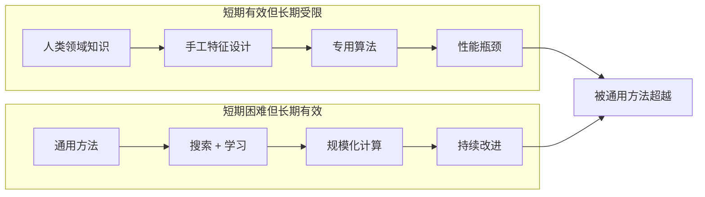

# 惨痛的教训（The Bitter Lesson）

"The Bitter Lesson"（惨痛的教训）是人工智能领域最具影响力的思想文章之一，由强化学习先驱 Rich Sutton 于 2019 年 3 月发表。Sutton 在文中总结了他观察到的 AI 研究中最深刻的历史规律：**基于人类知识和领域专长的方法，最终总是被依靠通用计算方法（搜索和学习）的规模化方法所击败**。他将这一规律称为"惨痛的教训"，因为它反复证明了人类研究者的直觉和精心设计的特征在计算力规模化面前显得苍白无力。

Sutton 回顾了 AI 研究过去 70 年的发展历程，列举了多个典型案例：在计算机视觉中，手工设计的特征（如 SIFT、HOG）被端到端的深度学习所取代；在语音识别中，精心设计的声学模型和语言模型被大规模神经网络所取代；在棋类博弈中，AlphaGo 最初依赖人类棋谱，但 AlphaGo Zero 和 AlphaZero 完全从零开始自我对弈，性能远超依赖人类知识的版本。这些案例共同指向一个方向：**通用的学习方法（如搜索和学习）随着计算量的增加而持续改进，而依赖人类特定知识的方法则会在计算力达到某个阈值后遇到瓶颈**。

## 核心洞察

**计算力碾压人类直觉**：Sutton 的核心论点是，AI 研究中最强大的驱动力是通用方法的持续改进——即那些能够随着计算量增加而持续扩展的方法。人类大脑的并行计算能力有限（约 10^15 FLOPS），而机器的计算能力每 5.6 年翻一番。当计算量足够大时，通用的搜索和学习方法能够发现人类永远无法理解的规律和策略。

**人类知识是短期最优、长期瓶颈**：人类研究者倾向于将自身对问题的理解编码到 AI 系统中（如设计特征、规则、先验知识）。这在短期内往往有效，但这些人工设计会占用模型的容量，限制了模型从数据中学习更优解的空间。Sutton 认为，我们应该寻找能够利用这种巨大计算力的方法，而不是将人类知道如何思考的内容构建到系统中。

**搜索与学习是两大通用方法**：Sutton 特别强调了两种通用计算方法——搜索（如蒙特卡洛树搜索、束搜索）和学习（如深度学习、强化学习）。这两种方法不依赖特定领域的先验知识，能够随着计算量的增加而持续改进，是 AI 长期进步的主要驱动力。

**对 AI 研究方向的启示**：惨痛的教训对 AI 研究具有深远的指导意义——研究者应该倾向于构建能够从数据和计算中学习的通用方法，而不是依赖人类手工设计的特征和规则。这一思想直接影响了深度学习时代的研究范式，推动了端到端训练、大规模预训练等技术方向的发展。

**争议与反思**：尽管惨痛的教训在深度学习时代得到了广泛验证，但也引发了一些反思。一方面，完全抛弃人类知识可能不是最高效的路径——人类先验知识（如因果推理、物理定律、逻辑规则）在某些场景下仍然具有重要价值。另一方面，当模型规模达到一定程度后，数据质量和训练方法的优化同样重要，单纯堆砌计算力并非万能。

## 技术架构

## 应用场景

**大规模预训练模型**：GPT、Claude、Llama 等大型语言模型的成功是惨痛教训的最佳印证。这些模型没有将人类语言规则（如语法、逻辑）硬编码进去，而是通过在大规模语料上的自监督学习，自动掌握了语言的统计规律和推理能力，最终超越了所有基于规则的 NLP 系统。

**强化学习与自我对弈**：AlphaGo Zero 和 AlphaZero 完全从零开始自我对弈学习，不依赖任何人类棋谱，最终超越了所有基于人类知识的围棋和象棋程序。这完美体现了"学习"作为通用方法的威力。

**端到端深度学习**：在计算机视觉、语音识别、机器翻译等领域，端到端的深度学习方法完全取代了传统的手工特征工程。模型直接从原始数据中学习最优表征，无需人类中间环节的干预。

**AI 研究范式转变**：惨痛的教训深刻影响了 AI 研究社区的思维方式，推动了从"特征工程"到"架构工程"再到"规模工程"的范式转变。研究者越来越倾向于构建能够利用大规模计算的通用方法。

**对 Agent 设计的启示**：在 AI Agent 设计中，惨痛的教训提醒我们不要过度依赖手工设计的规则和启发式策略，而应该让 Agent 通过学习和搜索来自主发现最优行为策略。

## 相关概念

- [[大型语言模型]] — 大规模预训练的成功印证了惨痛教训
- [[强化学习]] — Sutton 的核心研究领域与通用方法之一
- [[LLM-推理优化]] — 搜索与学习在推理阶段的应用
- [[Scaling Laws]] — 规模定律是惨痛教训的数学基础

## 主要页面

- [[topics/LLM-技术报告与前沿论文]] — 惨痛教训在最新模型中的印证
- [[topics/主流-LLM-与厂商]] — 各大厂商对规模化路线的不同选择
