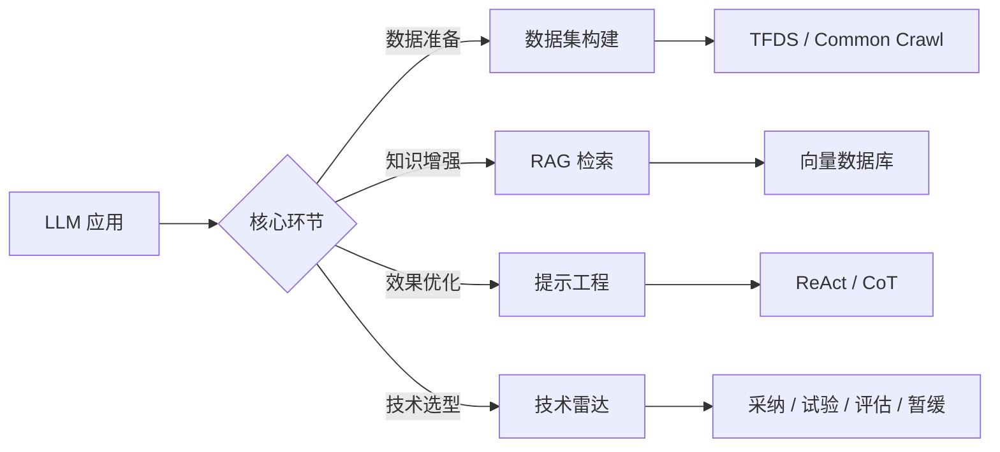

# 数据集标注与模型评估

数据集标注与模型评估是 [[LLM]] 应用落地的核心环节。高质量的数据集决定模型能力上限，科学的评估方法保障应用效果可控。本页面聚合从数据集构建、检索增强生成（[[RAG]]）到技术趋势评估的完整知识体系。

## 技术版图

数据与评估生态涵盖多个层次：以 [[TensorFlow Datasets]] 为代表的数据集目录、以 [[RAG]] 为代表的知识增强模式、以 [[Prompt Engineering]] 为代表的提示优化方法，以及以 [[Thoughtworks Tech Radar]] 为代表的技术趋势评估框架。

## LLM 训练数据集

[[LLM]] 的训练依赖海量高质量数据集。[[TensorFlow Datasets]]（TFDS）提供了标准化的数据集目录，覆盖 [[Common Crawl]]、[[Dolma]]、[[FineWeb]] 等主流预训练语料。

### 主流数据集规模

| 数据集 | 尺寸（Tokens） | 特点 |
|--------|---------------|------|
| [[FineWeb]] | 15T | 高质量网页过滤数据 |
| [[RedPajama2]] | 20T | 多领域混合数据 |
| [[Dolma]] | 3T | 开源训练数据 |
| [[SlimPajama]] | 627B | 去重清洗数据 |
| [[The Pile]] | 340B | 多样化领域数据 |
| [[RefinedWeb]] | 500B |  Falcon 训练数据 |
| [[C4]] | 172B | T5 训练数据 |

### 代码检索与相似性检测

结合 [[TF-IDF]] 或 [[BM25]] 算法可改进代码检索效果，提高检索准确性。[[Jaccard 相似度]]算法用于代码相似性检测。[[TreeSitter]] 和 [[AST]]（抽象语法树）技术进行语法分析，构建更好的交互体验。

## 检索增强生成（RAG）

[[RAG]]（Retrieval-augmented generation）是提高 [[LLM]] 生成响应质量的首选模式。通过将相关文档存储在支持向量搜索的数据库中（如 [[pgvector]]、[[Qdrant]]、[[Elasticsearch Relevance Engine]]），在推理时检索相关上下文与提示结合，提升输出质量并减少幻觉。

### 核心挑战

[[RAG]] 面临上下文窗口有限的约束，需通过重排序（Re-ranking）提升提示相关性。文档分割是关键技术难题——过大的文档无法直接计算嵌入向量，需分割为小块并适当重叠以维持语义连贯。

## 提示工程

[[Prompt Engineering]] 是为生成式 AI 模型设计和优化提示的过程。[[ReAct]] 提示工程将推理与行动结合，提高响应准确性并减少虚构内容。[[CoT]]（思维链）通过逐步推理提升复杂任务的表现。

### 实践方法

有效的提示设计包括：明确任务描述、提供少样本示例（Few-shot）、指定输出格式。[[GitHub Copilot]] 等编码助手通过提示工程生成代码、测试和文档。需注意提示注入攻击（Prompt Injection）的安全风险。

## 技术雷达与趋势评估

[[Thoughtworks]] 技术雷达（Tech Radar）每半年发布一次，评估工具、技术、平台、语言和框架的成熟度。四个环的含义：

- **采纳（Adopt）**：应认真考虑使用的技术
- **试验（Trial）**：可放心使用但未完全成熟
- **评估（Assess）**：值得关注，适合时试用
- **暂缓（Hold）**：需谨慎对待的技术

### 关键技术趋势

#### 大语言模型应用

[[LLM]] 驱动的自主代理（[[AI Agent]]）正从单一代理向多代理协作演进。[[Autogen]]、[[CrewAI]] 等框架支持角色定义、任务分配和对话协作。[[RAG]] 是知识增强的核心模式，[[Text-to-SQL]] 通过 [[Vanna]] 等框架实现自然语言转 SQL。

#### 模型微调与部署

[[Fine-tuning]] 并非所有场景的最优解——[[RAG]] 在知识注入场景下投入产出比更优。[[Self-hosted LLM]]（自托管大语言模型）通过 [[llama.cpp]] 等方案在边缘设备运行。[[量化]]技术减少内存需求，使高保真模型可在低成本硬件运行。

#### 向量数据库

[[pgvector]]、[[Qdrant]]、[[Chroma]] 是主流的向量数据库方案。[[Elasticsearch Relevance Engine]] 支持混合搜索（全文 + 向量），通过倒数排序融合（RRF）提升检索效果。

#### 工程实践

[[GitHub Actions]] 已成为 CI/CD 的默认选择。[[K3s]] 是边缘计算和资源受限环境下的 Kubernetes 发行版。[[Colima]] 和 [[Rancher Desktop]] 是 macOS 上 Docker Desktop 的替代方案。[[DVC]] 是数据科学项目实验管理的首选工具。

## 数据集标注实践

高质量标注是监督学习的基础。标注流程包括：定义标注规范、选择标注工具、执行标注任务、质量检验。[[Roboflow]] 等平台提供数据集标注、版本管理和模型训练能力。标注类型涵盖：分类标注、目标检测（边界框）、语义分割、关键点标注。

## 模型评估方法

[[LLM]] 评估是复杂系统工程。评估维度包括：准确性、相关性、流畅性、安全性。评估方法包括：自动评估（基于规则或模型打分）、人工评估（专家标注）、A/B 测试（在线实验）。[[Weights & Biases]] 提供实验跟踪、数据集版本和模型性能可视化。[[Langfuse]] 支持 LLM 应用的可观测性和调试。
