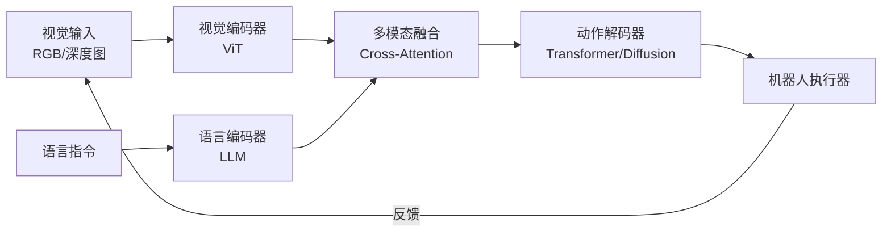

# 视觉语言动作模型

视觉语言动作模型（Vision-Language-Action Model，简称 VLA 模型）是一类将视觉感知、语言理解和动作控制统一在同一个神经网络架构中的端到端模型。它代表了从传统机器人"感知-规划-控制"分离架构向"感知-决策"一体化架构的范式转变，是具身智能（Embodied AI）领域的核心技术之一。

传统机器人系统通常采用模块化设计：视觉模块负责感知环境，规划模块负责生成动作序列，控制模块负责执行器驱动。这种架构虽然可解释性强，但模块间的信息损失和延迟限制了系统的灵活性和泛化能力。VLA 模型则试图用一个统一的 Transformer 架构，直接将视觉输入和语言指令映射为机器人动作序列，实现"看到即做到"的端到端控制。

VLA 模型的发展得益于三大技术趋势的融合：大语言模型（LLM）的语义理解能力、视觉-语言模型（VLM）的多模态感知能力，以及大规模机器人操作数据的积累。代表性工作包括 Google DeepMind 的 RT-2、Physical Intelligence 的 π0、NVIDIA 的 GR00T 等，这些模型展示了 VLA 在通用机器人操作任务上的巨大潜力。

## 核心概念

### 端到端动作生成

VLA 模型的核心思想是将机器人控制问题建模为"序列到序列"的生成问题：

- **输入**：视觉观测（RGB 图像、深度图、点云）+ 语言指令（如"把红色的杯子放到架子上"）
- **输出**：机器人动作序列（关节角度、末端执行器位姿、或直接的速度/力矩指令）
- **训练**：在大规模机器人操作数据集上学习视觉-语言-动作的联合分布

与传统方法相比，端到端架构消除了模块间的接口开销和误差累积，能够直接从原始感知数据生成精细动作。

### 视觉-语言预训练

大多数 VLA 模型采用预训练-微调的范式：

- **预训练阶段**：在大规模互联网数据（图像-文本对、视频-描述对）上训练视觉-语言模型，学习通用的视觉概念和语义理解。
- **适配阶段**：在机器人操作数据上微调，添加动作输出头（Action Head），学习从感知到动作的映射。
- **对齐阶段**：通过人类示范数据（Demonstration Data）或强化学习（RL）对齐动作策略。

这种范式充分利用了互联网数据的语义先验和机器人数据的动作先验，实现了"知识迁移"。

### 动作表示

VLA 模型的动作表示方式直接影响其性能和应用范围：

- **离散动作**：将连续动作空间离散化为 token 序列，类似于文本生成。优点是可直接复用 LLM 的生成能力，缺点是精度受限。
- **连续动作**：直接输出连续值（如 7-DoF 机械臂的关节角度），通常使用扩散模型（Diffusion Policy）或回归头。
- **混合表示**：先离散化粗粒度动作，再精调连续值，兼顾生成灵活性和控制精度。

### 多模态融合

VLA 模型需要融合多种模态的信息：

- **视觉编码器**：ViT（Vision Transformer）提取图像特征，处理空间信息。
- **语言编码器**：LLM 骨干网络处理文本指令，理解任务语义。
- **动作解码器**：将融合后的特征映射为动作序列，通常使用 Transformer 解码器或扩散模型。
- **本体感知**：融合关节角度、力矩等本体感知信息，实现闭环控制。

## 技术架构

典型 VLA 模型的架构流程：视觉编码器将图像转换为特征序列，语言编码器将指令编码为语义向量，多模态融合层（如 Cross-Attention）整合两种信息，动作解码器生成最终的动作序列。

## 应用场景

- **家庭服务机器人**：执行"拿取物品"、"整理桌面"、"开关家电"等自然语言指令任务。
- **工业装配**：在工厂环境中执行装配、搬运、分拣等操作，可快速适应新产品。
- **医疗辅助**：手术辅助机器人理解医生的语言指令并执行精细操作。
- **农业自动化**：采摘、除草、巡检等农业操作，适应非结构化环境。
- **自动驾驶**：VLA 思想也被应用于自动驾驶，将视觉-语言-动作统一建模。

## 相关技术

- [[具身智能与机器人]]
- [[多模态大模型]]
- [[强化学习与决策]]
- [[机器人操作系统（ROS）]]

## 主要页面

- [[具身智能与机器人]] - 具身智能与机器人技术全景
- [[多模态大模型]] - 多模态大模型架构与应用
