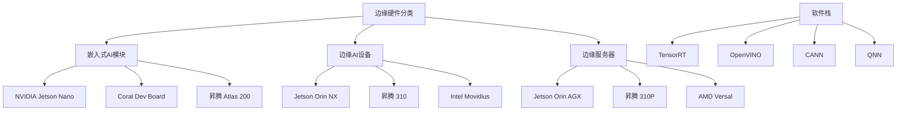

# 边缘硬件

边缘硬件是指在边缘计算场景中执行 AI 推理任务的专用计算设备，涵盖从嵌入式微控制器到边缘服务器的完整算力谱系。与云端数据中心使用通用 GPU（如 A100/H100）不同，边缘硬件需要在严格的功耗、体积、成本和散热约束下提供足够的 AI 推理性能。随着 AI 应用从云端向边缘延伸，边缘硬件已成为支撑智能制造、自动驾驶、智慧零售、能源电力等场景的关键基础设施。

边缘硬件的选型需要在算力、功耗、成本、体积之间做出权衡。一个典型的边缘 AI 部署决策涉及：选择什么芯片架构（GPU、NPU、FPGA、ASIC）？算力需求是多少（几 TOPS 到几百 TOPS）？功耗预算是多少（几瓦到几十瓦）？是否需要功能安全认证？这些问题没有标准答案，需要根据具体应用场景综合评估。

当前边缘硬件市场呈现多元化格局：NVIDIA Jetson 系列主导通用边缘 AI 推理市场；华为昇腾（Ascend）系列在国产替代和云端-边缘协同方面具有优势；Intel Movidius/Myriad 系列在视觉 AI 领域深耕；高通 Snapdragon 系列在移动端和 XR 设备领先；AMD Versal 系列在自适应计算方面特色鲜明；众多国产芯片（寒武纪 MLU、地平线征程、黑芝麻 A1000 等）在特定垂直领域快速成长。

## 核心概念

### 算力指标

边缘硬件的算力通常以 TOPS（Tera Operations Per Second，万亿次操作/秒）衡量：

- **INT8 TOPS**：8-bit 整数算力，是 AI 推理最常用的指标
- **FP16/BF16 TOPS**：半精度浮点算力，适用于需要更高精度的场景
- **稀疏算力**：利用模型稀疏性（如 2:4 结构化稀疏）实现的等效算力，通常为稠密算力的 2 倍

实际推理性能受内存带宽、算子效率、软件栈优化等因素影响，理论 TOPS 与实际吞吐量之间存在显著差距。

### 芯片架构

边缘 AI 芯片主要有以下架构：

- **GPU 架构**（NVIDIA Jetson）：通用并行计算，软件生态成熟，灵活性高
- **NPU 架构**（华为昇腾、寒武纪）：专用神经网络处理单元，能效比高，但灵活性受限
- **FPGA 架构**（AMD Versal、Intel Agilex）：可重构硬件，延迟极低，适合定制化推理
- **ASIC 架构**（Google Edge TPU、地平线 BPU）：专用集成电路，能效比最高，但不可编程
- **VPU 架构**（Intel Movidius）：视觉处理单元，专为计算机视觉优化

### 功耗与散热

边缘硬件的功耗从几毫量（MCU）到几十瓦（边缘服务器）不等：

- **超低功耗**（<1W）：MCU + NPU，如 Ambiq Apollo4、Nordic nRF5340
- **低功耗**（1-10W）：嵌入式 AI 模块，如 Jetson Nano、Coral Dev Board
- **中等功耗**（10-30W）：高性能边缘设备，如 Jetson Orin NX、昇腾 310
- **高功耗**（30-75W）：边缘服务器，如 Jetson Orin AGX、昇腾 310P

功耗直接决定散热设计——无风扇被动散热适用于 <10W 场景，风扇主动散热适用于 10-30W，液冷适用于 >30W。

### 软件生态

边缘硬件的软件生态是选型的关键因素：

- **NVIDIA Jetson**：CUDA、cuDNN、TensorRT、DeepStream 等完整 AI 软件栈
- **华为昇腾**：CANN（Compute Architecture for Neural Networks）、MindSpore、AscendCL
- **Intel Movidius**：OpenVINO 工具包
- **高通 Snapdragon**：QNN（Qualcomm Neural Processing SDK）
- **AMD Versal**：Vitis AI

软件生态的成熟度直接影响开发效率和推理性能。NVIDIA 凭借 CUDA 生态在边缘 AI 领域占据显著优势。

### 功能安全

工业和汽车场景对边缘硬件有功能安全要求：

- **ISO 26262**：汽车功能安全标准，ASIL-B/C/D 等级
- **IEC 61508**：工业功能安全标准，SIL 等级
- **AEC-Q100**：汽车电子可靠性认证

NVIDIA Orin 和 Thor、地平线征程系列、Mobileye EyeQ 等芯片通过了相关功能安全认证。

## 技术架构

## 应用场景

- **智能制造**：产线质检、预测性维护、机器人视觉引导
- **自动驾驶**：车载计算平台（NVIDIA Orin/Thor、地平线征程、华为 MDC）
- **智慧零售**：客流分析、无人结算、货架管理
- **能源电力**：智能巡检、故障识别、安全监控
- **医疗健康**：医学影像分析、手术机器人、可穿戴监测
- **智慧城市**：交通管控、环境监测、安防监控

## 相关技术

- [[Edge-Computing]] — 边缘计算技术体系
- [[TensorRT]] — NVIDIA 平台推理优化
- [[OpenVINO]] — Intel 平台推理优化
- [[模型量化]] — 边缘部署的模型压缩技术
- [[Jetson-与边缘计算]] — NVIDIA Jetson 平台实践

## 主要页面

- [[topics/Jetson-与边缘计算]] — Jetson 平台演进与边缘 AI 部署
- [[topics/华为昇腾与国产芯片]] — 国产边缘 AI 芯片生态
- [[topics/边缘计算与AI部署]] — 边缘 AI 部署实践
