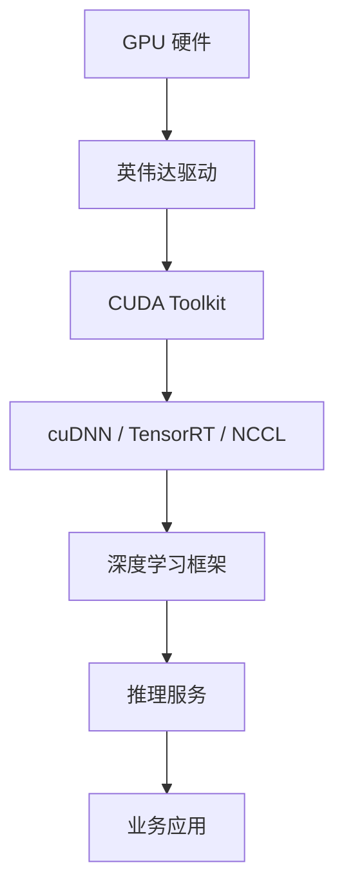
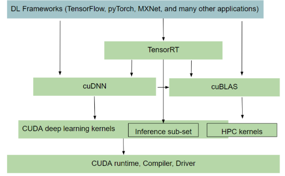

# GPU 与 CUDA 开发

图形处理器（GPU）已经从单纯的图形渲染加速器，演变为驱动深度学习、科学计算和物理 AI 的核心算力引擎。本页面系统梳理英伟达（NVIDIA）生态下的驱动安装、CUDA Toolkit 配置、容器化 GPU 方案、推理服务部署以及软件栈全貌，帮助开发者在真实生产环境中快速构建稳定的 GPU 开发体系。

## 1. 概述

现代 GPU 开发栈是一个分层架构，自下而上依次为：硬件 → 驱动 → CUDA Toolkit → 加速库（cuDNN、TensorRT、NCCL）→ 框架（PyTorch、PaddlePaddle）→ 服务层（ONNXRuntime、TensorRT-LLM、Triton）。理解每一层的职责与依赖关系，是排查版本兼容性问题的关键。



> **核心权衡（Trade-off）**：驱动版本决定了支持的最高 CUDA 版本；CUDA 版本又约束了可用的 cuDNN 和 TensorRT 版本。搭建环境时需严格遵循 [[NVIDIA-软件栈兼容性矩阵]] 进行匹配。

## 2. NVIDIA 驱动安装

驱动是 GPU 与操作系统之间的桥梁。安装方式主要有两种：APT 包管理（推荐用于 Ubuntu 生产环境）和 Runfile 手动安装（适合离线或特殊场景）。

### 2.1 APT 方式安装

Ubuntu 20.04+ 环境下，通过 `ubuntu-drivers` 命令搜索可用驱动版本：

```shell
sudo ubuntu-drivers devices
sudo apt install nvidia-driver-510
sudo reboot
```

### 2.2 Runfile 手动安装

离线环境下，从 [NVIDIA 驱动程序下载](https://www.nvidia.cn/Download/index.aspx?lang=cn) 页面获取对应型号的 `.run` 文件。安装前必须禁用开源 nouveau 驱动：

```shell
sudo nano /etc/modprobe.d/blacklist-nouveau.conf
# 写入以下内容：
blacklist nouveau
options nouveau modeset=0

sudo update-initramfs -u
sudo reboot
```

重启后验证 nouveau 已禁用（`lsmod | grep nouveau` 无输出即成功），再执行：

```shell
sudo sh NVIDIA-Linux-x86_64-535.129.03.run
```

### 2.3 验证安装

```shell
nvidia-smi
```

`nvidia-smi` 负责展示 GPU 运行状态、驱动版本及支持的最高 CUDA 版本，是日常监控和故障诊断的首选工具。

### 2.4 驱动卸载与切换

卸载命令：

```shell
sudo apt purge nvidia*
```

若需将独立显卡切换为 Intel 集成显卡（IGD）用于显示、独显专供计算，需在 BIOS 中将首选显卡设为 IGD，并通过 `xorg.conf` 配置 X Window 使用 Intel 驱动。详见 [[Intel-集成显卡与独立显卡切换]]。

## 3. CUDA Toolkit

CUDA 是英伟达推出的并行计算编程模型，包含编译器（nvcc）、运行时库和开发工具。

### 3.1 安装方式

CUDA Toolkit 可通过 Runfile 或 APT 安装。需注意：**CUDA Toolkit 自带驱动**，安装时可选择是否覆盖已有驱动。

```shell
# 下载
wget https://developer.download.nvidia.com/compute/cuda/11.6.0/local_installers/cuda_11.6.0_510.39.01_linux.run

# 安装
sudo sh cuda_11.6.0_510.39.01_linux.run
```

安装完成后，配置环境变量：

```shell
export PATH=$PATH:/usr/local/cuda-11.6/bin
export LD_LIBRARY_PATH=$LD_LIBRARY_PATH:/usr/local/cuda-11.6/lib64
```

### 3.2 验证 CUDA 安装

```shell
nvcc --version
cat /usr/local/cuda/version.txt
./deviceQuery  # 位于 CUDA samples 目录
```

`deviceQuery` 负责输出 GPU 的详细参数：CUDA 核心数、显存大小、计算能力（Compute Capability）等。

### 3.3 多版本 CUDA 管理

在 `/usr/local/` 下可同时存在多个 CUDA 版本（如 `cuda-11.5`、`cuda-11.6`），通过软链接 `cuda` 指向目标版本，灵活切换。

## 4. 容器化 GPU

### 4.1 nvidia-docker2

nvidia-docker2 让 Docker 容器能够直接访问 GPU 硬件。安装步骤如下：

```shell
# 配置 apt 仓库
curl -s -L https://nvidia.github.io/nvidia-docker/gpgkey | sudo apt-key add -
distribution=$(. /etc/os-release;echo $ID$VERSION_ID)
curl -s -L https://nvidia.github.io/nvidia-docker/$distribution/nvidia-docker.list | \
  sudo tee /etc/apt/sources.list.d/nvidia-docker.list

# 安装
sudo apt-get update
sudo apt-get install -y nvidia-docker2

# 重启 Docker
sudo systemctl restart docker
```

验证：

```shell
docker run --runtime=nvidia --rm nvidia/cuda nvidia-smi
```

### 4.2 Kubernetes GPU 共享

原生 Kubernetes 通过 [[NVIDIA Device Plugin]] 以整卡为单位调度 GPU，资源利用率低下。为实现细粒度 GPU 共享，业界有多种方案：

#### 阿里云 GPU Share 方案

通过 Scheduler Extender + Device Plugin 组合，以 `aliyun.com/gpu-mem` 资源申请显存（单位 GiB），支持多容器共享同一张 GPU。

```yaml
resources:
  limits:
    aliyun.com/gpu-mem: 4  # 申请 4G 显存
```

#### GaiaGPU / vCUDA 方案

GaiaGPU 基于腾讯的 vCUDA 技术，将物理 GPU 切割为虚拟 GPU，通过 GPU Manager + GPU Admission 实现弹性资源分配。核心组件：

- **vcuda-controller**：负责 CUDA 调用拦截与资源限制
- **gpu-manager**：节点代理，管理虚拟 GPU 资源
- **gpu-admission**：调度器扩展，过滤不满足资源需求的节点

资源申请使用自定义资源名：

```yaml
resources:
  requests:
    tencent.com/vcuda-core: 10      # 算力（100 = 整卡）
    tencent.com/vcuda-memory: 4     # 显存（单位 256MiB）
  limits:
    tencent.com/vcuda-core: 10
    tencent.com/vcuda-memory: 4
```

> **权衡（Trade-off）**：GPU 共享提升利用率，但引入约 1% 性能损耗，且隔离性弱于整卡独占。推理延迟敏感型服务建议独占 GPU。

## 5. 推理服务部署

### 5.1 ONNXRuntime 推理服务

ONNXRuntime 是一个跨平台的推理引擎，支持 CUDA、TensorRT 等多种执行提供程序（Execution Provider）。

#### 从源码构建 GPU 版本

```shell
git clone --recursive https://github.com/microsoft/onnxruntime.git
cd onnxruntime
./build.sh --parallel --build_shared_lib --enable_pybind --build_wheel \
    --use_cuda --cudnn_home /usr/include/x86_64-linux-gnu/ \
    --cuda_home /usr/local/cuda/ --config Release
```

构建使用多阶段 Dockerfile 可显著减小最终镜像体积（详见 [[Dockerfile-多阶段构建]]）。

#### 推理会话配置

```python
import onnxruntime as ort
providers = [
    ('CUDAExecutionProvider', {
        'device_id': 0,
        'arena_extend_strategy': 'kNextPowerOfTwo',
        'gpu_mem_limit': 2 * 1024 * 1024 * 1024,
        'cudnn_conv_algo_search': 'EXHAUSTIVE',
    }),
    'CPUExecutionProvider',
]
session = ort.InferenceSession(model_path, providers=providers)
```

### 5.2 PaddlePaddle 推理服务

飞桨（PaddlePaddle）官方提供 GPU 基础镜像。需注意：**非安培架构 GPU 推荐使用 CUDA 10.2 以获得更优性能**。

```dockerfile
FROM paddlepaddle/paddle:2.2.2-gpu-cuda10.2-cudnn7
```

自定义构建时务必包含 cuDNN，否则 PaddlePaddle 的 CPU-to-GPU 数据拷贝会因缺少 `libcudnn` 而失败。

### 5.3 TensorRT-LLM 大模型推理

TensorRT-LLM 负责构建高性能 LLM 推理引擎，结合 Triton Inference Server 可提供生产级服务。

#### 构建流程

```shell
git clone https://github.com/NVIDIA/TensorRT-LLM.git
cd TensorRT-LLM
make -C docker release_build
```

#### 构建 TensorRT 引擎

```shell
docker run --gpus 1 --rm -it -v /data/models:/data/models tensorrt_llm/release:latest bash
cd examples/chatglm/
python build.py -m chatglm3_6b --model_dir /data/models/llm/chatglm3-6b \
    --output_dir /data/models/trt-engines/chatglm3-6b/fp16/1-gpu
```

引擎构建耗时约 4 分钟（单卡 ChatGLM3-6B），生成的 `.engine` 文件约 12GB。

#### 与 Triton Inference Server 集成

Triton 是英伟达开源的推理服务框架，支持多模型并发、动态批处理和 GPU 推理。通过 tensorrtllm_backend 将 TensorRT-LLM 引擎部署为在线服务：

```bash
docker run --rm -it --net host --shm-size=2g \
    --ulimit memlock=-1 --ulimit stack=67108864 --gpus 1 \
    -v $(pwd):/tensorrtllm_backend \
    nvcr.io/nvidia/tritonserver:23.11-trtllm-python-py3
```

### 5.4 开源 LLM 部署实践

主流开源大模型的部署路径：

| 模型 | 参数 | 精度 | 加速方式 | 显存 | 速度（字/秒） |
| --- | ---: | :---: | ------- | --: | ----------: |
| Qwen-7B-Chat | 7B | float16 | flash-attention | 20G | 9 |
| ChatGLM2-6B | 6B | float16 | chatglm.cpp int4 | 6G | 90 |
| Baichuan2-7B-Chat | 7B | int4 | 在线量化 | 8G | 30 |
| Baichuan2-13B-Chat | 13B | int4 | 预量化 | 13G | 20 |

Flash-Attention 能显著加速自回归解码；量化（int8/int4）在显存受限场景下是关键的加速手段。

## 6. 软件栈全貌

英伟达深度学习软件栈各组件职责：

| 组件 | 职责 |
| --- | --- |
| **GPU Driver** | 硬件抽象层，提供 CUDA 驱动接口 |
| **CUDA Toolkit** | 并行计算编程模型（nvcc、cuBLAS、cuFFT） |
| **cuDNN** | 深度神经网络加速原语（卷积、池化、归一化） |
| **TensorRT** | 高性能推理优化器（层融合、精度校准、内核自动调优） |
| **NCCL** | 多 GPU / 多节点通信原语（AllReduce、AllGather） |
| **NIMS / NeMo** | LLM 推理微服务与训练框架 |



> 示意图来源：[[NVIDIA-软件栈搭建]]

### 6.1 全栈 AI 方案（2025-2026）

英伟达在 CES 2026 上展示了从训练到推理再到具身智能的全栈方案：

- **LLM 推理**：TensorRT-LLM + Triton + NIM（NVIDIA Inference Microservice）
- **LLM 开发**：NeMo 框架
- **具身智能**：GROOT 人形机器人基础模型 + Isaac Lab 仿真 + Omniverse 数字孪生
- **物理 AI**：Cosmos 世界模型理解物理定律，Alpamayo 自动驾驶 AI 具备推理能力

硬件层面，Vera Rubin 架构（GB300）较 Blackwell 显存容量提升 50%（288GB HBM3e），带宽达 8TB/s，并全面支持液冷散热。

## 7. GPU 系统信息查看

日常运维中需要快速获取 GPU 状态：

```shell
# GPU 型号
lspci | grep -i nvidia

# 驱动版本
modinfo nvidia | grep ^version:
cat /proc/driver/nvidia/version

# CUDA 版本
cat /usr/local/cuda/version.txt
nvcc --version

# 综合状态
nvidia-smi
```

其他系统信息：CPU 型号（`/proc/cpuinfo`）、内存（`free -h`）、磁盘（`df -h`、`lsblk`）。

## 8. FFmpeg GPU 加速

FFmpeg 可通过英伟达硬件加速编解码：

```shell
# GPU 加速格式转换
ffmpeg -y -vsync 0 -hwaccel cuda -hwaccel_output_format cuda \
    -i input.mp4 -c:a copy -c:v h264_nvenc -b:v 5M output.mp4

# GPU 解码 + CPU 抽帧
ffmpeg -y -hwaccel cuvid -c:v h264_cuvid -i input.mp4 \
    -vf "hwdownload,format=nv12" -r 1 input-%03d.jpeg
```

Docker 环境下使用 `jrottenberg/ffmpeg:4.3-nvidia` 镜像，需通过 `--runtime nvidia` 启用 GPU。

## 9. TVM 深度学习编译器

TVM 是一个端到端的深度学习编译器栈，支持将模型编译为多种后端（CUDA、OpenCL、Vulkan 等）。

### 从源码安装

```shell
git clone --recursive https://github.com/apache/tvm tvm
cd tvm

# 安装 LLVM（TVM 用于 CPU 代码生成）
wget https://github.com/llvm/llvm-project/releases/download/llvmorg-11.0.0/clang+llvm-11.0.0-x86_64-linux-gnu-ubuntu-20.04.tar.xz
tar xvf clang+llvm-11.0.0-x86_64-linux-gnu-ubuntu-20.04.tar.xz
mv clang+llvm-11.0.0-x86_64-linux-gnu-ubuntu-20.04 llvm

# 配置编译选项
mkdir build && cp cmake/config.cmake build
# 编辑 build/config.cmake：set(USE_CUDA ON)、set(USE_LLVM /path/to/llvm/bin/llvm-config)

cd build && cmake .. && make -j64
```

TVM 编译产物为 `libtvm.so` 和 `libtvm_runtime.so` 两个动态库。

## 10. Jetson Thor 边缘设备配置

Jetson Thor 是英伟达面向机器人和边缘 AI 的高性能模块。网络配置方面，通过 `nmtui` 可配置 Wi-Fi 热点（AP 模式）：

```bash
# 检查 Wi-Fi 是否支持 AP 模式
iw list | grep "AP"

# 配置热点
sudo nmtui
# 编辑连接 → 添加 → Wi-Fi → 模式选择 Access Point → 设置 SSID 和密码
```

## 11. Troubleshooting

### 11.1 驱动安装失败

**问题**：升级驱动时报错 `An NVIDIA kernel module 'nvidia' appears to already be loaded`

**根因**：旧驱动被进程占用（常见于 Kubernetes 节点的 kubelet）。

**排查**：

```shell
sudo lsof -n -w /dev/nvidia*
```

**解决**：

```shell
# 停止占用进程（以 kubelet 为例，不可直接 kill，否则会自动重启）
sudo systemctl stop kubelet

# 或卸载驱动模块
sudo rmmod nvidia  # 需确保无进程占用
```

### 11.2 驱动与库版本不匹配

```shell
nvidia-smi
# Failed to initialize NVML: Driver/library version mismatch
```

**解决**：重启系统或重新安装匹配版本的驱动。

### 11.3 缺少 libc 头文件

安装驱动时报错 `You do not appear to have libc header files installed`：

```shell
sudo apt-get install libc6-dev
# 若不可用，使用 build-essential
sudo apt-get install build-essential
```

### 11.4 Xorg 占用 GPU

`nvidia-smi` 显示每张卡被 `/usr/lib/xorg/Xorg` 占用少量显存。

**解决**：停止显示管理器以释放 GPU（仅限无图形界面需求的计算节点）：

```shell
sudo service gdm stop      # GNOME
sudo service lightdm stop  # LightDM
```

### 11.5 鼠标键盘失灵（双显卡切换后）

安装输入设备驱动：

```shell
sudo apt install xserver-xorg-input-all
```

### 11.6 登录循环（密码正确但无法进入桌面）

删除 `.Xauthority` 文件：

```shell
rm .Xauthority
```

## 参考资料

- [[NVIDIA-软件栈兼容性矩阵]]
- [[Dockerfile-多阶段构建]]
- [[NVIDIA Device Plugin]]
- [[Intel-集成显卡与独立显卡切换]]
- [NVIDIA CUDA Installation Guide](https://docs.nvidia.com/cuda/cuda-installation-guide-linux/index.html)
- [NVIDIA TensorRT-LLM Documentation](https://nvidia.github.io/TensorRT-LLM/)
