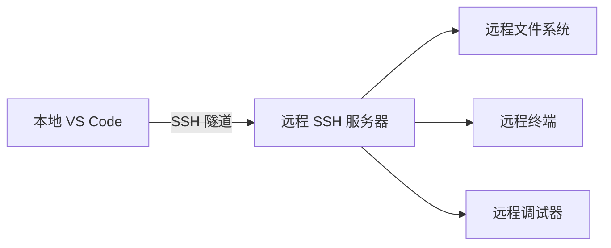

# IDE 与编辑器

## 概述

集成开发环境（IDE）与编辑器是开发者日常工作的核心工具。本页面聚合了在 [[VS-Code|VS Code]]、[[Jupyter-Notebook|Jupyter Notebook]]、[[Continue]] 等平台上积累的实践经验，涵盖远程开发、AI 编码辅助、扩展开发、快捷键速查等关键主题。随着 [[GitHub-Copilot|GitHub Copilot]] 等 AI 辅助编程工具的成熟，编辑器正从单纯的代码编写工具演进为智能化的开发伙伴。

## 主要 IDE 对比

现代开发工作流中，不同编辑器承担各异的角色：

| 工具 | 定位 | 核心优势 | 适用场景 |
|------|------|----------|----------|
| [[VS-Code|VS Code]] | 通用编辑器 + 扩展生态 | 轻量、插件丰富、跨平台 | 前端、脚本、全栈开发 |
| [[Jupyter-Notebook|Jupyter Notebook]] | 交互式计算环境 | Cell 执行、可视化集成 | 数据分析、机器学习、教学 |
| [[Continue]] | 开源 AI 编码助手 | 多模型支持、上下文感知 | 代码补全、对话式编程 |

### Jupyter Notebook 的工作模式

[[Jupyter-Notebook|Jupyter Notebook]] 采用双模式设计：

- **编辑模式**：光标位于 Cell 内，可直接编写代码或 Markdown
- **命令行模式**：按 `Esc` 进入，管理 Cell 的增删移动

通过 `%lsmagic` 可查看完整的 magic 命令列表，`%time` / `%%time` 负责性能分析，`!` 前缀直接运行 Shell 命令。探索式学习时，`dir()`、`help()`、`dis()`、`type()`、`id()` 等内置函数构成内省工具链。

## VS Code 深度实践

[[VS-Code|VS Code]] 是当前最主流的开源编辑器，其核心能力由扩展驱动。

### 基础编辑与导航

编辑操作的高效离不开快捷键。以下是 macOS 平台的核心组合：

| 类别 | 快捷键 | 功能 |
|------|--------|------|
| 编辑 | `⌘ /` | 注释/取消注释 |
| 编辑 | `⌥ ⇧ F` | 格式化文档 |
| 选择 | `⌥ ⇧ + 拖动` | 多列选择 |
| 导航 | `⌘ P` | 转到文件 |
| 导航 | `⌃ G` | 转到行号 |
| 导航 | `⌘ T` | 工作区符号搜索 |
| 导航 | `F12` | 转到定义 |
| 视图 | `⌘ B` | 切换侧栏 |
| 视图 | `⌃ \`` | 切换终端 |

更多快捷键参见 [[Visual-Studio-Code-Shortcut]] 中的完整速查表。

### Python 开发环境

在 [[VS-Code|VS Code]] 中搭建 Python 环境的步骤：

1. 通过 `⇧ ⌘ P` 打开命令面板
2. 输入 `Python: Select Interpreter` 选择解释器
3. 状态栏可快速切换环境

推荐安装的核心扩展包括 [[Jupyter]]、[[GitHub-Copilot|GitHub Copilot]] 和 Pytest 测试框架集成。测试方面，`pytest` 框架因其简洁的断言语法成为首选。

## 远程开发

[[VS-Code|VS Code]] 的 Remote Development 扩展包支持通过 SSH 连接远程主机，将本地编辑体验延伸到服务器端。

### 架构与连接流程



连接步骤：

1. 按 `F1`，选择 `Remote-SSH: Connect to Host...`
2. 输入 `user@hostname`
3. VS Code 自动完成服务端设置
4. 通过状态栏确认连接状态

### 常见问题：ENOSPC 错误

大型工作区中，`fs.inotify.max_user_watches` 默认为 8192，远不够用。解决方案：

```bash
# 查看当前限制
sysctl -n fs.inotify.max_user_watches

# 临时提升限制
sudo sysctl -w fs.inotify.max_user_watches=524288
```

同时在 VS Code 中配置 `files.watcherExclude` 排除 `node_modules`、`.git` 等无需监测的目录。详细排错指南参见 [[VS-Code-Remote-Development-SSH]]。

## AI 编码辅助

[[GitHub-Copilot|GitHub Copilot]] 作为 AI 结对编程工具，已深度集成到 [[VS-Code|VS Code]] 和 [[Neovim]] 中。

### GitHub Copilot 集成

- **VS Code**：安装 [GitHub Copilot](https://marketplace.visualstudio.com/items?itemName=GitHub.copilot) 和 [GitHub Copilot Labs](https://marketplace.visualstudio.com/items?itemName=GitHub.copilot-labs) 扩展
- **Neovim**：通过 `copilot.vim` 插件接入，执行 `:Copilot setup` 完成授权

Copilot Labs 扩展提供代码解释、跨语言翻译等进阶功能。[[GitHub-Copilot-Your-AI-Pair-Programmer]] 记录了完整的注册与配置流程。

### Continue 源码分析：键盘快捷键

[[Continue]] 作为开源 AI 编码助手，其交互设计值得深入研究。源码分析揭示了 TipTap 编辑器中的快捷键映射机制：

| 快捷键 | 功能 |
|--------|------|
| `Enter` | 普通发送（不使用 Codebase） |
| `⌘ Enter` | 使用 Codebase 上下文 |
| `⌥ Enter` | 使用 ActiveFile 上下文 |
| `⌘ ⌫` | 放弃当前响应 |
| `⇧ Enter` | 换行 |
| `⌘ L` | 新建会话 |
| `⌘ I` | 编辑高亮代码 |
| `⌘ ↑ R` | Debug Terminal |

核心实现在 `TipTapEditor.tsx` 中，通过 ProseMirror 的 `addKeyboardShortcuts` 钩子注册处理器。`ArrowUp` / `ArrowDown` 负责在历史输入间导航，`Mention` 和 `SlashCommand` 扩展驱动 `@` 上下文引用与 `/` 斜杠命令。更多源码细节参见 [[Continue-Source-Code-Analysis-Keyboard-Shortcuts]]。

## 扩展开发

[[VS-Code|VS Code]] 扩展开发基于 TypeScript/JavaScript，核心资源包括：

- [VS Code API](https://code.visualstudio.com/api/references/vscode-api)：完整的扩展 API 参考
- [VS Code Extension Samples](https://github.com/microsoft/vscode-extension-samples)：官方示例仓库

扩展开发涉及 `package.json` 中的 `contributes` 配置、`activationEvents` 激活事件、以及通过 `vscode.workspace` 和 `vscode.window` 命名空间操作编辑器状态。[[Chat-Extensions-VS-Code]] 和 [[Language-Model-API]] 深入探讨了基于 Language Model API 构建 Chat 扩展的技术路径。

## 快捷键速查

### VS Code 核心快捷键（macOS）

| 类别 | 快捷键 | 功能 |
|------|--------|------|
| 命令 | `F1` / `⇧ ⌘ P` | 显示所有命令 |
| 命令 | `⌘ ,` | 打开设置 |
| 导航 | `⇧ ⌘ O` | 编辑器内符号跳转 |
| 导航 | `⇧ ⌘ \` | 转到匹配括号 |
| 显示 | `⌥ ⌘ B` | 切换辅助侧栏 |
| 显示 | `⇧ ⌘ Space` | 打开 Copilot Chat |
| 编辑器 | `⌘ \` | 切分编辑器 |
| 编辑器 | `⌘ D` | 选择单词（多选） |

### Jupyter Notebook 核心快捷键

| 快捷键 | 功能 |
|--------|------|
| `Shift+Tab, Shift+Tab` | 查看帮助文档 |
| `Esc` | 编辑模式 → 命令行模式 |
| `h`（命令行模式） | 显示所有快捷键 |
| `?obj` / `obj?` | 查看对象帮助 |
| `??obj` / `obj??` | 查看源代码 |
| `!cmd` | 执行 Shell 命令 |

## 版本控制与分支策略

编辑器之外，代码管理同样是开发流程的关键环节。[[Cherry-Studio-Branch-Strategy]] 记录了 Cherry Studio 项目的分支策略实践：

### 分支模型

- **`main`**：主开发分支，仅接受通过 PR 合入的代码
- **`release/*`**：发布分支，仅接受文档更新和错误修复
- **功能分支**：`feature/issue-number-brief-description`，PR 目标为 `main`
- **修复分支**：`fix/issue-number-brief-description`，PR 目标为 `main`
- **热修复分支**：`hotfix/issue-number-brief-description`，同时 PR 到 `main` 和 `release`

### PR 准则

1. 所有 PR 提交到 `main`（关键生产修复除外）
2. 合入前与最新 `main` 同步
3. 描述中包含问题编号
4. 确保测试通过并附带修改前后截图

## 相关页面

- [[VS-Code]] — VS Code 综合配置与扩展生态
- [[Jupyter-Notebook]] — 交互式计算与数据科学实践
- [[GitHub-Copilot]] — AI 编码助手深度集成
- [[Continue]] — 开源 AI 编码助手源码分析
- [[Remote-Development]] — SSH 与容器化远程开发
