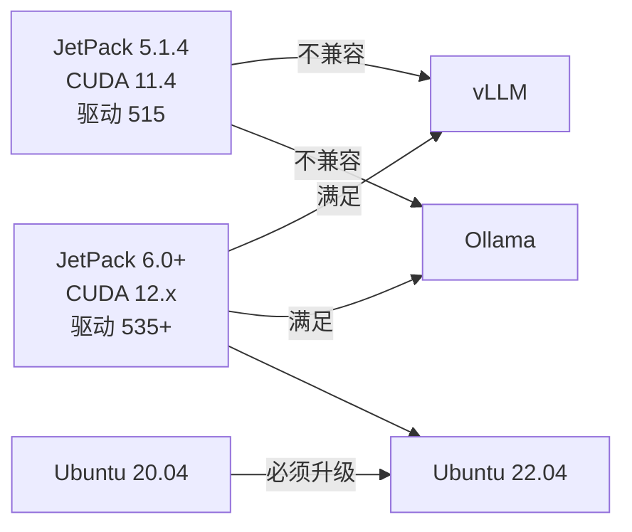
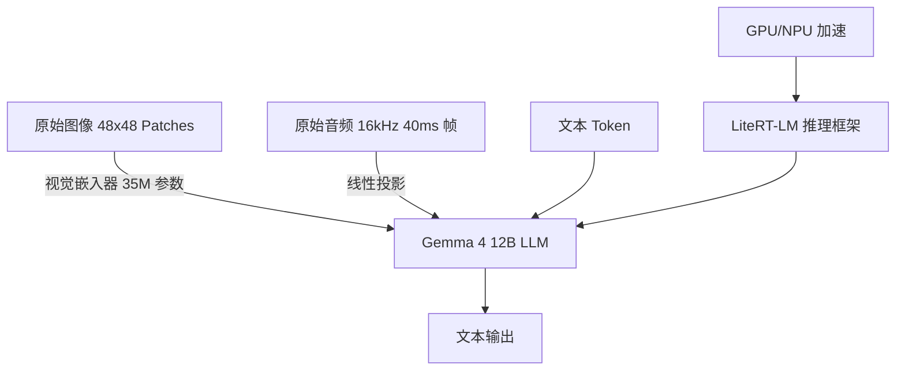

# Jetson 与边缘计算

边缘计算将 AI 推理从云端下沉到数据源附近，以低延迟、高隐私、离线可用的方式驱动实时智能。[[Jetson]] 是 NVIDIA 打造的嵌入式 AI 计算平台，在机器人、电力、工业质检等场景中承担核心算力。本页面聚合 Jetson 平台实践、边缘硬件选型、端侧大模型部署以及电力等行业应用的工程经验。

## 边缘计算的技术定位

边缘计算的本质是在数据产生的位置附近完成推理决策，避免海量原始数据向云端回传带来的延迟与带宽开销。与之配合的嵌入式 AI 芯片需要在功耗、算力、成本之间做出严苛的 [[权衡（Trade-off）]]。从寒武纪 MLU220 的嵌入式系统编译，到百度 [[EasyEdge]] 的端云协同平台，再到 NVIDIA Jetson 系列的大模型落地，边缘 AI 正在从"能否运行"走向"能否规模化部署"。

## Jetson 平台演进

### Jetson AGX Orin：大模型部署的起点

[[Jetson AGX Orin]] 是面向机器人、视觉检测等场景的高性能嵌入式平台，采用 ARM64 架构，GPU 计算能力 8.7。在物资仓库机器人项目中，它被用于火灾、烟雾和安全帽检测。然而该平台出厂搭载的 [[JetPack]] 5.1.4 + CUDA 11.4 已无法满足 [[vLLM]] 和 [[Ollama]] 等主流推理框架的最低要求——vLLM 至少需要 CUDA 11.8，Ollama 则要求驱动版本 531 以上。

升级路径的核心矛盾在于：JetPack 6.0 强制要求 Ubuntu 22.04，意味着必须重装系统，而机器人原有的 [[ROS]]1 在 Ubuntu 22.04 上缺乏官方支持。这一场景典型地反映了边缘 AI 部署中的"版本锁定"困境——推理框架、驱动、操作系统、机器人中间件之间形成紧密耦合的依赖链。

### Jetson Thor：具身智能的下一代算力

[[Jetson Thor]] 是 NVIDIA 为下一代人形机器人设计的端侧 AI 芯片，面向 [[Physical AI]] 场景提供卓越的 AI 性能与高速传感器处理能力。配合 [[Isaac ROS]]（基于 [[ROS]] 2 的硬件加速机器人开发框架），Jetson Thor 实现了 CUDA 加速的视觉、SLAM、运动规划等核心算法。

[[NITROS]]（NVIDIA Isaac Transport for ROS）进一步优化了 ROS 2 消息的硬件加速传输，使传感器数据到 AI 推理的端到端延迟大幅降低。对于需要实时响应的具身智能应用（如优必选 U1 人形机器人），Jetson Thor + Isaac ROS 的组合构成了当前最完整的端侧机器人计算栈。

## 边缘硬件生态

### 主流边缘 AI 芯片

边缘 AI 芯片按架构可分为 GPU、VPU、NPU 以及专用 SoC：

| 芯片平台 | 架构 | 典型应用场景 | 关键特性 |
|---------|------|------------|---------|
| NVIDIA Jetson Orin | ARM + Ampere GPU | 机器人、视觉检测 | CUDA 生态、8.7 计算能力 |
| NVIDIA Jetson Thor | ARM + Blackwell GPU | 人形机器人、具身智能 | 高传感器吞吐、Isaac ROS 加速 |
| Intel Movidius Myriad X | VPU | 低功耗视觉推理 | OpenVINO 工具链、神经计算棒 |
| 寒武纪 MLU220 | 专用 AI 加速 | 工业边缘推理 | 嵌入式 Linux、Buildroot |
| 昇腾 310 | NPU | 电力、安防 | ONNX Runtime 适配、INT8 量化 |

### 存储与内存技术

嵌入式平台的存储与内存直接影响推理吞吐量：

- **[[NVMe]]**：基于 PCIe 通道的 SSD 协议，充分利用并行性提升存储读写性能，适用于需要加载大模型权重（如 12B 参数模型）的场景
- **[[LPDDR]]**（Low Power DDR）：以低功耗和小体积著称，是嵌入式设备的主流内存标准，LPDDR5 被称为 5G 时代标配
- **[[M.2]]**接口：为超极本和嵌入式板卡量身定做的存储/AI 加速卡接口标准，取代 mSATA

## 端侧大模型部署

### 推理框架对比

在 Jetson 等边缘平台上部署大模型，需要根据硬件能力选择合适的推理引擎：

| 框架 | 最低 CUDA 要求 | Jetson 适配 | 多模态支持 |
|-----|--------------|------------|----------|
| vLLM | CUDA 11.8 | JetPack 6.0+ | 是 |
| Ollama | 驱动 531+ | JetPack 6.0+ | 是 |
| llama.cpp | 无硬性要求 | 全系列 | 部分 |
| LiteRT-LM | 无 | 全系列（含 Android/iOS） | 是 |

对于 JetPack 5.x 的老系统，[[llama.cpp]] 和 [[LiteRT-LM]] 是更务实的选择。LiteRT-LM 是 Google AI Edge 生态的推理框架，可在 Android、iOS、Linux、物联网设备上运行，通过 GPU/NPU 加速实现高性能 LLM 部署。

### Gemma 4 12B：笔记本级硬件的端侧多模态模型

[[Gemma 4 12B]] 是 Google 推出的原生无编码器（Encoder-free）统一多模态大模型，采用 Decoder-only Transformer 架构。其创新在于仅用 35M 参数视觉嵌入器取代了传统视觉 Transformer，并将 16kHz 原始音频信号通过线性投影直接输入 LLM，消除了模态转换延迟。

该模型仅需 16GB VRAM 即可在消费级 GPU 笔记本上运行，配合 [[LiteRT-LM]] 的 `litert-lm serve` 命令可一键启动兼容 [[OpenAI]] API 的本地服务器，为边缘设备提供标准化的模型服务接口。

## 行业应用：电力边缘 AI

在智能电网场景，边端电力设备需要在毫秒级时间内完成报文解析与安全决策。传统基于预设规则和阈值报警的方式已无法满足复杂工况需求。AI 技术的引入为电力边缘带来四个核心能力：

1. **毫秒级故障识别**：使用 [[CNN|1D-CNN]] 直接解析 GOOSE/SV 协议报文中的采样值波形，通过 [[TensorRT]] 或 [[OpenVINO]] 进行 INT8 量化后部署到边缘网关
2. **网络安全入侵检测**：基于 [[Autoencoder]] 学习正常报文的行为基准，通过重构误差识别异常报文注入
3. **预测性维护（PHM）**：利用 [[LSTM|Bi-LSTM]] 分析采样报文中的谐波畸变趋势，在设备性能衰减早期发出预警
4. **协议智能解析与数据压缩**：结合 [[PCA]] 与 [[VAE]] 对冗余报文进行特征抽稀，仅上送有价值的信息

电力边缘 AI 部署面临算力受限、高可靠性要求和小样本三大挑战，通常需要在 [[ONNX Runtime]] 上结合模型剪枝和量化技术实现落地。

## 端侧 AI 工具链与平台

### 百度 EasyEdge

[[EasyEdge]] 是基于 [[Paddle Lite]] 的端与边缘 AI 服务平台，支持将 Caffe、TensorFlow、PyTorch、PaddlePaddle、ONNX 等框架的模型快速转换为适配多种 AI 芯片的端侧推理模型。其端云协同能力支持断网时离线推理、联网时远程管理，并提供按设备或产品线的 SDK 授权机制。

### Google AI Edge 生态

Google 的端侧 AI 生态包含：

- **[[LiteRT]]**：TensorFlow Lite 的升级版，用于边缘平台的高性能 ML 与 GenAI 部署
- **[[LiteRT-LM]]**：专注于设备端 LLM 推理，支持 Gemma、Llama、Phi-4、Qwen 等模型
- **[[Google AI Edge Gallery]]**：开源全本地运行的 AI 交互沙盒，支持离线运行 Gemma 系列模型
- **[[Google AI Edge Eloquent]]**：完全离线、免订阅的 AI 语音听写与文本润色应用

### 嵌入式系统编译

边缘设备的系统层定制是 AI 部署的前提。以寒武纪 MLU220 为例，需要基于 [[Buildroot]] 通过交叉编译构建嵌入式 Linux 系统。[[OpenIL]]（Open Industrial Linux）是基于 Buildroot 的开源项目，专为嵌入式工业解决方案设计，支持 NXP LS1043 等主流工业处理器平台。

## 具身智能与 Physical AI

[[Physical AI]] 是将 AI 能力赋予物理实体（机器人、自动驾驶车辆）的技术方向。2026 年，随着 [[Jetson Thor]] 等专用芯片的量产以及优必选 U1 等人形机器人订单破万，具身智能正从实验室走向消费市场。

[[世界模型]]（World Model）是具身智能的理论基础之一——通过学习物理规律、编码因果关系，使智能体能够预测未来状态并规划动作。智源研究院在此方向上的探索表明，世界模型将成为下一代机器人理解与交互世界的核心能力。

## 相关页面

- [[GPU-与-CUDA-开发]] — CUDA 计算能力与 GPU 开发基础
- [[IDE-与编辑器]] — 端侧 AI 开发工具链
