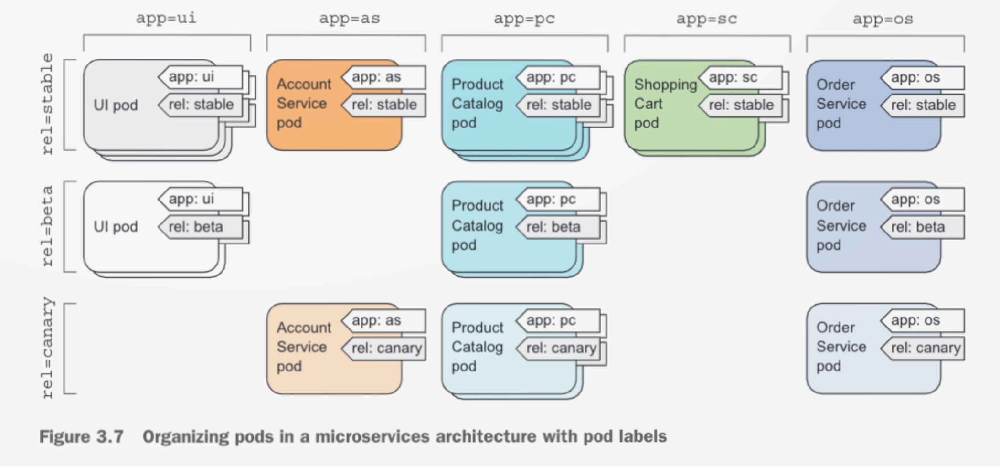
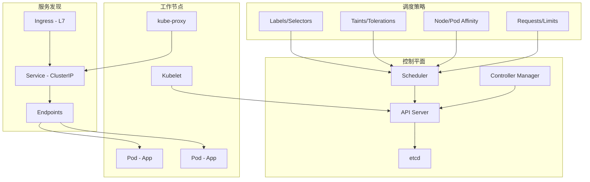
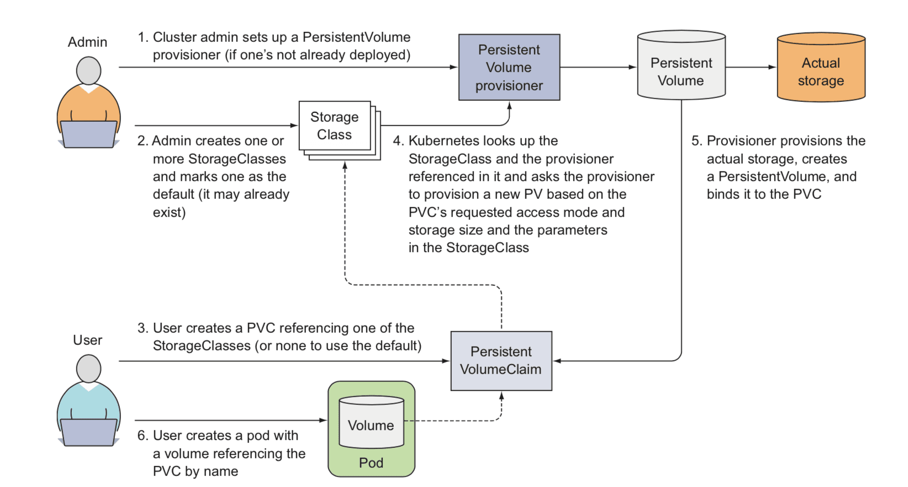
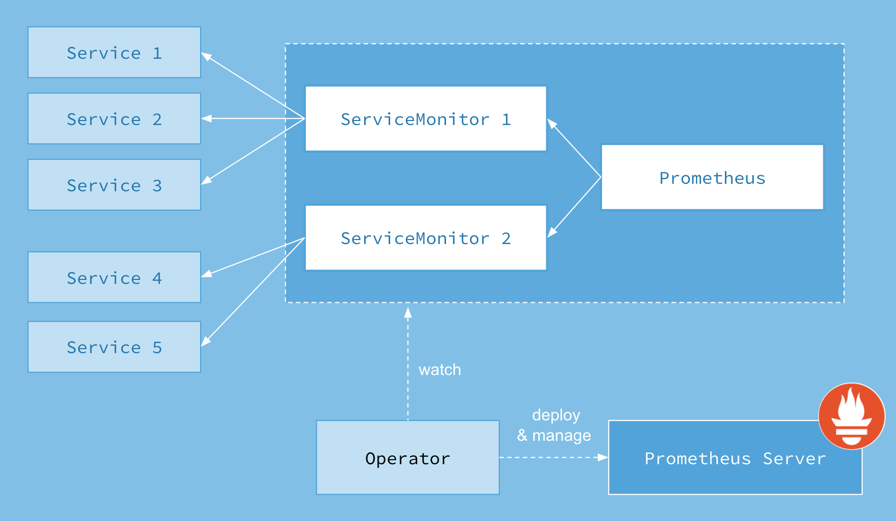

# Kubernetes 编排

Kubernetes 作为容器编排领域的事实标准，负责构建声明式驱动的工作负载管理体系，驱动集群资源的高效调度与自动化运维。本页面汇聚 24 篇实践笔记，覆盖集群搭建、[[Kubernetes-API|API 对象模型]]、[[工作负载管理]]、[[调度策略]]、[[服务网络]]、[[安全控制]]、[[资源管理]]及[[工具链]]八大维度，形成完整的 Kubernetes 知识图谱。

## 集群搭建与运维

### 集群安装

[[安装-Kubernetes-1_21_5|Kubernetes 1.21.5 安装]]基于 kubeadm 工具链完成集群初始化，核心步骤包括：配置 Docker 的 `cgroupDriver=systemd`、通过阿里云镜像源拉取组件、执行 `kubeadm init` 初始化控制平面、部署 [[Weave Net]] 网络插件，以及通过 `kubeadm join` 将工作节点接入集群。安装过程中需权衡镜像拉取速度与版本稳定性，国内环境通常需要配置镜像加速器。

[[minikube|Minikube]] 提供本地单节点集群方案，适用于开发调试场景。通过 `minikube start --force` 启动集群，配合 `minikube addons enable dashboard` 启用 Dashboard 附加组件。需注意 Docker 驱动在 root 权限下的限制，必要时添加 `--force` 参数绕过校验。

### 证书管理

[[Kubernetes-集群证书过期|Kubernetes 集群证书过期]]是运维中的常见故障。kubeadm 签发的 API 服务器证书默认有效期一年，过期后 `kubectl get nodes` 将返回 `x509: certificate has expired` 错误。通过 `openssl x509 -in /etc/kubernetes/pki/apiserver.crt -noout -text` 查看证书有效期，使用 `kubeadm alpha certs renew all` 批量更新证书，最后重启 kubelet 服务并复制 `admin.conf` 到用户目录恢复访问。

### 节点管理

[[Kubernetes-中删除节点|删除节点]]需先执行 `kubectl drain` 驱逐 Pod，再通过 `kubectl delete node` 移除节点对象。驱逐命令需配合 `--ignore-daemonsets` 忽略守护进程集管理的 Pod，`--delete-local-data` 处理本地存储数据。

[[Kubernetes-中如何恢复误删的节点|误删节点恢复]]依赖 kubeadm 的重置与重加入机制：在 Master 节点通过 `kubeadm token create --print-join-command` 生成加入令牌，在被删节点执行 `kubeadm reset` 清理状态后，使用令牌重新加入集群。

## Kubernetes API 与对象模型

### API 对象结构

[[Kubernetes-API|Kubernetes API]] 是集群的声明式接口，所有资源通过 YAML 或 JSON 描述。每个对象包含四个核心字段：`apiVersion`（API 版本）、`kind`（对象类别）、`metadata`（元数据如 name、namespace、labels）和 `spec`（期望状态）。`status` 字段由控制平面维护，描述当前实际状态。通过 `kubectl api-resources` 可查看集群支持的全部资源类型，`kubectl explain pods` 可查询字段定义。

### 标签与选择器

[[Kubernetes-中的标签和标签选择器|标签（Labels）]]是键值对形式元数据，用于组织资源、驱动调度决策。标签选择器支持多种过滤方式：`key=value` 精确匹配、`key` 存在性检查、`!key` 排除、`in`/`notin` 集合运算。标签不仅用于 Pod 分组，还驱动 [[Service]] 的 Endpoint 选择、[[节点亲和性]]的匹配条件。



节点同样可通过标签分类，例如 `kubectl label nodes ln6 gpu=true` 标记 GPU 节点，再通过 `nodeSelector` 将工作负载定向调度。但应避免使用 `kubernetes.io/hostname` 等系统标签做硬绑定，以防节点离线导致 Pod 无法重调度。

### 注解

[[Kubernetes-中的注解|注解（Annotations）]]与标签同为键值对，但不参与对象筛选，主要用于工具链元数据存储，容量上限 256KB。通过 `kubectl annotate pod` 添加注解，常用于记录构建信息、配置覆盖规则或集成外部系统。

### JSONPath 实践

[[Kubernetes-JSONPath-实践|JSONPath]] 是 kubectl 的查询语言扩展，支持从资源描述中提取特定字段。例如 `kubectl get nodes -o=jsonpath='{range .items[*]}{.metadata.name}{"\t"}{.spec.taints[*].key}{"\n"}{end}'` 可批量查看节点污点。JSONPath 在编写脚本和自动化工具时尤为实用，与 [[标签]]、[[污点]]等机制配合可快速巡检集群状态。

## 工作负载管理

### 副本集与守护进程集

[[Kubernetes-中的-ReplicationController-和-ReplicaSet|ReplicaSet]] 替代早期的 ReplicationController，通过标签选择器维持 Pod 副本数量。其协调循环持续比对实际副本数与期望值，自动创建或删除 Pod 以达成一致。`matchExpressions` 语法提供更丰富的选择器语义，支持 `In`、`NotIn`、`Exists`、`DoesNotExists` 运算符。

[[Kubernetes-中的-DaemonSet|DaemonSet]] 确保每个节点运行一个 Pod 实例，适用于日志收集、监控代理、网络插件等场景。默认主节点因 `node-role.kubernetes.io/master:NoSchedule` 污点不调度 Pod，需在 Pod 模板中添加 `tolerations` 容忍度。结合 `nodeSelector` 可将 DaemonSet 限定到特定节点组，例如仅 GPU 节点部署监控组件。

### 任务与定时任务

[[Kubernetes-中的-Job-和-CronJob|Job]] 用于运行一次性任务直至完成。关键参数包括 `completions`（完成次数）、`parallelism`（并行度）、`backoffLimit`（重试上限）和 `activeDeadlineSeconds`（超时限制）。Pod 重启策略仅支持 `OnFailure` 或 `Never`。

[[CronJob]] 按 Cron 表达式周期调度 Job，支持 `Allow`、`Forbid`、`Replace` 三种并发策略。通过 `successfulJobsHistoryLimit` 控制历史记录数量，避免资源泄漏。

[[基于模板创建-Job|基于模板批量创建 Job]] 提供两种方案：Shell 脚本通过 `sed` 替换 `$ITEM` 占位符生成多份 YAML；Python [[Jinja2]] 模板引擎则更适合复杂参数化场景，配合 `render_template` 别名实现流式生成。

## 名字空间与多租户

### 名字空间

[[Kubernetes-中的名字空间|名字空间（Namespace）]] 为对象提供逻辑隔离域，不同名字空间允许同名对象存在。通过 `kubectl create namespace` 或 YAML 创建，`kubectl delete ns` 将级联删除其内所有资源。上下文切换可通过 `kubectl config set-context --namespace` 设置，或定义 `kcd` 别名简化操作。

名字空间对运行中的 Pod 不提供网络隔离，隔离能力取决于底层 [[CNI]] 插件。跨名字空间的服务访问需使用全限定域名（FQDN）：`service.namespace.svc.cluster.local`。

### 多租户

[[Kubernetes-的多租户|多租户]]架构依赖名字空间划分租户边界，结合 [[ResourceQuota]] 限制资源用量、[[RBAC]] 控制访问权限。[[KubeSphere]] 等平台在此基础上提供租户自助服务、工作负载可视化等增强能力。

## 调度策略

### 污点与容忍度

[[Kubernetes-中的污点和容忍度|污点（Taint）]] 用于节点反亲和，阻止 Pod 调度到特定节点。三种效果：`NoSchedule`（禁止新调度）、`PreferNoSchedule`（尽量不调度）、`NoExecute`（驱逐已运行 Pod）。容忍度（Toleration）则允许 Pod 忽略指定污点，通过 `operator: Exists` 可容忍任意污点。

典型场景是将训练节点与推理节点分离：训练节点设置 `node-type=training:PreferNoSchedule`，推理节点设置 `node-type=inference:NoSchedule`，配合 Pod 容忍度实现工作负载隔离。

### 节点亲和性与 Pod 亲和性

[[Kubernetes-中的节点亲和性和-Pod-亲和性|节点亲和性（nodeAffinity）]] 是 `nodeSelector` 的增强版，支持 `requiredDuringScheduling`（硬性）和 `preferredDuringScheduling`（软性）两种约束。`matchExpressions` 语法可实现 `In`、`NotIn` 等复杂匹配。

[[Pod 亲和性（podAffinity）]] 将客户端与服务端调度到同一节点，减少网络延迟；[[Pod 非亲和性（podAntiAffinity）]] 则确保每个节点仅运行一个 Pod 实例，提升高可用性。`topologyKey` 定义拓扑域（如 `kubernetes.io/hostname` 或 `topology.kubernetes.io/zone`），控制亲和/反亲和的作用范围。

## 服务网络

### Service

[[Kubernetes-中的-Service|Service]] 为一组功能相同的 Pod 提供固定虚拟 IP，实现服务发现与负载均衡。三种主要类型：

- **ClusterIP**：集群内部访问，默认类型
- **NodePort**：每个节点开放静态端口，支持外部访问
- **LoadBalancer**：云厂商负载均衡器集成，需基础设施支持

服务发现支持环境变量和 [[DNS]] 两种方式。环境变量遵循 `SERVICE_NAME_SERVICE_HOST` / `_PORT` 命名规则；DNS 方式通过 CoreDNS 提供 `<service>.<namespace>.svc.cluster.local` 域名解析。

[[Endpoint]] 资源记录后端 Pod IP，无标签选择器的服务需手动配置 Endpoint，`ExternalName` 类型则通过 CNAME 记录指向外部服务。

### 端口转发

[[通过端口转发连接-Pod|端口转发（Port-Forward）]] 将本地端口映射到 Pod 端口，用于调试场景。`kubectl port-forward pod-name 8888:8080` 建立隧道后，即可通过 `curl localhost:8888` 访问服务，配合 `kubectl logs` 实时查看请求日志。

### Ingress

[[在Kubernetes-上安装-Ingress|Ingress]] 提供基于域名和路径的七层流量入口，支持 HTTPS 终止和虚拟主机路由。通过 [[Helm]] 安装 Nginx Ingress Controller 时，国内环境需替换 `k8s.gcr.io` 镜像为本地镜像源（如 `pollyduan/ingress-nginx-controller`）。Ingress 资源通过 `rules` 定义路由规则，将不同域名映射到后端 Service。

## 安全控制

### API 服务器安全防护

[[Kubernetes-API-服务器的安全防护|Kubernetes API 服务器]] 的安全机制涵盖认证、授权、准入三层。认证插件链依次验证请求身份，首个成功插件决定用户身份。[[ServiceAccount]] 为 Pod 提供身份凭证，通过 `imagePullSecrets` 可集中管理镜像拉取密钥。

[[RBAC]]（基于角色的访问控制）通过四种资源实现权限管理：

- **Role** / **ClusterRole**：定义名字空间或集群范围的权限集合
- **RoleBinding** / **ClusterRoleBinding**：将角色绑定到用户或 ServiceAccount

HTTP 动词映射到 Kubernetes 请求动词：POST→create、GET→get/list、PUT→update、PATCH→patch、DELETE→delete。

## 资源管理

### 计算资源管理

[[Kubernetes-中的计算资源管理|Pod 资源请求与限制]]通过 `requests`（最小保障）和 `limits`（最大上限）定义。CPU 单位为毫核（m），memory 支持 `Mi`、`Gi` 等二进制单位。[[QoS 等级]]根据 requests/limits 配置将 Pod 分为：

- **Guaranteed**：requests == limits，优先级最高
- **Burstable**：部分设置，中等优先级
- **BestEffort**：均未设置，内存不足时优先被驱逐

[[LimitRange]] 为名字空间内的容器设置资源默认值与上下限，防止未配置 requests/limits 的 Pod 滥用资源。[[ResourceQuota]] 限制名字空间级别的资源总量，包括 CPU、内存、GPU 及对象数量（Pod、Service、PVC 等）。

[[NVIDIA Device Plugin]] 将 GPU 资源暴露为 `nvidia.com/gpu` 可调度资源，需在节点配置 Docker 的 `default-runtime: nvidia`，并通过 [[污点]]标记 GPU 节点。

## 工具链与设备插件

### Helm

[[命令-Helm|Helm]] 是 Kubernetes 的包管理器，通过 Chart 定义、安装和升级应用。核心操作包括：`helm repo add` 添加仓库、`helm search repo` 搜索 Chart、`helm install` 部署应用、`helm uninstall` 卸载。Chart 模板支持参数化，便于多环境配置管理。

### NVIDIA Device Plugin

[[Install-NVIDIA-device-plugin-for-Kubernetes|NVIDIA Device Plugin]] 以 [[DaemonSet]] 形式部署，将节点 GPU 资源注册到 kubelet。部署前需确保每个 GPU 节点配置了 `nvidia-container-runtime` 作为 Docker 默认运行时，否则插件将进入 `CrashLoopBackOff` 状态并报告 `Failed to initialize NVML`。通过 `kubectl describe node` 可验证 `nvidia.com/gpu` 资源是否成功注册。

## 架构总览

下图展示 Kubernetes 编排体系的核心组件与数据流：



## 学习路径

1. **入门**：从 [[minikube]] 或 [[安装-Kubernetes-1_21_5|kubeadm 安装]]开始，搭建首个集群
2. **基础对象**：理解 [[Kubernetes-API|API 对象]]、[[标签]]、[[注解]]、[[名字空间]]
3. **工作负载**：掌握 [[ReplicaSet]]、[[DaemonSet]]、[[Job]]、[[CronJob]]
4. **调度进阶**：学习 [[污点与容忍度]]、[[节点亲和性]]、[[Pod 亲和性]]
5. **网络与访问**：配置 [[Service]]、[[Ingress]]、[[端口转发]]
6. **资源治理**：设置 [[LimitRange]]、[[ResourceQuota]]、[[QoS 等级]]
7. **安全加固**：配置 [[RBAC]]、[[ServiceAccount]]、镜像拉取密钥
8. **生产运维]]：处理 [[证书过期]]、[[节点管理]]、[[GPU 设备插件]]


# Kubernetes-编排（补充）

本页面汇总 Batch 44–45 共 9 篇文章，覆盖集群部署、持久化存储、调度策略、有状态工作负载、可观测性栈以及机器学习平台在 Kubernetes 上的工程实践。与 [[Kubernetes-编排|主页面]] 共同构成完整的 K8s 编排知识体系。Kubernetes 作为云原生时代的操作系统，其编排能力建立在 [[Docker-容器化|容器]] 抽象之上，通过声明式 API 与控制器模式驱动集群向期望状态收敛。

## 集群部署与升级

### 使用 kubeadm 部署 Kubernetes 1.26.0

Kubernetes 1.26.0 标志着容器运行时全面转向 [[Docker-容器化|containerd]] 的关键节点。部署流程遵循标准路径：通过 `apt` 安装指定版本的 `kubelet`、`kubeadm`、`kubectl`，使用阿里云镜像仓库 `registry.aliyuncs.com/google_containers` 拉取控制面组件，再以 `kubeadm init` 初始化控制面、`kubeadm join` 纳管工作节点。

```shell
kubeadm init --kubernetes-version=1.26.0 \
  --image-repository=registry.aliyuncs.com/google_containers
```

部署过程中常见的陷阱包括：

- **CRI 兼容性问题**：containerd 默认配置可能残留 Docker 的 CRI 垫片，导致 `kubeadm preflight` 报 `[ERROR CRI]`。解决方式是将 `/etc/containerd/config.toml` 移至别处并重启 containerd，让 containerd 重新生成纯 CRI 配置。
- **Metrics Server 部署**：需为 kubelet 添加 `--kubelet-insecure-tls` 参数以绕过证书校验，同时替换国内可访问的镜像源。
- **网络插件选型**：本实践选用 [[Docker-容器化|Weave]] 作为 CNI 插件，通过 `kubectl apply -f` 部署 DaemonSet 形态的网络组件。[[Linux-与系统管理|Linux 系统]] 层面的内核参数（如 `net.bridge.bridge-nf-call-iptables`）也需正确配置，否则跨节点通信会失败。

### Kubernetes Dashboard

Dashboard 提供集群资源的 Web 可视化界面，支持 Deployment 弹性伸缩、滚动升级与 Pod 排错。部署时需关注三个层面：

1. **RBAC 授权**：创建 `admin-user` ServiceAccount 并绑定 `cluster-admin` ClusterRole，通过 Bearer Token 完成认证。RBAC 是 Kubernetes 安全模型的基石，与 [[Linux-与系统管理|Linux 权限]] 体系形成互补。
2. **访问通道**：本地使用 `kubectl proxy` 建立代理；远程环境通过 SSH 隧道 `-L 8001:127.0.0.1:8001` 转发；开发环境可切换 Service 类型为 `NodePort` 直接暴露端口。
3. **本地 kubectl 配置**：从 Master 节点复制 `/etc/kubernetes/admin.conf` 至本地 `~/.kube/config`，即可在 [[macOS-与-Apple-Silicon|macOS]] 等开发机上远程管理集群。

## 持久化存储

### 使用 StorageClass 动态创建 NFS 持久卷

Kubernetes 存储子系统的核心抽象层包括 Volume、PersistentVolume（PV）、PersistentVolumeClaim（PVC）与 StorageClass。StorageClass 驱动动态制备 PV，让应用无需关心底层存储细节即可获得持久化能力。



实践基于 [[Linux-与系统管理|NFS]] 构建动态供给链路：

1. **NFS 服务端配置**：在 [[Linux-与系统管理|Ubuntu]] 上安装 `nfs-kernel-server`，通过 `/etc/exports` 暴露共享目录。关键参数 `no_root_squash` 允许容器内 root 用户直接操作文件系统，这对 MongoDB 等需要 `chown` 数据目录的场景至关重要。
2. **NFS Subdir External Provisioner**：部署一个 Deployment 监听 PVC 事件，自动在 NFS 共享目录下创建形如 `${namespace}-${pvcName}-${pvName}` 的子目录并制备 PV。国内环境下需自行构建镜像以绕过 `registry.k8s.io` 的访问限制，也可参考 [[Docker-容器化|Docker 镜像]] 加速方案。
3. **StorageClass 定义**：指定 `provisioner: k8s-sigs.io/nfs-subdir-external-provisioner` 与 `archiveOnDelete: "false"` 参数，确保删除 PVC 时同步清理 NFS 数据。

部署方式灵活多样——既可通过官方 YAML 清单手动部署，也可借助 [[Linux-与系统管理|Kustomize]] 的 `patchesStrategicMerge` 注入 NFS 服务器地址，或使用 Helm Chart 一行命令完成安装。Helm 作为 Kubernetes 的包管理器，与 [[Docker-容器化|Docker Compose]] 在容器编排领域的定位形成上下层关系。

### Velero：备份与迁移

Velero 负责构建集群的灾难恢复能力。与直接备份 etcd 的方案不同，Velero 通过 Kubernetes API 捕获资源状态，因此可按命名空间、资源类型或标签选择器做细粒度过滤，也适用于无权访问底层 etcd 的托管 Kubernetes 环境。

Velero 的核心能力：

- **灾难恢复**：基础设施丢失或服务中断时缩短恢复时间，与 [[Linux-与系统管理|Linux 灾备]] 方案互补。
- **数据迁移**：将资源跨集群搬运，实现集群可移植性，适用于多云与混合云场景。
- **数据保护**：计划备份、保留策略、备份前后挂钩（Hook）机制，满足合规审计需求。

持久卷层面，Velero 支持存储平台原生快照与 Restic 集成文件级备份两种路径，可根据底层存储能力权衡选择。对于已部署 [[Docker-容器化|NFS]] 的环境，Restic 模式更为通用，无需存储平台支持快照 API。

## 工作负载管理

### 配置调度器策略

Kubernetes 默认调度器通过「过滤 → 打分 → 选择」三步决策 Pod 的落脚节点。调度策略（Policy）允许管理员重写打分逻辑，驱动集群向特定优化目标收敛。

场景示例：压榨节点资源利用率，优先将 Pod 调度到 CPU/Memory 占用最高的节点上。配置方式如下：

```json
{
  "kind": "Policy",
  "apiVersion": "v1",
  "priorities": [
    {"name": "MostRequestedPriority", "weight": 1}
  ]
}
```

常用优先级函数：

| 优先级函数 | 优化目标 |
|---|---|
| `MostRequestedPriority` | 优先填满已用资源多的节点，提升装箱率 |
| `LeastRequestedPriority` | 优先选择剩余容量最高的节点，分散负载 |
| `BalancedResourceAllocation` | 选择 CPU/Memory 使用率最均衡的节点，常与 `LeastRequestedPriority` 组合使用 |

策略文件通过 `--policy-config-file` 参数注入 `kube-scheduler` 静态 Pod 清单，修改后调度器自动加载新配置，无需重启。调度策略的调优需结合 [[Linux-与系统管理|节点资源]] 实际分布，在装箱率与负载均衡之间做出权衡（Trade-off）。

### 在 Kubernetes 上部署 MySQL

MySQL 在 K8s 上的部署形态取决于可用性需求：

**单实例模式**：使用 Deployment + PVC，适合开发测试环境。通过 `nfs-client` StorageClass 申请持久卷，确保 Pod 重建后数据不丢失。`strategy.type: Recreate` 保证同一时刻只有一个 Pod 运行，避免数据竞争。这与 [[Docker-容器化|Docker 单容器]] 部署模式的保障级别相当。

**集群模式（主从复制）**：使用 StatefulSet 编排多实例，核心设计包括：

- **稳定网络标识**：Headless Service 为每个 Pod 提供稳定的 DNS 表项（`mysql-0.mysql`、`mysql-1.mysql` 等），支撑主从拓扑发现，依赖 [[Linux-与系统管理|CoreDNS]] 提供服务发现能力。
- **配置分化**：Init Container 根据 Pod 序号写入不同的 `my.cnf`——主库开启 `log-bin`，从库设置 `super-read-only`，类似 [[Linux-与系统管理|Linux 配置管理]] 的分发思路。
- **数据克隆**：`clone-mysql` Init Container 通过 `xtrabackup` 从上游节点流式克隆全量数据，避免新从库从零开始同步。
- **读写分离**：`mysql-read` Service 以 Round-Robin 方式将读请求分发到所有副本，写请求则固定路由到主库 `mysql-0.mysql`。

### Elastic Cloud on Kubernetes（ECK）

ECK Operator 负责构建 Elastic Stack 的 Kubernetes 原生管理能力，通过自定义资源定义（CRD）声明式管理 Elasticsearch、Kibana 与 Filebeat。

部署流程：

1. 安装 CRD 与 Operator（位于 `elastic-system` 命名空间）。
2. 声明 `Elasticsearch` 资源，指定版本与节点集（nodeSets）。
3. 声明 `Kibana` 资源并通过 `elasticsearchRef` 关联集群。
4. 声明 `Beat` 资源部署 Filebeat DaemonSet，采集容器日志。

实战踩坑记录：

- **StorageClass 缺失**：Elasticsearch 默认未设置 `storageClassName`，导致 PVC 处于 `unbound` 状态。需手动编辑 PVC 添加 `storageClassName: nfs-client`。
- **时间同步**：节点间时钟偏移会导致 Elasticsearch 就绪探针失败（`curl_rc: 7`）。通过 `ntp` 服务同步时钟，必要时使用 `hwclock --hctosys` 强制校准。

## 可观测性栈

### 使用 Prometheus Operator 部署 Prometheus 和 Grafana

Prometheus Operator 负责构建 Kubernetes 原生的监控栈，通过 ServiceMonitor、PodMonitor 等 CRD 自动发现监控目标，大幅降低 Prometheus 配置维护成本。




部署基于 `kube-prometheus` 项目，一键创建完整的监控组件：

- **Prometheus**：双副本高可用，持久化存储指标数据，与 [[Docker-容器化|存储卷]] 配合保障数据可靠性。
- **Alertmanager**：三副本集群，负责告警分组、抑制与路由，是 [[Linux-与系统管理|告警中枢]]。
- **Grafana**：预置丰富的 Kubernetes 集群仪表板（API Server、Kubelet、节点、Pod、PVC 等），可与 [[Docker-容器化|可视化生态]] 无缝集成。
- **kube-state-metrics**：将 Kubernetes 对象状态转化为 Prometheus 可采集的指标。
- **node-exporter**：DaemonSet 部署，采集节点级系统指标，依赖 [[Linux-与系统管理|/proc 文件系统]]。
- **prometheus-adapter**：将自定义指标暴露给 Kubernetes HPA，支撑自动伸缩。

国内环境下需替换 `registry.k8s.io` 镜像为 `m.daocloud.io` 源，可通过 `kubectl patch` 直接修改 Deployment 镜像字段，也可参考 [[Docker-容器化|镜像加速]] 方案统一处理。

访问路径：

```shell
kubectl --namespace monitoring port-forward svc/grafana 3000
kubectl --namespace monitoring port-forward svc/prometheus-k8s 9090
kubectl --namespace monitoring port-forward svc/alertmanager-main 9093
```

## 机器学习平台在 Kubernetes 上的实践

Kubernetes 已成为机器学习平台的事实标准底层。vivo 的 AI 平台实践表明，通过 K8s 统一调度 CPU 集群（2000+ 台）与 GPU 集群（1000+ 卡），可支撑大规模分布式训练与在线推理。

平台核心组件：

- **特征工程系统**：统一特征服务与样本生产，解决特征生产效率、处理一致性与数据一致性难题，是 [[LLM-技术报告与前沿论文|机器学习]] 流水线的基础设施。
- **分布式训练引擎**：基于 Horovod 实现 Ring AllReduce 通信，通过增大 Batch Size 将 [[GPU-与-CUDA-开发|GPU]] 利用率从 30% 提升至 90%。
- **高性能推理引擎**：结合 TensorRT、OpenVINO 做图优化与算子融合，在 BERT 等模型上实现 10 倍推理加速，与 [[LLM-推理优化|LLM 推理优化]] 技术栈一脉相承。
- **AB 实验平台**：针对即时配送等强耦合场景，设计分时间片轮转对照的分流方法，消除区域间干扰。

腾讯「无量」系统进一步展示了千亿参数模型的工程挑战：参数服务器架构支撑千亿级参数与千亿级样本的并行训练，全量 + 增量模型管理策略平衡上线性能与更新时效，自研 `tl_hash_map` 将模型加载内存开销压缩至仅比原始数据大 20%。这类大规模机器学习平台的底层均依赖 [[Kubernetes-编排|K8s 调度]] 能力实现资源弹性分配。

## 关键权衡（Trade-off）

| 决策维度 | 选项 | 适用场景 |
|---|---|---|
| 存储供给 | 静态 PV vs StorageClass 动态供给 | 前者适合固定存储池；后者适合多租户、弹性需求 |
| 部署形态 | Deployment vs StatefulSet | 无状态服务选前者；有状态服务（数据库、消息队列）选后者 |
| 调度策略 | MostRequested vs LeastRequested | 装箱率优先选前者；负载均衡优先选后者 |
| 备份方案 | 快照 vs Restic 文件级备份 | 快照依赖存储平台能力；Restic 通用但性能较低 |
| 监控搭建 | 原生 Prometheus vs Operator | Operator 降低维护成本，推荐生产环境使用 |

以上决策均需结合 [[Linux-与系统管理|基础设施]] 现状与团队运维能力综合判断。Kubernetes 编排的本质是在抽象与掌控之间寻找平衡——声明式 API 屏蔽底层细节的同时，仍需理解 [[Docker-容器化|容器运行时]]、存储、网络等底层机制，才能在故障场景下快速定位根因。
