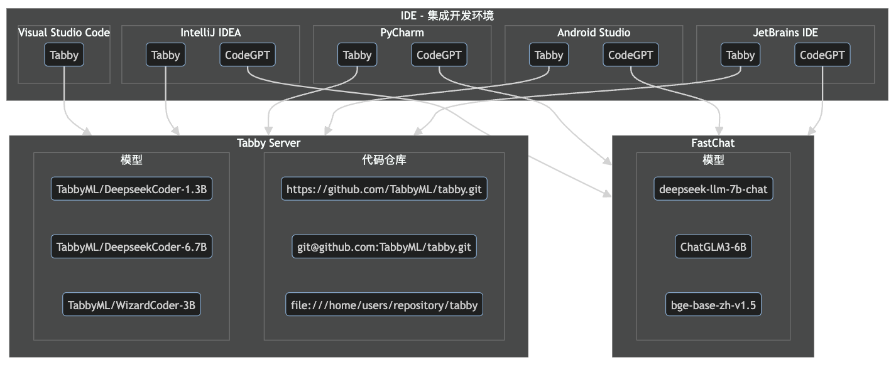
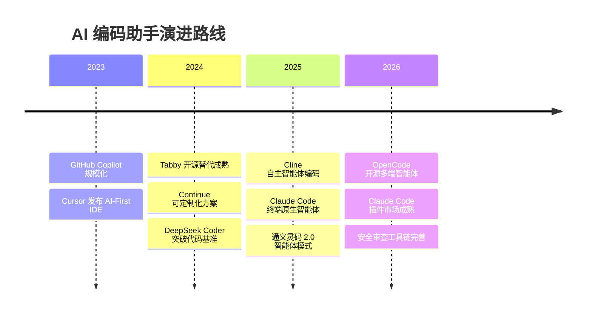
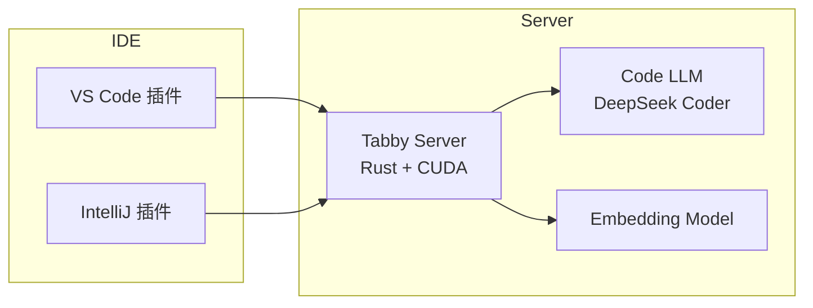
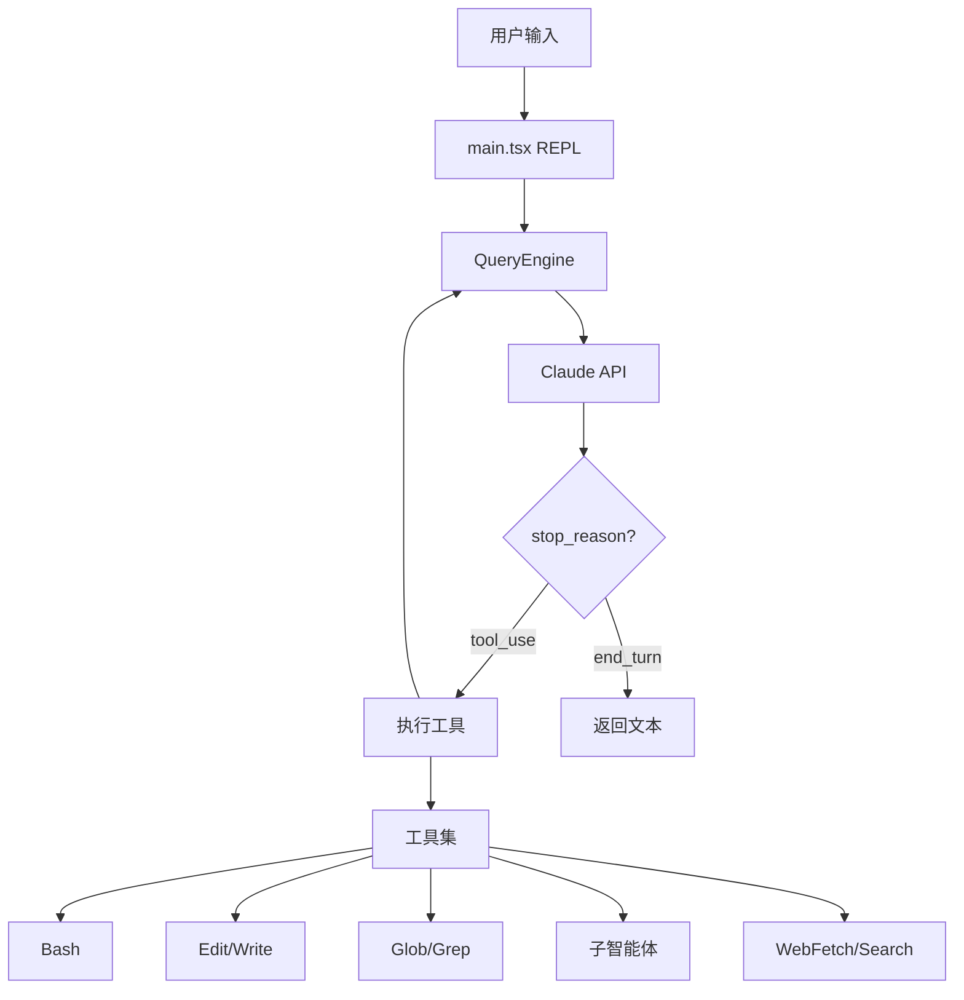

# LLM-编码助手

[[LLM-编码助手]]（AI Coding Assistant）是一类基于大语言模型（LLM）构建的智能编程辅助工具，旨在通过自然语言交互、代码补全、代码生成、代码解释等能力，将开发者的编码效率提升到新高度。[[GitHub-Copilot]] 开创了这一领域，而如今生态已扩展为覆盖 IDE 插件型、终端原生型、自主智能体型的完整谱系。



## 演进脉络

[[LLM-编码助手]] 经历了三个显著阶段。第一阶段以 [[Tabby]]、[[CodeGPT]]、[[Continue]] 为代表，聚焦于 IDE 内的代码补全与对话问答；第二阶段以 [[GitHub-Copilot]]、[[Cursor]]、[[Sourcegraph-Cody]] 为标志，深度整合 IDE 上下文，支持多文件编辑与工作区索引；第三阶段以 [[Claude-Cli|Cline]]、[[Claude-Code]]、[[opencode]] 为代表，走向自主智能体编码——工具能自主规划任务、执行多步操作、管理 Git 工作流，开发者只需用自然语言描述意图。



## 代码大模型底座

所有 [[LLM-编码助手]] 的能力边界，根本上取决于底层代码大模型（Code LLM）的质量。当前主流底座模型在代码补全、插入、对话三类任务上各有侧重。

### 主流 Code LLM 对比

| 模型 | 参数量 | 核心能力 | 适用场景 |
|------|--------|----------|----------|
| [[DeepSeek-Coder]] | 1.3B–33B | 代码补全、插入、仓库级补全 | 本地部署、开源首选 |
| StarCoder | 1B–15B | 多语言代码补全、80+ 编程语言 | 多语言项目 |
| Code Llama | 7B–34B | 代码生成、指令跟随 | 通用编程 |
| Codestral | 22B | 指令跟随 + 中间填充双优 | 补全与对话统一 |
| Qwen / ChatGLM3 | 6B–14B | 中文理解、通用对话 | 中文场景 |
| CodeFuse | 13B–34B | DevOps 全生命周期 | 企业级应用 |

[[DeepSeek-Coder]] 在 2T 令牌上训练（87% 代码 + 13% 自然语言），采用 16K 窗口与填空任务，支持项目级代码补全。[[CodeFuse]] 则围绕软件开发全流程（设计、编码、测试、部署、运维）构建了 MFTCoder 多任务微调框架与 DevOps-ChatBot 智能助手。

### 模型评测基准

评估 [[LLM-编码助手]] 的底座模型需关注以下基准：

- **HumanEval**：164 个 Python 编程问题，测量功能正确性
- **MultiPL-E**：将 HumanEval 翻译为 18 种编程语言
- **MBPP**：974 个初级 Python 函数问题
- **GSM8K**：数学推理能力
- **MMLU**：多任务语言理解

排行榜方面，[HuggingFace Open LLM Leaderboard](https://huggingface.co/spaces/HuggingFaceH4/open_llm_leaderboard)、[TabbyML Coding LLMs Leaderboard](https://leaderboard.tabbyml.com/)、[OpenCompass 2.0](https://rank.opencompass.org.cn/leaderboard-llm-v2) 是主要参考。

## IDE 插件型助手

插件型 [[LLM-编码助手]] 直接嵌入开发者熟悉的 IDE 环境，学习成本最低、集成度最高。

### Tabby：开源可自部署

[[Tabby]] 定位为 [[GitHub-Copilot]] 的开源替代方案，使用 Rust 编写，支持本地模型部署。核心优势在于数据完全本地可控，适合对代码隐私有严格要求的企业。

部署方式覆盖 macOS（Homebrew + Metal）、Linux（Docker + CUDA）、Windows。模型支持 StarCoder、DeepseekCoder、CodeLlama、WizardCoder 等系列。在 NVIDIA T4 上，StarCoder-1B 可达 4.14 QPS、1.69s 平均延迟。

IDE 插件支持 VS Code、IntelliJ IDEA、PyCharm、Android Studio 等 JetBrains 全系列。配置文件 `~/.tabby-client/agent/config.toml` 控制服务端点与认证。



### Continue：高度可定制

[[Continue]] 支持 VS Code 与 JetBrains 双平台，核心理念是"连接任何模型、任何上下文"。配置文件 `~/.continue/config.json` 定义模型提供商（Ollama、OpenAI、Anthropic）、嵌入模型、重排序器、上下文提供器与斜杠命令。

核心能力包括：
- **Tab 自动补全**：基于 Codestral 或 CodeQwen 的实时代码建议
- **@codebase 检索**：本地向量索引 + BM25 混合检索，支持重排序
- **斜杠命令**：/edit、/comment、/cmd 等内置命令，支持自定义
- **上下文提供器**：diff、terminal、docs、url 等多源上下文

Continue 的代码库检索使用 LanceDB 存储向量索引，默认 `all-MiniLM-L6-v2` 嵌入模型，支持 Ollama、OpenAI、Transformers.js 多种嵌入后端。源码分析涵盖 transformers.js 大模型提供者、SQLite FTS5 数据库设计、RerankerRetrievalPipeline 检索流水线、键盘快捷键实现等模块。

### CodeGPT：JetBrains 原生集成

[[CodeGPT]] 是 JetBrains 平台的 AI 插件，支持 OpenAI 兼容 API 与本地 GGUF 模型。配置灵活，可同时接入远程 API（如 FastChat + ChatGLM3）和本地模型（如 Deepseek Coder 6.7B），兼顾代码补全与 AI 对话。

### GitHub Copilot：行业标杆

[[GitHub-Copilot]] 是当前最广泛采用的 [[LLM-编码助手]]，支持 VS Code、JetBrains、Visual Studio、Xcode、Neovim 等全系列 IDE。核心交互方式包括：

- **Code Completions**：行内与多行代码建议
- **Inline Chat**：编辑器内联对话
- **Chat View**：侧边栏聊天视图
- **Copilot Edits**：跨多文件的智能编辑（工作集限制 10 文件）
- **Terminal Inline Chat**：终端内联对话

Chat Participants（@workspace、@vscode、@terminal）与斜杠命令（/explain、/tests、/fix、/new）构建了可扩展的交互框架。工作区索引支持最多 2000 文件，结合 GitHub 代码搜索的 ngram 倒排索引，实现语义级上下文检索。

### Cursor：AI-First 编辑器

[[Cursor]] 是基于 VS Code 二次开发的 AI-First 编辑器，核心差异在于将 AI 能力深度融入编辑体验。支持 Codebase Context（100 代码块）、多维度问题理解、AI 辅助调试。配置 Rules for AI 可定制模型行为。

### Sourcegraph Cody：代码感知优先

[[Sourcegraph-Cody]] 的独特价值在于深度整合代码搜索与代码智能。补全生命周期包括规划、检索、生成、后处理四步，使用 Tree-sitter 进行语法分析。延迟优化策略涵盖停用词、流式处理、TCP 连接复用、并行请求限制、补全回收等。补全接受率约 30%。

### Bloop：Rust 代码搜索

[[Bloop]] 是用 Rust 编写的代码搜索引擎，结合 Qdrant 向量数据库与 ONNX Runtime 本地推理，提供代码搜索与 AI 对话能力。适合需要快速语义检索大型代码库的团队。

### 通义灵码 2.0：智能体升级

[[通义-灵码|通义灵码]] 2.0 引入智能体模式，支持 AI 程序员交互、提示词工程、智能体任务执行。覆盖代码生成、单测、调试、重构等场景，是阿里云生态下的 [[LLM-编码助手]] 代表产品。

## 终端原生智能体型

终端原生型 [[LLaude-Code]] 脱离 IDE 约束，在 Shell 环境中直接操作代码库，遵循 Unix 哲学——可组合、可脚本化。

### Claude Code：Anthropic 的终端智能体

[[Claude-Code]] 是 Anthropic 推出的终端内 AI 编程助手，基于 Claude 大模型。安装方式包括 Native（curl 脚本）、Homebrew、NPM（已弃用）。启动命令 `claude` 进入交互式会话。

核心能力：
- **自然语言构建功能**：描述需求即可获得完整实现
- **代码库理解**：自动分析项目结构、入口点、技术栈
- **Git 工作流**：提交、PR、合并冲突处理
- **MCP 集成**：通过 `claude mcp add` 接入外部工具（如 Playwright）
- **子智能体**：Task 工具运行子智能体处理复杂任务
- **记忆系统**：CLAUDE.md 跨会话记忆，三级配置（项目/本地/全局）

内置工具集包括 Bash、Edit、Glob、Grep、Read、Write、MultiEdit、NotebookEdit、WebFetch、WebSearch、Task、TodoWrite 等 12 种。

源码分析显示，Claude Code v2.1.88 采用 TypeScript 构建，核心智能体循环位于 `src/query.ts`，工具系统通过 `buildTool()` 工厂采用构建者模式，权限系统包含 validateInput → 钩子 → 权限规则 → 交互确认 → checkPermissions 五级校验。上下文管理支持 autoCompact、snipCompact、contextCollapse 三种压缩策略。



插件系统是 Claude Code 的重要扩展机制，包含 code-review（5 并行 Sonnet 智能体 + 置信度评分）、feature-dev（7 阶段工作流）、commit-commands（Git 自动化）、security-guidance（9 种安全模式检测）等官方插件。插件市场支持第三方注册（如 `obra/superpowers-marketplace`）。

安全审查工具 `claude-code-security-review` 以 GitHub Action 形式运行，利用 Claude 进行差异感知的 PR 安全审计，支持误报过滤与自定义扫描指令。

### Cline：自主编程智能体

[[Cline]] 是 VS Code 扩展形态的自主编程智能体，采用 React + TypeScript 构建，核心架构为 WebviewProvider → Controller → Task 三层。

架构亮点：
- **双模式系统**：规划模式（plan_mode_respond）与执行模式（工具调用）分离
- **上下文管理**：模型感知的自动截断（DeepSeek 64K、Claude 200K），智能保留原始任务
- **MCP 集成**：McpHub 管理 Stdio/SSE 两类 MCP 服务器，支持市场一键安装
- **任务恢复**：基于 Git 检查点的状态保存与恢复，支持中断续传
- **浏览器自动化**：Puppeteer 实现的固定分辨率（900×600）浏览器控制

API 提供商支持 Anthropic、OpenRouter、AWS Bedrock、Gemini、Ollama、LM Studio、VS Code LM 七种。

Cline 文档体系（cline-doc）涵盖自定义指令库（Memory Bank）、提示指南、Mentions 功能、工具参考、MCP 快速入门、MCP 服务器开发协议等专题。

### OpenCode：开源多端智能体

[[opencode]] 是开源的 AI 编码智能体，提供 CLI、桌面应用、Web 界面三种使用方式。安装简单（`curl -fsSL https://opencode.ai/install | bash`），支持火山方舟、Ollama 等多模型接入。

内置两种 Agent：build（完整权限开发）与 plan（只读分析），另含 general 子智能体处理复杂搜索任务。支持 ACP（Agent Client Protocol）协议接入 VS Code，实现 IDE 与智能体的 JSON-RPC 通信。

## 开发环境与模型部署

[[LLM-编码助手]] 的本地部署依赖 GPU 推理环境。典型配置包括：

### CUDA 环境搭建

在 Linux 部署需安装 NVIDIA 驱动（推荐 525+）与 CUDA Toolkit（11.7+）。[[FastChat]] 提供 OpenAI 兼容 API 服务，通过 controller + model_worker + openai_api_server 三进程架构驱动 Qwen、ChatGLM 等模型。[[vLLM]] 则提供更高性能的推理引擎，支持 Flash Attention 优化。

### 基准测试方法

评估本地部署性能需关注 QPS、平均延迟、p90/p95 延迟。[[Tabby-benchmarking]] 使用 wrk 工具，在 T4/A10G/A100 上测试不同模型的吞吐量与延迟分布。[[LLM-benchmarking]] 则覆盖 FastChat 与 vLLM 两种推理后端的对比。

### 低配 GPU 部署

在 [[GTX-1060]] 6GB 等消费级 GPU 上部署 [[Tabby]] 需权衡模型规模与并行度。DeepseekCoder-1.3B 在 GTX 1060 上可运行，但 DeepseekCoder-6.7B 需要更精细的显存管理。Docker 部署时通过 `NVIDIA_VISIBLE_DEVICES` 指定 GPU，`--parallelism` 控制并发度。

## 生态标准与扩展协议

### MCP（Model Context Protocol）

[[MCP]] 是 [[LLM-编码助手]] 生态的关键开放协议，定义了工具与上下文的标准接入方式。[[Continue]] 通过 GitHub MCP Server 集成实现代码审查；[[Cline]] 的 McpHub 管理 Stdio/SSE 两类连接；[[Claude-Code]] 通过 `claude mcp add` 命令接入外部服务。

MCP 服务器开发遵循标准协议：工具定义、资源暴露、提示模板。Cline 文档体系提供了完整的 MCP 服务器开发协议与快速入门指南。

### Language Model API

VS Code 的 [[Language-Model-API]] 允许扩展直接调用 Copilot 语言模型，支持 `LanguageModelChatMessage` 与 `@vscode/prompt-tsx` 两种提示构建方式。Chat Extensions 通过 `package.json` 注册聊天参与者（chat participant），支持斜杠命令、后续问题、参与者检测（disambiguation）等高级功能。

### Chat Extensions 架构

VS Code 聊天扩展由聊天参与者（@participant）、斜杠命令（/command）、聊天变量（#variable）三部分构成。响应流支持 Markdown、代码块、命令链接、命令按钮、文件树、进度消息、引用等多种内容类型。内置 @workspace、@vscode、@terminal 参与者处理代码库、IDE、终端三类场景。

## 选型建议

| 需求场景 | 推荐工具 | 核心理由 |
|----------|----------|----------|
| 代码隐私优先 | [[Tabby]] | 全开源、本地部署、模型可控 |
| 高度可定制 | [[Continue]] | 任意模型、任意上下文、双平台 |
| 通用 IDE 辅助 | [[GitHub-Copilot]] | 全系列 IDE 支持、生态成熟 |
| AI-First 编辑体验 | [[Cursor]] | 深度集成、交互流畅 |
| 代码搜索优先 | [[Sourcegraph-Cody]] | 语法分析、检索增强 |
| 自主智能体编码 | [[Claude-Code]] | 终端原生、插件市场、子智能体 |
| 开源智能体 | [[Cline]] / [[opencode]] | MCP 集成、多提供商、可扩展 |
| 中文场景 | [[通义-灵码|通义灵码]] 2.0 | 中文理解、阿里云生态 |

## 提示工程实战

[[LLM-编码助手]] 的效能上限不仅取决于模型能力，更受制于提示工程（Prompt Engineering）的质量。[[鲁软慧码提示工程实战手册]] 总结了编写高效提示的核心原则：

1. **目标明确，意图清晰**——直接说明要做什么，避免模糊指令
2. **提供充足上下文**——告知编程语言、框架、约束条件与错误信息
3. **关注结果而非过程**——描述期望行为，让助手自主选择实现路径
4. **指定输出格式**——明确要求 JSON、Markdown、带注释的代码等格式
5. **迭代优化，逐步求精**——从简单提示开始，根据反馈逐步添加细节

进阶技巧包括：Few-Shot 示例引导、角色扮演（"假设你是一位资深 DevOps 工程师"）、否定约束（"不要使用第三方库"）以及复杂任务分解。

---

## GitHub Copilot v1.100 新特性

[[GitHub-Copilot]] for VS Code v1.100 引入了三种核心交互模式：

- **询问模式（Ask）**——与之前的聊天视图相同，支持 @ 调用聊天参与者、# 附加上下文
- **编辑模式（Edit）**——对多文件进行定向编辑，附加 #codebase 自动查找文件，但不运行终端命令
- **代理模式（Agent）**——启动自主编码流程，包含工具集以收集上下文、运行终端命令

此外，v1.100 还引入了**提示文件（Prompt files）**与**指令文件（Instructions files）**，用于管理和定制 AI 模型的行为。工具增强包括 #usages（搜索用法）、#fetch（获取网页）、#extensions（搜索扩展）、#githubRepo（搜索仓库代码）。

---

## CLI 编码智能体生态

终端原生型 [[LLM-编码助手]] 已形成完整生态，主流工具包括：

| 工具 | 安装方式 | 特点 |
|------|---------|------|
| [[Claude Code]] | curl / Homebrew / NPM | 终端原生，插件市场成熟 |
| [aider](https://aider.chat/) | pip install | 支持 DeepSeek 等模型，Git 感知 |
| [OpenAI Codex CLI](https://github.com/openai/codex) | npm install -g | OpenAI 官方 CLI 智能体 |
| [Gemini CLI](https://github.com/google-gemini/gemini-cli) | npm install -g | Google Gemini 终端智能体 |
| [CodeBuddy Code](https://www.tencent.com) | npm install -g | 腾讯 AI 编码助手 |

这些工具遵循 Unix 哲学——可组合、可脚本化，适合集成到自动化流水线中。

---

## Cline 架构深度剖析

[[Cline]] 的企业级架构设计代表了当前 AI 编程助手的最高水平，其核心设计包括：

### 分层架构

```
UI 层 → Controller 层 → Core 层 → Integration 层 → Host 层
  ↓          ↓           ↓            ↓            ↓
React    状态协调    业务逻辑      工具集成      平台抽象
```

### 核心设计亮点

1. **gRPC + Protobuf 通信**——端到端类型安全，为多语言扩展打下基础
2. **组件化提示词系统**——16 个提示词组件 + 18 个变体，可组合、可测试
3. **集中式状态管理 + Mutex**——通过 `withStateLock` 防止竞态条件
4. **MCP 协议无限扩展**——动态工具发现，用户可让 Cline 自己创建工具
5. **检查点系统**——基于 Git 的时间旅行能力，随时回滚
6. **多宿主抽象**——通过 `HostProvider` 支持 VS Code、CLI、JetBrains、独立应用

### 工具执行系统

Cline 提供 10+ 内置工具（read_file、write_to_file、edit_file、run_command、browser 等），每个工具都有标准化定义与权限级别（READ_ONLY、WRITE、EXECUTE、DANGEROUS）。工具执行流程包括：输入验证 → 权限检查 → 执行 → 结果格式化 → 检查点创建。

---

## Claude Code 架构演进

[[Claude Code]] 的架构在持续演进中，从早期版本到 v2.1.88 已形成清晰的分层结构：

### 核心智能体循环

```
用户输入 → REPL (main.tsx) → QueryEngine → query() 主循环
                                      ↓
                        [根据需要调用 Agent 工具]
                                      ↓
                              runAgent() → 子 query() 循环
```

### 关键架构特性

- **工具系统**——40+ 内置工具，通过 `buildTool()` 工厂采用构建者模式
- **权限系统**——validateInput → PreToolUse Hooks → Permission Rules → Interactive Prompt → checkPermissions 五级校验
- **上下文管理**——autoCompact、snipCompact、contextCollapse 三种压缩策略
- **子智能体**——支持 default、fork、worktree、remote 四种启动模式
- **工具编排**——并发安全批次并行执行，非并发安全批次串行执行

### 插件系统

Claude Code 的插件架构包含 13 个官方插件（code-review、feature-dev、commit-commands、security-guidance 等），每个插件遵循标准结构：plugin.json 元数据 + commands + agents + skills + hooks + MCP 集成。

---

## OpenCode 与 ACP 协议

[[opencode]] 作为开源 AI 编码智能体，提供了终端、桌面、Web 三种使用方式，其差异化特性在于：

- **双 Agent 模式**——build（完整权限开发）与 plan（只读分析），通过 Tab 键切换
- **ACP（Agent Client Protocol）**——通过 JSON-RPC 实现 IDE 与智能体的通信，支持多并发会话
- **MCP 协议集成**——编辑器将 MCP 服务器配置传递给智能体，使其直接连接外部工具

ACP 协议定义了智能体客户端的标准通信方式：编辑器启动智能体子进程，双方通过 stdin/stdout 进行 JSON-RPC 通知与请求。

---

## Claude Code 实战技巧

[[Claude Code]] 在软件开发全生命周期中的应用覆盖五个阶段：

| 阶段 | 应用 |
|------|------|
| 探索（Discover） | 代码库概览、文档搜索、入职配置 |
| 设计（Design） | 项目规划、技术规范、架构定义 |
| 构建（Build） | 代码实现、测试编写、提交与 PR |
| 部署（Deploy） | CI/CD 自动化、环境配置 |
| 维护（Support） | 调试、重构、监控 |

### 记忆系统

- **CLAUDE.md**——跨会话记忆，提交至源码控制，与团队共享
- **CLAUDE.local.md**——个人指令，不共享
- **~/.claude/CLAUDE.md**——全局通用指令

### 并行开发

通过 Git Worktree 创建多个并行工作树，每个工作树中独立运行 Claude Code 开发不同功能，最终在主分支合并。MCP Server（如 Playwright）可通过 `claude mcp add` 快速集成。

### 安装与维护

- **Native 安装**——`curl -fsSL https://claude.ai/install.sh | bash`（推荐，国内可能卡住）
- **Homebrew**——`brew install --cask claude-code`（版本可能滞后）
- **NPM**——已弃用
- **更新**——`claude update`（Native）或 `brew upgrade --cask claude-code`

---

## 关联概念

- [[LLM-部署与开源生态]]：模型推理与部署基础设施
- [[MCP]]：模型上下文协议标准
- [[DeepSeek-Coder]]：开源代码大模型
- [[IDE-与编辑器]]：工具载体
- [[鲁软慧码提示工程实战手册]]：提示工程方法论
- [[ACP]]：智能体客户端协议标准
