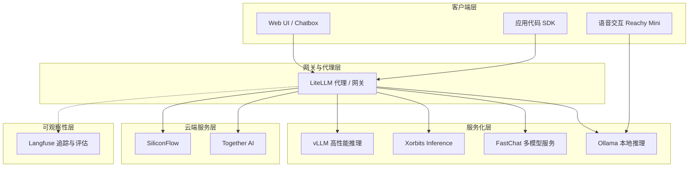
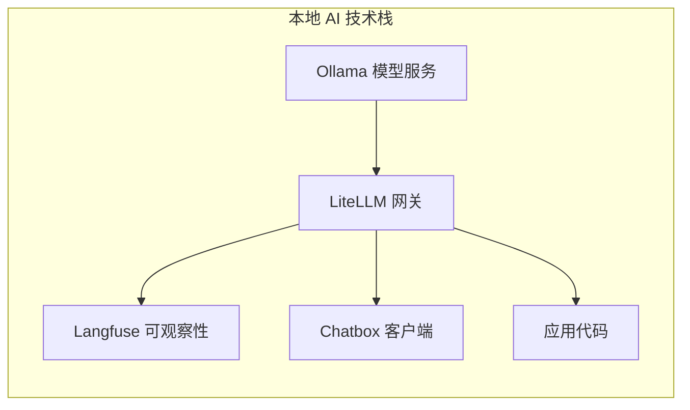

# LLM 部署与开源生态

大语言模型（LLM）的部署与开源生态负责构建从模型到生产环境的完整链路。这一领域涵盖本地推理框架、服务化平台、[[AI-网关|AI 网关]]、可观察性工具以及云端推理服务，形成一套层次分明的工具矩阵。

## 生态全景



上图展示了 LLM 部署生态的典型分层架构。客户端通过统一入口访问模型，网关层负责协议转换与路由，服务化层驱动模型推理，云端服务层提供弹性扩展能力，[[可观察性|可观察性]]工具则贯穿全链路负责监控与调试。

## 本地推理框架

本地推理是让模型在自有硬件上运行的基础能力，核心权衡（Trade-off）在于易用性、性能与硬件兼容性之间的平衡。

### Ollama

[[Ollama|Ollama]] 是当前最流行的本地 LLM 运行框架，通过简洁的命令行接口和 [[Docker|Docker]] 化部署大幅降低上手门槛。Ollama 支持 [[GGUF|GGUF]] 格式模型，提供类 [[Dockerfile|Dockerfile]] 的 [[Modelfile|Modelfile]] 机制定义模型参数与系统提示，并内置模型版本化管理能力。

关键技术特性：

- **环境变量驱动配置**：通过 `OLLAMA_HOST`、`OLLAMA_NUM_PARALLEL`、`OLLAMA_MAX_LOADED_MODELS`、`OLLAMA_KEEP_ALIVE` 等参数控制服务行为
- **systemd 集成**：Linux 环境下通过 systemd 服务管理，支持多并行请求与长时加载
- **嵌入模型支持**：集成 mxbai-embed-large、nomic-embed-text、all-minilm 等嵌入模型，为 [[RAG|检索增强生成]] 提供向量能力
- **视觉问答**：原生支持 LLaVA 等视觉模型，通过 [[SDK|SDK]] 传入图片进行多模态交互

```bash
# 开放 Ollama 服务到局域网
sudo systemctl edit ollama.service
# 添加 Environment="OLLAMA_HOST=0.0.0.0"
# 添加 Environment="OLLAMA_NUM_PARALLEL=3"
sudo systemctl daemon-reload
sudo systemctl restart ollama
```

### Open WebUI

[[Open WebUI|Open WebUI]] 为用户提供类 ChatGPT 的聊天界面，支持 [[Ollama|Ollama]] 与 [[OpenAI-API|OpenAI API]] 两种后端。部署方式灵活，既可通过 [[Docker-Compose|Docker Compose]] 与 Ollama 联动，也可独立运行对接任意兼容 OpenAI 协议的服务。

```yaml
# Docker Compose 配置示例
services:
  openwebui:
    image: ghcr.io/open-webui/open-webui:main
    extra_hosts:
      - host.docker.internal:host-gateway
    ports:
      - "3000:8080"
```

## 服务化框架

服务化框架负责将模型封装为生产级服务，提供多模型管理、负载均衡与 [[OpenAI-API|OpenAI API]] 兼容能力。

### FastChat

[[FastChat|FastChat]] 是 LMSYS 推出的开放平台，采用 Controller-Worker 架构实现多模型服务化。核心组件包括：

- **Controller**：中央调度器，负责模型注册与请求路由
- **Model Worker**：模型执行进程，支持 [[MPS|MPS]]（Apple Silicon）、[[CUDA|CUDA]] 多种加速后端
- **OpenAI API Server**：提供 `/v1/completions` 与 `/v1/chat/completions` 兼容接口
- **Gradio Web Server**：内置 Web 聊天界面

FastChat 支持 [[Qwen|Qwen]]、[[DeepSeek|DeepSeek]]、[[ChatGLM|ChatGLM]]、Vicuna 等主流模型，通过 `--model-names` 参数实现模型别名映射，便于上层应用统一调用。多卡场景下通过 `--num-gpus` 与 `--tensor-parallel-size` 配置张量并行。

```bash
# 启动 Controller
python -m fastchat.serve.controller

# 启动 Model Worker（MPS 加速）
python -m fastchat.serve.model_worker \
    --model-path Qwen/Qwen-1_8B-Chat \
    --device mps

# 启动 OpenAI API Server
python -m fastchat.serve.openai_api_server
```

### Xorbits Inference

[[Xorbits Inference|Xorbits Inference]]（Xinference）是专注于模型服务化的开源平台，提供 Web UI 与 [[REST-API|REST API]] 双交互方式。其核心优势在于：

- **广泛的模型支持**：覆盖 Qwen、DeepSeek、ChatGLM、Llama、Mistral、Mixtral 等数十种模型
- **GGML 引擎集成**：通过 llama-cpp-python 支持 Apple Silicon Metal 加速
- **Chatbox 集成**：可直接对接 [[Chatbox|Chatbox]] 客户端
- **命令行管理**：`xinference-local` 启动服务，`xinference list` 查看运行模型

```bash
# macOS 安装
conda create -n xinference python=3.10.9
CMAKE_ARGS="-DLLAMA_METAL=on" pip install llama-cpp-python
pip install xinference

# 启动服务
xinference-local
```

## AI 网关与代理

[[AI-网关|AI 网关]] 负责统一多提供商、多模型的访问入口，解决协议差异、密钥管理与可观察性问题。

### LiteLLM

[[LiteLLM|LiteLLM]] 是当前最活跃的 LLM 代理/网关解决方案，提供 Proxy Server 与 [[Python-SDK|Python SDK]] 两种使用模式。核心能力包括：

- **统一接口**：将 Ollama、OpenAI、Together AI、Xinference 等提供商的 API 统一为 OpenAI 格式
- **虚拟密钥管理**：通过 master_key 与 salt_key 体系实现多租户访问控制
- **可观察性集成**：原生对接 [[Langfuse|Langfuse]] 实现请求追踪与成本分析
- **模型回退（Fallback）**：支持模型级故障转移与重试策略

```yaml
# config.yaml 示例
model_list:
  - model_name: gpt-4
    litellm_params:
      model: ollama/qwen2.5-coder:7b
  - model_name: deepseek-r1
    litellm_params:
      model: ollama/deepseek-r1
litellm_settings:
  success_callback: ["langfuse"]
  failure_callback: ["langfuse"]
  drop_params: true
```

> ⚠️ `drop_params: true` 配置至关重要。[[Ollama|Ollama]] 不支持 `presence_penalty` 等参数，未开启此选项时会导致 `UnsupportedParamsError`。

### OpenAI API 兼容性

[[OpenAI-API|OpenAI API]] 已成为 LLM 服务的事实标准。主流本地框架与服务化平台均提供兼容接口：

| 服务 | 端口 | 接口路径 |
|------|------|----------|
| [[Ollama|Ollama]] | 11434 | `/v1/chat/completions` |
| [[LiteLLM|LiteLLM]] | 4000 | `/v1/chat/completions` |
| [[Xorbits Inference|Xinference]] | 9997 | `/v1/chat/completions` |
| MindIE | 1025 | `/v1/chat/completions` |

这种兼容性使得应用层代码无需修改即可在不同后端间切换，[[LiteLLM|LiteLLM]] 网关则进一步将非 OpenAI 协议的服务统一封装。

## 可观察性

LLM 应用的可观察性涉及请求追踪、提示管理与评估，是生产部署不可或缺的一环。

### Langfuse

[[Langfuse|Langfuse]] 是开源的 [[LLM|LLM]] 工程平台，覆盖开发、监控、测试全流程：

- **LLM 可观察性**：通过 [[Tracing|Tracing]] 记录每次 LLM 调用的输入输出、延迟与成本
- **提示管理**：版本化管理与部署提示词
- **评估体系**：支持基于模型的评估、用户反馈与手动评分
- **数据集管理**：构建测试数据集进行回归验证

[[Langfuse|Langfuse]] 与 [[LiteLLM|LiteLLM]] 的集成尤为紧密，通过 `success_callback` 与 `failure_callback` 配置即可实现全量请求追踪。

```python
import litellm
litellm.success_callback = ["langfuse"]
litellm.failure_callback = ["langfuse"]
```

## 云端推理服务

云端服务提供弹性、按需的推理能力，适合无需自建基础设施的场景。

### Together AI

[[Together AI|Together AI]] 定位为最快的生成式 AI 云平台，提供 [[OpenAI-API|OpenAI API]] 兼容接口与 [[REST-API|REST API]] 两种访问方式。支持 Llama、Mixtral、Mistral 等开源模型，推理速度表现优异。

```python
from openai import OpenAI
client = OpenAI(
    api_key=TOGETHER_API_KEY,
    base_url='https://api.together.xyz/v1'
)
```

### SiliconFlow

[[SiliconFlow|SiliconFlow]]（硅基流动）是国内领先的 AI 基础设施平台，提供 SiliconCloud 云服务、SiliconLLM 推理引擎与 OneDiff 图像生成引擎。价格方面，DeepSeek-V2-Chat 约 ¥1.33/1M tokens，Qwen2-7B-Instruct 约 ¥0.35/1M tokens，具有较高性价比。

## 应用框架与智能体

应用框架将模型能力封装为可编排的工作流，降低构建 LLM 应用的门槛。

### Dify

[[Dify|Dify]] 是开源的 LLM 应用开发平台，支持通过可视化工作流构建智能体。在政策解读场景中，Dify 可编排 [[vLLM|vLLM]] 提供的高性能推理与 [[Ollama|Ollama]] 托管的嵌入模型（bge-m3），形成完整的 [[RAG|RAG]] 链路。

```bash
# Docker 部署
git clone https://github.com/langgenius/dify
cd dify/docker
cp .env.example .env
docker compose up -d
```

### Reachy Mini 语音智能体

[[Reachy Mini|Reachy Mini]] 语音对话智能体展示了 LLM 部署在嵌入式场景的应用形态。技术栈包括：

- **STT**：[[Faster Whisper|Faster Whisper]] 或 Parakeet-TDT 负责语音转文字
- **LLM**：[[Qwen|Qwen]] 系列模型通过 [[MLX|MLX]] 框架在 Apple Silicon 上推理
- **TTS**：[[Qwen3-TTS|Qwen3-TTS]] 实现低延迟语音合成
- **控制层**：Reachy Mini Control 应用管理硬件交互

该场景体现了 [[Speech-to-Speech|Speech-to-Speech]] 架构的完整链路，从语音输入到动作输出的端到端延迟可控制在百毫秒级。

## 本地 AI 技术栈构建

综合上述工具，可构建完整的本地 AI 技术栈：



[[LiteLLM|LiteLLM]] 作为网关统一路由请求，[[Ollama|Ollama]] 负责本地模型推理，[[Langfuse|Langfuse]] 追踪全链路指标，[[Chatbox|Chatbox]] 提供轻量交互界面。这种架构既保障了数据隐私，又具备生产级的可观测性与灵活性。

## 选型建议

根据场景需求选择合适的部署方案：

| 场景 | 推荐方案 | 关键考量 |
|------|----------|----------|
| 个人体验 | [[Ollama|Ollama]] + [[Open WebUI|Open WebUI]] | 部署简单，开箱即用 |
| 多模型服务 | [[FastChat|FastChat]] 或 [[Xorbits Inference|Xinference]] | 多模型管理，[[GPU|GPU]] 加速 |
| 生产网关 | [[LiteLLM|LiteLLM]] | 统一接口，密钥管理，故障转移 |
| 可观察性 | [[Langfuse|Langfuse]] | 追踪、评估、提示管理 |
| 云端弹性 | [[Together AI|Together AI]] 或 [[SiliconFlow|SiliconFlow]] | 按需付费，免运维 |
| 应用构建 | [[Dify|Dify]] | 可视化工作流，快速原型 |

## 相关概念

- [[AI-网关|AI 网关]]：统一 LLM 访问入口的代理层
- [[模型服务化]]：将模型封装为可水平扩展的服务
- [[可观察性]]：LLM 应用的监控、追踪与评估体系
- [[RAG]]：检索增强生成，依赖嵌入模型与向量检索
- [[vLLM]]：高性能 LLM 推理引擎
- [[GGUF]]：量化模型格式，适用于本地推理
