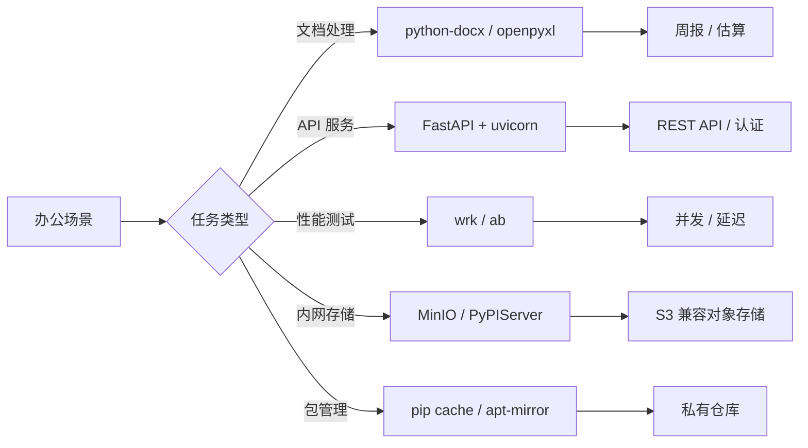

# 办公自动化与效率工具

办公自动化是工程师提升日常生产力的关键实践。本页面聚合从 [[Python]] 脚本编程、[[FastAPI]] 服务开发到私有软件包仓库构建的完整技术栈，覆盖文档处理、周报生成、工作量估算、HTTP 基准测试、JSON 格式化以及内网镜像源部署等场景。

## 技术版图

办公自动化生态涵盖多个层次：以 [[Python]] 为核心的脚本层、以 [[FastAPI]] 为框架的 API 服务层、以 [[MinIO]] 和 [[PyPIServer]] 为代表的内网基础设施层。选型时需在开发效率、运行性能和部署复杂度之间做出[[权衡（Trade-off）]]。

## Python 办公套件与文档处理

[[Python]] 是办公自动化的核心语言，凭借丰富的标准库和第三方包，能够高效处理 [[Excel]]、[[Word]]、[[JSON]] 等常见办公格式。

### Excel 与 Word 自动化

通过 [[openpyxl]] 操作 [[Excel]] 工作簿，支持单元格读写、样式复制和公式设置；通过 [[python-docx]] 操作 [[Word]] 文档，支持段落、表格和图片的自动化插入。[[Python]] 的 `datetime` 和 `timedelta` 模块负责日期计算，是周报时间范围生成的基础。

### 自动生成周报

基于模板克隆的周报生成方案：利用 `shutil.copy` 复制模板文件，通过 [[openpyxl]] 修改工作表标题、报告日期和任务内容。[[Typer]] 提供了类型安全的 CLI 接口，支持参数传递和 `--reporter` 可选参数。[[Python]] 的 `strftime` 和 `strptime` 负责日期格式化。

### 工作量自动估算

工作量估算脚本通过遍历工作表、定位"工作量估算（人天）"单元格，复制单元格样式后随机微调数值。核心逻辑包括：使用 `_find_cell_in_sheet` 定位目标区域，`_copy_cell` 复制完整样式（字体、边框、填充、对齐），`_change_cell_value` 按概率随机减值。[[Typer]] 提供 CLI 入口，[[zipfile]] 负责结果打包。

### 文件目录路径操作

[[Python]] 的 [[os]] 和 [[shutil]] 模块是文件操作的核心。`os.path.basename`、`os.path.dirname`、`os.path.splitext` 处理路径解析；`shutil.copy`、`shutil.copytree` 负责拷贝；`os.walk` 支持递归遍历。[[os.makedirs]] 创建多级目录，[[shutil.rmtree]] 删除目录树。

## JSON 格式化与命令行工具

[[JSON]] 是数据交换的核心格式。[[jq]] 是命令行 JSON 处理利器，支持过滤、转换和格式化。[[Python]] 内置的 `json.tool` 模块同样支持美化输出。在 [[Vim]] 中通过 `%!jq .` 或 `%!python -m json.tool` 可直接格式化当前缓冲区内容。

## FastAPI REST API 服务开发

[[FastAPI]] 是基于 [[Python]] 的现代 Web 框架，凭借自动生成的 [[OpenAPI]] 文档和原生异步支持，成为构建 [[REST API]] 服务的首选。

### 项目架构与依赖注入

标准项目结构包含 `main.py`（入口）、`dependencies.py`（依赖函数）和 `routers/` 路由目录。[[FastAPI]] 的 `APIRouter` 支持模块化路由组织，`Depends` 实现依赖注入。`as_form` 装饰器解决了 [[Pydantic]] 模型与表单数据的兼容问题。

### 文件上传与下载

[[FastAPI]] 支持多种文件传输方式：`request.stream()` 实现二进制流式上传（效率最高），`UploadFile` 支持表单多文件上传，`StreamingResponse` 实现分块下载。基准测试表明：**binary 流式传输效率优于 form-data**，异步读 + 同步写组合效率最高。[[uvicorn]] 和 [[gunicorn]] 是常用的 ASGI 服务器。

### API 密钥身份验证

[[FastAPI]] 通过 `fastapi.security.api_key.APIKeyHeader` 实现 API Key 认证。两种实现方式：方法一通过 `dependencies=[Security(get_api_key)]` 在路由级别声明；方法二通过 `api_key: APIKey = Security(get_api_key)` 在参数级别声明。`auto_error=True` 控制是否在密钥缺失时自动抛出异常。

### 请求文件与表单混合

[[FastAPI]] 支持文件与表单数据混合提交：通过 `Form(...)` 接收标量字段，通过 `Json` 接收结构化数据，通过 `Depends(validate_json(Box))` 实现带验证的 JSON 表单参数。[[Pydantic]] 的 `model_validate` 负责数据验证。

## HTTP 基准测试工具

性能评估是 API 服务的关键环节。[[wrk]] 是基于 HTTP/1.1 的高性能压测工具，支持 [[Lua]] 脚本自定义请求。[[ab]]（Apache Bench）使用 HTTP/1.0，适合简单场景。

### wrk 核心用法

`-t` 设置线程数、`-c` 设置并发连接数、`-d` 设置持续时间。`--latency` 打印延时分布。通过 [[Lua]] 脚本可自定义 `wrk.method`、`wrk.body` 和 `wrk.headers`，支持 POST 表单、JSON 和文件上传。[[wrk]] 支持 `multipart/form-data` 文件上传，需手动构造 boundary 数据。

### 部署注意事项

[[uvicorn]] 默认绑定 `127.0.0.1`，需通过 `--host 0.0.0.0` 开放外部访问。[[gunicorn]] 使用 `--bind 0.0.0.0`。阿里云 [[ECS]] 需在安全组配置端口入站规则（如 5000/8000）。

## 私有软件包仓库

内网环境下，构建私有软件包仓库可加速依赖安装并保障供应链安全。

### 基于 PyPIServer 的 Python 私有仓库

[[PyPIServer]] 是最轻量的私有 [[PyPI]] 仓库方案。通过 [[Docker]] 一行命令即可部署，支持 `pip download` 预缓存依赖包。客户端通过 `~/.config/pip/pip.conf` 配置 `index-url` 和 `extra-index-url`。[[htpasswd]] 实现上传权限控制，[[twine]] 负责包上传。

### 基于 Apt-Mirror 的 Ubuntu 私有仓库

[[apt-mirror]] 同步官方 [[Ubuntu]] 仓库到本地，配合 [[Apache]] 提供 HTTP 服务。`/etc/apt/mirror.list` 配置同步源和架构，支持 `focal`、`bionic` 等版本。客户端通过 `/etc/apt/sources.list` 替换镜像源地址。

### 共享软件包缓存

[[pip]] 和 [[conda]] 均支持共享缓存目录配置。pip 通过 `~/.config/pip/pip.conf` 设置 `cache-dir`；conda 通过 `~/.condarc` 配置 `pkgs_dirs`。共享缓存避免重复下载，加速多环境构建。

## MinIO 对象存储

[[MinIO]] 是 S3 兼容的分布式对象存储系统。单机模式通过 `docker run` 快速启动；分布式模式通过纠删码保障数据安全。[[Docker Compose]] 部署支持 4 节点集群 + [[Nginx]] 负载均衡。[[MinIO Client]]（`mc`）提供 `alias set`、`mb`、`cp`、`ls`、`cat` 等命令。

## Python 语言实践

[[Python]] 的核心语言特性是高效开发的基础。变量赋值是对象引用而非拷贝；`==` 比较值，`is` 比较对象 ID；浅拷贝与深拷贝的差异影响可变对象的处理。[[装饰器]] 通过 `@functools.wraps` 保留原函数元信息。[[asyncio]] 通过 `create_task` 和 `gather` 实现并发。[[生成器]] 通过 `yield` 实现惰性求值。

## 数据安全与误删恢复

`rm -rf *` 是最危险的命令之一。[[extundelete]] 是 [[ext4]] 文件系统的恢复工具，通过 [[inode]] 扫描找回误删文件。预防措施包括：使用 `rm -i` 交互确认、设置 `alias rm='rm -i'`、定期备份关键数据。[[Linux]] 的 `ls -id` 可查看文件 inode 编号。
