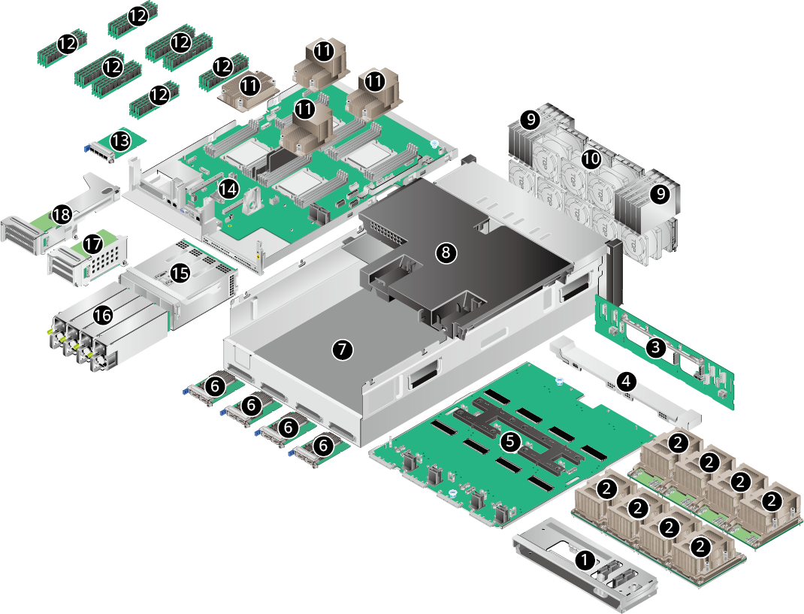
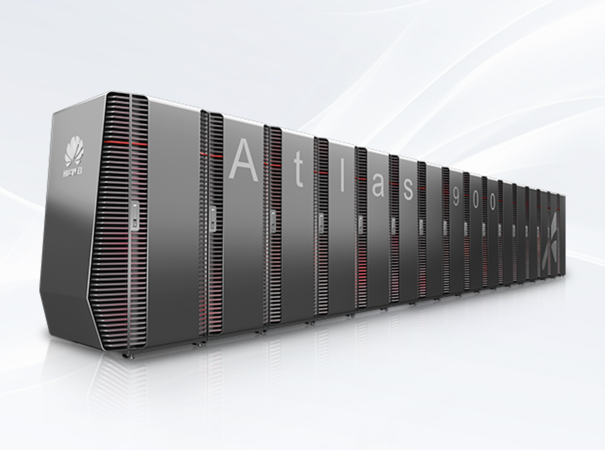
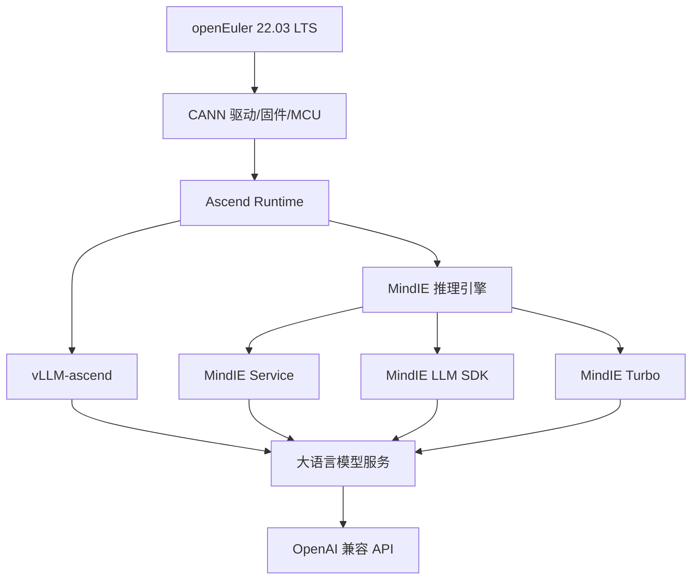
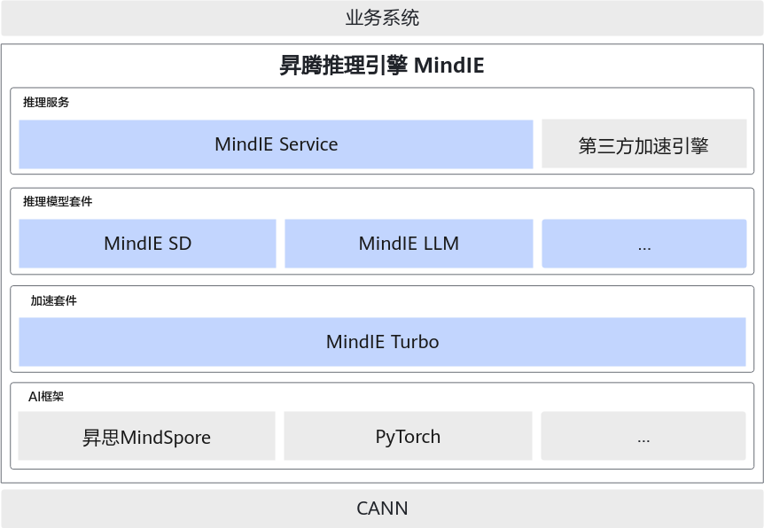
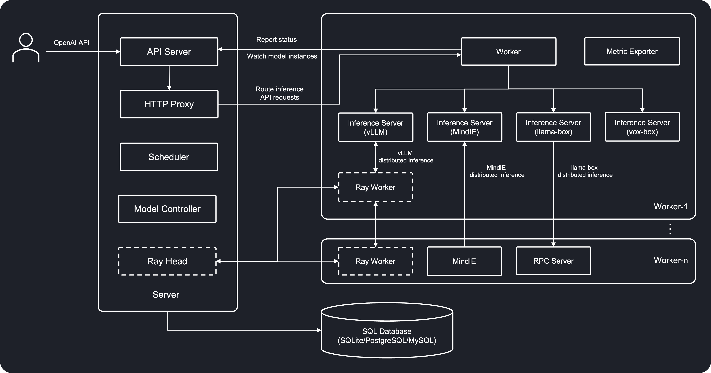
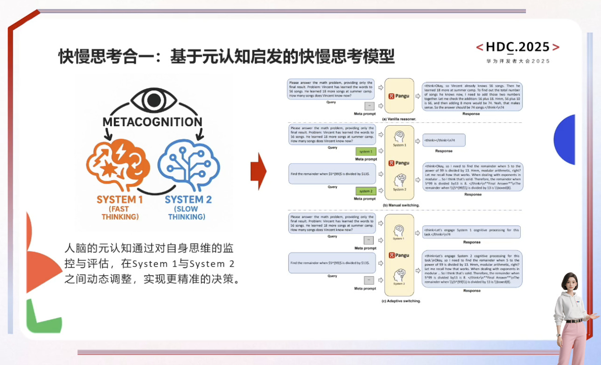

# 华为昇腾与国产芯片

> 本页面系统梳理华为昇腾（Ascend）NPU 的大模型部署全栈实践，涵盖[[硬件架构]]、[[驱动固件安装]]、[[MindIE]] 推理引擎、[[LLM-部署与开源生态|LLM 部署]]、[[集群化管理]]及[[性能调优]]。同时涉及[[海光 DCU]] 推理压测、[[盘古大模型]]关键技术解读，以及 [[GlusterFS]]、[[GPUStack]]、[[Docker-容器化|Docker Swarm]] 等[[分布式部署]]方案。

## 硬件平台

### Atlas 800I A2 推理服务器

Atlas 800I A2 是华为面向[[大模型推理]]场景推出的旗舰设备，采用 **[[鲲鹏 920]]（5250）CPU** + **[[昇腾 910B4]] NPU** 的[[异构架构]]，单机配备 8 张 NPU 卡（每卡 32GB [[HBM]]），总显存 256GB，内存容量 1024GB。

| 组件 | 规格 |
|---|---|
| CPU | 鲲鹏 920（5250），192 核，2.6 GHz |
| NPU | 昇腾 910B4 × 8（32GB HBM/卡） |
| 系统盘 | 450GB SSD × 2（RAID1） |
| 数据盘 | 3.5TB NVMe SSD × 4 |
| 内存 | 1024GB |
| 操作系统 | openEuler 22.03 LTS（aarch64） |



Atlas 800I A2 的 NPU 模组通过高速[[铜排]]与 CPU 主板互联，支持 [[算力]]切分（[[vNPU]]），可将单张物理卡划分为多个[[虚拟设备]]，提升[[资源利用率]]。

### Atlas 900 AI 集群

Atlas 900 是华为面向[[超大规模训练]]的[[集群方案]]，济南人工智能计算中心部署的 Atlas 900 集群配备 384 张昇腾 NPU，采用 [[InfiniBand]] 高速互联网络，搭载[[分布式存储]]系统和[[管理调度]]平台。集群包含 AI 机房、电池间空调系统、UPS 配电柜、水处理系统及网络交换设备，整体设计面向 [[LLM-推理优化|大模型训练与推理]] 的高吞吐场景。



## AI 软件栈架构

华为昇腾的软件栈自底向上分为[[驱动层]]、[[运行时层]]、[[推理引擎层]]和[[应用层]]。理解各层关系是高效部署的前提。



- **CANN（Compute Architecture for Neural Networks）**：昇腾的底层[[计算架构]]，负责驱动、固件和 MCU 管理，对应 [[Linux-与系统管理]] 中的[[驱动安装]]流程。
- **MindIE（Mind Inference Engine）**：华为自研[[推理加速]]套件，包含 Service、LLM、Turbo、Torch 四大组件。
- **vLLM-ascend**：基于社区 [[vLLM]] 的昇腾适配版本，支持[[张量并行]]和[[专家并行]]。

## 部署流程

### 完整安装部署流程

Atlas 800I A2 的部署遵循严格的顺序，任何环节跳步都可能导致[[设备无法识别]]或[[服务启动失败]]。


### ① 逻辑卷创建与存储规划

Atlas 800I A2 配备 4 块 3.5TB [[NVMe SSD]]，通过 [[LVM]] 聚合为单一[[逻辑卷]]，格式化为 [[XFS]] 文件系统挂载至 `/data`。选择 XFS 而非 [[ext4]] 的权衡（Trade-off）在于：XFS 在大文件连续读写和高并发 I/O 场景下表现显著更优，适合[[大模型权重文件]]的加载。

```bash
# 创建物理卷
for d in /dev/nvme{0..3}n1; do pvcreate "$d"; done
# 创建卷组
vgcreate vg_data /dev/nvme0n1 /dev/nvme1n1 /dev/nvme2n1 /dev/nvme3n1
# 创建逻辑卷
lvcreate -l 100%VG -n lv_data vg_data
# 格式化为 XFS
mkfs.xfs /dev/vg_data/lv_data
# 挂载
mkdir -p /data && mount /dev/vg_data/lv_data /data
```

### ②③ 驱动与固件安装

驱动、固件、MCU 的安装顺序取决于场景：**首次安装**遵循"驱动 → 固件"顺序；**覆盖安装**遵循"固件 → 驱动"顺序。这一差异源于 [[DKMS]] 模块的注册机制。

关键步骤：
1. 使用 `lsmod | grep drv_pcie_host` 判断是否已安装
2. 使用 `lspci | grep d802` 验证 NPU 芯片在位（8 张卡对应 8 行 d802）
3. 驱动安装需携带 `--install-username=root --install-usergroup=root --install-for-all` 参数
4. 固件安装后需重启生效

```bash
# 安装驱动
./Ascend-hdk-910b-npu-driver_25.0.rc1.1_linux-aarch64.run --full \
    --install-username=root --install-usergroup=root --install-for-all
# 安装固件
./Ascend-hdk-910b-npu-firmware_7.7.0.1.231.run --full
```

### ④ MCU 升级

MCU（Microcontroller Unit）是昇腾 NPU 的[[带外管理]]模块，负责[[单板监测]]和[[故障上报]]。设备出厂时集成初始版本，必须升级至与[[驱动固件]]配套的版本。通过 `npu-smi upgrade` 命令逐卡升级，可借助自定义脚本 `upgrade_mcu.sh` 一键完成全部 8 张卡的升级。

```bash
# 查询 MCU 版本
npu-smi upgrade -b mcu -i 0
# 升级指定 NPU 的 MCU
npu-smi upgrade -t mcu -i 0 -f Ascend-hdk-910b-mcu_25.50.10.hpm
# 使新版本生效
npu-smi upgrade -a mcu -i 0
```

### ⑤ Docker 安装与配置

[[openEuler]] 22.03 与 [[CentOS]] 8 软件栈兼容，可直接使用阿里云镜像的 [[Docker CE]] aarch64 仓库。配置 `/etc/docker/daemon.json` 时需指定 `data-root` 指向 `/data/docker`，避免占用[[系统盘]]空间。

```json
{
    "registry-mirrors": ["https://docker.xuanyuan.me"],
    "data-root": "/data/docker"
}
```

### ⑥ 镜像导入

通过 [[rsync]] 将 MindIE 和 vLLM-ascend [[镜像同步]]至目标服务器后，使用 `docker load` 导入。MindIE 镜像版本为 `2.0.RC1-800I-A2-py311-openeuler24.03-lts`，vLLM-ascend 镜像版本为 `v0.9.2rc1`。

### ⑦ 大模型下载

支持 [[ModelScope]] 和魔乐社区（[[openmind_hub]]）两种下载方式。使用 ModelScope 时需设置 `TORCH_DEVICE_BACKEND_AUTOLOAD=0` 禁用 [[torch_npu]] 自动加载，避免下载过程中触发 [[NPU 初始化]]。

```bash
# ModelScope 下载
export TORCH_DEVICE_BACKEND_AUTOLOAD=0
modelscope download --model Qwen/Qwen2.5-7B-Instruct --local_dir Qwen2.5-7B-Instruct
# 魔乐社区下载
python3 openmind.py Jinan_AICC/DeepSeek-R1-Distill-Qwen-7B-w8a8 \
    --local_dir /models/deepseek-ai/DeepSeek-R1-Distill-Qwen-7B-w8a8
```

## MindIE 推理引擎

### 架构概览

MindIE 是华为昇腾的[[全场景]][[推理加速]]套件，采用[[分层架构]]设计：



| 组件 | 职责 |
|---|---|
| **MindIE Service** | 推理服务化平台，包含 MS（管理策略）、Server（推理服务）、Client（API 客户端）、Benchmark（性能测试） |
| **MindIE SD** | 多模态生成推理框架 |
| **MindIE LLM** | 大模型优化推理 SDK，包含模型库、推理优化器和运行环境 |
| **MindIE Turbo** | 通用昇腾硬件加速套件，首发支持 vLLM 加速 |
| **MindIE Torch** | PyTorch 框架对接，提供 C++/Python 接口 |

### 单实例部署

MindIE 通过 [[Docker 容器]]部署，需映射 `/dev/davinci_manager`、`/dev/hisi_hdc`、`/dev/devmm_svm` 及 `/dev/davinci0-7` 等[[设备文件]]。核心配置文件 `config.json` 定义了 ServerConfig（端口、[[TLS]]、监听地址）和 BackendConfig（模型路径、NPU 设备 ID、序列长度、调度策略）。

```bash
docker run --net=host --ipc=host -it \
    --name mindie \
    --device=/dev/davinci_manager \
    --device=/dev/hisi_hdc \
    --device=/dev/devmm_svm \
    --device=/dev/davinci0 \
    ... \
    -v /models:/models \
    swr.cn-south-1.myhuaweicloud.com/ascendhub/mindie:2.0.RC1-800I-A2-py311-openeuler24.03-lts
```

启动服务后，通过 [[OpenAI 兼容 API]] 访问：

```bash
curl 'http://localhost:1025/v1/chat/completions' \
    -H "Content-Type: application/json" \
    -d '{"model": "deepseek-r1", "messages": [{"role": "user", "content": "解释人工智能"}]}'
```

### 多实例部署

单台 Atlas 800I A2 的 8 张 NPU 可划分为两组（每组 4 卡），同时部署两个[[模型实例]]。[[多实例部署]]的关键配置：

- **端口分配**：实例 1 使用 1025/1026/1027，实例 2 使用 2025/2026/2027
- **NPU 分配**：实例 1 绑定 davinci0-3，实例 2 绑定 davinci4-7
- **模板化配置**：使用 `config.json.template` + `envsubst` 实现环境变量替换
- **日志目录**：每个实例独立日志目录，权限设置为 750

[[内网环境]]下，官方 MindIE 镜像缺少 `envsubst` 工具，需自定义 [[Dockerfile]] 安装 `gettext` 包。

### Docker Compose 部署

使用 [[Docker-容器化|Docker Compose]] 可简化 MindIE 服务的[[生命周期管理]]。`compose.yml` 需配置 `init: true`（解决 [[PID 1]] 信号转发问题）、`network_mode: host`、`shm_size: 1g`，并通过 `entrypoint` 直接拉起 `mindieservice_daemon`。

## vLLM-ascend 部署

### 部署方式

vLLM-ascend 是 [[vLLM]] 的昇腾适配版本，支持 [[Qwen2.5]]、[[Qwen3]]、[[DeepSeek-V3]] 等模型。部署时需注意：

1. **[[张量并行]]约束**：[[注意力头数]]必须能被 `--tensor-parallel-size` 整除（如 Qwen2.5-7B 有 28 个注意力头，支持 2/4 卡并行，不支持 8 卡）
2. **[[最大序列长度]]**：`--max-model-len` 不可超过模型 `config.json` 中的 `max_position_embeddings`
3. **[[内存碎片]]优化**：设置 `PYTORCH_NPU_ALLOC_CONF=max_split_size_mb:256` 减少内存碎片

```bash
docker run -it --rm --name vllm --network host \
    --device /dev/davinci_manager \
    --device /dev/davinci0 ... /dev/davinci3 \
    -v /models:/models \
    quay.io/ascend/vllm-ascend:v0.9.2rc1 \
    serve /models/Qwen/Qwen2.5-7B-Instruct \
    --tensor-parallel-size 4 --port 8000 --max-model-len 26240
```

### 模型卡数需求

| 模型 | NPU（32G）数 | 备注 |
|---|---|---|
| Qwen3-8B | 1 | 单卡即可部署 |
| Qwen3-30B-A3B | 4 | MoE 架构，需启用 `--enable_expert_parallel` |
| Qwen2.5-32B-Instruct | 4 | 张量并行 |
| Qwen2.5-Coder-32B-Instruct | 4 | 张量并行 |
| Qwen2.5-VL-32B-Instruct | 4 | 多模态模型 |
| DeepSeek-V3-Pruning | 8 | 全卡并行 + 专家并行 |

### DeepSeek-V3 部署注意事项

[[DeepSeek-V3-Pruning]] 在 vLLM-ascend 上的部署存在特殊问题：不设置 `max_tokens` 参数时模型不会停止输出，且输出内容为[[无意义 token]]。需添加 `--enforce-eager` 模式并显式指定 `max_tokens` 限制。

## 性能基准测试

### 性能指标定义

[[大模型推理]]性能测试关注以下核心指标，对应 [[LLM-推理优化]] 中的[[评估体系]]：

- **TTFT（Time to First Token）**：[[首 token 延迟]]，影响用户感知的[[响应速度]]
- **TPOT（Time per Output Token）**：除首 token 外每个后续 token 的[[生成时间]]
- **ITL（Inter-token Latency）**：[[相邻 token 间隔]]，反映[[生成流畅度]]
- **Request Throughput**：请求级 [[QPS]]
- **Token Throughput**：token 级[[吞吐量]]（tok/s）

### DeepSeek-R1-7B 精度对比

在 Atlas 800I A2 上，[[W8A8 量化]]相比 [[Float16]] 在吞吐和延迟上均有提升：

| 指标 | Float16 | W8A8 |
|---|---|---|
| 请求吞吐量 | 21.06 req/s | 22.84 req/s |
| 输出 token 吞吐量 | 2619 tok/s | 2859 tok/s |
| 平均 TTFT | 13399 ms | 12147 ms |
| 平均 TPOT | 57 ms | 52 ms |

### DeepSeek-R1-7B vs Qwen2.5-7B

两者在 4 卡配置下性能接近，Qwen2.5-7B 在 TTFT 上略逊：

| 指标 | DeepSeek-R1-7B | Qwen2.5-7B |
|---|---|---|
| 请求吞吐量 | 23.28 req/s | 22.70 req/s |
| 输出 token 吞吐量 | 2888 tok/s | 2856 tok/s |
| 平均 TTFT | 12327 ms | 12709 ms |

## 集群化管理

### GPUStack 集群管理

[[GPUStack]] 是开源的 [[GPU 集群管理器]]，支持昇腾 NPU，提供统一的[[模型部署]]、[[负载均衡]]和[[故障恢复]]能力。其核心特性包括：

- 多厂商 GPU/NPU 兼容（[[NVIDIA CUDA]]、[[Apple Metal]]、[[AMD ROCm]]、昇腾 CANN、海光 DTK）
- 多推理框架支持（[[vLLM]]、[[Ascend MindIE]]、[[llama-box]]）
- 自动故障恢复与[[多实例冗余]]
- [[OpenAI 兼容 API]]



部署架构分为 [[Server 节点]]和 [[Worker 节点]]。Server 运行于主服务器（172.16.33.106），Worker 运行于各 Atlas 800I A2 节点。通过 [[NFS]] 实现模型文件的[[统一存储]]，避免重复下载。

```bash
# 启动 GPUStack Server
docker run -d --name gpustack \
    --device /dev/davinci0 ... /dev/davinci7 \
    --device /dev/davinci_manager \
    -v /data/models:/models \
    --network=host --ipc=host \
    -v gpustack-data:/var/lib/gpustack \
    gpustack/gpustack:latest-npu --port 8080
```

实测发现 [[vLLM]] 比 [[MindIE]] 快约 10%，但 4 卡与 8 卡配置下 vLLM 速度相同，未出现 [[NVIDIA GPU]] 上的[[线性加速]]现象。

### Docker Swarm 分布式部署

使用 [[Docker-容器化|Docker Swarm]] 可在 Atlas 800I A2 集群上实现[[跨节点模型部署]]。通过 `docker stack deploy` 部署包含 [[Qwen3-30B]] 和 [[Coder-32B]] 的[[服务栈]]，采用 [[overlay 网络]]实现[[跨节点通信]]。

**已知问题**：Docker Swarm 的 overlay 网络依赖 `iptables` 规则，与 `firewalld` 存在冲突，需停止并禁用 [[firewalld]]。实验表明 Docker Swarm 在昇腾 NPU 上的[[分布式部署]]尚未成功，主要瓶颈在于 NPU 设备在 overlay 网络下的[[映射机制]]。

## 共享存储方案

### 分布式文件系统对比

在[[多节点集群]]中，[[共享存储]]是模型权重统一管理的关键。对比 [[NFS]]、[[GlusterFS]]、[[Ceph]] 和 [[HDFS]] 四种方案：

| 特性 | NFS | GlusterFS | Ceph | HDFS |
|---|---|---|---|---|
| 架构 | 客户端-服务器 | 无元数据服务器 | 统一存储 | 主-从 |
| 可扩展性 | 差 | 强 | 极强 | 极强 |
| 可用性 | 单点故障 | 无单点故障 | 自我修复 | NameNode 风险 |
| 适用场景 | 小型文件共享 | 大文件、高性能计算 | 统一存储 | 大数据批处理 |

### GlusterFS 部署实践

[[GlusterFS]] 的[[无元数据服务器]]设计避免了[[单点故障]]，适合大模型权重文件的[[共享存储]]。在 4 台 Atlas 800I A2 上部署[[分布式复制卷]]（replica 2），brick 数量为副本数的整数倍。

```bash
# 配置信任池
gluster peer probe 172.16.33.107
gluster peer probe 172.16.33.108
gluster peer probe 172.16.33.109
gluster peer probe 172.16.33.110
# 创建分布式复制卷
gluster volume create models_volume replica 2 \
    172.16.33.107:/data/gluster_brick \
    172.16.33.108:/data/gluster_brick \
    172.16.33.109:/data/gluster_brick \
    172.16.33.110:/data/gluster_brick force
```

**[[性能瓶颈]]**：实测 GlusterFS 写吞吐 58.6 MB/s、读吞吐 110 MB/s，而[[本地磁盘]]可达 1.9 GB/s（写）/ 2.0 GB/s（读）。瓶颈在于[[千兆网卡]]（1 GbE，约 118 MB/s），建议升级至 [[25 GbE]] 网络。

## 海光 DCU 推理压测

### 硬件配置

海光 DCU（Deep Computing Unit）是海光自研的 [[AI 处理器]]，K100_AI 型号配备 64GB 显存。测试平台配置：

- CPU：[[Hygon C86]] 7490 64核 × 2（共 256 线程，8 [[NUMA 节点]]）
- DCU：Hygon K100_AI 64G × 8
- 驱动：[[hydcu]]

### 压测结果

使用 [[evalscope]] 和 [[vLLM benchmark]] 工具对 [[Qwen2.5-7B]]、[[Qwen2.5-72B]]、[[DeepSeek-R1-Distill-Qwen-7B]] 进行压测：

**Qwen2.5-7B（4 卡）**：
- 输出 token 吞吐量：2033 tok/s
- 平均 TTFT：29485 ms
- 平均 TPOT：110 ms
- 并发 200 时服务失败

**Qwen2.5-72B（8 卡）**：
- 输出 token 吞吐量：602 tok/s
- 平均 TTFT：100031 ms
- 平均 TPOT：398 ms
- 并发可达 500

**DeepSeek-R1-Distill-Qwen-7B（4 卡）**：
- 输出 token 吞吐量：3228 tok/s
- 平均 TTFT：19398 ms
- 平均 TPOT：48 ms

DCU 使用 `HIP_VISIBLE_DEVICES` [[环境变量]]控制 [[GPU 可见性]]，对应 NVIDIA 的 `CUDA_VISIBLE_DEVICES`。vLLM 在 DCU 上不支持自定义 [[all-reduce]] 内核，且注意力头数必须能被张量并行数整除（DeepSeek-R1-7B 的 28 头不支持 8 卡并行）。

## 盘古大模型

[[盘古大模型]]（Pangu）是[[华为云]]推出的[[大模型系列]]，涵盖[[基础模型]]、[[世界模型]]、[[具身智能]]和[[预测大模型]]四大方向：

- **基础模型**：[[NLP 大模型]]，借助[[外部工具]]提升[[行业智能]]水平
- **世界模型**：通过[[数字孪生]]和 [[4D 物理空间]]模拟[[真实世界规律]]，解决[[自动驾驶]]与[[具身智能]]的[[训练数据不足]]和[[安全性]]问题
- **具身智能**：融合 [[3D 空间理解]]、[[物理推理]]及[[行为预测]]能力，目标是在[[高危场景]]中超越人类
- **预测大模型**：打破[[数据孤岛]]，通过[[原子级表达]]实现[[跨场景统一推演]]



## 算力切分（vNPU）

Atlas A2 支持通过 [[npu-smi]] 工具实现[[算力切分]]（vNPU），将单张物理 NPU 卡划分为多个[[虚拟设备]]。系统支持多种[[切分模板]]：

| 模板 | AICORE | 内存(GB) | AICPU | VPC | VDEC | JPEGD |
|---|---|---|---|---|---|---|
| vir10_3c_16g | 10 | 16 | 3 | 4 | 1 | 12 |
| vir10_4c_16g_m | 10 | 16 | 4 | 9 | 2 | 24 |
| vir05_1c_8g | 5 | 8 | 1 | 2 | 0 | 6 |

```bash
# 查询切分模式
npu-smi info -t vnpu-mode
# 创建 vNPU
npu-smi set -t create-vnpu -i 0 -c 0 -f vir10_3c_16g
# 销毁 vNPU
npu-smi set -t destroy-vnpu -i 0 -c 0 -v 100
```

[[vNPU]] 技术允许多个容器共享同一张物理卡，提升[[资源利用率]]，但需权衡（Trade-off）[[算力隔离]]与[[资源共享]]的关系。

## llama.cpp 部署 GPT-OSS

在 Atlas 800I A2 上部署 [[OpenAI]] 开源模型 [[GPT-OSS]] 需通过 [[llama.cpp]] 的 [[CANN 后端]]。编译时启用 `-DGGML_CANN=on`，运行时通过 `CANN_VISIBLE_DEVICES` 指定 NPU 设备。

```bash
# 编译 llama.cpp
cmake -B build -DGGML_CANN=on -DCMAKE_BUILD_TYPE=release -DLLAMA_CURL=OFF
cmake --build build --config release
# 启动 llama-server
CANN_VISIBLE_DEVICES=0,1,2,3,4,5,6,7 ./build/bin/llama-server \
    -a gpt-oss-20b \
    -m /data/models/ggml-org/gpt-oss-20b-GGUF/gpt-oss-20b-mxfp4.gguf \
    -c 0 -fa --jinja --reasoning-format none --gpu-layers 60
```

实测 [[gpt-oss-20b]] 首 token 处理约 902 ms，解码速度约 2.66 tok/s。多次调用后性能显著下降（解码速度降至 1.97 tok/s），原因是 NPU 上同时部署了其他模型，导致[[资源争抢]]。

## 关键配置参数速查

### MindIE 核心参数

| 参数 | 说明 | 典型值 |
|---|---|---|
| `worldSize` | NPU 卡数 | 4 或 8 |
| `maxSeqLen` | 最大序列长度 | 2560 / 8192 |
| `maxInputTokenLen` | 最大输入 token 长度 | 2048 / 4096 |
| `maxIterTimes` | 最大输出 token 长度 | 512 / 4096 |
| `maxBatchSize` | 最大批处理大小 | 200 |
| `npuMemSize` | NPU 内存限制（-1 为不限制） | -1 |

### vLLM-ascend 核心参数

| 参数 | 说明 | 典型值 |
|---|---|---|
| `--tensor-parallel-size` | 张量并行卡数 | 1/2/4/8 |
| `--max-model-len` | 最大序列长度 | 26240 / 32768 |
| `--enable_expert_parallel` | 启用专家并行（MoE 模型） | true |
| `--enforce-eager` | 强制 eager 模式 | 调试用 |

## 常见问题与排错

1. **[[驱动安装]]后 NPU 不识别**：检查 `lspci | grep d802` 输出，确认 8 张卡均在位
2. **[[MindIE 容器]]启动失败**：确认 `/dev/davinci_manager` 等[[设备文件]]已正确映射
3. **[[vLLM 张量并行]]报错**：验证注意力头数能否被并行数整除
4. **[[Docker Swarm 网络]]冲突**：禁用 [[firewalld]] 并重启 [[Docker]]
5. **[[GlusterFS 性能]]低下**：检查网络带宽，千兆网卡是主要瓶颈

## 相关资源

- [[LLM-部署与开源生态]] — 通用 LLM 部署方案对比
- [[LLM-推理优化]] — 推理性能优化技术
- [[Docker-容器化]] — Docker 与容器编排
- [[GPU-与-CUDA-开发]] — NVIDIA GPU 开发对比
- [[Linux-与系统管理]] — 驱动与系统配置
- [[网络与分布式存储]] — 存储网络技术
- [[微调与模型训练]] — 模型微调方法
- [[主流-LLM-与厂商]] — 大模型生态全景
- [[Jetson-与边缘计算]] — 边缘端 AI 部署
- [[具身智能与机器人]] — 具身智能技术
- [[多模态大模型]] — 多模态模型部署
- [[数据集标注与模型评估]] — 模型评估方法
