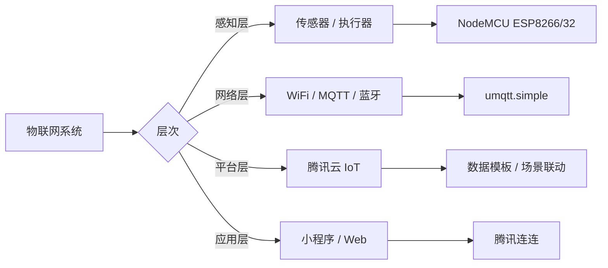

# 物联网与嵌入式开发

[[物联网]]（IoT）与嵌入式开发是连接物理世界与数字世界的桥梁。本页面聚合从 [[MicroPython]] 开发环境搭建、[[MQTT]] 通信协议、智能硬件控制到软路由系统部署的完整实践。

## 技术版图

物联网开发涵盖多个层次：以 [[ESP8266]] 和 [[ESP32]] 为代表的微控制器、以 [[Raspberry Pi]] 为代表的单板计算机、以 [[腾讯云物联网开发平台]] 为代表的云服务，以及以 [[OpenWrt]] 为代表的嵌入式操作系统。

## MicroPython 开发环境

[[MicroPython]] 是 [[Python]] 3 的精简实现，专为微控制器设计。通过 [[esptool]] 烧录固件，可在 [[ESP8266]] 和 [[ESP32]] 上运行 Python 代码。

### ESP8266 环境搭建

[[NodeMCU]] ESP8266 是最流行的物联网开发板之一。开发流程：安装 [[esptool]] → 擦除 Flash → 烧录固件 → 通过串口 REPL 或 [[WebREPL]] 交互。[[MicroPython]] 启动后自动创建 WiFi 接入点（AP），可通过 `192.168.4.1` 访问。

### ESP32 环境搭建

[[ESP32]] 是 ESP8266 的升级版，支持 WiFi + 蓝牙双模、双核处理器。烧录时需指定 `--chip esp32` 和起始地址 `0x1000`。[[ESP32]] 支持低功耗蓝牙（[[BLE]]），需先激活 WiFi 再启用蓝牙。

### 开发工具链

- **[[pyboard.py]]**：命令行工具，支持 `cp`、`cat`、`ls`、`rm`、`mkdir` 等文件操作
- **[[upip]]**：MicroPython 包管理器，类似 pip
- **[[SecureCRT]]** / **[[PuTTY]]**：串口终端工具
- **[[WebREPL]]**：基于浏览器的交互解释器，支持文件传输

## 腾讯云物联网开发平台

[[腾讯云物联网开发平台]]（IoT Explorer）提供设备管理、数据模板、规则引擎和小程序接入能力。默认公共实例支持 1000 个设备免费接入。

### 开发流程

1. **创建项目**：选择行业分类（如智能家居）
2. **创建产品**：定义设备类型和数据模板
3. **定义数据模板**：通过 JSON Schema 描述设备属性、事件和行为
4. **交互开发**：配置小程序（腾讯连连）快速入口
5. **设备调试**：创建设备、获取三元组（产品ID、设备名称、设备密钥）

### MQTT 通信

设备通过 [[MQTT]] 协议与云端通信。[[umqtt.simple]] 是 MicroPython 的 MQTT 客户端库。核心流程：配置 WiFi 连接 → 创建 MQTTClient → 订阅控制主题 → 发布状态数据。

### 智能电灯实现

基于 [[ESP8266]] + 三色 LED + 继电器的智能电灯：[[PWM]] 控制颜色和亮度，[[Relay]] 控制开关。数据模板定义 `power_switch`、`color`、`brightness` 属性。

### 光照传感器实现

基于 [[PT550]] 光敏二极管的光照传感器：[[ADC]] 读取模拟值（0-4095），线性转换为 0-6000 Lux。数据模板定义 `Illuminance` 属性。

### 场景联动

通过腾讯连连小程序配置自动化规则：当光照值低于阈值时自动开灯，高于阈值时自动关灯。支持条件触发和任务执行的组合。

## IoT 硬件组件

### NeoPixel（WS2812B）

[[NeoPixel]] 是可单独寻址的 RGB LED 灯带，每个像素支持 256 级灰度和 1677 万色显示。通过单线控制，[[MicroPython]] 的 `neopixel` 模块提供 `NeoPixel` 类。支持随机颜色、循环、弹跳、淡入淡出等动画效果。

### Raspberry Pi ReSpeaker

[[ReSpeaker]] 2-Mics Pi HAT 是专为语音应用设计的双麦克风扩展板，基于 [[WM8960]] 编解码器。提供 3 个 APA102 RGB LED、1 个用户按钮和 2 个 Grove 接口。通过 [[I2C]] 配置，[[ALSA]] 音频框架处理录音和播放。

### Raspberry Pi Camera

[[Raspberry Pi]] Camera 通过 CSI 接口连接，支持拍照（[[raspistill]]）和录像（[[raspivid]]）。Python 开发使用 [[picamera]] 库。需在 `raspi-config` 中启用 Camera 接口并保证显存 ≥ 128MB。

## OpenWrt 软路由

[[OpenWrt]] 是基于 [[Linux]] 的路由器操作系统。[[LEDE]] 项目提供了更易用的编译版本，支持 SS/SSR/V2RAY/TROJAN 等代理协议。

### 编译与部署

通过 [[Docker]] 容器编译 LEDE 系统：`make defconfig` → `make -j` 编译。输出路径为 `/lede/bin/targets`。

### 网络服务

- **[[SSH]]**：通过 Dropbear 提供远程管理，配置 `HostKeyAlgorithms +ssh-rsa` 兼容旧版
- **[[vsftpd]]**：FTP 服务器，支持文件上传下载
- **[[ShadowSocksR Plus+]]**：代理工具，支持 GFW 列表、绕过大陆 IP、PAC 等多种模式

## 高中英语词汇速记工具

基于纯前端技术的背单词工具，使用 [[Web Speech API]] 实现发音，[[localStorage]] 保存学习状态。支持卡片式记忆、搜索跳转、已会/未会标记、随机顺序和进度统计。
