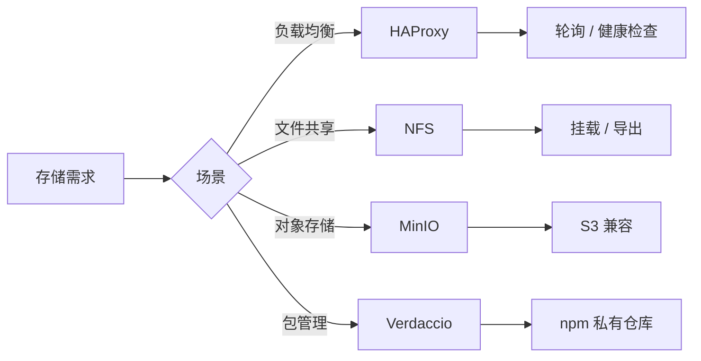

# 网络与分布式存储

网络与分布式存储是构建可靠基础设施的核心能力。本页面聚合从 [[HAProxy]] 负载均衡、[[NFS]] 网络文件系统、[[MinIO]] 对象存储到 [[Verdaccio]] 私有 npm 仓库的完整实践。

## 技术版图

网络存储生态涵盖多个层次：以 [[HAProxy]] 为代表的负载均衡层、以 [[NFS]] 为代表的网络文件系统层、以 [[MinIO]] 为代表的对象存储层，以及以 [[Verdaccio]] 为代表的包管理私有仓库层。

## 基于容器的负载均衡

[[HAProxy]] 是高性能的 TCP/HTTP 负载均衡器，通过 [[Docker]] 容器部署可快速构建可扩展的服务架构。

### 配置核心

[[HAProxy]] 配置文件包含 `global`（全局设置）、`defaults`（默认参数）、`frontend`（前端监听）和 `backend`（后端服务器池）四个部分。负载均衡算法支持 `roundrobin`（轮询）、`leastconn`（最少连接）等。健康检查通过 `check inter 2000 rise 2 fall 5` 配置。

### Docker 部署

通过 `--link` 参数连接后端容器，`-v` 挂载配置文件。[[HAProxy]] 的 `stats enable` 和 `stats uri /admin?stats` 提供监控页面。配合 [[Docker Compose]] 可实现多实例部署。

## NFS 网络文件系统

[[NFS]]（Network File System）是分布式文件系统协议，允许多台主机共享同一目录。

### 服务端配置

[[Ubuntu]] 上通过 `apt install nfs-kernel-server` 安装服务端。`/etc/exports` 配置导出目录和访问权限：`/data/nfs 172.16.33.0/24(rw,sync,fsid=0,crossmnt,no_subtree_check)`。`exportfs -ra` 应用配置。

### 客户端挂载

客户端通过 `apt install nfs-common` 安装工具，`showmount -e <server>` 查看导出列表，`mount -t nfs <server>:/ <local>` 执行挂载。支持 NFS v3、v4.1、v4.2 协议。

## MinIO 对象存储

[[MinIO]] 是 S3 兼容的分布式对象存储系统，专为云原生场景设计。

### 部署模式

- **单机模式**：单容器部署，适合开发测试
- **分布式模式**：多节点纠删码，保障数据安全
- **Docker Compose 部署**：4 节点集群 + [[Nginx]] 负载均衡

### 核心操作

[[MinIO Client]]（`mc`）是命令行工具：`mc alias set` 添加存储别名，`mc mb` 创建存储桶，`mc cp` 上传文件，`mc ls` 列出文件，`mc cat` 显示内容。[[MinIO]] 的纠删码机制保障部分节点故障时数据不丢失。

## Verdaccio 私有 npm 仓库

[[Verdaccio]] 是基于 [[Node.js]] 的轻量级私有 npm 仓库，支持包发布、缓存和用户管理。

### 部署方式

通过 [[Docker]] 拉取 `verdaccio/verdaccio` 镜像，挂载配置目录、插件目录和存储目录。配置文件 `config.yaml` 定义存储路径、认证方式、上游代理和包访问权限。

### 核心配置

- **存储**：`storage: /verdaccio/storage/data`
- **认证**：`auth.htpasswd.file` 指定密码文件
- **上游代理**：`uplinks.npmjs.url` 配置 npmjs.org 作为上游
- **包权限**：`packages` 配置访问控制（`$all`、`$authenticated`、`$anonymous`）

### 自动缓存机制

[[Verdaccio]] 自动缓存从上游下载的包，后续请求直接返回本地副本，加速安装并减少外网依赖。支持 `proxy: npmjs` 配置透明代理。

### 用户管理

通过 `htpasswd` 创建用户，`npm adduser --registry <url>` 登录，`npm publish` 发布包。`max_users: -1` 可禁用注册。
