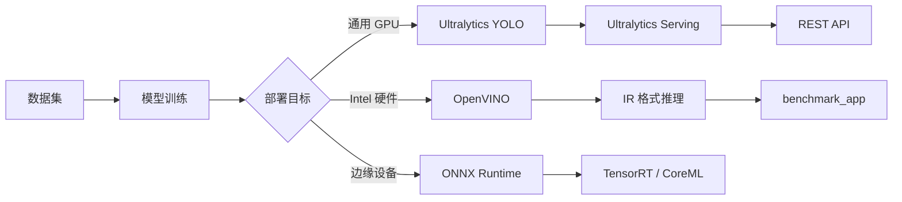

# 计算机视觉与目标检测

计算机视觉是人工智能的"眼睛"，负责从图像和视频中提取语义信息。本页面聚合从 YOLO 系列目标检测、OpenVINO 模型优化与推理部署，到 Ultralytics 生态工具链的完整实践，覆盖训练、转换、部署、性能分析全流程。

## 技术栈总览



## Ultralytics YOLOv8：目标检测的工业标准

[[Ultralytics YOLOv8]] 是当前最主流的[[目标检测]]框架，支持检测、分类、分割和姿态估计任务。其 `yolo` CLI 提供从训练到推理的一站式接口，同时支持 [[PyTorch]]（`.pt`）和 [[ONNX]] 两种导出格式。

### 推理速度对比：PyTorch vs ONNX

在实际测试中，YOLOv8 的推理速度表现呈现反直觉的结果：

**CPU 环境**（Intel Xeon E5-2640 v4, 40 核）：
| 格式 | 训练后推理速度 | 模型大小 |
|------|------|------|
| best.pt | 35.9 ms | 6 MB |
| best.onnx | 53.0 ms | 12 MB |

**GPU 环境**（Tesla T4, CUDA 11.2）：
| 格式 | 训练后推理速度 | 模型大小 |
|------|------|------|
| best.pt | 7.3 ms | 6 MB |
| best.onnx | 13.8 ms | 12 MB |

**结论**：在 YOLOv8 场景中，PyTorch 原生格式比 ONNX 快约 31-38%，且模型体积更小。这与"ONNX 更快"的常见认知相悖——原因在于 PyTorch 的 CUDA 优化已非常成熟，而 ONNX Runtime 的通用性带来了额外开销。在选择部署格式时，需根据实际硬件和推理框架做出[[权衡（Trade-off）]]。

### 训练前后模型体积变化

PyTorch 训练过程中的 `best.pt` 约 24 MB，训练完成后仅 6 MB。差异源于训练时保存了优化器状态、梯度等临时信息，最终模型只保留参数和结构。转 ONNX 后膨胀至 12 MB，因为 ONNX 需要保存额外的模型元数据以支持跨框架互操作。

## Ultralytics Hub 与 Roboflow：云端训练流水线

[[Ultralytics Hub]] 是 Ultralytics 官方提供的云端训练平台，支持数据集上传、模型选择、参数配置和 [[Google Colab]] 一键训练。数据集需按 `data.yaml` 规范组织（定义 `train`、`val`、`test` 路径和类别映射），压缩为 zip 后上传。

[[Roboflow]] 提供完整的数据标注、版本管理和部署能力：

- **标注**：支持手动标注和自动标注，内置标注质量检查（Annotation Heatmap、Object Count Histogram）
- **预处理**：图像尺寸调整、归一化
- **增强**：旋转、翻转、色彩抖动等数据增强
- **导出**：支持 [[YOLO]]、COCO、Pascal VOC 等格式
- **部署**：提供 Python SDK 直接调用训练好的模型

Roboflow Universe 是一个开放的预训练模型社区，可直接搜索和复用公开模型。配合 [[Ultralytics Hub]] 可实现从数据集管理到云端训练的完整流水线。

## 基于 FastAPI 的推理服务

[[Ultralytics Serving]] 是一个基于 [[FastAPI]] + [[ONNX Runtime]] 的 [[YOLO]] 推理服务，支持多架构 Docker 镜像构建（amd64 / arm64）。

### 核心架构

- **Web 框架**：FastAPI + Uvicorn + Gunicorn，支持热重载
- **推理引擎**：ONNX Runtime，支持 CUDA 加速
- **多架构构建**：`docker buildx build --platform=linux/amd64/arm64`
- **API 文档**：Swagger UI + ReDoc，支持离线部署（内网环境需本地化 CDN 资源）

### 内网部署注意事项

在内网环境中，[[FastAPI]] 的 `/docs` 和 `/redoc` 页面因无法加载 [[CDN]] 资源而显示缓慢或报错。解决方案是通过 `docs_url=None, redoc_url=None` 禁用默认文档，然后手动挂载本地 [[Swagger UI]] 和 [[ReDoc]] 静态文件。

## OpenVINO：Intel 硬件推理优化

[[OpenVINO]]（Open Visual Inference and Neural Network Optimization）是 Intel 推出的神经网络推理优化工具包，专为 Intel CPU、GPU、VPU 和 FPGA 等硬件加速。其核心流程是：下载预训练模型 → 转换为 IR 格式 → 在目标设备上编译和推理。

### 模型下载与转换

OpenVINO 提供 Open Model Zoo（OMZ），包含图像分类（[[GoogleNet]]、[[ResNet]]）、目标检测（[[SSD]]、[[YOLO]]）等数百款预训练模型：

```bash
omz_downloader --name googlenet-v1
omz_converter --name googlenet-v1
```

转换后生成 `.xml`（网络结构）和 `.bin`（权重）两个文件，支持 FP16 和 FP32 精度。

### 图像分类推理

基于 [[GoogleNet]]-v1 的图像分类示例展示了 OpenVINO 推理的标准流程：

1. 创建 Runtime Core
2. 读取模型（`.xml` / `.bin` 或 `.onnx`）
3. 构建预处理（[[PrePostProcessor]]）：设置输入布局（NHWC → NCHW）、尺寸调整
4. 编译模型到目标设备（CPU / GPU / MYRIAD）
5. 同步或异步推理
6. 后处理（Top-K 分类结果）

### 目标检测推理

基于 [[SSD]]300 的目标检测示例输出边界框坐标和置信度，后处理时过滤低置信度（< 0.5）的检测结果，绘制矩形框。[[SSD]] 输出格式为 `[1, 1, N, 7]`，每个检测框包含 `[_, class_id, confidence, xmin, ymin, xmax, ymax]`。

## 性能分析与优化

### 神经网络性能分析

OpenVINO 提供逐层性能分析能力，通过 `PERF_COUNT` 配置项启用，可获取每层的 Real Time、CPU Time 和执行状态。分析 SSD300 在 CPU 上的推理瓶颈：

- 最耗时层：`fc6/WithoutBiases`（卷积层，0.022724 s）和 `conv4_3/WithoutBiases`（0.022195 s）
- 大量 Reorder 和 Transpose 层消耗在数据布局转换上
- ReLU 层与卷积融合后状态为 `NOT_RUN`（已被优化器合并）

这一分析为模型优化提供了明确方向——重点优化大卷积层和减少布局转换开销。

### Benchmark Python Tool

`benchmark_app` 是 OpenVINO 的性能基准测试工具，支持同步（[[Latency]]）和异步（[[Throughput]]）两种推理模式：

| 模式 | 优化目标 | 典型吞吐量（GoogleNet CPU） |
|------|------|------|
| 同步 + LATENCY | 单帧延迟最低 | 170.76 FPS |
| 异步 + THROUGHPUT | 吞吐量最高 | 449.02 FPS |
| 异步 + LATENCY 提示 | 平衡模式 | 333.59 FPS |

在 CPU 上增大批量尺寸（batch size）对推理性能提升有限，从 batch=1 到 batch=2 吞吐量仅从 443 提升至 450 FPS。

### Cross Check Tool

[[Cross Check Tool]]（CCT）用于比较两次推理的精度和性能指标，支持：

- **跨设备检查**：同一 IR 在不同设备（如 GPU vs CPU）上的精度差异
- **跨精度检查**：同一设备不同精度（FP16 vs FP32）的精度差异
- **张量转储**：保存推理中间结果用于离线分析

测试表明，[[GPU]] vs [[CPU]] 的 max absolute difference 仅 `2.38e-07`，精度一致性极高；而 [[FP16]] vs [[FP32]] 的差异达 `0.707`，低精度推理在部分场景下可能引入不可忽略的误差。

## DL Workbench：可视化开发环境

[[DL Workbench]] 是 OpenVINO 的基于 Web 的可视化开发环境，通过 [[Docker]] 部署（`openvino/workbench:2022.1`，端口 5665）。其工作流包括：导入数据集 → 导入模型 → 配置设备 → 运行推理 → 性能分析 → 导出优化模型。适合不熟悉命令行的开发者快速验证模型性能。

## 边缘设备视觉应用

在 [[Reachy Mini Conversation App]] 中，视觉处理作为机器人感知层集成：

- **头部追踪**：可选 [[YOLO]] 或 [[MediaPipe]] 实现面部检测与追踪
- **图像处理**：线程安全帧缓冲 + 2 秒面部丢失延迟 + 平滑插值
- **本地推理**：[[SmolVLM2]] 本地部署（`--local-vision`）
- **远程推理**：调用后端 [[LLM]] 分析图像

这一架构体现了计算机视觉从"独立推理"走向"与运动和决策系统深度耦合"的趋势——视觉模块不仅输出检测结果，还直接驱动机器人的行为（如头部跟随）。

## 部署工程实践

### Docker 多架构构建

在 x86 服务器和 ARM 边缘设备混部场景中，需构建多架构镜像。[[Docker]] 的 `buildx` 工具支持跨平台构建：

```bash
docker buildx build --platform=linux/amd64 --pull --rm -f Dockerfile -t image:amd64 . --push
docker buildx build --platform=linux/arm64 --pull --rm -f Dockerfile -t image:arm64 . --push
```

### ONNX Runtime 推理

使用 [[ONNX Runtime]] 进行 [[YOLO]] 推理的标准流程：

```python
import onnxruntime as ort
ort_session = ort.InferenceSession("yolov5.onnx", providers=["CUDAExecutionProvider"])
ort_inputs = {ort_session.get_inputs()[0].name: resized}
ort_outs = ort_session.run(None, ort_inputs)
```

获取输入输出名称的方法：`session.get_inputs()[0].name` / `session.get_outputs()[0].name`。[[ONNX]] 模型可使用 [[Netron]] 可视化网络结构和张量形状。[[TensorRT]] 是 NVIDIA 的高性能推理优化器，可将 ONNX 模型进一步加速。

## YOLO 系列目标检测演进：从 v3 到 v5

[[YOLO]] 系列是目标检测领域最具影响力的单阶段检测框架。本节聚合从 Darknet 原生训练到 PyTorch 工程化的完整实践路径。

### YOLOv3：Darknet 原生训练工程化

YOLOv3 在 Darknet 框架下的自定义训练流程包含三个关键环节：

1. **数据准备**：使用 [[LabelImg]] 标注图像，生成 [[PASCAL VOC]] 格式 XML 文件，转换为 YOLO 格式（`class_id x y width height`，坐标归一化到 0-1）
2. **配置调整**：修改 `yolov3.cfg` 中的 `filters=(classes+5)×3` 和 `classes` 参数（共 3 处，对应 3 个检测尺度），基于 `darknet53.conv.74` 预训练权重微调
3. **训练与推理**：`darknet detector train` 训练，`darknet detector test` 推理

为提升工程化水平，实践将训练和预测封装为 [[Docker]] 容器：训练容器（`darknet`）挂载工程目录支持多 GPU 训练（`-gpus 0,1,2,3`）；预测容器（`darknet-serving`）暴露端口 7713 提供推理服务。这种容器化方案使得模型训练和部署可以[[权衡（Trade-off）]]灵活地在不同环境中迁移。

### YOLOv4：精度与速度的进一步突破

YOLOv4 在 Darknet 框架下引入 CSPDarknet53 backbone、SPP 和 PANet 等改进。在 GTX1060 6G 显卡上的配置要点：`batch=8`、`subdivisions=8`、输入尺寸 `512×512`。训练时通过 `-mjpeg_port 8090` 参数启用 MJPEG 流可视化，可在浏览器中实时监控训练进度。预训练权重为 `yolov4.conv.137`。

### YOLOv5：PyTorch 时代的工程化范式

YOLOv5 标志着 [[YOLO]] 从 C 语言框架向 [[PyTorch]] 生态的全面转型。其数据组织采用 `data.yaml` 配置文件定义训练/验证路径和类别，支持 `yolov5s/m/l/x` 四种规格。在 4 张 GPU 上的批量训练脚本：

```bash
for v in 's' 'm' 'l' 'x'
do
  python train.py --epoch 100 --batch-size 64 --data project/data.yaml \
    --cfg project/models/yolov5$v.yaml --weights project/models/yolov5$v.pt \
    --project project/runs-$v/train
done
```

推理阶段支持 `--save-txt` 输出 YOLO 格式标注、`--classes` 过滤类别、`--exist-ok` 固定输出目录等参数。配合 [[JupyterLab]] 和 [[TensorBoard]] 可实现训练过程的可视化监控——需注意 `jupyter-tensorboard 0.2.0` 不支持 TensorBoard 2.0+，需降级到 1.15 版本。

### 数据格式转换：PASCAL VOC → YOLO

不同标注工具产生的格式差异是实际工程中的常见痛点。[[PASCAL VOC]] 使用 XML 存储绝对坐标边界框（`xmin, ymin, xmax, ymax`），而 [[YOLO]] 使用归一化的中心点坐标（`class_id x_center y_center width height`）。转换公式：

```python
x = (xmin + xmax) / 2 / image_width
y = (ymin + ymax) / 2 / image_height
w = (xmax - xmin) / image_width
h = (ymax - ymin) / image_height
```

## 实例分割与经典检测框架

### Mask RCNN：两阶段实例分割

[[Detectron]]（Facebook AI）框架下的 Mask RCNN 实践采用 [[ResNet]]-101 + FPN 架构，支持 [[COCO]] 格式数据集。关键配置包括：`NUM_CLASSES`、`MAX_iter`、学习率策略（steps_with_decay）、FPN 多尺度 RoI 对齐。训练通过 `train_net.py` 执行，推理通过 `infer_simple.py` 执行。实践中需修复 `yaml.load` 的 Loader 参数兼容性问题。

### RetinaNet：单阶段 focal loss 实践

[[RetinaNet]] 使用 [[TensorFlow]] 2 + [[Keras]] 实现，以 `focal loss` 解决单阶段检测中的类别不平衡问题。基于 `keras-retinanet` 容器，流程为：LabelImg 标注 → VOC 转 CSV → 划分训练/验证集 → 训练（`train.py`）→ [[TensorBoard]] 可视化 → 评估（`evaluate.py`）→ 模型转换（`convert_model.py`，417MB → 140MB）→ 预测。

## OpenVINO 工具链全景

[[OpenVINO]] 在 Intel 硬件上构建了从模型优化到部署的完整工具链，本节聚合其安装配置、工作原理和组件生态。

### 安装与验证

开发包 `openvino-dev` 支持 [[PyTorch]]、[[TensorFlow]]、[[ONNX]]、Caffe、MXNet、Kaldi 等多种框架的模型导入。通过 `hello_query_device` 样例可查询设备支持的精度（FP32/FP16/INT8）和优化能力。在 Intel i7-8700 + UHD 630 的配置上，CPU 支持 FP32/FP16/INT8/BIN，GPU 支持 FP32/FP16。

### 工作原理：从训练到部署的五步流程

OpenVINO 定义了清晰的端到端工作流：

1. **计划和设置**：确定主机/目标平台（Linux/Windows/macOS/Raspbian），选择模型框架
2. **训练模型**：使用预训练模型（[[Open Model Zoo]]）或自建模型
3. **转换和优化**：运行模型优化器（MO）将模型转换为 [[IR]] 格式（`.xml` + `.bin`），支持 FP16 压缩、预处理嵌入、模型裁剪
4. **调整性能**：推理引擎（IE）编译模型到目标设备，支持多设备执行、异构执行、自动批处理
5. **部署应用程序**：通过部署管理器打包运行时环境

### Open Model Zoo 与 MTCNN 人脸检测

[[Open Model Zoo]]（OMZ）提供数百款预训练模型，涵盖图像分类、目标检测、人脸检测等任务。以 MTCNN 人脸检测为例，三阶段级联网络（Proposal → Refine → Output）在 CPU 上的推理延迟约 1160ms（FPS 0.9）。模型通过 `omz_downloader` 下载、`omz_converter` 转换为 IR 格式。

### Get Started YOLOv5：云端训练与可视化

YOLOv5 的快速上手流程：`torch.hub.load` 加载预训练模型 → `detect.py` 支持摄像头/视频/URL/RTSP 等多种输入源 → `train.py` 训练自定义数据集。可视化支持 [[Weights & Biases]]（wandb）和 [[TensorBoard]] 两种方案，其中 `tensorboard --bind_all` 可将训练指标暴露到局域网。

## OpenCV 图像处理基础与 PaddleOCR

### OpenCV Python 实践

[[OpenCV]] 是计算机视觉的基础库，核心操作包括：

- **图像变换**：`resize`（按比例或像素）、`rotate`（90°/180°/270°）、`flip`（水平/垂直翻转）
- **颜色空间**：`cvtColor`（BGR → Gray → 二值化）
- **绘制**：`line`、`rectangle`、`circle`、`putText`
- **中文支持**：OpenCV 的 `putText` 不支持中文，需通过 `cv2.freetype.createFreeType2()` 或 [[PIL]] 的 `ImageFont` 实现
- **视频处理**：`VideoWriter` 编码（XVID/MJPG），需确保图像尺寸与编码器设置一致

### PaddleOCR 文字识别

[[PaddleOCR]] 基于 [[PaddlePaddle]] 框架，支持中英文识别。核心参数 `use_angle_cls=True` 启用方向检测，`det_limit_side_len` 控制检测图像的长边尺寸（增大可提升大图精度）。输出格式为 `[box_coordinates, (text, confidence)]`，其中 box 包含 4 个角点坐标。

## Ultralytics YOLOv8 生态与推理服务

### YOLOv8 框架能力

[[Ultralytics YOLOv8]] 提供统一的 `yolo` CLI 接口，支持检测、分类、分割和姿态估计。其 `benchmark` 模式可跨格式评估推理性能：

**CPU 环境关键数据**（YOLOv8n, 640px）：
| 格式 | 推理时间 | 模型大小 |
|------|------|------|
| PyTorch | 186.26 ms | 6.2 MB |
| ONNX | 61.08 ms | 12.2 MB |
| OpenVINO | 21.58 ms | 12.3 MB |
| TensorRT | N/A | - |

**GPU 环境关键数据**（Tesla T4）：
| 格式 | 推理时间 | 模型大小 |
|------|------|------|
| PyTorch | 13.39 ms | 6.2 MB |
| ONNX | 10.97 ms | 12.2 MB |
| TensorRT | 4.80 ms | 16.1 MB |

YOLOv8 支持导出 13 种格式，包括 [[PyTorch]]、[[ONNX]]、[[OpenVINO]]、[[TensorRT]]、CoreML、TF Lite、PaddlePaddle 等。训练可视化支持 [[Comet]] 和 [[ClearML]] 两种平台。

### REST API JSON 格式标准

不同 AI 服务商的 [[目标检测]] API 响应格式存在显著差异，实践中需做适配层：

- **[[Hugging Face]]**：`[{score, label, box: {xmin, ymin, xmax, ymax}}]`，简洁的数组结构
- **[[Azure]] Cognitive Services**：`{objects: [{rectangle: {x, y, w, h}, object, confidence, parent}]}`，支持层级分类
- **[[Google Cloud]] Vision**：`{localizedObjectAnnotations: [{boundingPoly: {normalizedVertices}, name, score}]}`，使用归一化坐标
- **[[AWS]] Rekognition**：`{CustomLabels: [{Name, Confidence, Geometry: {BoundingBox: {Width, Height, Left, Top}}}]}`
- **[[ModelScope]]**：`{data: {boxes: [[x1,y1,x2,y2]], labels, scores}}`，边界框为绝对坐标

## 开源 OCR 引擎基准测试

在中文场景下对比 [[EasyOCR]]、[[PaddleOCR]]、[[Tesseract]] 三款开源引擎：

**速度对比**（CPU Intel Xeon Silver 4216，首次/后续推理）：
| 引擎 | CPU 首次 | CPU 后续 | CUDA (T4) 后续 |
|------|------|------|------|
| EasyOCR | 11015 ms | 6184 ms | 1194 ms |
| PaddleOCR | 11508 ms | 8135 ms | 784 ms |

**关键发现**：
- EasyOCR 在 CPU 上后续推理快 35%，但 CUDA 环境下 PaddleOCR 快 52%
- EasyOCR 需 3GB 显存，PaddleOCR 需 2GB
- 在 Apple M2 Max 上通过 amd64 容器运行会出现 `Illegal instruction`（NNPACK 不兼容），但 Linux amd64 正常
- EasyOCR 与 [[PyTorch]] 版本强绑定（torch 2.0.1 + torchvision 0.15.2），升级后出现 `Segmentation fault`
- 使用 `faulthandler.enable()` 可定位 C/C++ 扩展的崩溃位置

## 多模态视觉语言模型

2024-2025 年，视觉语言模型（VLM）将 [[OCR]]、图像理解、文档分析能力整合到统一框架，形成对传统 pipeline 的降维打击。

### CogVLM2：智谱开源多模态大模型

[[CogVLM2]]-Llama3-19B 基于 Meta-Llama-3-8B-Instruct 基座，支持 8K 文本长度和 1344×1344 分辨率。实测能力包括：

- **OCR**：印刷体中文/英文、手写英文作文识别（含错误自动纠正）
- **表格识别**：复杂表格转 Markdown，支持非常规样式
- **信息提取**：保单、火车票、手机充值订单的结构化提取（JSON 格式）
- **专业场景**：电网缺陷识别（绝缘层破损、杆塔鸟窝、吊臂下有人）
- **图像描述与数学题**：基础能力可用，但数学推理存在错误

提示词工程是关键——需要精确描述需求（如"识别图像中的手写英文"而非"对图像文字进行识别"），JSON 格式输出需显式指定。

### Phi-3-vision：微软轻量级多模态模型

[[Phi-3-vision]]-128k-instruct 仅 4B 参数，支持 128K 上下文。在 OCR 和表格理解上表现良好，但中文识别能力弱于 CogVLM2。其优势在于内存/计算受限环境下的高效推理。

### GLM-4V-9B：智谱视觉语言模型

[[GLM-4V-9B]] 支持 1120×1120 高分辨率中英双语对话。在复杂表格识别上存在不足（如代码注入分类表格的合并单元格处理），但中文 OCR 能力较强。

### DeepSeek-OCR：上下文光学压缩

[[DeepSeek-OCR]] 提出"上下文光学压缩"范式，将图像编码为视觉词元（visual tokens），通过语言模型解码为文本。核心架构：

- **DeepEncoder**：SAM（冻结）+ CLIP（可训练）+ 压缩器，将图像压缩为少量视觉词元
- **语言模型**：DeepSeek3B-MoE，12 层分为 2 个流水线并行阶段
- **训练**：20 节点 × 8 A100-40G，全局 batch size 640，纯文本 90B tokens/天

支持多种提示词模板：`Free OCR`、`Convert the document to markdown`、`Parse the figure`、`Locate <|ref|>...<|/ref|> in the image`。在 Fox 和 OmniDocBench 基准上表现优异。推理需 `flash_attention_2` 支持，当前版本与 transformers 存在 `LlamaFlashAttention2` 导入兼容问题。

## Hugging Face 开源模型生态

[[Hugging Face]] Transformers 库提供统一的 pipeline API，覆盖多种视觉任务：

- **目标检测**：`facebook/detr-resnet-50`，端到端 Transformer 检测器
- **图像分类**：`pipeline("image-classification")`
- **零样本分类**：CLAP 模型支持音频零样本分类（但中文支持不佳）
- **自动语音识别**：`distil-whisper/distil-small.en`，支持长音频分块转录
- **文本转语音**：`kakao-enterprise/vits-ljs`

配合 [[Gradio]] 可快速构建可共享的 Web 演示应用（`demo.launch(share=True)`）。

## Reachy Mini 机器人视觉音频交互

[[Reachy Mini]] 是 Pollen Robotics 推出的桌面级机器人，其 Python SDK 将视觉、音频、运动控制统一到客户端-服务器架构中。

### 视觉交互

- **图像捕获**：`mini.media.get_frame()` 返回 BGR 格式的 numpy 数组（uint8）
- **实时串流**：通过 `cv2.imencode` + `IPython.display` 在 Notebook 中实现约 30fps 的实时显示
- **拍照工作流**：结合 [[OpenCV]] 编码、音频提示、头部动作的"倒计时拍照"行为

### 音频交互

- **硬件**：ReSpeaker 4 麦克风阵列 + 扬声器，16kHz 采样率
- **录制**：`start_recording()` → 循环 `get_audio_sample()` 采集 → `stop_recording()`
- **播放**：`start_playing()` → `push_audio_sample()` 分块推送 → `stop_playing()`
- **音量控制**：通过守护进程 [[REST API]]（`/api/volume/set`）调节扬声器/麦克风音量

### 运动控制

头部 6 自由度（3 平移 + 3 旋转），`goto_target()` 平滑插值到目标姿态。天线以 `[右, 左]` 弧度制控制，支持 81 种预录情感动作。这种将视觉感知、音频交互、运动控制深度耦合的架构，体现了[[具身智能]]的发展趋势。

## 相关技术

- [[语音与音频处理]]：机器人系统中的多模态感知
- [[具身智能与机器人]]：视觉在具身场景中的应用
- [[Jetson 与边缘计算]]：边缘端视觉推理硬件
- [[GPU 与 CUDA 开发]]：GPU 加速推理
- [[华为昇腾与国产芯片]]：国产推理加速方案
