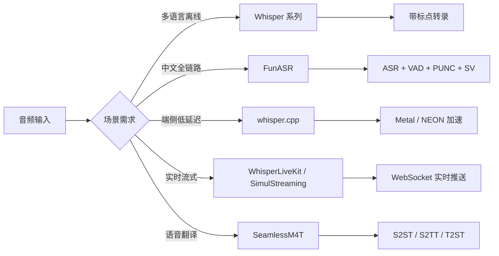

# 语音与音频处理

语音与音频处理是人工智能中连接声学信号与自然语言的关键领域，涵盖[[语音识别]]（ASR）、[[语音合成]]（TTS）、语音翻译、说话人分离和音频事件检测等核心任务。本页面聚合从 [[Whisper]] 到 [[FunASR]]、从云端 API 到端侧 C++ 部署的完整工程实践，覆盖离线转写、实时流式识别以及多模态语音对话系统。

## 技术版图与选型权衡

语音处理生态呈现明显的分层格局：以 [[Whisper]] 为代表的多语言通用模型、以 [[FunASR]] 为代表的中文优化全链路工具包、以 [[whisper.cpp]] 为代表的端侧推理方案，以及以 [[SeamlessM4T]] 为代表的多模态翻译模型。选型时需在识别精度、推理延迟、部署成本和语言覆盖之间做出[[权衡（Trade-off）]]。



## Whisper：多语言语音识别的通用基座

[[Whisper]] 是 OpenAI 推出的多语言语音识别模型，支持将音频转录为任意语言，或将音频翻译并转录为英文。其核心能力包括多语言识别、长音频处理以及通过提示（Prompt）优化识别效果。

### 云端 API 与本地部署

Whisper 提供云端 API（`whisper-1`）和本地部署两种方式。云端 API 限制单文件 25 MB，支持 mp3、mp4、wav 等常见格式。对于超长音频，需结合 [[PyDub]] 进行智能分割——在静音处切分可避免暴力截断导致的上下文丢失。本地部署使用 `openai-whisper` 包，支持从 tiny 到 large-v3 的全系列模型。[[OpenAI]] 的 Whisper 凭借其多语言鲁棒性，已成为语音识别领域的通用基座。

### 长音频处理策略

处理超过 25 MB 限制的长音频时，推荐采用基于静音检测的自动分割方案：利用 [[PyDub]] 的 `detect_silence` 函数定位最佳切分点，逐段转录后合并。这种策略在保持句子完整性的同时，通过上下文提示（将前段末尾文本作为后段 prompt）维持语义连贯性。[[FFmpeg]] 是音频格式转换和预处理的核心工具。

## whisper.cpp：端侧推理的性能标杆

[[whisper.cpp]] 是 Whisper 的 C/C++ 原生实现，专为 [[Apple Silicon]]、[[ARM NEON]] 和 [[CUDA]] 等端侧硬件优化。在 MacBook Pro M2 Max 上的测试表明，whisper.cpp 的 NEON + Metal 加速路径相比 [[MLX]] 实现具有显著速度优势。

### 硬件加速路径对比

| 后端 | 设备 | large-v3 总用时（5 分钟音频） | 特点 |
|------|------|------|------|
| NEON + Metal | Apple M2 Max | 1:06.08 | 默认路径，精度与速度均衡 |
| CoreML | Apple M2 Max | 1:11.44 | 编码器专用，速度提升但精度略降 |
| MLX | Apple M2 Max | 1:02.96 | Apple 原生框架，小模型更快 |

### 模型量化选择

whisper.cpp 支持从 FP32 到 Q5_1 的多种量化格式。以 tiny 模型为例，原始 FP32 用时 7.70 秒，Q5_1 量化后用时 10.42 秒（小模型量化后略慢）；而 large-v3 从 1:06.08（FP32）到 1:07.71（Q5_0），量化对大模型速度影响较小。选择时需[[权衡（Trade-off）]]模型大小、精度损失和推理速度。

## WhisperLiveKit：实时语音识别服务

[[WhisperLiveKit]] 是面向生产环境的实时语音转文本服务，支持说话人识别（[[Diarization]]）、多语言转录和 [[WebSocket]] 流式传输。其架构基于 [[FastAPI]] + [[WebSockets]]，支持从 tiny 到 large-v3-turbo 的全系列 [[Whisper]] 模型。

### 部署架构

WhisperLiveKit 采用容器化部署，支持 NVIDIA GPU（CUDA）和 Apple Silicon（MPS）后端。在 [[Jetson Thor]] 等边缘设备上，需手动编译 [[torchaudio]]（禁用 C++ 扩展以适配 Jetson 的 ABI 约束）。服务通过 WSS 协议推送实时转录结果，客户端支持 WebM/PCM 两种音频格式。

### 多模型协同

测试表明，`small` 模型已能满足中文会议转录需求，而 `large-v3-turbo` 在中英文混合场景下表现更优，且支持自动语言检测和中译英翻译。配合 [[NeMo]] 工具包可实现说话人分离，满足多人会议场景需求。

## SimulStreaming：流式同步翻译

[[SimulStreaming]] 实现了 [[Whisper]] 模型的同步翻译和转录功能（Simultaneous Translation），采用 AlignAtt 同步策略，在语音识别领域被称为流式传输。其核心优势在于极低的延迟——在音频尚未结束时即可开始输出译文，适用于同声传译场景。

该工具包支持 `transcribe` 和 `translate` 两种任务，通过 `--comp_unaware` 参数控制是否感知计算预算。语言检测基于 [[Whisper]] 内置的多语言分类器，自动识别输入语言后选择对应的解码策略。[[PyTorch]] 是其底层推理框架。

## FunASR：中文语音处理全链路

[[FunASR]] 是阿里[[达摩院]]推出的基础语音识别工具包，提供 ASR、[[语音端点检测]]（VAD）、标点恢复（PUNC）、说话人验证（SV）和多人对话识别等完整能力。其核心设计是 **AutoModel 多模型协调引擎**，将不同组件串联为完整处理流水线。

### 多模型协作流程

```
音频输入 → VAD 分段 → ASR 识别 → 标点恢复 → 说话人分离 → 带标签转录
```

FunASR 支持三种服务模式：非实时一句话转写（offline）、实时语音听写（online）、实时与非实时一体化协同（2pass）。2pass 模式在说话句尾用高精度转写修正实时输出，兼顾速度与精度。

### 性能基准

在 MacBook Pro M2 Max（64GB RAM）上，84.79 秒音频的测试结果：

| 模型配置 | MPS 用时 | CPU 用时 | 加速比 |
|---------|---------|---------|--------|
| 纯 ASR（paraformer-zh） | 2.636 s | 2.417 s | 0.92× |
| ASR + VAD | 1.414 s | 2.642 s | 1.87× |
| ASR + VAD + PUNC | 2.072 s | 2.795 s | 1.35× |
| ASR + VAD + PUNC + SV | 4.061 s | 11.839 s | 2.92× |

值得注意的是，加入 VAD 后推理速度反而提升（1.414 s < 2.636 s），因为 VAD 预先过滤了静音段，减少了 ASR 处理量。MPS 在 SV（说话人验证）任务上加速效果显著（2.92×），体现了 Apple GPU 对嵌入向量计算的适配性。

### 模型选型建议

| 模型 | 中文准确度 | 英文/混合 | 标点 | 特色 | 评分 |
|------|---------|---------|------|------|------|
| Fun-ASR-Nano | 极高 | 完美 | 极佳 | 生产级 | 5.0 |
| SenseVoiceSmall | 高 | 较弱 | 较好 | 情感/事件检测 | 4.0 |
| paraformer-zh (+VAD+PUNC) | 高 | 中等 | 优秀 | 自动断句 | 4.5 |
| paraformer-zh（纯 ASR） | 一般 | 极差 | 无 | 原始数据 | 2.0 |

## SenseVoice：多维度语音理解

[[SenseVoice]]（FunAudioLLM）是具有音频理解能力的音频基础模型，覆盖 ASR、语种识别（LID）、语音情感识别（SER）和音频事件检测（AED）。采用 40 万小时数据训练，支持 50+ 种语言，识别效果优于 Whisper。

### 核心优势

- **富文本识别**：输出包含情感标签（如 `<|NEUTRAL|>`）和事件标记（如 `<|Speech|>`、`<|Applause|>`）
- **极低延迟**：SenseVoice-Small 采用非自回归端到端框架，10 秒音频推理仅 70ms，15 倍优于 Whisper-Large
- **多引擎推理**：支持 funasr、ONNX、Libtorch 和直接推理四种方式，其中 funasr + MPS 在 Apple Silicon 上 RTF 仅 0.009

## PaddleSpeech：飞桨语音开源库

[[PaddleSpeech]] 是基于 [[PaddlePaddle]] 的语音开源模型库，覆盖语音识别、语音合成、声音分类、声纹提取、标点恢复和语音翻译。其特色是中文 TTS 能力突出，支持流式语音合成。安装时需注意 [[numpy]] 版本兼容性（需 `<1.24`）和 nltk_data 依赖。

## SeamlessM4T：多模态机器翻译

[[SeamlessM4T]] 是 [[Meta]] 推出的近 100 种语言的语音到语音翻译模型，支持 ASR、S2ST（语音到语音翻译）、S2TT（语音到文本翻译）、T2ST（文本到语音翻译）和 T2TT（文本到文本翻译）五大任务。

### 任务覆盖

- **ASR**：96 种语言语音识别
- **S2ST**：100 种源语言 → 35 种目标语言
- **S2TT**：100 种源语言 → 95 种目标文本语言
- **T2ST**：95 种源文本语言 → 35 种目标语音语言
- **T2TT**：95 种语言互译

在 [[Apple Silicon]] 上，[[SeamlessM4T]] 的 [[MPS]] 支持存在限制——涉及语音输入的任务（S2ST、S2TT、ASR）在 [[MPS]] 设备上会报错，需使用 CPU 或 [[CUDA]] 后端。

## 语音对话系统实践

[[Reachy Mini Conversation App]] 展示了语音技术在具身智能场景中的集成方式。该应用构建了一个分层实时对话机器人：

- **后端层**：支持 Hugging Face、OpenAI Realtime、Gemini Live 三种 LLM 后端
- **工具层**：集成头部运动、编舞、情感动作、摄像头捕获等机器人工具
- **运动控制**：60Hz 实时控制环路，独立线程 + 命令队列
- **视觉处理**：可选 YOLO / MediaPipe 头部追踪，支持本地 SmolVLM2 部署

这一架构体现了语音识别从"转文字"走向"理解并行动"的演进方向——ASR 不再孤立存在，而是作为多模态交互系统的输入层，与 LLM、运动控制和视觉感知深度耦合。

## 部署与工程实践

### 音频格式统一

语音处理流水线的前置步骤是格式统一。推荐使用 [[FFmpeg]] 将所有输入转换为 16kHz 单声道 16-bit PCM 格式：

```bash
ffmpeg -i input.m4a -ar 16000 -ac 1 -sample_fmt s16 output.wav
```

不同采样率的音频（16k/24k/48k）不能直接合并，需先统一采样率，否则会导致合并后语音模糊。

### 容器化部署

FunASR 和 WhisperLiveKit 均提供 Docker 化部署方案。FunASR 支持 CPU（在线）和 GPU（离线）两种镜像，默认端口 10095。WhisperLiveKit 需自签名证书（WSS），支持通过环境变量配置模型、端口和语言。在 [[Jetson Thor]] 等边缘平台上，需特别注意 torchaudio 的编译选项（禁用 C++ 扩展）。

## audio2sub：音频转字幕工具

[[audio2sub]] 是基于 [[OpenAI Whisper]] 的命令行工具，将音频文件批量转写为 [[VTT]] / [[SRT]] 格式字幕。支持递归遍历目录、跳过已有字幕、自动语言检测和多种计算设备（CPU / MPS / CUDA）。

### 核心功能

- **批量处理**：递归扫描目录中的音频文件（支持 mp3、wav、flac、m4a、ogg 等格式）
- **多格式输出**：支持 VTT（WebVTT）和 SRT 两种字幕格式
- **灵活配置**：可选模型（tiny 到 large-v3）、语言（zh/en/auto）、计算设备
- **智能跳过**：`--skip-existing` 跳过已有字幕的音频，避免重复转写

### 技术实现

[[audio2sub]] 基于 [[openai-whisper]] 包，自动管理 [[PyTorch]] 依赖。时间戳格式化遵循 VTT（`HH:MM:SS.mmm`）和 SRT（`HH:MM:SS,mmm`）标准。设备选择逻辑优先 [[MPS]]（Apple Silicon GPU），其次 [[CUDA]]，最后 CPU。[[FFmpeg]] 是音频解码的系统级依赖。

## 相关技术

- [[计算机视觉与目标检测]]：语音系统的视觉感知层（如头部追踪）
- [[具身智能与机器人]]：语音交互在机器人场景中的集成
- [[Jetson 与边缘计算]]：端侧语音推理的硬件平台
- [[LLM 部署与开源生态]]：语音 + 大模型的联合部署
